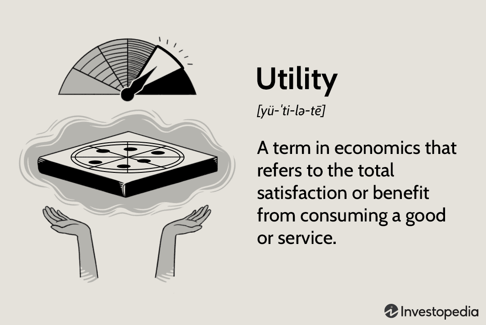

In the intersection of economics and trading, utility measurement and algorithmic trading play crucial roles in shaping modern financial markets. Utility serves as a conceptual framework to quantify and analyze consumer satisfaction, acting as a cornerstone in understanding decision-making processes. In trading, algorithmic systems provide a structured and efficient means to execute transactions, incorporating complex data analysis and high-speed operations.

Utility theory provides insights into consumer preferences and behaviors, which can be leveraged to optimize decision-making strategies in trading contexts. By incorporating utility measurement, traders can better gauge risk-reward dynamics, informing more precise asset allocation and portfolio management decisions. This fusion of economic theory with trading practice represents a promising opportunity to refine trading strategies and enhance market performance.



Algorithmic trading, on the other hand, transforms these theoretical insights into practical execution through advanced computational algorithms. By interpreting data patterns and executing trades at unprecedented speeds, algorithmic trading methods ensure timely reactions to market changes. This enables traders to capitalize on transient market opportunities, thus maximizing potential utility gains.

The integration of utility theories into algorithmic trading strategies can significantly enhance trading efficacy. Utility functions can serve as a powerful tool for designing algorithms that align with specific investment objectives and risk tolerances. This symbiotic potential unlocks pathways for more adaptive and tailored trading systems, driving innovation and efficiency in financial markets.

Consequently, this article aims to explore the confluence of utility measurement and algorithmic trading. By examining economic utility theories' application in trading models, the article seeks to uncover techniques that enrich algorithmic trading strategies and highlight their mutual benefits. Through this exploration, the article endeavors to provide a deeper understanding of how these interdisciplinary concepts can be harmoniously applied to optimize trading paradigms.

## Table of Contents

## Understanding Utility in Economics

Utility is a fundamental concept in economics, encapsulating the level of satisfaction or value consumers attain from consuming goods or services. It serves as the groundwork for analyzing and predicting consumer behavior and decision-making processes. The centrality of utility in economics lies in its ability to quantify preferences and guide analytical frameworks focused on consumer choice.

Economists utilize various forms of utility to dissect and understand consumer satisfaction. Total utility is the aggregate level of satisfaction derived from consuming a certain quantity of goods or services, while marginal utility refers to the additional satisfaction gained from consuming one more unit of a good or service. Marginal utility is particularly important as it influences consumer decisions by addressing how additional consumption affects overall satisfaction. 

To measure satisfaction more precisely, economists apply two key approaches: cardinal utility and ordinal utility. Cardinal utility presumes that satisfaction can be measured numerically, allowing for a specific quantification of utility. This approach paved the way for mathematical modeling in economics, allowing researchers to assign specific utility values to different consumption bundles. Ordinal utility, on the other hand, only requires that consumers can rank their preferences in order of satisfaction without quantifying the differences between them. This approach is often used as it reflects actual consumer behavior more realistically by recognizing that exact quantification of satisfaction levels is often impossible.

Understanding these utility concepts enables economists to develop models to predict consumer choices and market demand patterns effectively. By assessing how consumers allocate their resources to maximize utility, economists can infer likely demand within markets and potential shifts resulting from changes in price, income, or other external factors. These utility-based models are crucial in crafting economic policies and marketing strategies, as they provide insights into consumer reactions to various stimuli, thus shaping supply and demand dynamics.

## Types of Economic Utility

Economic utility is a multifaceted concept that reflects the value consumers derive from goods and services. It is commonly divided into four distinct types: form, time, place, and possession utility, each representing a different dimension of consumer satisfaction and value.

**Form utility** refers to the transformation of raw materials into finished products that meet consumer needs and preferences. This type of utility emphasizes the manufacturing process, where goods are tailored to desired specifications, increasing their appeal and usability. For example, transforming raw cotton into a wearable garment exemplifies form utility by enhancing the item's economic value through design and production processes that match consumer demands.

**Time utility** concerns the availability of goods and services at moments when they are most needed or desired by consumers. Firms enhance time utility through efficient logistics and inventory management, ensuring that products reach consumers at the optimal time. For instance, delivering heating oil before the onset of winter illustrates time utility by aligning supply with seasonal demand, thereby maximizing consumer satisfaction.

**Place utility** involves the geographic accessibility of products and services. By strategically locating retail outlets or leveraging distribution networks, companies increase place utility, ensuring that consumers can conveniently access products. A clear example is the placement of convenience stores in urban areas, which heightens place utility by offering goods in proximate locations, reducing the effort and time required for consumers to obtain necessary items.

**Possession utility** facilitates the acquisition of goods by consumers, making them easier to buy and own. This can be achieved through flexible payment options, financing plans, and clear transfer of ownership. E-commerce platforms enhance possession utility by simplifying the purchasing process through features like one-click purchasing and multiple payment methods, thereby streamlining the consumer's journey from desire to ownership.

Understanding these types of economic utility is crucial for businesses as they design strategies to enhance consumer satisfaction and drive market demand. By effectively managing these aspects, firms can better meet the needs of their customers, thereby strengthening their market position.

## Expected Utility Theory

Expected utility theory provides a structured approach to decision-making in environments characterized by uncertainty and risk. By integrating outcome probabilities with utility values, decision-makers can rationally evaluate various risky options. This framework has a foundational role in both economics and finance, aiding in the modeling of consumer choices and the optimization of investment portfolios.

In expected utility theory, an individual is assumed to have a set of preferences that can be represented by a utility function. This utility function assigns a numerical value to each possible outcome, reflecting the satisfaction or value derived from it. To make a choice under uncertainty, the decision-maker evaluates the expected utility of each option, calculated as the sum of the utilities of possible outcomes, each weighted by their respective probabilities. Mathematically, the expected utility $E(u)$ of a set of possible outcomes is expressed as:

$$
E(u) = \sum_{i} p_i \times u(x_i)
$$

where:
- $p_i$ is the probability of outcome $i$,
- $u(x_i)$ is the utility of outcome $i$.

The decision-maker will choose the option that maximizes the expected utility. This approach is particularly powerful in finance, where it underlies models used for portfolio optimization. Investors can balance the potential returns of an asset against the associated risks by choosing a portfolio that maximizes expected utility based on their risk preferences.

Despite its widespread application, expected utility theory is not without limitations. One of the primary criticisms lies in its assumption of rationality, which supposes that individuals make consistent decisions to maximize expected utility. However, real-world scenarios often reveal deviations from rational behavior, as documented by behavioral economists Daniel Kahneman and Amos Tversky. Cognitive biases and heuristics can significantly influence decision-making, leading to choices that contradict the predictions of expected utility theory.

In conclusion, while expected utility theory offers a robust framework for evaluating risky decisions and has significantly influenced economic and financial modeling, its reliance on rationalist assumptions requires caution. Real-life complexities and irrational behaviors necessitate complementary models to fully capture decision-making dynamics.

## Utility Maximization

Utility maximization is a cornerstone of economic theory, guiding individuals and firms in the allocation of resources to achieve the highest possible level of satisfaction or utility. This principle assumes that economic [agents](/wiki/agents) are rational actors who seek to maximize their utility given the constraints of their available resources, such as income, time, and information.

The concept revolves around the use of utility functions, mathematical representations that capture consumer preferences and the trade-offs between different goods or choices. These functions typically exhibit properties such as diminishing marginal utility, indicating that the additional satisfaction gained from consuming an extra unit of a good decreases as the quantity consumed increases.

In mathematical terms, a consumer's utility maximization problem can be expressed as:

$$
\max U(x_1, x_2, ..., x_n)
$$

subject to the budget constraint:

$$
p_1x_1 + p_2x_2 + ... + p_nx_n = M
$$

where $U$ is the utility function, $x_i$ are the quantities of goods consumed, $p_i$ are the prices of these goods, and $M$ is the total available budget. The consumer's objective is to choose quantities $x_1, x_2, ..., x_n$ that maximize their utility.

In the context of trading, utility maximization translates into optimal asset allocation, where investors aim to strike a balance between risk and return. This involves constructing a portfolio of investments that maximizes an investor’s expected utility, often modeled using a utility function that reflects their risk preferences. A common approach is the mean-variance optimization, pioneered by Harry Markowitz, which uses a quadratic utility function:

$$
U(W) = E[R] - \frac{\lambda}{2} \sigma^2
$$

where $U(W)$ is the utility of the wealth generated by the portfolio, $E[R]$ is the expected return, $\sigma^2$ is the variance of the portfolio's return, and $\lambda$ represents the investor's risk aversion. Higher values of $\lambda$ signify greater aversion to risk.

Python can be employed to model and solve utility maximization problems in a trading context. Consider the following simplified example of solving a utility maximization problem using Python and a typical library for optimization such as SciPy:

```python
import numpy as np
from scipy.optimize import minimize

# Define the utility function
def utility(weights, expected_returns, covariance_matrix, risk_aversion):
    portfolio_return = np.dot(weights, expected_returns)
    portfolio_variance = np.dot(weights.T, np.dot(covariance_matrix, weights))
    # Utility function with risk aversion
    return -(portfolio_return - risk_aversion * portfolio_variance)

# Example data
expected_returns = np.array([0.05, 0.07, 0.12])
covariance_matrix = np.array([[0.005, -0.010, 0.004], 
                              [-0.010, 0.040, -0.002], 
                              [0.004, -0.002, 0.023]])
risk_aversion = 3.0
initial_weights = np.array([1/3, 1/3, 1/3])

# Constraints and bounds
constraints = {'type': 'eq', 'fun': lambda x: np.sum(x) - 1}
bounds = [(0, 1) for _ in range(len(expected_returns))]

# Optimization
optimal_portfolio = minimize(utility, initial_weights, args=(expected_returns, covariance_matrix, risk_aversion),
                             bounds=bounds, constraints=constraints)

print(f"Optimal weights: {optimal_portfolio.x}")
```

This script optimizes the allocation of wealth across three assets to maximize the utility based on expected returns, taking into account the investor's risk aversion. The optimal weights output provides the proportion of total investment to allocate to each asset, aligning with the utility maximization principle.

By integrating utility theories into trading strategies, investors can better align their portfolios with personal risk profiles and financial goals, paving the way for more informed and effective decision-making in financial markets.

## Algorithmic Trading Basics

Algorithmic trading is a pivotal advancement in financial markets, utilizing sophisticated computer algorithms to execute trades with remarkable speed and precision. These algorithms are designed to process large volumes of data, identify trading opportunities, and execute orders almost instantly, which is essential in fast-paced financial environments.

At its core, [algorithmic trading](/wiki/algorithmic-trading) relies on predefined criteria and sophisticated data processing capabilities to enhance trading efficiency and decision-making. This includes analyzing market data, detecting patterns, and making predictions based on historical and real-time data. For instance, algorithms can be programmed to track moving average crossovers, a popular technical indicator where the intersection of short-term and long-term moving averages generates buy or sell signals. This systematic approach helps traders to execute strategies consistently and without the influence of human emotions.

The role of risk management in algorithmic trading cannot be overstated. Algorithms must be precisely calibrated to adjust to varying market conditions, ensuring decisions align with predefined risk profiles. This often involves setting parameters such as stop-loss orders and position sizing to mitigate potential losses. As markets fluctuate, these algorithms need to adapt their strategies dynamically to optimize returns while managing risk exposure effectively.

The implementation of algorithmic trading requires not only strategic foresight but also robust technological infrastructure. Trading platforms must support the execution of complex algorithms in real-time, demanding high-speed connectivity, reliable data feeds, and powerful computational resources. This infrastructure is crucial in maintaining the integrity and performance of trading algorithms across global markets.

In summary, algorithmic trading represents a transformative approach to modern trading, where computational efficiency and strategic automation intersect to deliver enhanced trading performance. By leveraging data-driven insights and systematic strategies, algorithmic traders can navigate the complexities of financial markets with precision and agility.

## Using Utility in Algorithmic Trading

Integrating utility functions into algorithmic trading models allows for a more nuanced evaluation and prioritization of investment options. This incorporation is rooted in aligning trading strategies with the investor's risk preferences and financial goals, optimizing decision-making processes under conditions of uncertainty.

Utility functions, which express an investor's preference over a set of outcomes, can be used to assess the expected utility of different strategies or trades. An expected utility $U$ for a particular strategy can be represented by the formula:

$$
U = \sum_{i=1}^{n} p_i \cdot u(x_i)
$$

where $p_i$ is the probability of outcome $i$, $u(x_i)$ is the utility of outcome $i$, and $n$ is the total number of possible outcomes. By evaluating these expected utilities, algorithms can adjust trading strategies dynamically, adhering to an investor's specific risk tolerance and preference structure.

This adjustment of strategies based on expected utilities is particularly significant because it allows for a tailored approach to portfolio management. Algorithms can prioritize options that maximize expected utility, effectively balancing risks and returns in alignment with individual or institutional financial objectives. For instance, risk-averse investors may prefer strategies that lead to higher certainty albeit lower potential returns, while risk-seeking investors might opt for strategies with higher risk and potential for significant gain.

Portfolio optimization through utility functions is a sophisticated approach that enhances the customization of trading strategies. Here, the goal is to determine the optimal mix of assets that aligns with an investor’s utility curve, accounting for their risk preference levels. The utility function thus serves as the decision-making benchmark for asset selection and allocation.

Python, with its extensive libraries for numerical computation, offers tools like NumPy and SciPy to facilitate these calculations. Below is a basic Python example illustrating how utility evaluation might be set up in an algorithmic trading context:

```python
import numpy as np

# Example utilities and probabilities for various outcomes
utilities = np.array([0.9, 0.5, 0.2])
probabilities = np.array([0.4, 0.4, 0.2])

# Calculate expected utility
expected_utility = np.dot(probabilities, utilities)

print(f"Expected Utility: {expected_utility}")
```

This code snippet calculates the expected utility for a set of investment outcomes with associated probabilities and utility. By consistently leveraging such calculations, algorithms can opt for strategies that statististically maximize utility.

In practice, these evaluations and adjustments allow trading algorithms to remain flexible and responsive to market dynamics, maintaining strategy efficiency even as market conditions shift. Consequently, the integration of utility functions not only personalizes trading activity but also supports achieving superior financial performance through scientifically-backed investment choices.

## Case Studies and Practical Applications

Case studies provide valuable insights into the successful implementation and optimization of utility functions in trading decisions. These functions play a crucial role in both high-frequency trading ([HFT](/wiki/high-frequency-trading-strategies)) and portfolio management. 

In high-frequency trading, utility-maximization strategies are used to make rapid trading decisions based on real-time data. These strategies often involve adjusting trading parameters continuously to adapt to fast-evolving market conditions. By leveraging utility functions, traders can prioritize trades that align with their risk preferences and expected returns. For instance, a utility function $U(x)$, where $x$ represents a portfolio's value, can be defined to reflect the trader’s risk tolerance. In practice, this function could take the form of a logarithmic utility function to represent risk-averse behavior:

$$
U(x) = \log(x)
$$

Implementation in HFT often requires coding bespoke algorithms that automatically adjust trading strategies based on utility calculations. Python, with its rich ecosystem for data processing and algorithm development, is a common choice. A simplified Python example is as follows:

```python
import numpy as np

def utility_function(value, risk_aversion_factor):
    # Example of a logarithmic utility function
    return np.log(value) if value > 0 else -np.inf

def optimize_trade(values, risk_aversion_factor):
    # Calculate utility for each asset value
    utilities = [utility_function(v, risk_aversion_factor) for v in values]
    # Select the trade with maximum utility
    best_trade = values[np.argmax(utilities)]
    return best_trade

values = [100, 200, 150]  # hypothetical portfolio values
risk_aversion_factor = 0.5
best_trade = optimize_trade(values, risk_aversion_factor)
print(f"Optimal trade decision based on utility: {best_trade}")
```

In portfolio management, utility-maximization frameworks are employed to achieve optimal asset allocation, balancing risk and return. This involves constructing portfolios with asset combinations that maximize the expected utility for an investor given their risk profile. The Markowitz mean-variance optimization model, which can be enhanced by integrating utility functions, is a prevalent strategy. By incorporating utility functions, situations where traditional mean-variance models might fail to accurately reflect investor preferences are better addressed.

Practical applications often require integrating financial data systems with optimization software or custom-coded solutions. Asset managers may utilize software solutions that allow the specification of utility functions as part of the optimization criteria, linking them to dynamic market data feeds to ensure timely decision-making. These systems not only enhance trading efficiency but also provide customizable frameworks that can reflect individual investor goals and constraints.

In conclusion, utility functions serve as powerful tools in trading, facilitating decision processes that align closely with investor preferences and market dynamics. Such implementations underscore the adaptability of utility-based models in crafting tailored strategies that respond to the complex variables present in contemporary financial markets.

## Challenges and Limitations

Utility theory, a cornerstone of classical economics, faces significant challenges when applied to real-world trading scenarios. A primary issue stems from its core assumption of rational behavior, which posits that individuals make decisions by consistently maximizing their utility. However, various market anomalies suggest that this is not always the case. Human behavior often diverges from perfect rationality due to psychological influences, leading to decisions that defy traditional economic predictions.

Behavioral economics provides vital insight into these deviations, highlighting cognitive biases like loss aversion, overconfidence, and herding behavior. For instance, Kahneman and Tversky's Prospect Theory challenges the rational utility model by showing how individuals value gains and losses differently. According to their research, people tend to weigh potential losses more heavily than equivalent gains, contradicting the fundamental assumptions of utility maximization.

Another layer of complexity arises from the computational demands in implementing utility-maximization models within dynamic trading environments. Markets evolve rapidly, requiring algorithms that not only compute optimal strategies but also adapt to shifting conditions in real-time. This necessitates sophisticated models capable of processing large volumes of data and adjusting decisions with minimal latency. The mathematical rigor of these models, often involving solving complex optimization problems, can pose significant computational burdens.

To manage these computational challenges, more advanced methods such as [machine learning](/wiki/machine-learning) techniques like [reinforcement learning](/wiki/reinforcement-learning) are increasingly employed. These methods can dynamically adapt strategies based on historical and real-time data, offering a more flexible approach compared to static utility-based models. However, despite these technological advancements, aligning model outputs with actual market behavior remains a primary challenge, given the unpredictable nature of human actions and market dynamics. 

In conclusion, while utility theory provides a valuable framework for decision-making, its application in algorithmic trading must account for human irrationality and computational complexity to effectively enhance trading strategies.

## Conclusion

Utility measurement brings profound insights from economics to enhance algorithmic trading. By quantifying satisfaction and value, utility functions provide a framework for aligning trading strategies with investor preferences and risk profiles. The integration of utility theory into algorithmic trading models enables traders to tailor their approaches, optimizing asset allocation to maximize expected satisfaction under uncertainty. This alignment with risk preferences is achieved by employing expected utility theory, which combines probabilities of outcomes with their respective utilities to evaluate potential decisions strategically.

In the dynamic and ever-evolving landscape of financial markets, leveraging utility within algorithms offers a competitive advantage. Algorithmic trading systems that incorporate utility functions can adapt to changes in market conditions more effectively. This adaptability stems from the ability of utility-maximizing algorithms to recalibrate strategies in response to shifts in investor sentiment and risk tolerance, thereby maintaining a robust performance across various market scenarios.

By focusing on utility maximization, traders can not only enhance the efficiency of their decision-making processes but also ensure that their strategies are consistently aligned with the ultimate goal of achieving the highest possible level of satisfaction and return for investors. As market complexities continue to increase, the integration of economic utility theories into algorithmic trading systems is likely to become an indispensable component of successful, adaptive, and effective trading strategies.

## References & Further Reading

Markowitz, H. (1952). "Portfolio Selection." The Journal of Finance. This foundational work presents the Modern Portfolio Theory, introducing the concept of diversification to optimize investment portfolios by balancing risk and return. Markowitz’s framework has become an indispensable tool in financial economics, modeling the trade-offs between expected returns and [volatility](/wiki/volatility-trading-strategies).

Kahneman, D., & Tversky, A. (1979). "Prospect Theory: An Analysis of Decision under Risk." Econometrica. This paper challenges traditional economic models of rational behavior by demonstrating that people value gains and losses differently, leading to decision-making anomalies. It explains how human cognitive biases affect perception of risk, providing insight into investor behavior beyond the expected utility theory.

Lopez de Prado, M. (2018). "Advances in Financial Machine Learning." Wiley. This book combines finance and machine learning, presenting algorithmic methodologies to improve financial strategies. Lopez de Prado offers practical insights on implementing machine learning techniques in trading, which enhance data processing, risk management, and decision-making capabilities.

