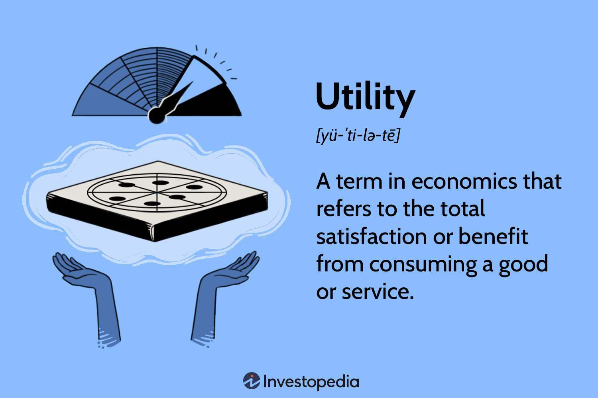

## Table of Contents

## What is utility in economics?

Utility in economics is a measure of the satisfaction or happiness that people get from consuming goods and services. It's a way to understand why people make the choices they do. For example, if you enjoy eating chocolate, the utility you get from chocolate is high. Economists use the concept of utility to explain how people make decisions to maximize their overall satisfaction.

Utility can be thought of in different ways. Sometimes, it's seen as something you can measure, like a number. Other times, it's more about comparing different choices to see which one gives more satisfaction. For instance, if you have to choose between an apple and an orange, you might think about which one will make you happier. Economists use these ideas to build models that help predict how people will behave in different situations.

## How is utility typically measured in economics?

In economics, utility is often measured using a concept called utils. Utils are imaginary units that help economists assign a number to the satisfaction someone gets from a good or service. For example, if you enjoy a slice of pizza, an economist might say that slice gives you 10 utils. The exact number of utils isn't important; what matters is that it helps compare different levels of satisfaction.

Another way to measure utility is through ordinal utility, which doesn't use specific numbers but ranks preferences. For instance, if you prefer an apple to an orange, and an orange to a banana, you can say your utility from these fruits is ranked in that order. This method is simpler because it doesn't need exact numbers, just a way to see which option you like more. Both methods help economists understand how people make choices to feel happier or more satisfied.

## What is the difference between total utility and marginal utility?

Total utility is the total satisfaction or happiness someone gets from consuming all the goods and services they have. Imagine you eat three slices of pizza. The total utility is how happy you feel after eating all three slices. It's like adding up the happiness from each slice to get the overall happiness.

Marginal utility is different. It's the extra satisfaction or happiness you get from consuming just one more unit of a good or service. Using the pizza example again, the marginal utility would be the additional happiness you feel from eating the fourth slice of pizza, compared to how you felt after three slices. It helps understand how much more happiness each additional unit brings.

## Can utility be measured objectively, or is it subjective?

Utility is mostly subjective. This means it's based on personal feelings and opinions. What makes one person happy might not make another person happy. For example, one person might love chocolate and get a lot of utility from it, while another person might prefer fruit. Because utility depends on personal tastes, it's hard to measure it in an exact, objective way that everyone agrees on.

Economists use different methods to try to measure utility, but these methods still depend on what people say or how they act. They might use numbers called utils to show how much happiness someone gets from something, but these numbers are made up and don't mean the same thing to everyone. So, even though economists can study and talk about utility, it's always going to be a bit personal and not something you can measure perfectly with a ruler or a scale.

## What are the common methods used to measure utility?

Economists often use utils to measure utility. Utils are just imaginary numbers that help show how much happiness or satisfaction someone gets from something. For example, if you enjoy a movie, an economist might say it gives you 10 utils. The exact number of utils isn't super important. What matters is that it helps compare how happy different things make you feel. But remember, utils are made up and don't mean the same thing to everyone because happiness is personal.

Another way to measure utility is by ranking preferences, which is called ordinal utility. This method doesn't use specific numbers but looks at which option someone likes more. For instance, if you prefer an apple to an orange, and an orange to a banana, you can say your utility from these fruits is ranked in that order. This way is simpler because it doesn't need exact numbers, just a way to see which option you like more. Both methods help economists understand how people make choices to feel happier or more satisfied, even though utility is always a bit personal.

## How does the concept of utility relate to consumer choice theory?

The concept of utility is super important in consumer choice theory because it helps explain why people make the choices they do. In consumer choice theory, economists look at how people decide what to buy to make themselves as happy as possible. They use the idea of utility to say that people choose things that give them the most happiness or satisfaction. For example, if you're choosing between buying a burger or a salad, you'll pick the one that makes you happier, which means it gives you more utility.

Economists also use the idea of marginal utility to understand consumer choices better. Marginal utility is the extra happiness you get from one more of something. If eating a second burger doesn't make you as happy as the first one did, you might decide not to buy it. Consumer choice theory says people keep buying things until the extra happiness they get from one more thing isn't worth the cost. So, utility helps explain not just what people choose, but also how much they choose to buy.

## What is the utility maximization rule and how is it applied?

The utility maximization rule says that people try to get the most happiness or satisfaction they can with the money they have. It's like trying to make the best use of your money by choosing things that make you happiest. Economists say you should keep buying more of something until the extra happiness you get from one more of it (marginal utility) is equal to the price you pay for it. So, if a candy bar gives you a lot of happiness and it's cheap, you might buy a few. But if the next candy bar doesn't make you as happy and it's still the same price, you'll stop buying more.

To apply this rule, you compare the extra happiness (marginal utility) you get from different things to their prices. Imagine you're at a store with money to spend. You might look at a soda and think about how happy it will make you. If the soda's price is low and it gives you a lot of happiness, you'll buy it. But if you then look at a bag of chips and see that it gives you even more happiness for the same price, you might choose the chips instead. You keep doing this, [picking](/wiki/asset-class-picking) the things that give you the most bang for your buck until you run out of money or the extra happiness from more stuff isn't worth the cost anymore.

## What are the limitations of measuring utility?

Measuring utility is tricky because it's all about how happy or satisfied people feel, and that's different for everyone. It's hard to put a number on happiness because what makes one person happy might not make another person happy at all. For example, if you love ice cream, you might say it gives you a lot of utility, but someone who doesn't like ice cream won't feel the same way. So, when economists try to measure utility with utils or rank preferences, they're always dealing with something that's personal and hard to pin down exactly.

Another problem is that people's feelings can change over time. What makes you happy today might not make you happy tomorrow. This means that even if you could measure utility at one moment, it might not be the same later. Plus, people don't always know exactly how happy something will make them until they try it. So, any measurement of utility is kind of a guess and can be off because it's based on what people think they'll feel, not what they actually feel.

## How do economists handle interpersonal comparisons of utility?

Economists find it really hard to compare how happy different people are because happiness is personal. Imagine if you and your friend both eat a slice of pizza. You might love it and feel super happy, but your friend might just think it's okay. There's no easy way to say how much happier you are compared to your friend because happiness isn't something you can measure like weight or height. So, economists usually avoid trying to compare utility between people directly because it's too tricky and not very accurate.

Instead, economists look at how people make choices and what those choices say about their happiness. They might see that when given a choice, most people pick the thing that makes them happiest. By studying these choices, economists can understand how people value different things without needing to know exactly how happy each person is. This way, they can talk about utility in a way that's useful for understanding how people behave, even if they can't say for sure who is happier.

## What role does utility play in welfare economics?

In welfare economics, utility is super important because it helps economists figure out how to make people happier overall. Welfare economics is all about making choices that help everyone in a society. Economists use the idea of utility to see if a change, like a new law or policy, will make people better off. They look at how much happiness or satisfaction people get from different things and try to find ways to increase that happiness for as many people as possible.

One big idea in welfare economics is called Pareto efficiency. This means a situation where you can't make one person happier without making someone else less happy. Economists use utility to check if a change will make some people happier without hurting others. If it does, it's a good change. But if making one person happier means making someone else less happy, economists have to think about how to balance that out to make the most people happy. So, utility helps guide decisions to improve everyone's well-being.

## How have modern economic theories expanded on traditional utility measurement?

Modern economic theories have expanded on traditional utility measurement by looking at how people make choices in more detailed and realistic ways. Instead of just using utils or ranking preferences, economists now use ideas like behavioral economics to understand how people actually behave. Behavioral economics looks at things like how people might not always make the best choices because of emotions or habits. For example, someone might choose a smaller reward now instead of waiting for a bigger reward later, even if waiting would make them happier in the long run. This helps economists understand that utility isn't just about what makes us happy in theory, but also about how we really act in the real world.

Another way modern theories have expanded on utility is by considering how social and psychological factors affect our happiness. Economists now talk about things like social utility, where the happiness we get from something can depend on what other people think or do. For example, you might enjoy a new phone more if your friends think it's cool. Also, ideas like prospect theory show that people feel gains and losses differently, so the utility from winning $100 might not be the same as the disutility from losing $100. These new ideas help economists create more accurate models of how people make choices and feel happy, going beyond the simple numbers of traditional utility measurement.

## What are some advanced statistical methods used in utility analysis?

Economists use some fancy math and stats to understand how happy people are with what they choose. One cool method is called regression analysis. This helps economists see how different things, like the price of a product or how much someone earns, can change how happy they feel about their choices. They can use this to predict how happy someone might be with a new product or policy. It's like trying to guess how much you'll enjoy a new video game based on what you liked about old ones.

Another method is called conjoint analysis. This is used to figure out what parts of a product or service make people the happiest. Imagine you're picking a new phone. Conjoint analysis can help see if you care more about the camera, the battery life, or the price. By asking people to choose between different options, economists can figure out what's most important to them and how much happiness each feature brings. This helps companies make better products that people will enjoy more.

There's also something called structural equation modeling. This method looks at how different things are connected and how they affect happiness. It's like trying to understand a big puzzle where everything is linked. For example, it can show how your job, your family, and your hobbies all work together to make you happy. By using this, economists can see the big picture of what makes people happy and how all the pieces fit together.

## What is Expected Utility Theory?

Expected utility theory provides a structured approach to decision-making in environments characterized by uncertainty and risk. By integrating outcome probabilities with utility values, decision-makers can rationally evaluate various risky options. This framework has a foundational role in both economics and finance, aiding in the modeling of consumer choices and the optimization of investment portfolios.

In expected utility theory, an individual is assumed to have a set of preferences that can be represented by a utility function. This utility function assigns a numerical value to each possible outcome, reflecting the satisfaction or value derived from it. To make a choice under uncertainty, the decision-maker evaluates the expected utility of each option, calculated as the sum of the utilities of possible outcomes, each weighted by their respective probabilities. Mathematically, the expected utility $E(u)$ of a set of possible outcomes is expressed as:

$$
E(u) = \sum_{i} p_i \times u(x_i)
$$

where:
- $p_i$ is the probability of outcome $i$,
- $u(x_i)$ is the utility of outcome $i$.

The decision-maker will choose the option that maximizes the expected utility. This approach is particularly powerful in finance, where it underlies models used for portfolio optimization. Investors can balance the potential returns of an asset against the associated risks by choosing a portfolio that maximizes expected utility based on their risk preferences.

Despite its widespread application, expected utility theory is not without limitations. One of the primary criticisms lies in its assumption of rationality, which supposes that individuals make consistent decisions to maximize expected utility. However, real-world scenarios often reveal deviations from rational behavior, as documented by behavioral economists Daniel Kahneman and Amos Tversky. Cognitive biases and heuristics can significantly influence decision-making, leading to choices that contradict the predictions of expected utility theory.

In conclusion, while expected utility theory offers a robust framework for evaluating risky decisions and has significantly influenced economic and financial modeling, its reliance on rationalist assumptions requires caution. Real-life complexities and irrational behaviors necessitate complementary models to fully capture decision-making dynamics.

## How can one achieve Utility Maximization?

Utility maximization is a cornerstone of economic theory, guiding individuals and firms in the allocation of resources to achieve the highest possible level of satisfaction or utility. This principle assumes that economic [agents](/wiki/agents) are rational actors who seek to maximize their utility given the constraints of their available resources, such as income, time, and information.

The concept revolves around the use of utility functions, mathematical representations that capture consumer preferences and the trade-offs between different goods or choices. These functions typically exhibit properties such as diminishing marginal utility, indicating that the additional satisfaction gained from consuming an extra unit of a good decreases as the quantity consumed increases.

In mathematical terms, a consumer's utility maximization problem can be expressed as:

$$
\max U(x_1, x_2, ..., x_n)
$$

subject to the budget constraint:

$$
p_1x_1 + p_2x_2 + ... + p_nx_n = M
$$

where $U$ is the utility function, $x_i$ are the quantities of goods consumed, $p_i$ are the prices of these goods, and $M$ is the total available budget. The consumer's objective is to choose quantities $x_1, x_2, ..., x_n$ that maximize their utility.

In the context of trading, utility maximization translates into optimal asset allocation, where investors aim to strike a balance between risk and return. This involves constructing a portfolio of investments that maximizes an investor’s expected utility, often modeled using a utility function that reflects their risk preferences. A common approach is the mean-variance optimization, pioneered by Harry Markowitz, which uses a quadratic utility function:

$$
U(W) = E[R] - \frac{\lambda}{2} \sigma^2
$$

where $U(W)$ is the utility of the wealth generated by the portfolio, $E[R]$ is the expected return, $\sigma^2$ is the variance of the portfolio's return, and $\lambda$ represents the investor's risk aversion. Higher values of $\lambda$ signify greater aversion to risk.

Python can be employed to model and solve utility maximization problems in a trading context. Consider the following simplified example of solving a utility maximization problem using Python and a typical library for optimization such as SciPy:

```python
import numpy as np
from scipy.optimize import minimize

# Define the utility function
def utility(weights, expected_returns, covariance_matrix, risk_aversion):
    portfolio_return = np.dot(weights, expected_returns)
    portfolio_variance = np.dot(weights.T, np.dot(covariance_matrix, weights))
    # Utility function with risk aversion
    return -(portfolio_return - risk_aversion * portfolio_variance)

# Example data
expected_returns = np.array([0.05, 0.07, 0.12])
covariance_matrix = np.array([[0.005, -0.010, 0.004], 
                              [-0.010, 0.040, -0.002], 
                              [0.004, -0.002, 0.023]])
risk_aversion = 3.0
initial_weights = np.array([1/3, 1/3, 1/3])

# Constraints and bounds
constraints = {'type': 'eq', 'fun': lambda x: np.sum(x) - 1}
bounds = [(0, 1) for _ in range(len(expected_returns))]

# Optimization
optimal_portfolio = minimize(utility, initial_weights, args=(expected_returns, covariance_matrix, risk_aversion),
                             bounds=bounds, constraints=constraints)

print(f"Optimal weights: {optimal_portfolio.x}")
```

This script optimizes the allocation of wealth across three assets to maximize the utility based on expected returns, taking into account the investor's risk aversion. The optimal weights output provides the proportion of total investment to allocate to each asset, aligning with the utility maximization principle.

By integrating utility theories into trading strategies, investors can better align their portfolios with personal risk profiles and financial goals, paving the way for more informed and effective decision-making in financial markets.

## How can utility be used in algorithmic trading?

Integrating utility functions into [algorithmic trading](/wiki/algorithmic-trading) models allows for a more nuanced evaluation and prioritization of investment options. This incorporation is rooted in aligning trading strategies with the investor's risk preferences and financial goals, optimizing decision-making processes under conditions of uncertainty.

Utility functions, which express an investor's preference over a set of outcomes, can be used to assess the expected utility of different strategies or trades. An expected utility $U$ for a particular strategy can be represented by the formula:

$$
U = \sum_{i=1}^{n} p_i \cdot u(x_i)
$$

where $p_i$ is the probability of outcome $i$, $u(x_i)$ is the utility of outcome $i$, and $n$ is the total number of possible outcomes. By evaluating these expected utilities, algorithms can adjust trading strategies dynamically, adhering to an investor's specific risk tolerance and preference structure.

This adjustment of strategies based on expected utilities is particularly significant because it allows for a tailored approach to portfolio management. Algorithms can prioritize options that maximize expected utility, effectively balancing risks and returns in alignment with individual or institutional financial objectives. For instance, risk-averse investors may prefer strategies that lead to higher certainty albeit lower potential returns, while risk-seeking investors might opt for strategies with higher risk and potential for significant gain.

Portfolio optimization through utility functions is a sophisticated approach that enhances the customization of trading strategies. Here, the goal is to determine the optimal mix of assets that aligns with an investor’s utility curve, accounting for their risk preference levels. The utility function thus serves as the decision-making benchmark for asset selection and allocation.

Python, with its extensive libraries for numerical computation, offers tools like NumPy and SciPy to facilitate these calculations. Below is a basic Python example illustrating how utility evaluation might be set up in an algorithmic trading context:

```python
import numpy as np

# Example utilities and probabilities for various outcomes
utilities = np.array([0.9, 0.5, 0.2])
probabilities = np.array([0.4, 0.4, 0.2])

# Calculate expected utility
expected_utility = np.dot(probabilities, utilities)

print(f"Expected Utility: {expected_utility}")
```

This code snippet calculates the expected utility for a set of investment outcomes with associated probabilities and utility. By consistently leveraging such calculations, algorithms can opt for strategies that statististically maximize utility.

In practice, these evaluations and adjustments allow trading algorithms to remain flexible and responsive to market dynamics, maintaining strategy efficiency even as market conditions shift. Consequently, the integration of utility functions not only personalizes trading activity but also supports achieving superior financial performance through scientifically-backed investment choices.

## What are some case studies and practical applications?

Case studies provide valuable insights into the successful implementation and optimization of utility functions in trading decisions. These functions play a crucial role in both high-frequency trading ([HFT](/wiki/high-frequency-trading-strategies)) and portfolio management. 

In high-frequency trading, utility-maximization strategies are used to make rapid trading decisions based on real-time data. These strategies often involve adjusting trading parameters continuously to adapt to fast-evolving market conditions. By leveraging utility functions, traders can prioritize trades that align with their risk preferences and expected returns. For instance, a utility function $U(x)$, where $x$ represents a portfolio's value, can be defined to reflect the trader’s risk tolerance. In practice, this function could take the form of a logarithmic utility function to represent risk-averse behavior:

$$
U(x) = \log(x)
$$

Implementation in HFT often requires coding bespoke algorithms that automatically adjust trading strategies based on utility calculations. Python, with its rich ecosystem for data processing and algorithm development, is a common choice. A simplified Python example is as follows:

```python
import numpy as np

def utility_function(value, risk_aversion_factor):
    # Example of a logarithmic utility function
    return np.log(value) if value > 0 else -np.inf

def optimize_trade(values, risk_aversion_factor):
    # Calculate utility for each asset value
    utilities = [utility_function(v, risk_aversion_factor) for v in values]
    # Select the trade with maximum utility
    best_trade = values[np.argmax(utilities)]
    return best_trade

values = [100, 200, 150]  # hypothetical portfolio values
risk_aversion_factor = 0.5
best_trade = optimize_trade(values, risk_aversion_factor)
print(f"Optimal trade decision based on utility: {best_trade}")
```

In portfolio management, utility-maximization frameworks are employed to achieve optimal asset allocation, balancing risk and return. This involves constructing portfolios with asset combinations that maximize the expected utility for an investor given their risk profile. The Markowitz mean-variance optimization model, which can be enhanced by integrating utility functions, is a prevalent strategy. By incorporating utility functions, situations where traditional mean-variance models might fail to accurately reflect investor preferences are better addressed.

Practical applications often require integrating financial data systems with optimization software or custom-coded solutions. Asset managers may utilize software solutions that allow the specification of utility functions as part of the optimization criteria, linking them to dynamic market data feeds to ensure timely decision-making. These systems not only enhance trading efficiency but also provide customizable frameworks that can reflect individual investor goals and constraints.

In conclusion, utility functions serve as powerful tools in trading, facilitating decision processes that align closely with investor preferences and market dynamics. Such implementations underscore the adaptability of utility-based models in crafting tailored strategies that respond to the complex variables present in contemporary financial markets.

## References & Further Reading

Markowitz, H. (1952). "Portfolio Selection." The Journal of Finance. This foundational work presents the Modern Portfolio Theory, introducing the concept of diversification to optimize investment portfolios by balancing risk and return. Markowitz’s framework has become an indispensable tool in financial economics, modeling the trade-offs between expected returns and [volatility](/wiki/volatility-trading-strategies).

Kahneman, D., & Tversky, A. (1979). "Prospect Theory: An Analysis of Decision under Risk." Econometrica. This paper challenges traditional economic models of rational behavior by demonstrating that people value gains and losses differently, leading to decision-making anomalies. It explains how human cognitive biases affect perception of risk, providing insight into investor behavior beyond the expected utility theory.

Lopez de Prado, M. (2018). "Advances in Financial Machine Learning." Wiley. This book combines finance and [machine learning](/wiki/machine-learning), presenting algorithmic methodologies to improve financial strategies. Lopez de Prado offers practical insights on implementing machine learning techniques in trading, which enhance data processing, risk management, and decision-making capabilities.

