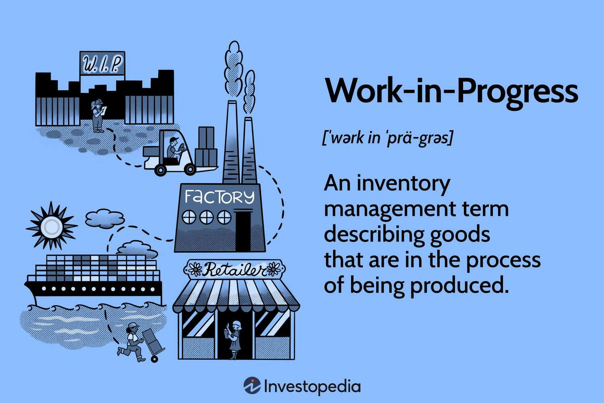

## Table of Contents

## What is work in progress (WIP) in accounting?

Work in Progress (WIP) in accounting refers to the costs associated with partially completed goods or services that are still in the production process. These costs can include materials, labor, and overhead expenses that have been incurred but the product is not yet finished and ready for sale. In manufacturing, WIP is an important part of the inventory on a company's balance sheet, showing the value of goods that are in various stages of production.

WIP helps businesses track the flow of production and manage their resources effectively. By monitoring WIP, a company can understand how much money is tied up in unfinished products and can make better decisions about production schedules and inventory management. This is crucial for maintaining cash flow and ensuring that the business operates efficiently.

## Why is it important to measure work in progress?

Measuring work in progress is important because it helps businesses know how much money is being used for products that are not yet finished. This is useful for keeping track of money and making sure the business has enough cash to keep running smoothly. If a company knows how much money is in work in progress, they can plan better and make sure they are not spending too much on things that are not ready to sell.

Also, measuring work in progress helps businesses see how well their production is going. If the amount of work in progress is growing too much, it might mean that something is slowing down the production process. By keeping an eye on work in progress, a company can find problems early and fix them before they get worse. This helps the business run more efficiently and can save time and money in the long run.

## How is work in progress different from finished goods and raw materials?

Work in progress, finished goods, and raw materials are all parts of a company's inventory, but they are at different stages of production. Work in progress refers to products that are in the middle of being made. They are not finished yet, but some work has already been done on them. This includes the costs of materials, labor, and other expenses that have been used so far. On the other hand, raw materials are the basic items that a company buys to start making their products. They haven't been worked on yet and are just waiting to be used in production.

Finished goods are the end result of the production process. These are the products that are completely done and ready to be sold to customers. Once a product moves from work in progress to finished goods, it means all the work needed to make it is finished. Understanding the difference between these three types of inventory helps a business keep track of where their money is being spent and how their production is going. It's important for planning and making sure the business runs smoothly.

## What are the common methods used to measure work in progress?

One common method to measure work in progress is the weighted average method. This method takes the average cost of all the units that were in production during a certain period. It includes both the costs from the beginning of the period and any new costs added during that time. By using this method, a company can get a good idea of the overall cost of the products that are still being made.

Another method is the first-in, first-out (FIFO) method. This method assumes that the costs of the units that were started first are the ones that get finished first. So, when figuring out the cost of work in progress, a company looks at the costs of the oldest units still in production. This can help show how costs have changed over time and give a clearer picture of what the current work in progress is costing.

The last method is the standard costing method. With this method, a company sets a standard cost for each unit of production. Then, they compare the actual costs to these standards to see if they are spending more or less than expected. This helps them keep track of work in progress by seeing how well they are sticking to their planned costs.

## How do you calculate the cost of work in progress?

To calculate the cost of work in progress, you need to add up the costs of materials, labor, and overhead that have been used so far in making the product. Start with the cost of the raw materials that have been put into the product. Then, add the cost of the labor that has worked on it. Finally, include any overhead costs, like electricity or rent for the factory, that are part of making the product. This total gives you the cost of the work in progress.

Different methods can be used to figure out these costs. One way is the weighted average method, where you take the average cost of all the units in production during a certain time. Another way is the first-in, first-out (FIFO) method, which looks at the costs of the oldest units still being made. There's also the standard costing method, where you compare actual costs to a set standard to see if you're spending more or less than planned. Each method helps you understand the cost of work in progress in a different way, but they all aim to give you a clear picture of where your money is going during production.

## What accounting standards govern the measurement of work in progress?

The measurement of work in progress is governed by different accounting standards depending on the country and the type of business. In the United States, the Generally Accepted Accounting Principles (GAAP) set the rules for how companies should measure and report work in progress. GAAP requires that the costs of work in progress be recorded accurately and consistently, using methods like weighted average, FIFO, or standard costing to calculate these costs.

Internationally, the International Financial Reporting Standards (IFRS) also provide guidance on measuring work in progress. IFRS focuses on making sure that financial statements are clear and comparable across different countries. Like GAAP, IFRS requires that the costs of work in progress be reported accurately, but it gives companies more flexibility in choosing the methods they use to calculate these costs. Both GAAP and IFRS aim to help businesses show a true picture of their financial health by properly accounting for the value of products that are still being made.

## How can errors in measuring work in progress affect financial statements?

Errors in measuring work in progress can make a company's financial statements look wrong. If the cost of work in progress is too high or too low, it can change how much inventory the company says it has. This affects the balance sheet because inventory is a big part of it. If the inventory number is wrong, the total assets will also be wrong. This can make the company look like it has more or less money than it really does.

These errors can also mess up the income statement. If the cost of work in progress is not right, it can change the cost of goods sold. If the cost of goods sold is too high, the company might show less profit than it should. If it's too low, the profit might look higher than it really is. This can lead to bad decisions because the company's leaders might think they are doing better or worse than they actually are. It's important to measure work in progress correctly to keep the financial statements accurate and helpful.

## What are the challenges in accurately measuring work in progress?

Accurately measuring work in progress can be hard because it involves keeping track of many different costs. These costs include the price of raw materials, the wages of workers, and the overhead expenses like electricity and rent. Each of these costs needs to be added up correctly, and it's easy to make mistakes. For example, if a company doesn't keep good records of how much raw material they use, they might not know the true cost of their work in progress. Also, figuring out how much labor cost to include can be tricky, especially if workers are doing different jobs at the same time.

Another challenge is choosing the right method to measure work in progress. Different methods like weighted average, FIFO, and standard costing can give different results. A company needs to pick the method that fits their business best, but this can be confusing. If they change methods, it can make their financial reports hard to understand. Plus, things like production delays or changes in how much it costs to make things can make it even harder to get the numbers right. It's important to keep up with all these changes to make sure the cost of work in progress is measured accurately.

## How does the choice of inventory valuation method impact the measurement of work in progress?

The choice of inventory valuation method can change how a company measures the cost of work in progress. If a company uses the weighted average method, they mix the old and new costs of materials and labor to find an average cost for the products that are still being made. This can smooth out big changes in costs over time, but it might not show the exact cost of the latest work in progress. On the other hand, if they use the first-in, first-out (FIFO) method, they look at the costs of the oldest units still in production. This can show how costs have changed over time, but it might make the cost of work in progress look higher if prices have gone up.

The standard costing method is different because it uses a set cost for each unit of production. This helps a company see if they are spending more or less than they planned. If the actual costs are different from the standard costs, it can make the measurement of work in progress less accurate. Each method can give a different number for the cost of work in progress, so it's important for a company to choose the method that fits their business best. The choice can affect how much money they think is tied up in unfinished products, which impacts their financial planning and decisions.

## What role does technology play in improving the measurement of work in progress?

Technology helps a lot in making the measurement of work in progress more accurate and easier. With special computer programs and software, companies can keep track of all the costs, like raw materials, labor, and overhead, in real time. These tools can automatically add up all the costs and update them whenever something changes. This means there's less chance of making mistakes when figuring out the cost of work in progress. Also, technology can help by connecting with other systems in the company, like the ones that manage inventory or track how much time workers spend on different tasks. This makes it easier to get all the information needed to measure work in progress correctly.

Using technology also helps companies see what's happening in their production process more clearly. For example, with sensors and machines that report data, a company can see exactly where a product is in the production line and how much it has cost so far. This real-time information can help them find problems quickly and fix them before they get worse. Plus, technology can make reports and graphs that show the cost of work in progress in a way that's easy to understand. This helps managers make better decisions about production and inventory, which can save time and money and make the business run more smoothly.

## How do companies manage and report changes in work in progress over time?

Companies keep track of changes in work in progress over time by using special accounting methods and tools. They might use the weighted average method, which looks at the average cost of all the units in production, or the first-in, first-out (FIFO) method, which tracks the costs of the oldest units still being made. They also use software that can update the costs of work in progress as soon as new costs come in. This helps them see how much money is being spent on products that are still being made and make sure their records are accurate.

When it's time to report these changes, companies include the cost of work in progress on their balance sheet as part of their inventory. If the amount of work in progress goes up, it means more money is tied up in products that aren't finished yet. If it goes down, it might mean those products are getting closer to being ready to sell. Companies need to explain these changes in their financial reports so that people who read them, like investors or banks, can understand how the business is doing. By keeping good records and using clear reports, companies can show how their production is going and make sure everyone knows what's happening with their work in progress.

## What advanced techniques can be used to optimize the measurement and management of work in progress in complex manufacturing environments?

In complex manufacturing environments, advanced techniques like lean manufacturing and just-in-time (JIT) production can help optimize the measurement and management of work in progress. Lean manufacturing focuses on cutting out waste and making the production process smoother. By using lean methods, companies can keep a close eye on their work in progress and make sure they're not spending too much money on products that are taking too long to finish. Just-in-time production means getting materials and starting production just when they're needed, so there's less money tied up in unfinished products. These techniques help companies keep their work in progress at a good level and make their production more efficient.

Another advanced technique is using enterprise resource planning (ERP) systems. These are big computer programs that can manage all parts of a business, including tracking the costs of work in progress. ERP systems can connect with machines and sensors on the factory floor to get real-time data about what's happening in production. This helps companies see exactly where their money is going and make quick changes if they need to. By using ERP systems, companies can keep their records accurate and make better decisions about how to manage their work in progress, which can save time and money in the long run.

Also, advanced analytics and [machine learning](/wiki/machine-learning) can play a big role in optimizing work in progress. These tools can look at a lot of data from the production process and find patterns that might be hard for people to see. For example, they can predict when delays might happen or when costs might go up, so companies can plan ahead and manage their work in progress better. By using these smart tools, companies can make their production process more efficient and keep their costs under control, which is really important in complex manufacturing environments.

## What are the fundamentals of Work in Progress (WIP) in accounting?

Work in Progress (WIP) refers to the inventory of partially completed goods that have advanced from raw material form but are not yet finished products. In accounting, WIP is considered a crucial component of inventory management, appearing as a current asset on a company's balance sheet. This representation indicates the costs incurred during the manufacturing or development stages of these goods.

The valuation of WIP involves compiling several cost components that contribute to the production process. The primary elements include:

1. **Direct Labor**: This encompasses the wages and other labor-related expenses directly tied to the production of goods. Direct labor costs are calculated based on the amount of time spent by workers on manufacturing the goods that constitute WIP.

2. **Direct Materials**: These are the raw materials that have been physically integrated into the work in progress. Direct materials costs are traced during the production timeline and are converted from raw materials once they start the manufacturing process.

3. **Factory Overhead Costs**: These include indirect production expenses such as utilities, depreciation of production equipment, and maintenance overheads that are essential to the manufacturing process but not directly attributable to a specific product.

To accurately maintain records and manage WIP, companies typically employ cost accounting systems that allocate these costs to products as they go through different stages of production. Such systems not only aid in valuing inventory but also help in recognizing production efficiency and potential inefficiencies.

Consider a simple illustration: a manufacturing company uses the following formula to calculate its WIP costs:

$$
\text{WIP Cost} = \text{Beginning WIP Inventory} + \text{Manufacturing Costs} - \text{Cost of Manufactured Goods}
$$

where:
- **Beginning WIP Inventory** is the value of the work in progress at the start of the accounting period.
- **Manufacturing Costs** comprise direct labor, direct materials, and factory overhead incurred during the period.
- **Cost of Manufactured Goods** is the cost attributed to goods completed and moved to finished goods inventory.

In Python, this calculation could be expressed as follows:

```python
def calculate_wip_cost(beginning_wip, manufacturing_costs, costs_of_manufactured_goods):
    return beginning_wip + manufacturing_costs - costs_of_manufactured_goods

# Example usage:
beginning_wip = 50000
manufacturing_costs = 200000
costs_of_manufactured_goods = 180000

wip_cost = calculate_wip_cost(beginning_wip, manufacturing_costs, costs_of_manufactured_goods)
print(f"WIP Cost: ${wip_cost}")
```

Understanding and accurately measuring WIP is essential for businesses. It plays a pivotal role in the cost of goods sold and influences financial performance metrics, such as gross margin and inventory turnover ratios. Consequently, effective management of WIP can lead to improved operational efficiency and financial reporting accuracy.

## How should one account for Work in Progress (WIP): What are the methods for measurement and reporting?

Accurately measuring Work in Progress (WIP) is vital for financial reporting as it directly influences both the cost of goods sold (COGS) and inventory valuation. WIP encompasses all costs associated with products that are partially completed, and its precise accounting ensures transparency in financial statements.

Typically, WIP is recorded in a general ledger account dedicated to tracking ongoing production expenses. This account accumulates all relevant costs, including direct materials, direct labor, and allocated manufacturing overhead. As products advance through the production process and reach completion, these costs are transferred from the WIP account to the finished goods inventory account. This transfer is a critical accounting step, as it affects the COGS calculation upon the sale of the finished goods. The formula for calculating COGS is:

$$
\text{COGS} = \text{Beginning Inventory} + \text{Purchases} - \text{Ending Inventory}
$$

where the ending inventory is adjusted by the costs transferred from WIP. 

Efficient WIP accounting practices can significantly enhance operational efficiencies. By closely monitoring WIP, businesses can identify production bottlenecks, thereby providing insights into where delays or inefficiencies may occur. For instance, if WIP levels are unusually high, it may indicate that a particular production phase is slower than expected, requiring attention or reallocation of resources. These insights enable better decision-making and resource management.

Moreover, advanced accounting software systems and Enterprise Resource Planning (ERP) platforms offer tools for tracking and analyzing WIP in real-time. These systems allow businesses to maintain up-to-date records of production costs and progress, supporting optimal inventory levels and streamlined operations. Implementing these technologies not only aids in accurate WIP reporting but also helps in minimizing waste and reducing production costs. 

In summary, maintaining meticulous records of WIP and implementing sophisticated tracking systems are essential to effective financial management. They ensure that businesses have a clear view of their production dynamics, supporting both operational improvements and fiscal accuracy.

## What is the impact of WIP on financial ratios and performance metrics?

Work in Progress (WIP) levels have a substantial impact on several critical financial ratios and performance metrics, including inventory turnover, gross margin, and current ratio.

Inventory turnover measures how efficiently a company manages its inventory. It is calculated using the formula:

$$
\text{Inventory Turnover} = \frac{\text{Cost of Goods Sold (COGS)}}{\text{Average Inventory}}
$$

A higher WIP level can inflate the average inventory value, thus reducing the inventory turnover ratio. A lower turnover ratio might suggest inefficiencies in inventory management or slower production processes, potentially signaling to investors that resources are not being utilized optimally.

The gross margin ratio, representing the percentage of revenue that exceeds the cost of goods sold, can also be influenced by WIP levels. The formula for gross margin is:

$$
\text{Gross Margin Ratio} = \frac{\text{Revenue} - \text{COGS}}{\text{Revenue}} \times 100
$$

Elevated WIP may lead to increased costs allocated to COGS, thereby reducing the gross margin ratio. This decrease might indicate increased production costs or inefficiencies, impacting profitability.

The current ratio, an indicator of a company’s ability to pay its short-term liabilities with its short-term assets, is calculated as:

$$
\text{Current Ratio} = \frac{\text{Current Assets}}{\text{Current Liabilities}}
$$

WIP, as part of current assets, directly affects this ratio. High WIP levels can temporarily bolster the current ratio. However, if not managed effectively, they could signify potential production or supply chain inefficiencies, posing risks to [liquidity](/wiki/liquidity-risk-premium).

Understanding these metrics and their relation to WIP is essential for businesses aiming to enhance their operational efficiency and financial health. By closely monitoring WIP levels, companies can identify potential bottlenecks or disruptions and enact strategies to streamline production processes, thereby optimizing resource allocation and improving their standing with investors and stakeholders.

## References & Further Reading

[1]: Fazzari, S. M., Hubbard, R. G., & Petersen, B. C. (1988). ["Financing Constraints and Corporate Investment."](https://www.jstor.org/stable/2534426) Brookings Papers on Economic Activity.

[2]: ["Lean Thinking: Banish Waste and Create Wealth in Your Corporation"](https://www.researchgate.net/publication/200657172_Lean_Thinking_Banish_Waste_and_Create_Wealth_in_Your_Corporation) by James P. Womack and Daniel T. Jones

[3]: Lambert, R. A. (1984). ["Income Smoothing as Rational Equilibrium Behavior."](https://www.jstor.org/stable/247322) The Accounting Review.

[4]: ["Cost Accounting: A Managerial Emphasis"](https://www.amazon.com/Cost-Accounting-Managerial-Emphasis-13th/dp/0136126634) by Charles T. Horngren, Srikant M. Datar, and Madhav V. Rajan

[5]: ["Quantitative Value, + Web Site: A Practitioner's Guide to Automating Intelligent Investment and Eliminating Behavioral Errors"](https://www.amazon.com/Quantitative-Value-Web-Site-Practitioners/dp/1118328078) by Wesley R. Gray and Tobias E. Carlisle