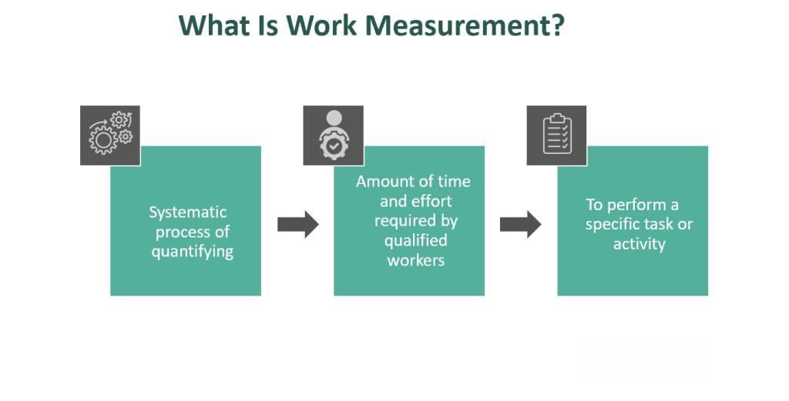

In today's dynamic financial landscape, understanding key concepts such as Work in Progress (WIP) measurement and its application in various fields is essential for businesses and investors alike. WIP plays a crucial role in accounting and financial analysis as it refers to the value of goods still in the production process, not yet completed or ready for sale. As businesses strive to optimize operations and improve financial outcomes, accurately measuring and managing WIP becomes pivotal.

This article explores how WIP is measured in accounting and its remarkable integration with algorithmic trading. The intersection of these areas provides unique insights into how partially completed products can influence financial strategies and outcomes. By comprehending the basics of WIP—spanning from its impact on manufacturing cycles to its reporting on financial statements—stakeholders can harness this knowledge to make informed decisions.



Businesses benefiting from a thorough understanding of WIP include financial professionals, investors, and academics who delve deeply into the mechanisms that affect inventory management and production efficiency. Furthermore, integrating WIP metrics into trading models represents an innovative approach to elevating investment strategies, offering competitive advantages in rapidly changing markets.

Whether by improving insights into company operations or enhancing the predictive accuracy of trading algorithms, recognizing the importance of WIP remains fundamental. This understanding is not only crucial for maintaining precise fiscal statements but also for navigating and succeeding in complex and competitive financial markets.

## Table of Contents

## Fundamentals of Work in Progress (WIP) in Accounting

Work in Progress (WIP) refers to the inventory of partially completed goods that have advanced from raw material form but are not yet finished products. In accounting, WIP is considered a crucial component of inventory management, appearing as a current asset on a company's balance sheet. This representation indicates the costs incurred during the manufacturing or development stages of these goods.

The valuation of WIP involves compiling several cost components that contribute to the production process. The primary elements include:

1. **Direct Labor**: This encompasses the wages and other labor-related expenses directly tied to the production of goods. Direct labor costs are calculated based on the amount of time spent by workers on manufacturing the goods that constitute WIP.

2. **Direct Materials**: These are the raw materials that have been physically integrated into the work in progress. Direct materials costs are traced during the production timeline and are converted from raw materials once they start the manufacturing process.

3. **Factory Overhead Costs**: These include indirect production expenses such as utilities, depreciation of production equipment, and maintenance overheads that are essential to the manufacturing process but not directly attributable to a specific product.

To accurately maintain records and manage WIP, companies typically employ cost accounting systems that allocate these costs to products as they go through different stages of production. Such systems not only aid in valuing inventory but also help in recognizing production efficiency and potential inefficiencies.

Consider a simple illustration: a manufacturing company uses the following formula to calculate its WIP costs:

$$
\text{WIP Cost} = \text{Beginning WIP Inventory} + \text{Manufacturing Costs} - \text{Cost of Manufactured Goods}
$$

where:
- **Beginning WIP Inventory** is the value of the work in progress at the start of the accounting period.
- **Manufacturing Costs** comprise direct labor, direct materials, and factory overhead incurred during the period.
- **Cost of Manufactured Goods** is the cost attributed to goods completed and moved to finished goods inventory.

In Python, this calculation could be expressed as follows:

```python
def calculate_wip_cost(beginning_wip, manufacturing_costs, costs_of_manufactured_goods):
    return beginning_wip + manufacturing_costs - costs_of_manufactured_goods

# Example usage:
beginning_wip = 50000
manufacturing_costs = 200000
costs_of_manufactured_goods = 180000

wip_cost = calculate_wip_cost(beginning_wip, manufacturing_costs, costs_of_manufactured_goods)
print(f"WIP Cost: ${wip_cost}")
```

Understanding and accurately measuring WIP is essential for businesses. It plays a pivotal role in the cost of goods sold and influences financial performance metrics, such as gross margin and inventory turnover ratios. Consequently, effective management of WIP can lead to improved operational efficiency and financial reporting accuracy.

## Accounting for WIP: Measurement and Reporting

Accurately measuring Work in Progress (WIP) is vital for financial reporting as it directly influences both the cost of goods sold (COGS) and inventory valuation. WIP encompasses all costs associated with products that are partially completed, and its precise accounting ensures transparency in financial statements.

Typically, WIP is recorded in a general ledger account dedicated to tracking ongoing production expenses. This account accumulates all relevant costs, including direct materials, direct labor, and allocated manufacturing overhead. As products advance through the production process and reach completion, these costs are transferred from the WIP account to the finished goods inventory account. This transfer is a critical accounting step, as it affects the COGS calculation upon the sale of the finished goods. The formula for calculating COGS is:

$$
\text{COGS} = \text{Beginning Inventory} + \text{Purchases} - \text{Ending Inventory}
$$

where the ending inventory is adjusted by the costs transferred from WIP. 

Efficient WIP accounting practices can significantly enhance operational efficiencies. By closely monitoring WIP, businesses can identify production bottlenecks, thereby providing insights into where delays or inefficiencies may occur. For instance, if WIP levels are unusually high, it may indicate that a particular production phase is slower than expected, requiring attention or reallocation of resources. These insights enable better decision-making and resource management.

Moreover, advanced accounting software systems and Enterprise Resource Planning (ERP) platforms offer tools for tracking and analyzing WIP in real-time. These systems allow businesses to maintain up-to-date records of production costs and progress, supporting optimal inventory levels and streamlined operations. Implementing these technologies not only aids in accurate WIP reporting but also helps in minimizing waste and reducing production costs. 

In summary, maintaining meticulous records of WIP and implementing sophisticated tracking systems are essential to effective financial management. They ensure that businesses have a clear view of their production dynamics, supporting both operational improvements and fiscal accuracy.

## Integration of WIP Measurement in Algorithmic Trading

Algorithmic trading, which leverages computational algorithms for executing trades, can significantly benefit from incorporating Work in Progress (WIP) data. Accurately measuring WIP allows traders and investors to forecast production timelines and associated costs effectively, providing a comprehensive understanding of manufacturing dynamics.

Predictive models in [algorithmic trading](/wiki/algorithmic-trading) can utilize WIP data to anticipate changes in inventory levels and manufacturing cycles. For instance, if WIP levels are calibrated and fed into a [machine learning](/wiki/machine-learning) model, it can predict potential increases or decreases in finished goods, offering crucial insights for supply chain optimization and strategic investment decisions. Consider a scenario where a Python-based predictive model uses WIP data:

```python
import pandas as pd
from sklearn.ensemble import RandomForestRegressor

# Sample data: WIP levels and corresponding production timelines
data = pd.DataFrame({
    'WIP_Level': [100, 200, 300, 400, 500],
    'Production_Time': [10, 15, 20, 25, 30]
})

# Define and train the predictive model
model = RandomForestRegressor()
model.fit(data[['WIP_Level']], data['Production_Time'])

# Predict future production timelines based on new WIP levels
new_wip_level = pd.DataFrame({'WIP_Level': [350]})
predicted_time = model.predict(new_wip_level)
print(f"Predicted Production Time for WIP Level 350: {predicted_time[0]} days")
```

This integration facilitates development of robust investment strategies by leveraging WIP metrics. Traders can optimize their decision-making processes based on expected market movements inferred from production data. For example, a rising WIP level might indicate an upcoming increase in supply, potentially leading to price adjustments for certain commodities or stocks.

By monitoring WIP metrics alongside other economic indicators, algorithmic trading systems can enhance their predictive accuracy, thus providing a competitive edge. This approach not only improves the precision of trades but also aids in risk management by aligning trading strategies with real-time production insights.

## Impact of WIP on Financial Ratios and Performance Metrics

Work in Progress (WIP) levels have a substantial impact on several critical financial ratios and performance metrics, including inventory turnover, gross margin, and current ratio.

Inventory turnover measures how efficiently a company manages its inventory. It is calculated using the formula:

$$
\text{Inventory Turnover} = \frac{\text{Cost of Goods Sold (COGS)}}{\text{Average Inventory}}
$$

A higher WIP level can inflate the average inventory value, thus reducing the inventory turnover ratio. A lower turnover ratio might suggest inefficiencies in inventory management or slower production processes, potentially signaling to investors that resources are not being utilized optimally.

The gross margin ratio, representing the percentage of revenue that exceeds the cost of goods sold, can also be influenced by WIP levels. The formula for gross margin is:

$$
\text{Gross Margin Ratio} = \frac{\text{Revenue} - \text{COGS}}{\text{Revenue}} \times 100
$$

Elevated WIP may lead to increased costs allocated to COGS, thereby reducing the gross margin ratio. This decrease might indicate increased production costs or inefficiencies, impacting profitability.

The current ratio, an indicator of a company’s ability to pay its short-term liabilities with its short-term assets, is calculated as:

$$
\text{Current Ratio} = \frac{\text{Current Assets}}{\text{Current Liabilities}}
$$

WIP, as part of current assets, directly affects this ratio. High WIP levels can temporarily bolster the current ratio. However, if not managed effectively, they could signify potential production or supply chain inefficiencies, posing risks to [liquidity](/wiki/liquidity-risk-premium).

Understanding these metrics and their relation to WIP is essential for businesses aiming to enhance their operational efficiency and financial health. By closely monitoring WIP levels, companies can identify potential bottlenecks or disruptions and enact strategies to streamline production processes, thereby optimizing resource allocation and improving their standing with investors and stakeholders.

## Challenges and Strategies in WIP Management

Managing Work in Progress (WIP) effectively requires addressing several key challenges that can impact operational efficiency and financial performance. Accurate cost allocation, tracking production stages, and responding to fluctuating market dynamics are central issues that organizations face when handling WIP.

Accurate cost allocation is crucial to correctly assigning the direct costs associated with production, which include labor, materials, and overheads. Misallocation can lead to skewed financial statements and incorrect profitability assessments. To address this challenge, businesses can implement cost accounting systems that allocate these expenses more precisely, ensuring that each unit of WIP is accurately valued and reflected in financial reports.

Tracking production stages is another significant challenge in WIP management. As goods move through various stages of production, maintaining real-time visibility of their status is essential. Enterprise Resource Planning (ERP) systems play a pivotal role in this process by integrating data across all functional areas of an organization, allowing for seamless tracking of production stages. By utilizing ERP systems, companies can monitor the progression of WIP, identify bottlenecks, and improve production scheduling.

Responding to market dynamics involves being agile in adapting to changes in demand and supply conditions. This adaptability can be enhanced through strategies like Just-In-Time (JIT) inventory management, which reduces excess inventory by aligning production closely with demand. JIT minimizes WIP by ensuring that materials and components arrive only as they are needed in the production process, leading to reduced storage costs and less capital tied up in inventory.

Lean manufacturing principles also provide a framework for minimizing WIP by focusing on eliminating waste and optimizing processes. Techniques such as value stream mapping can be employed to identify non-value-adding activities in the production chain, enabling businesses to streamline operations and improve efficiency.

Implementing these strategies can yield substantial benefits, including reduced production costs and improved lead times. By minimizing WIP, companies can lower their inventory carrying costs and reduce the likelihood of obsolete stock, thereby enhancing their financial position and competitive advantage in the market.

Overall, effective WIP management demands a comprehensive approach that combines technology, process improvement, and strategic planning to address the myriad of challenges associated with production and market variability.

## Conclusion

Effectively measuring and managing Work in Progress (WIP) is crucial for ensuring fiscal accuracy and optimizing production processes within a business. This accuracy is fundamental for maintaining precise financial statements, which rely on correctly valuing inventory and cost of goods sold. Sound management of WIP not only enhances the reliability of financial reporting but also refines production workflows, enabling organizations to identify and eliminate inefficiencies that may arise in production cycles.

Incorporating WIP metrics into algorithmic trading strategies can provide a significant competitive advantage. By integrating detailed insights from production processes into predictive models, investors and financial professionals can make informed decisions based on anticipated market movements. This involves building sophisticated algorithms that [factor](/wiki/factor-investing) in WIP data to enhance the precision of forecasts related to inventory levels and production timelines. Such data-driven strategies can lead to optimized trading decisions, minimizing risk while maximizing returns by capitalizing on expected shifts in supply and demand dynamics.

As financial environments continue to evolve rapidly, staying informed about key concepts like WIP is essential for navigating increasingly complex market landscapes. The better a business or investor understands these dynamics, the more effectively they can tailor their strategies to meet the demands of the modern marketplace. Ultimately, keeping abreast of changes in WIP management practices can lead to improved operational efficiency and profitability, ensuring that businesses remain competitive and resilient in the face of economic fluctuations.

## References & Further Reading

[1]: Fazzari, S. M., Hubbard, R. G., & Petersen, B. C. (1988). ["Financing Constraints and Corporate Investment."](https://www.jstor.org/stable/2534426) Brookings Papers on Economic Activity.

[2]: ["Lean Thinking: Banish Waste and Create Wealth in Your Corporation"](https://www.researchgate.net/publication/200657172_Lean_Thinking_Banish_Waste_and_Create_Wealth_in_Your_Corporation) by James P. Womack and Daniel T. Jones

[3]: Lambert, R. A. (1984). ["Income Smoothing as Rational Equilibrium Behavior."](https://www.jstor.org/stable/247322) The Accounting Review.

[4]: ["Cost Accounting: A Managerial Emphasis"](https://www.amazon.com/Cost-Accounting-Managerial-Emphasis-13th/dp/0136126634) by Charles T. Horngren, Srikant M. Datar, and Madhav V. Rajan

[5]: ["Quantitative Value, + Web Site: A Practitioner's Guide to Automating Intelligent Investment and Eliminating Behavioral Errors"](https://www.amazon.com/Quantitative-Value-Web-Site-Practitioners/dp/1118328078) by Wesley R. Gray and Tobias E. Carlisle