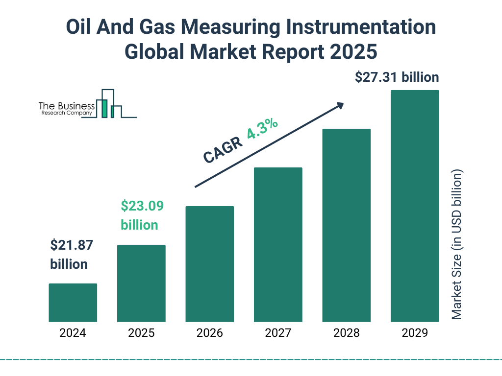

## Table of Contents

## What is oil and gas production?

Oil and gas production is the process of extracting oil and natural gas from underground reservoirs. These resources are found in rock formations deep beneath the Earth's surface. To get them out, companies drill wells into these formations. Once the oil and gas are brought to the surface, they are separated and treated to remove impurities. This makes them safe and useful for things like fueling cars, heating homes, and making plastics.

After the oil and gas are extracted and treated, they are transported to places where they are needed. This can be done through pipelines, ships, or trucks. At the destination, the oil might be refined into different products like gasoline, diesel, and jet fuel. Natural gas can be used directly for heating or cooking, or it can be processed into other products. The whole process from drilling to delivery involves many steps and a lot of technology to make sure it is done safely and efficiently.

## Why is measurement and reporting important in oil and gas production?

Measurement and reporting are really important in oil and gas production because they help everyone know how much oil and gas is being taken out of the ground. This is important for the companies because they need to know how much they are producing to plan their business and make sure they are making money. It's also important for the government because they use this information to make sure they are getting the right amount of taxes and royalties from the oil and gas companies. If the measurements are wrong, it could cause big problems like not knowing how much oil is left in the ground or not getting the right amount of money from the oil and gas.

Another reason measurement and reporting are important is for safety and the environment. By keeping track of how much oil and gas is being produced, companies can make sure they are following the rules to protect the environment. They can also use this information to make sure their equipment is working safely and not leaking. If there is a problem, like a leak, good measurement and reporting can help find it quickly so it can be fixed before it causes harm. This helps keep workers safe and protects the environment around the oil and gas operations.

## What are the basic units of measurement used in oil and gas production?

In oil and gas production, the basic units of measurement are barrels for oil and cubic feet for natural gas. A barrel is used to measure the [volume](/wiki/volume-trading-strategy) of oil, and it equals 42 US gallons. When people talk about how much oil is being produced, they often use barrels per day, which tells you how many barrels of oil are coming out of the ground each day.

For natural gas, the basic unit is cubic feet. This measures the volume of gas, and it's often reported as cubic feet per day. Sometimes, people also use a bigger unit called a thousand cubic feet (Mcf) or a million cubic feet (MMcf) to talk about larger amounts of gas. Both oil and gas measurements help everyone understand how much is being produced and how to plan for the future.

These units are important because they help keep track of how much oil and gas is being taken out of the ground. They are used all over the world, so everyone can understand and compare the amounts of oil and gas being produced in different places. This helps companies, governments, and people who use oil and gas know how much is available and how to use it wisely.

## What are the common methods for measuring oil and gas production?

In oil and gas production, there are several common methods for measuring how much oil and gas is being produced. One way is to use meters that can measure the flow of oil and gas as it comes out of the ground. These meters can be placed at the wellhead or along pipelines to keep track of the volume of oil and gas. Another method is called tank gauging, where oil is collected in tanks and the level of oil in the tank is measured to figure out how much oil has been produced. This method is often used for smaller wells or when the oil needs to be stored before it is moved somewhere else.

For natural gas, a common method is to use an orifice meter, which measures the flow of gas by how it moves through a small opening. This helps calculate the volume of gas being produced. Another way is to use electronic flow meters, which can give very accurate measurements of gas flow. These methods help make sure that the measurements are correct and can be trusted. All these measurement methods are important for keeping track of how much oil and gas is being produced and making sure that everything is running smoothly and safely.

## How does one ensure accuracy in oil and gas production measurements?

To ensure accuracy in oil and gas production measurements, it's important to use high-quality equipment that is well-maintained and calibrated regularly. Calibration means checking the equipment against a known standard to make sure it's measuring correctly. For example, flow meters and tank gauges need to be checked often to make sure they are giving the right readings. Also, using backup systems and having multiple ways to measure the same thing can help catch any errors. If one meter shows a different reading than another, it's a sign that something might be wrong and needs to be fixed.

Another way to ensure accuracy is by following strict procedures and standards. This means having clear rules on how to measure and report oil and gas production, and making sure everyone follows them. Training workers to use the equipment correctly and understand the importance of accurate measurements is also key. Regular audits and inspections can help find any problems early. By doing these things, companies can make sure their measurements are as accurate as possible, which is important for their business, safety, and the environment.

## What are the regulatory requirements for reporting oil and gas production?

Regulatory requirements for reporting oil and gas production are rules set by governments to make sure companies tell the truth about how much oil and gas they are taking out of the ground. These rules are important because they help governments know how much oil and gas is being produced in their country. This information is used to collect taxes and royalties, which are payments companies make to the government for the right to take oil and gas from the ground. Different countries have different rules, but they all want to make sure the numbers are correct and that companies are following the law.

To meet these requirements, oil and gas companies have to report their production numbers regularly, often every month or every year. They need to use accurate measuring tools and follow strict procedures to make sure their reports are correct. Governments might check these reports to make sure the companies are telling the truth. If a company doesn't follow the rules, they could get in trouble and have to pay fines. This is why it's so important for companies to keep good records and report their production honestly.

## What technologies are used to automate the measurement and reporting of oil and gas production?

Automation in oil and gas production helps make measuring and reporting easier and more accurate. One common technology is the use of smart meters and sensors. These devices can measure oil and gas flow in real-time and send the data directly to computers. This means workers don't have to go out to the well to take readings, which saves time and reduces the chance of mistakes. The data from these smart meters can be sent to a central system where it is checked and used to create reports automatically.

Another technology used is called SCADA, which stands for Supervisory Control and Data Acquisition. SCADA systems collect data from different parts of the oil and gas operation, like wells and pipelines, and bring it all together in one place. This helps managers see what's happening everywhere at once and make quick decisions if something goes wrong. SCADA can also be set up to create reports automatically, so the company can easily send the right information to the government or other people who need it. These technologies make the whole process of measuring and reporting more reliable and efficient.

## How do companies handle discrepancies or errors in production data?

When companies find errors or differences in their production data, they need to fix them quickly. They start by checking the data again to make sure the mistake is real. They look at the numbers from different meters or sensors to see if they match up. If they don't, the company will figure out which meter or sensor might be broken or not working right. They might need to fix or replace the equipment to make sure it's working correctly again. This helps them get back to having accurate data.

Once the problem is found and fixed, the company updates their records with the right numbers. They might need to change past reports to make sure everything is correct. It's important to tell the government about any changes, so they know the real amount of oil and gas produced. Companies also learn from these mistakes to make their measuring and reporting systems better. By doing this, they can prevent the same errors from happening again in the future.

## What are the environmental considerations in oil and gas production measurement and reporting?

When companies measure and report how much oil and gas they produce, they need to think about the environment. Accurate measurements help make sure they are not taking too much out of the ground too quickly, which can harm the environment. If there are leaks or spills, good measurements can help find them fast so they can be fixed before they cause a lot of damage. This is important because oil and gas can pollute water and air if they get out, and that's bad for plants, animals, and people.

Also, governments use the production data to make rules about how much oil and gas can be taken out of the ground. They want to protect the environment, so they need to know the right numbers. If the measurements are wrong, the rules might not work as well, and that could lead to more harm to the environment. So, it's really important for companies to measure and report their oil and gas production carefully and honestly.

## How does the measurement and reporting of oil and gas production impact financial reporting?

The measurement and reporting of oil and gas production directly affects a company's financial reporting. When a company knows exactly how much oil and gas it is producing, it can figure out how much money it is making from selling these resources. This information is used to create financial statements, like income statements and balance sheets, which show how well the company is doing. If the production numbers are wrong, the financial reports will also be wrong, which can lead to big problems. Investors and banks look at these reports to decide if they want to give the company money, so it's really important for the numbers to be correct.

Also, governments use the production data to make sure they are getting the right amount of taxes and royalties from the oil and gas companies. If the production is reported correctly, the government can collect the right amount of money. This money helps pay for things like schools and roads. If the production numbers are not accurate, the government might not get enough money, and the company could get in trouble for not paying the right amount of taxes. So, accurate measurement and reporting of oil and gas production is key for both the company's financial health and for making sure the government gets what it needs.

## What are the best practices for maintaining and calibrating measurement equipment in oil and gas production?

To keep measurement equipment working well in oil and gas production, it's important to follow a regular schedule for checking and fixing the equipment. This means making sure to calibrate the meters and sensors often. Calibration is when you compare the equipment to a known standard to see if it's giving the right readings. If it's not, you adjust it so it's accurate again. It's also a good idea to keep the equipment clean and protected from things like dust and water that could make it stop working right. If something breaks, it should be fixed or replaced quickly to keep the measurements accurate.

Another important part of maintaining measurement equipment is training the people who use it. They need to know how to use the equipment correctly and understand why it's important to take good care of it. Regular training sessions can help make sure everyone knows what to do. Also, keeping good records of when the equipment was last checked and calibrated helps keep everything organized. If there's a problem, these records can help figure out what went wrong and how to fix it. By following these practices, companies can make sure their measurements are as accurate as possible, which is important for their business and for meeting government rules.

## How do international standards and practices differ in the measurement and reporting of oil and gas production?

International standards and practices for measuring and reporting oil and gas production can be different from one country to another. Some countries follow rules set by groups like the American Petroleum Institute (API) or the International Organization for Standardization (ISO). These groups make guidelines that help companies measure and report their production in a way that everyone can understand. But not all countries use these guidelines the same way. For example, some countries might have their own rules that are stricter or different from the international standards. This can make it hard for companies that work in different countries to keep track of all the different rules they need to follow.

Even though the basic units of measurement like barrels for oil and cubic feet for gas are used around the world, the way companies report their production can be different. Some countries might want reports every month, while others might want them every year. Also, the way companies handle errors or discrepancies in their data can be different. In some places, companies might need to tell the government right away if there's a problem, while in other places, they might have more time to fix it before reporting. These differences can make it tricky for companies to make sure they are following all the rules correctly, but it's important for them to do so to stay in good standing with the governments where they work.

## References & Further Reading

[1]: Cornot-Gandolphe, S. (2017). ["The US Natural Gas Exports: New Rules on the Global Gas Market"](https://www.ifri.org/sites/default/files/migrated_files/documents/atoms/files/etude_cornot_gaz_naturel_en_europe_en_okdb_complet-reduit_ok.pdf). IFRI.

[2]: Clark, P., & Fox, B. (2018). ["The Impacts of Algorithmic Trading in Markets"](https://psycnet.apa.org/record/2018-58808-003). CFA Institute.

[3]: Barkhuizen, B. (2018). ["Geopolitics of Oil and Gas: A Strategic Analysis of Resources and Supply"](https://www.sciencedirect.com/science/article/pii/S2214629622001384) African Centre for the Constructive Resolution of Disputes (ACCORD).

[4]: Geman, H. (2005). ["Commodities and Commodity Derivatives: Modeling and Pricing for Agriculturals, Metals and Energy"](https://download.e-bookshelf.de/download/0000/5675/90/L-G-0000567590-0015270354.pdf) Wiley.

[5]: [International Energy Agency. "Gas 2020 Analysis and Forecast to 2025"](https://www.iea.org/reports/oil-market-report-december-2024).

[6]: [European Securities and Markets Authority (ESMA), MiFID II](https://www.esma.europa.eu/publications-and-data/interactive-single-rulebook/mifid-ii).

[7]: Menkveld, A. J. (2016). ["The Economics of High-Frequency Trading: Taking Stock"](https://www.annualreviews.org/content/journals/10.1146/annurev-financial-121415-033010). Annual Review of Financial Economics.

[8]: Evans, J. (2013). ["US Shale Oil Revolution"](https://www.erfin.org/journal/index.php/erfin/article/view/30). Financial Times.

[9]: Tetlock, P. C. (2007). ["Giving Content to Investor Sentiment: The Role of Media in the Stock Market"](https://onlinelibrary.wiley.com/doi/abs/10.1111/j.1540-6261.2007.01232.x). The Journal of Finance.