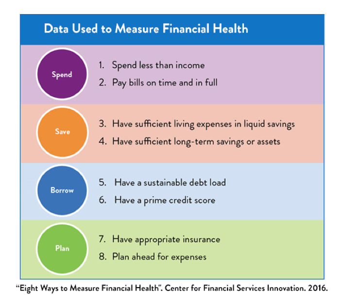

## Table of Contents

## What is corporate financial health?

Corporate financial health refers to how well a company is doing financially. It looks at things like how much money the company is making, how much it owes, and how much cash it has on hand. A company with good financial health can pay its bills, invest in new projects, and handle unexpected problems without too much trouble.

To check a company's financial health, people often look at its financial statements. These include the income statement, which shows if the company is making a profit; the balance sheet, which shows what the company owns and owes; and the cash flow statement, which shows how money moves in and out of the company. By looking at these documents, investors and managers can see if the company is strong and stable or if it might be in trouble.

## Why is it important to measure corporate financial health?

Measuring corporate financial health is important because it helps everyone understand how well a company is doing. When people know a company's financial health, they can make better decisions. For example, if you're thinking about buying stock in a company, you want to know if it's making money and can pay its bills. If the company is not doing well, you might decide not to invest.

It's also important for the people running the company. They need to know if they have enough money to keep the business going, pay their workers, and grow the company. If they see that the company is not healthy, they can try to fix problems before they get worse. This can help the company stay strong and avoid going out of business.

## What are the basic financial statements used to assess corporate health?

The basic financial statements used to assess corporate health are the income statement, the balance sheet, and the cash flow statement. The income statement shows how much money the company made and spent over a period of time, like a year. It tells you if the company made a profit or a loss. This is important because a company that keeps making profits is usually healthier than one that keeps losing money.

The balance sheet is like a snapshot of the company's financial situation at a specific moment. It lists what the company owns, like buildings and equipment, and what it owes, like loans and bills. By comparing what the company owns to what it owes, you can see if it has enough assets to cover its debts. This helps show if the company is financially stable.

The cash flow statement shows how money moves in and out of the company. It tells you where the money is coming from, like sales or loans, and where it's going, like paying bills or buying new equipment. This statement is crucial because even if a company is making a profit, it can still run into trouble if it doesn't have enough cash to pay its bills. By looking at all three statements together, you can get a good picture of the company's financial health.

## How can profitability ratios help evaluate a company's financial health?

Profitability ratios are numbers that show how well a company is making money. They help you see if a company is good at turning its sales into profit. One common ratio is the net profit margin, which tells you how much profit a company keeps from each dollar of sales. A high net profit margin means the company is good at controlling costs and making money. Another ratio is return on assets, which shows how well a company uses its things, like buildings and machines, to make a profit. If this number is high, it means the company is using its assets well to make money.

These ratios are important because they give a quick look at how healthy a company is financially. If a company has high profitability ratios, it usually means it's doing well and can keep making money in the future. But if the ratios are low, it might mean the company is struggling and needs to find ways to cut costs or increase sales. By looking at these ratios over time, you can see if the company is getting better or worse at making money. This helps investors and managers make smart decisions about the company's future.

## What role do liquidity ratios play in assessing corporate financial stability?

Liquidity ratios help us see if a company can pay its short-term bills. They show how much cash or things that can quickly turn into cash a company has compared to what it owes soon. The most common liquidity ratios are the current ratio and the quick ratio. The current ratio looks at all the things a company can turn into cash within a year, like inventory, and compares them to what it needs to pay in the same time. The quick ratio is stricter; it only counts the most liquid assets, like cash and money owed by customers, leaving out inventory.

These ratios are important because they tell us if a company can handle its bills without selling off long-term assets or borrowing more money. If a company has a high current or quick ratio, it means it's in a good spot to pay its bills and is less likely to run into money trouble. But if these ratios are low, it might mean the company could struggle to pay what it owes, which could lead to bigger problems. By keeping an eye on liquidity ratios, investors and managers can make sure the company stays financially stable and can keep running smoothly.

## How do solvency ratios indicate a company's long-term financial health?

Solvency ratios help us see if a company can pay off all its debts over the long term. They look at the big picture, showing how much a company owes compared to what it owns or how much money it makes. One common solvency ratio is the debt-to-equity ratio, which compares what the company owes to what the owners have put in. A lower ratio usually means the company is in better shape because it's not relying too much on borrowed money.

Another important solvency ratio is the interest coverage ratio. This tells us if a company makes enough money to pay the interest on its loans. If the ratio is high, it means the company can easily pay its interest and is less likely to run into problems. By looking at these solvency ratios, people can tell if a company is strong enough to keep going for a long time or if it might face trouble paying back what it owes.

## What are efficiency ratios and how do they reflect corporate performance?

Efficiency ratios help us see how well a company uses its things, like money and time, to do its work. These ratios look at how fast a company turns its stuff into sales and how good it is at collecting money from customers. For example, the inventory turnover ratio shows how many times a company sells and replaces its stock in a year. If this number is high, it means the company is good at selling its products and not letting them sit around too long. Another ratio is the receivables turnover ratio, which tells us how quickly a company gets paid by its customers. A high ratio here means the company is good at getting its money back fast.

These ratios are important because they show how well a company runs its day-to-day business. If a company has high efficiency ratios, it means it's doing a good job at using its resources to make money. This can help the company save money and be more profitable. But if the ratios are low, it might mean the company is not managing its things well and could be wasting time and money. By looking at efficiency ratios, people can see if a company is working smart and if it can keep making money in the future.

## How can cash flow analysis be used to determine financial health?

Cash flow analysis helps us see how money moves in and out of a company. It shows if a company has enough cash to pay its bills and keep running. By looking at the cash flow statement, we can see where the money comes from, like selling products or getting loans, and where it goes, like paying workers or buying new equipment. If a company has more cash coming in than going out, it's a good sign that it's doing well financially. But if it's spending more cash than it's making, it might run into trouble and need to borrow money or sell assets to keep going.

This analysis is important because even if a company looks profitable on paper, it can still have cash problems. For example, a company might show a profit on its income statement but still struggle to pay its bills because it's waiting too long to get paid by customers. By looking at the cash flow from operations, investing, and financing activities, we can see if the company is managing its cash well. A healthy cash flow means the company can handle its day-to-day needs and invest in future growth, which is a key part of its overall financial health.

## What advanced metrics beyond traditional ratios can provide deeper insights into corporate financial health?

Beyond the usual ratios, there are other ways to dig deeper into a company's financial health. One way is to look at the Economic Value Added (EVA), which shows if a company is making more money than the cost of the money it uses. If EVA is positive, it means the company is creating value for its shareholders. Another useful metric is the Altman Z-Score, which uses a mix of financial ratios to predict if a company might go bankrupt. A higher Z-Score means the company is more likely to stay healthy.

Another advanced metric is the Cash Conversion Cycle (CCC), which tells us how long it takes for a company to turn its inventory and other resources into cash. A shorter CCC means the company is good at managing its cash flow and can keep money moving quickly. Lastly, looking at the Customer Lifetime Value (CLTV) compared to the Customer Acquisition Cost (CAC) can show how well a company is doing at making money from its customers over time. If CLTV is much higher than CAC, it's a good sign that the company's business model is strong and sustainable.

## How do macroeconomic factors influence the interpretation of corporate financial health metrics?

Macroeconomic factors can have a big impact on how we look at a company's financial health. Things like the overall economy, interest rates, and inflation can change what we think about a company's numbers. For example, if the economy is doing well, a company's profits might look good. But if the economy is in a recession, even a small profit might be a big deal because many other companies are struggling. So, we need to think about the bigger picture when we look at a company's financial health.

Interest rates and inflation also matter a lot. When interest rates go up, it costs more for a company to borrow money. This can make their debt look worse and affect their financial health. Inflation can make a company's costs go up, which might hurt their profits. But if they can raise prices to match inflation, their financial health might still look good. So, it's important to think about these big economic factors when we try to understand if a company is doing well or not.

## What are the limitations of using financial ratios to assess corporate health?

Using financial ratios to check a company's health has some problems. One big issue is that these ratios only look at numbers from the past. They don't tell us much about what might happen in the future. Also, different companies in different industries can have very different ratios. What looks good for one company might not be good for another. This means we need to be careful when we compare companies using just their ratios.

Another problem is that financial ratios can be affected by how a company decides to do its accounting. Companies can use different ways to count their money, and this can change their ratios. For example, one company might decide to count its inventory in a way that makes its ratios look better than another company that uses a different method. So, it's important to know how a company does its accounting when we look at its ratios.

## How can a company improve its financial health based on the analysis of these measures?

A company can improve its financial health by looking at its financial statements and ratios, then making smart changes. For example, if the company's profit margin is low, it might need to cut costs or find ways to sell more. If the company has a lot of debt, it might want to pay it down or not borrow more money. By looking at the cash flow statement, the company can see if it has enough money coming in to cover what it needs to pay. If it doesn't, the company might need to collect money from customers faster or find other ways to bring in more cash.

Another way to improve financial health is by using efficiency ratios to see how well the company is using its resources. If the inventory turnover ratio is low, the company might need to sell its products faster or not buy as much inventory. If the receivables turnover ratio is low, the company might need to make sure customers pay their bills quicker. By making these kinds of changes, the company can use its resources better and make more money. This can help the company stay healthy and grow over time.

## What is the understanding of financial health in corporate finance?

Financial health is a concept referring to the state of a corporation's financial affairs, playing a crucial role in its continued operation and growth. A corporation's financial health is paramount as it influences its ability to stay solvent, meet operational expenses, invest in long-term assets, and ultimately, achieve its business objectives. Evaluating financial health enables corporations to identify areas for improvement, capitalize on strengths, and maintain a competitive edge.

The determination of financial health involves several key components including liquidity, solvency, operating efficiency, and profitability:

1. **Liquidity** refers to a company's ability to meet its short-term obligations using its readily available assets. It is a vital measure because insufficient liquidity can lead to financial distress or bankruptcy. Liquidity is often assessed using ratios such as the current ratio and quick ratio. The current ratio is calculated as:
$$
   \text{Current Ratio} = \frac{\text{Current Assets}}{\text{Current Liabilities}}

$$

   A current ratio greater than one indicates that the company has more current assets than current liabilities, suggesting good [liquidity](/wiki/liquidity-risk-premium).

2. **Solvency** evaluates a company's capacity to meet its long-term obligations. It is crucial for assessing the long-term viability of a business. Solvency is often assessed using the debt-to-equity ratio, which compares a company’s total liabilities to its shareholder equity:
$$
   \text{Debt-to-Equity Ratio} = \frac{\text{Total Liabilities}}{\text{Shareholders' Equity}}

$$

   A lower debt-to-equity ratio indicates a more financially stable position and greater solvency.

3. **Operating Efficiency** reflects how well a company utilizes its resources to generate revenue. It is a measure of the effectiveness with which a company can turn its inputs into outputs, minimizing costs and maximizing profitability. Common metrics include asset turnover and inventory turnover ratios.

4. **Profitability** is the ability of a company to generate income relative to its revenue, expenses, and equity or assets. It is a key indicator of a company’s success in growing shareholder value. Profitability ratios include the net profit margin, return on assets (ROA), and return on equity (ROE). The net profit margin, for instance, is calculated as:
$$
   \text{Net Profit Margin} = \left( \frac{\text{Net Income}}{\text{Revenue}} \right) \times 100

$$

   This ratio provides insights into how much profit a company extracts from its total sales.

**Key Financial Statements:**

To evaluate these components, three primary financial statements are used:

- **Balance Sheet**: Provides a snapshot of a company’s financial position at a specific point in time, summarizing assets, liabilities, and shareholders' equity. It essentially illustrates what the company owns and owes.

- **Income Statement**: Shows the company’s financial performance over a particular period, detailing the revenues, expenses, and profits or losses during the timeframe. This statement helps assess profitability and operational efficiency.

- **Cash Flow Statement**: Offers insights into the cash inflows and outflows from operating, investing, and financing activities over a period. It is crucial for understanding liquidity and the ability to generate cash to sustain or grow operations.

Together, these statements provide a comprehensive picture of a corporation’s financial health, guiding stakeholders in making informed decisions about the company’s future.

## What are the key financial indicators?

Financial indicators are essential tools utilized in corporate finance to assess a company's health and operational efficiency. They provide invaluable insights into various aspects of a company’s financial status through ratios that allow stakeholders to make informed decisions. This section discusses three primary categories of financial ratios: liquidity ratios, solvency ratios, and profitability ratios. Each category serves a distinct purpose in evaluating a company's performance and stability.

### Liquidity Ratios

Liquidity ratios measure a firm's capacity to meet its short-term liabilities with its short-term assets. The most commonly used liquidity ratio is the current ratio, which is calculated as:

$$
\text{Current Ratio} = \frac{\text{Current Assets}}{\text{Current Liabilities}}
$$

A current ratio greater than 1 indicates that the company has more current assets than current liabilities, suggesting sound short-term financial health. However, an excessively high ratio may signify underutilized assets.

### Solvency Ratios

Solvency ratios assess a company’s long-term financial viability and its ability to meet long-term obligations. The debt-to-equity ratio is a critical solvency ratio, expressed as:

$$
\text{Debt-to-Equity Ratio} = \frac{\text{Total Debt}}{\text{Shareholders' Equity}}
$$

A lower debt-to-equity ratio suggests a healthier balance between debt and equity in financing the company’s assets, indicating lower financial risk and greater stability. Investors and creditors often prefer companies with lower solvency ratios as they denote financial prudence and reduced risk.

### Profitability Ratios

Profitability ratios gauge a company’s ability to generate profit relative to sales, equity, and assets. The net profit margin is frequently used to denote how efficiently a company converts revenues into actual profit:

$$
\text{Net Profit Margin} = \left( \frac{\text{Net Income}}{\text{Revenue}} \right) \times 100
$$

A higher net profit margin indicates effective cost management and strong profit generation capabilities, reflecting positively on the company's operational effectiveness.

### Operational Effectiveness and Financial Stability

Financial indicators like these ratios provide a comprehensive picture of a company’s operational effectiveness and financial stability. For instance, liquidity ratios assure stakeholders that the company can handle its short-term obligations without resorting to additional financing. Solvency ratios provide insight into the company’s capital structure and its long-term financial strategy, which is crucial for investors evaluating financial risk. Meanwhile, profitability ratios reveal the efficiency and competence of a company's management in generating earnings.

In summary, these financial indicators act as a diagnostic toolkit that helps in assessing a company’s fiscal health, guiding decision-makers in formulating strategies for sustainable growth and stability.

## How can financial indicators be integrated into algo trading?

Algorithmic trading represents a fusion of technology and finance, enabling traders to execute orders through pre-programmed instructions that account for variables such as timing, price, and [volume](/wiki/volume-trading-strategy). Financial indicators, derived from a company's financial statements and market performance metrics, play a crucial role in formulating these strategies. These indicators provide quantitative insights into corporate health, which are essential for assessing market conditions and making informed trading decisions. 

In the context of [algorithmic trading](/wiki/algorithmic-trading), financial indicators like price-to-earnings (P/E) ratios, moving averages, and [momentum](/wiki/momentum) indicators are systematically integrated into trading algorithms. They serve as the foundational metrics for decision-making processes. For example, the moving average is utilized to identify price trends over specific periods. A simple moving average (SMA) is calculated by taking the arithmetic mean of prices over a designated number of periods. The formula is as follows:

$$
\text{SMA} = \frac{P_1 + P_2 + ... + P_n}{n}
$$

Where $P_i$ represents the price at each period $i$ and $n$ is the number of periods. In algorithmic trading, an SMA can help identify potential buy or sell signals when a shorter-term SMA crosses above or below a longer-term SMA, which could indicate a trend reversal.

Data analysis and [machine learning](/wiki/machine-learning) have introduced a new dimension to interpreting financial indicators for trading algorithms. Machine learning techniques, such as regression analysis, decision trees, and neural networks, analyze vast datasets to identify patterns and predict future price movements. By training algorithms on historical market data, machine learning models can refine trading strategies and increase their predictive accuracy. For instance, a machine learning model could be trained to detect patterns associated with market entry and [exit](/wiki/exit-strategy) points.

```python
from sklearn.linear_model import LinearRegression
import numpy as np

# Assume X is a 2D array with features from historical financial data
# y is the target variable, e.g., price movement
model = LinearRegression()
model.fit(X, y)

# Predict future prices using new data
predicted_prices = model.predict(new_X)
```

Algorithmic traders utilize these models to leverage financial data and execute trades with enhanced precision. By employing statistical [arbitrage](/wiki/arbitrage) or market signal exploration, traders identify price discrepancies and opportunities for profit. For example, a trader might develop a strategy based on the relationship between oil prices and energy sector stock prices. If an algorithm detects a correlation between the two, it could systematically execute trades when oil prices fluctuate, anticipating corresponding stock movements.

The integration of financial indicators into algorithmic trading offers a powerful tool for enhancing trading efficiency and profitability. However, success relies heavily on the robustness of the algorithms and the quality of the underlying data. As financial markets continue to evolve, the adaptive capabilities enabled by data analysis and machine learning remain indispensable in developing sophisticated trading strategies.

## References & Further Reading

[1]: Bergstra, J., Bardenet, R., Bengio, Y., & Kégl, B. (2011). ["Algorithms for Hyper-Parameter Optimization."](https://dl.acm.org/doi/10.5555/2986459.2986743) Advances in Neural Information Processing Systems 24.

[2]: ["Advances in Financial Machine Learning"](https://www.amazon.com/Advances-Financial-Machine-Learning-Marcos/dp/1119482089) by Marcos Lopez de Prado

[3]: ["Evidence-Based Technical Analysis: Applying the Scientific Method and Statistical Inference to Trading Signals"](https://www.amazon.com/Evidence-Based-Technical-Analysis-Scientific-Statistical/dp/0470008741) by David Aronson

[4]: ["Machine Learning for Algorithmic Trading"](https://github.com/stefan-jansen/machine-learning-for-trading) by Stefan Jansen

[5]: ["Quantitative Trading: How to Build Your Own Algorithmic Trading Business"](https://github.com/LucindaYa/quant-resources/blob/master/Quantitative%20Trading%20How%20to%20Build%20Your%20Own%20Algorithmic%20Trading%20Business.pdf) by Ernest P. Chan