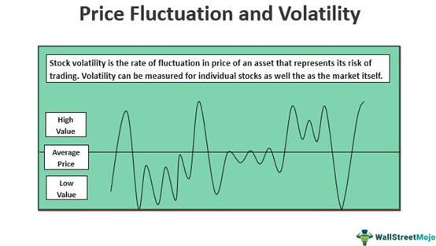

## Table of Contents

## What is stock price volatility and why is it important?

Stock price volatility refers to how much and how quickly the price of a stock changes over time. If a stock's price goes up and down a lot in a short period, it has high volatility. If the price stays pretty steady, it has low volatility. Imagine you're on a roller coaster; a stock with high volatility is like a wild ride with lots of ups and downs, while a stock with low volatility is more like a gentle, smooth ride.

Understanding volatility is important because it helps investors know what to expect and how much risk they're taking. If you invest in a stock with high volatility, you might make more money if the price goes up, but you could also lose more if it goes down. On the other hand, a stock with low volatility might not grow as fast, but it's usually safer. Knowing a stock's volatility can help you decide if it fits with your investment goals and how much risk you're comfortable with.

## How is stock price volatility different from stock price movement?

Stock price volatility and stock price movement are related but different. Stock price movement is just about whether the price of a stock goes up or down. If you look at a stock's price over time, you might see it going up, down, or staying the same. This movement tells you the direction the stock is going, but it doesn't tell you how bumpy the ride is.

Volatility, on the other hand, is all about how much the price jumps around. It's like looking at how wild the ups and downs are, not just if the price is going up or down. A stock can have a big movement, like going up a lot, but if it does it smoothly without a lot of ups and downs, it might not be very volatile. But if the price is going up and down a lot, even if it ends up in the same place, that's high volatility. So, movement is about direction, while volatility is about how much the price changes along the way.

## What are the basic measures of stock price volatility?

One common way to measure stock price volatility is by looking at the standard deviation of the stock's returns. Think of it like this: if you have a bunch of test scores, the standard deviation tells you how spread out those scores are. For stocks, if the returns are all over the place, the standard deviation will be high, meaning the stock is volatile. If the returns are pretty close together, the standard deviation is low, showing the stock is less volatile.

Another measure is the beta of a stock. Beta compares a stock's movement to the overall market. If a stock's beta is 1, it moves with the market. A beta higher than 1 means the stock is more volatile than the market, and a beta less than 1 means it's less volatile. So, if you want to know how wild a stock's ride is compared to the market, beta can help you figure that out.

## How is standard deviation used to measure stock price volatility?

Standard deviation is a way to measure how much a stock's price moves around over time. Imagine you have a bunch of daily returns for a stock. Some days the stock might go up a lot, some days it might go down a lot, and some days it might not move much at all. Standard deviation takes all these daily returns and calculates how spread out they are. If the returns are all over the place, the standard deviation will be high, which means the stock is very volatile. If the returns are pretty close together, the standard deviation will be low, showing the stock is less volatile.

To use standard deviation to measure stock price volatility, you first need to calculate the daily returns of the stock. This is done by taking the difference between the stock's price on one day and the next, then dividing by the starting price. Once you have these daily returns, you can use them to find the standard deviation. A higher standard deviation means the stock's price is moving around a lot, making it more volatile. A lower standard deviation means the stock's price is more stable, making it less volatile. This helps investors understand the risk of the stock and make better investment choices.

## What is the difference between historical volatility and implied volatility?

Historical volatility is about looking back at how much a stock's price has moved around in the past. It's like checking the weather history to see how stormy it was last month. To find historical volatility, you take the stock's past prices, figure out the daily returns, and then use those to calculate the standard deviation. A high number means the stock was bouncing around a lot, which means it was very volatile. A low number means the stock's price was pretty steady, so it was less volatile. This helps investors understand how wild the stock has been and can give them an idea of what to expect in the future.

Implied volatility is different because it's about what people think might happen in the future, not what has already happened. It's like guessing how stormy the weather might be next week. Implied volatility comes from looking at options prices, which are like bets on where the stock price will go. If people think the stock will move a lot, they'll pay more for options, which makes the implied volatility higher. If they think the stock will stay pretty steady, they'll pay less for options, making the implied volatility lower. This helps investors see what the market expects and can be useful for making decisions about buying or selling stocks and options.

## How do you calculate historical volatility?

To calculate historical volatility, you start by figuring out the daily returns of a stock. Daily returns are found by taking the difference between the stock's price on one day and the next, then dividing that difference by the starting price. Once you have these daily returns, you can use them to find the standard deviation. The standard deviation shows how spread out the returns are. If the returns are all over the place, the standard deviation will be high, meaning the stock is very volatile. If the returns are pretty close together, the standard deviation will be low, showing the stock is less volatile.

After you have the daily returns, you need to calculate the average of these returns. Then, you find the difference between each daily return and the average return, square those differences, and add them all up. Divide this sum by the number of returns minus one, then take the square root of that number. This gives you the standard deviation, which is your measure of historical volatility. A higher number means the stock's price has been moving around a lot, while a lower number means it's been more stable.

## What are the limitations of using standard deviation as a measure of volatility?

Using standard deviation to measure volatility has some limitations. One big problem is that it treats all changes in price the same way, whether the price goes up or down. But in the real world, investors often care more about big drops in price than big jumps up. Standard deviation doesn't tell you if the big moves were good or bad, just that they happened. Another issue is that standard deviation looks at past data. It can tell you how much the stock's price has moved around in the past, but it doesn't say anything about what might happen in the future. If the market changes or something unexpected happens, the past might not be a good guide for what's coming next.

Another limitation is that standard deviation can be affected by outliers, which are really big or small changes that don't happen often. If a stock has one or two huge price swings, it can make the standard deviation look higher than it really is most of the time. This can give investors a false idea of how risky the stock is. Also, standard deviation doesn't take into account how often the price changes. A stock might have a few big moves but stay steady most of the time, or it might be moving around a lot every day. Standard deviation doesn't tell you the difference, so it might not give you the whole picture of how volatile a stock really is.

## How is the Average True Range (ATR) used to assess volatility?

Average True Range (ATR) is another way to measure how much a stock's price moves around, or its volatility. It looks at the size of the price moves from one day to the next, and it takes into account gaps in price that happen when the market is closed. To calculate ATR, you first find the "true range" for each day, which is the biggest of three things: the difference between today's high and low, the difference between today's high and yesterday's close, or the difference between today's low and yesterday's close. Then, you take an average of these true ranges over a certain number of days, usually 14 days.

ATR is helpful because it gives you a sense of how much the stock price is moving, not just if it's going up or down. A high ATR means the stock's price is moving around a lot, so it's more volatile. A low ATR means the price isn't moving much, so it's less volatile. Unlike standard deviation, ATR is good at catching big price moves even if they happen when the market is closed. This can be useful for traders who want to know how much a stock's price might change in the near future, helping them decide when to buy or sell.

## What are Bollinger Bands and how do they relate to volatility?

Bollinger Bands are a tool used by traders to understand how much a stock's price is moving around. They are made up of three lines: the middle line is usually the average price of the stock over the last 20 days, and the other two lines are above and below this middle line. These top and bottom lines are set at a certain number of standard deviations away from the middle line, often two standard deviations. When the stock's price is moving a lot, the bands get wider, showing more volatility. When the price is moving less, the bands get narrower, showing less volatility.

The way Bollinger Bands relate to volatility is by showing how far the stock's price is spreading out. If the bands are wide apart, it means the stock's price has been going up and down a lot, so it's more volatile. If the bands are close together, it means the price hasn't been moving much, so it's less volatile. Traders use Bollinger Bands to see if a stock might be ready for a big move or if it's likely to stay steady. It helps them make decisions about when to buy or sell the stock based on how much the price is expected to change.

## How do options pricing models like the Black-Scholes model incorporate volatility?

The Black-Scholes model is a way to figure out how much an option should cost. It uses something called volatility to help make this calculation. Volatility in this model is a guess about how much the stock's price might move around in the future. It's called "implied volatility" because it comes from looking at the prices people are willing to pay for options right now. The more people think the stock's price will jump around, the higher the implied volatility, and the more they'll pay for the option. So, the Black-Scholes model uses this implied volatility number to help set the option's price.

In the Black-Scholes formula, volatility shows up in a part of the equation that helps predict how the stock's price might change over time. This part of the equation uses the square root of time and the volatility number to figure out how much the stock's price could move. If you think the stock's price will be very volatile, you'll use a bigger number for volatility in the model, and this will make the option more expensive. If you think the stock's price will stay pretty steady, you'll use a smaller number for volatility, and the option will be cheaper. So, the Black-Scholes model really depends on getting the volatility guess right to come up with a good price for the option.

## What advanced statistical models are used to forecast volatility?

One way to forecast volatility is by using a model called GARCH, which stands for Generalized Autoregressive Conditional Heteroskedasticity. This model looks at how much a stock's price has been moving around in the past and uses that to guess how much it might move around in the future. It's like checking the weather history to predict what the weather might be like tomorrow. GARCH is good because it can handle the way volatility changes over time. Sometimes, a stock might be calm for a while and then suddenly start moving a lot. GARCH can catch these changes and help investors get a better idea of what might happen next.

Another advanced model for forecasting volatility is the Stochastic Volatility (SV) model. This model thinks of volatility as something that changes randomly over time, kind of like a roller coaster that goes up and down without a clear pattern. The SV model uses past data to figure out how these random changes have happened before, and then it tries to predict how they might happen in the future. Both GARCH and SV models are more complicated than just using standard deviation, but they can give a more accurate picture of how much a stock's price might jump around, helping investors make smarter choices about buying and selling stocks.

## How can volatility clustering affect the accuracy of volatility measures?

Volatility clustering means that times when a stock's price moves a lot tend to happen close together, and times when it doesn't move much also happen close together. Imagine if you were on a roller coaster that had a bunch of big drops one after the other, then a bunch of smooth parts. That's kind of like volatility clustering. When we measure volatility, we often look at the past to guess the future. But if we don't know about volatility clustering, our guesses might be off. For example, if we just look at the last few days and they were calm, we might think the stock will stay calm, but if there's been a pattern of volatility clustering, a big move might be coming soon.

This can make it tricky to use simple measures like standard deviation to predict how much a stock's price will move around. Standard deviation looks at how spread out the price changes are over a certain time, but it doesn't pay attention to when those big changes happen. If we don't take into account that big moves often come in clusters, our measures of volatility might be too low right before a big move happens, or too high right after a bunch of big moves. That's why models like GARCH and Stochastic Volatility are helpful. They look at how volatility changes over time and can give a better guess about what might happen next, even if there's been a lot of clustering.

## What is Stock Volatility?

Stock [volatility](/wiki/volatility-trading-strategies) refers to the degree of variation in a stock's price over a given period. This concept is crucial for investors and traders as it serves as a statistical measure of the amount of uncertainty or risk associated with the size of changes in a security's value. Essentially, volatility provides insight into how much the price of a stock is likely to fluctuate, which is a key component in assessing investment risks and making informed trading decisions.

The measure of stock volatility is typically expressed in terms of standard deviation, a statistical metric that captures the [dispersion](/wiki/dispersion-trading) of a dataset relative to its mean. In the context of stock prices, a higher standard deviation indicates greater volatility, meaning the stock price experiences larger swings. Conversely, a lower standard deviation suggests less volatility and smaller changes in price.

$$
\sigma = \sqrt{\frac{1}{N-1} \sum_{i=1}^{N} (X_i - \bar{X})^2}
$$

Where $\sigma$ represents the standard deviation, $N$ is the number of observations, $X_i$ denotes each individual observation (stock price), and $\bar{X}$ is the mean of these observations.

Volatility can be categorized into two types: historical volatility and implied volatility. Historical volatility is calculated based on past price movements of a stock and is often used to gauge future price trends. It provides a retrospective view of how the price of a security has changed historically, which can be useful in risk assessment and strategic planning.

Implied volatility, on the other hand, is derived from the market price of a market-traded derivative, such as options. It reflects the market's expectations of future volatility, offering a forward-looking perspective. Implied volatility is a key [factor](/wiki/factor-investing) in options pricing models, such as the Black-Scholes model, where it can significantly impact the premium of options contracts.

Understanding volatility is essential for identifying investment risk levels. For traders, it assists in anticipating price fluctuations and making tactical decisions. High volatility can offer opportunities for significant gains, as stocks may experience rapid and wide price movements. However, it also increases the risk of substantial losses. Low volatility, in contrast, suggests more stable prices, which might be preferable for risk-averse investors seeking consistent returns.

In conclusion, stock volatility is a fundamental concept in financial markets that offers critical insights into the potential risks and opportunities associated with trading securities. It helps traders and investors evaluate the level of uncertainty in stock price movements and form strategies that align with their risk tolerance and investment objectives.

## What are Volatility Measures?

Stock volatility is a crucial component in the analysis and prediction of financial market behavior. Various measures exist to quantify this volatility, each providing specific insights into market dynamics.

Historical volatility is one primary measure that assesses the extent to which a stock's price has fluctuated over a certain past period. It is calculated using statistical metrics, primarily the standard deviation of the stock's returns over time. Given a series of past prices $P_1, P_2, ..., P_n$, the return for each period is often calculated as the natural logarithm of the price ratios: 

$$
R_i = \ln\left(\frac{P_i}{P_{i-1}}\right)
$$

The historical volatility $\sigma$ can then be computed as:

$$
\sigma = \sqrt{\frac{1}{n-1} \sum_{i=1}^{n} (R_i - \bar{R})^2}
$$

where $\bar{R}$ is the average of the returns $R_i$.

Implied volatility differs in that it is forward-looking, derived from the current market prices of options. It represents the market's expectations of future price fluctuations. Implied volatility is embedded in the Black-Scholes model, a fundamental formula used in options pricing. It does not compute directly from historical prices but is extracted from the price of call and put options using numerical techniques to fit observed market prices. Implied volatility can thus reflect traders' sentiment and expectations about future price movements.

Other important volatility measures include beta, standard deviation, and the VIX index. Beta measures a stock's volatility relative to the overall market. A beta greater than one suggests that the stock is more volatile than the market. The formula for beta ($\beta$) is:

$$
\beta = \frac{\text{Cov}(R_i, R_m)}{\text{Var}(R_m)}
$$

where $R_i$ and $R_m$ are the returns of the individual stock and the market, respectively.

The standard deviation, while used in calculating historical volatility, serves as a standalone measure, providing the average volatility from a mean. It is a basic yet powerful tool for evaluating the past performance volatility of stocks.

Lastly, the VIX, also known as the "fear index," quantifies the market's expectation of 30-day volatility, derived from the S&P 500 index options. It is widely recognized as a standard measure for market risk and investor sentiment.

Incorporating these different measures facilitates a comprehensive understanding of market behavior, accommodating both historical trends and future expectations. Each approach offers valuable insights that traders and analysts can integrate into their financial strategies for more robust volatility assessment.

## References & Further Reading

[1]: Bergstra, J., Bardenet, R., Bengio, Y., & Kégl, B. (2011). ["Algorithms for Hyper-Parameter Optimization."](https://papers.nips.cc/paper/4443-algorithms-for-hyper-parameter-optimization) Advances in Neural Information Processing Systems 24.

[2]: ["Advances in Financial Machine Learning"](https://www.amazon.com/Advances-Financial-Machine-Learning-Marcos/dp/1119482089) by Marcos Lopez de Prado

[3]: ["Evidence-Based Technical Analysis: Applying the Scientific Method and Statistical Inference to Trading Signals"](https://www.amazon.com/Evidence-Based-Technical-Analysis-Scientific-Statistical/dp/0470008741) by David Aronson

[4]: ["Machine Learning for Algorithmic Trading"](https://github.com/stefan-jansen/machine-learning-for-trading) by Stefan Jansen

[5]: ["Quantitative Trading: How to Build Your Own Algorithmic Trading Business"](https://www.amazon.com/Quantitative-Trading-Build-Algorithmic-Business/dp/1119800064) by Ernest P. Chan