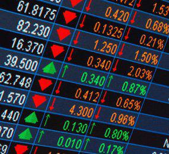

In the ever-evolving landscape of financial markets, options trading has emerged as a prominent investment avenue, attracting both novice and experienced traders. Options are financial derivatives that confer the right, but not the obligation, to buy or sell an underlying asset at a predetermined price before or at the expiration date. The appeal of options trading lies in its flexibility, leverage potential, and ability to hedge against risks.

A pivotal factor influencing traders and investors in options trading is option liquidity. Option liquidity pertains to the ease with which options can be bought or sold in the market without causing significant price fluctuations. High liquidity enables effortless entry and exit from positions, reducing the costs associated with trading. In contrast, low liquidity can introduce challenges such as wider bid-ask spreads and increased transaction costs, affecting trading efficiency and profitability.



This article examines the critical aspects of option liquidity, including its measurement and the transformative role of algorithmic trading in enhancing market liquidity. By scrutinizing liquidity metrics such as daily trading volume and open interest, traders can better assess liquidity risks associated with specific option contracts. Additionally, algorithmic trading strategies, including high-frequency trading (HFT) and market making, have revolutionized trading processes by increasing market liquidity and narrowing bid-ask spreads.

Understanding these dynamics allows traders to make informed decisions, optimizing their trading outcomes and participating more effectively in the options market.

## Table of Contents

## Understanding Option Liquidity

Option liquidity is a fundamental concept in the financial markets, particularly in options trading. It indicates the ease with which options contracts can be bought or sold without significantly affecting their prices. High liquidity in options implies that traders and investors can efficiently enter or exit their positions, which is critical for capitalizing on trading opportunities and managing risk.

Two primary indicators of option liquidity are daily trading volume and open interest. These metrics provide insight into the level of activity and ongoing interest in particular options.

**Daily Trading Volume**: This metric represents the total number of options contracts traded in a given day. High daily trading volume is often associated with greater liquidity, as it suggests a high level of interest in the option and a larger number of participants willing to buy or sell at any given time. A high volume reduces the risk of price manipulation because orders can be executed quickly without causing significant price changes. For instance, an option with a daily volume of 10,000 contracts is considered more liquid than one with only 1,000 contracts traded.

**Open Interest**: Open interest is the total number of outstanding options contracts that have not been settled or closed. It provides an indication of the market's ongoing interest in a particular option. Unlike daily trading volume, which resets at the end of each trading day, open interest is cumulative and provides a snapshot of the total number of open positions. High open interest suggests that the option is actively engaged by traders, potentially increasing liquidity. For example, an option with an open interest of 50,000 contracts is likely to experience easier market entry and exit conditions compared to one with an open interest of 5,000 contracts.

Both daily trading [volume](/wiki/volume-trading-strategy) and open interest are crucial for evaluating [liquidity](/wiki/liquidity-risk-premium), and they often complement each other. Traders and investors commonly monitor these indicators as part of their strategy to minimize liquidity risk and improve the execution quality of their trades. By understanding these metrics, traders can make more informed decisions, ensuring that their trades align with their liquidity preferences and market conditions.

## Measuring Option Liquidity

Option liquidity is a vital consideration in options trading, determining how smoothly a trader can enter or [exit](/wiki/exit-strategy) positions. A key part of assessing option liquidity involves analyzing specific metrics—daily trading volume and open interest—which provide insights into market dynamics and potential risks associated with trading those options.

Daily volume represents the number of times a specific option contract is traded within a single day. A higher daily volume indicates greater liquidity, meaning the option is traded more frequently, allowing traders to execute orders more efficiently without causing significant price fluctuations. This measure is particularly crucial as it helps traders determine the ease with which they can enter or exit positions, minimizing slippage and ensuring favorable trade execution.

Open interest is another essential metric, reflecting the total number of outstanding option contracts that have not yet been settled. Unlike daily volume, open interest is a cumulative figure, providing an indication of the level of ongoing interest and participation in a particular option. A higher open interest suggests more active involvement from traders and possibly a more liquid market. This metric helps assess the sustainability of trading volumes and whether there will be enough market participants to support future trades.

By evaluating these metrics—daily volume and open interest—traders can gain valuable insights into the liquidity of specific options. For example, an option with high daily volume and open interest suggests higher liquidity, reducing liquidity risk and allowing for more effective management of positions. Additionally, these metrics enable traders to gauge the potential impact of their trades on market prices, aiding in the development of robust trading strategies.

Here is a simple Python snippet that provides a basic illustration of how traders might analyze these metrics:

```python
def assess_option_liquidity(daily_volume, open_interest):
    if daily_volume > 1000 and open_interest > 5000:
        return "High Liquidity"
    elif daily_volume > 500 and open_interest > 2500:
        return "Moderate Liquidity"
    else:
        return "Low Liquidity"

# Example usage
daily_volume_example = 1200
open_interest_example = 6000

liquidity_status = assess_option_liquidity(daily_volume_example, open_interest_example)
print(f'The liquidity status of the option is: {liquidity_status}')
```

This function provides a basic framework for categorizing option liquidity based on predefined thresholds for daily volume and open interest. By applying such analyses, traders can refine their decision-making processes, enhancing their ability to engage in profitable and well-executed trades.

## The Role of Algorithmic Trading

Algorithmic trading employs automated systems to execute trades with precision and speed, significantly influencing option market liquidity. These systems encompass a variety of algorithms designed to optimize trading performance by minimizing transaction costs and exploiting market inefficiencies.

High-Frequency Trading ([HFT](/wiki/high-frequency-trading-strategies)) is one of the dominant algorithmic strategies contributing to market liquidity. It involves executing a large number of trades at extremely high speeds, often within microseconds. HFT firms typically profit from small price discrepancies, and their activity increases market depth, as more buy and sell orders are placed. This increased activity generally results in tighter bid-ask spreads, a key indicator of enhanced market liquidity. By reducing the cost of trading, HFT provides a more liquid environment, encouraging higher participation rates in the options market.

Market Making is another crucial algorithmic strategy that plays a pivotal role in improving liquidity. Market makers continuously quote buy and sell prices for options, ensuring that other market participants can execute trades. By providing these quotes, market makers help maintain a balance between supply and demand, which is essential for keeping the bid-ask spread narrow. In essence, their activity guarantees that there is always a counterparty willing to trade, making it easier for investors to enter and exit positions.

The impact of [algorithmic trading](/wiki/algorithmic-trading) on liquidity can also be quantitatively assessed. By implementing strategies that boost trading volumes, these systems facilitate more frequent price discovery, ensuring that prices reflect all available information. Additionally, because algorithmic trading can process large sets of data quickly, it aids in identifying and correcting mispricing in real-time.

Algorithmic trading not only streamlines the trading process but also introduces risks, such as the potential for increased market [volatility](/wiki/volatility-trading-strategies). Rapid trade execution can lead to significant price swings if not managed properly. Consequently, while these systems enhance liquidity and market efficiency, they also necessitate robust risk management practices.

Overall, algorithmic trading, through its strategic use of technologies like HFT and [market making](/wiki/market-making), fosters an environment of improved liquidity. This leads to more efficient markets, benefiting traders by allowing for quicker and cheaper trade executions. Understanding the mechanisms behind these contributions is essential for traders seeking to optimize their participation in the financial markets.

## Case Study: Comparing Algorithmic Strategies

High-Frequency Trading (HFT) and Statistical Arbitrage are prominent algorithmic strategies that have reshaped the landscape of options trading by utilizing rapid trade executions to exploit small price discrepancies. These strategies rely on sophisticated algorithms and computational power to achieve their goals, each contributing uniquely to the market’s liquidity profile.

High-Frequency Trading represents a significant proportion of all trading activities in financial markets. HFT firms deploy algorithms that execute trades within microseconds, profiting from ephemeral price imbalances and inefficiencies. By performing a high volume of trades in a short time, HFT enhances market liquidity by increasing the number of transactions and reducing the bid-ask spread. Despite these benefits, HFT is not without risks, including the potential for increased market volatility and the propagation of systemic risks during periods of market stress.

Statistical [arbitrage](/wiki/arbitrage), on the other hand, involves constructing portfolios designed to exploit statistical mispricings between related financial instruments. Statistical models identify potential overvalued or undervalued options, allowing for trades that theoretically [carry](/wiki/carry-trading) a lower risk due to diversification and mean reversion tendencies. This strategy contributes to liquidity since arbitrageurs are continually balancing imbalances by adding market depth through their trades. However, [statistical arbitrage](/wiki/statistical-arbitrage) requires careful risk management and sophisticated quantitative models to mitigate the impact of model risk and execution risk.

Market Making is another vital algorithmic strategy that plays a crucial role in maintaining liquidity. Market makers continuously provide buy and sell quotes for options, striving to profit from the bid-ask spread. Their presence ensures that there is always a counterparty available, thus supporting the trades of other market participants. The open order [books](/wiki/algo-trading-books) and reduced transaction costs driven by market makers facilitate greater market efficiency. However, maintaining consistent profitability demands a rigorous understanding of market conditions and strategic positioning to avoid significant losses during periods of market upheaval or rapid price movements.

The contributions of these algorithmic strategies to market liquidity are varied. While HFT and Statistical Arbitrage primarily increase trading volumes and capitalize on inefficiencies, Market Making directly enhances the depth of the market. Each strategy presents its unique set of risks and rewards, influencing the choices traders and investors make based on their risk tolerance, computational resources, and market objectives. Balancing these factors effectively can lead to optimized trading outcomes and a more liquid options market.

## Considerations for Traders

Liquidity plays a pivotal role in the selection of options for trading, influencing both trade execution and potential profitability. Traders looking to optimize their strategies must give significant consideration to liquidity metrics alongside the effects of algorithmic trading. Assessing these factors can provide valuable insights into market behavior and help in crafting effective trading strategies.

Liquidity metrics, such as daily trading volume and open interest, serve as essential indicators of an option's ease of transaction. High trading volumes typically suggest that options can be bought or sold with minimal price concession, reflecting a liquid market. Similarly, high open interest may indicate a robust market with sustained investor interest. Together, these metrics help assess the liquidity risk associated with specific options, guiding traders in making informed decisions about entry and exit positions.

Incorporating the impact of algorithmic trading is also paramount for traders. Algorithmic trading, through methods such as High-Frequency Trading (HFT) and Market Making, enhances liquidity by increasing trading volumes and narrowing bid-ask spreads. This process facilitates smoother and more efficient trade executions. By understanding the interplay between algorithms and liquidity, traders can better anticipate market conditions and adapt their strategies accordingly.

Moreover, liquidity assessment cannot occur in isolation; it requires balancing alongside other critical factors such as volatility and risk management. Volatility, for instance, affects the pricing of options and can intersect with liquidity in complex ways. An option may be highly liquid but also highly volatile, presenting both opportunities and risks. Effective trading strategies often require a nuanced understanding of how liquidity and volatility coexist, ensuring that positions are not only liquid but also strategically sound in terms of risk exposure.

Risk management further complements liquidity considerations, as it focuses on protecting the trader's capital and ensuring long-term sustainability. By integrating risk management techniques, traders can minimize potential losses and enhance their ability to react swiftly to changing market environments. This balance of liquidity, volatility, and risk forms the cornerstone of a resilient trading strategy, enabling traders to optimize their market participation and enhance profitability. 

In conclusion, achieving a comprehensive grasp of both liquidity metrics and the influence of algorithmic trading empowers traders to make informed trading decisions. By balancing liquidity with volatility and effective risk management, traders can design strategies that are robust and adaptive to the ever-evolving financial markets.

## Conclusion

Option liquidity plays an essential role in crafting efficient trading strategies within financial markets. It serves as a measure of how seamlessly options can be traded without causing significant price fluctuations. The higher the liquidity, the lower the transaction costs and the quicker an investor can enter or exit a position. Thus, understanding and effectively measuring option liquidity can markedly improve trading outcomes.

Traders and financial analysts employ various metrics to quantify liquidity, such as daily trading volume and open interest. These indicators provide valuable insights into the ease of transaction and the level of ongoing interest in an option. By analyzing these metrics, traders can better evaluate liquidity risk and make more informed decisions about which options to trade.

Algorithmic trading further enhances liquidity by automating the trading process, increasing trading volumes, and narrowing bid-ask spreads. Through sophisticated strategies such as High-Frequency Trading (HFT) and Market Making, algorithms facilitate faster execution of trades and thereby boost market efficiency. These strategies optimize liquidity by continuously adjusting to market conditions and providing consistent buy and sell opportunities, which in turn enhances the overall trading ecosystem.

Understanding liquidity dynamics is thus crucial for traders. By accurately measuring liquidity and effectively utilizing algorithmic trading, traders can optimize their market participation. This enables them to make informed trading decisions that are aligned with their strategic objectives, risk tolerance, and market conditions. Therefore, option liquidity is not just a determinant of market functionality but a vital component in achieving successful trading outcomes.

## References & Further Reading

[1]: Hull, J. C. (2018). ["Options, Futures, and Other Derivatives"](https://www.semanticscholar.org/paper/Options%2C-Futures%2C-and-Other-Derivatives-Hull/89bdee500c8623864fc9eb7a471546aa713acc44) (10th ed.). Pearson.

[2]: Black, F., & Scholes, M. (1973). ["The Pricing of Options and Corporate Liabilities."](https://www.cs.princeton.edu/courses/archive/fall09/cos323/papers/black_scholes73.pdf) Journal of Political Economy, 81(3), 637-654.

[3]: Hasbrouck, J. (2009). ["Trading Costs and Returns for U.S. Equities: Estimating Effective Costs from Daily Data."](https://pages.stern.nyu.edu/~jhasbrou/Research/GibbsCurrent/HasbrouckJF.pdf) Review of Financial Studies, 22(3), 1039-1070.

[4]: Johnson, T. C. (2008). ["Volume, Liquidity, and Price Impact."](https://timothyjohnson.web.illinois.edu/papers/JFE_2008.pdf) Journal of Financial Economics, 87(2), 388-417.

[5]: Aldridge, I. (2013). ["High-Frequency Trading: A Practical Guide to Algorithmic Strategies and Trading Systems"](https://books.google.com/books/about/High_Frequency_Trading.html?id=6l0DDQAAQBAJ) (2nd ed.). Wiley.