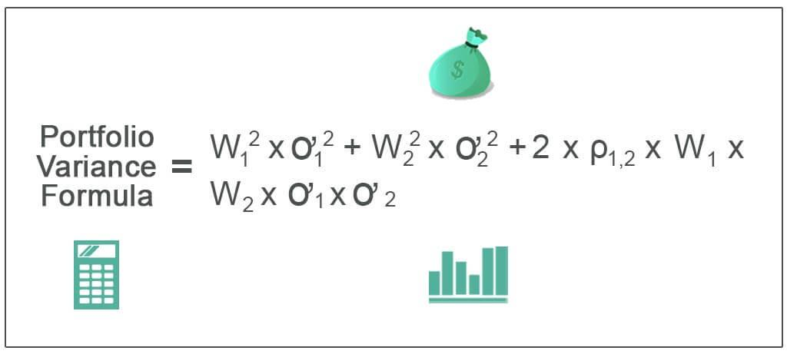

## Table of Contents

## What is portfolio variance and why is it important?

Portfolio variance is a measure of how the value of a collection of investments, called a portfolio, might change over time. It tells you how much the returns on your investments might go up or down. Imagine you have different stocks or bonds in your portfolio. Portfolio variance looks at how each of these investments moves and how they move together. If one stock goes up while another goes down, this can affect the overall risk of your portfolio.

Understanding portfolio variance is important because it helps you manage risk. If you know how much your portfolio might change in value, you can make better decisions about which investments to include. For example, if you want a less risky portfolio, you might choose investments that don't all move in the same direction at the same time. This can help smooth out the ups and downs of your investments, making your financial future more predictable and secure.

## How do you calculate the variance of a single asset?

To calculate the variance of a single asset, you first need to know the returns of that asset over a period of time. Let's say you have the monthly returns for a year. You start by finding the average return, which is just adding up all the returns and dividing by the number of months. Then, for each month, you subtract the average return from the actual return for that month. This gives you the difference, or deviation, from the average for each month.

Next, you square each of these differences. Squaring them makes sure all the numbers are positive, which is important for the next step. After squaring, you add up all these squared differences. Finally, you divide this total by the number of months minus one. This gives you the variance of the asset's returns. The variance tells you how spread out the returns are from the average, which helps you understand the risk of the asset.

## What are the basic components needed to calculate portfolio variance?

To calculate portfolio variance, you need to know the weights of each asset in your portfolio, the variance of each asset, and the correlation between the assets. The weights tell you how much of your money is in each asset. The variance of each asset shows how much its returns can change. The correlation tells you how the returns of different assets move together.

You start by finding the variance of each asset on its own. Then, you look at how these assets move together, which is the correlation. If two assets move in the same direction, they have a high positive correlation. If they move in opposite directions, they have a negative correlation. You use these pieces of information along with the weights to calculate the overall variance of your portfolio. This helps you understand how much your whole portfolio might change in value.

## How does diversification affect portfolio variance?

Diversification means spreading your money across different types of investments. When you do this, you can lower the overall risk of your portfolio. Imagine if you put all your money in one stock and that stock goes down. You lose a lot. But if you spread your money across many stocks, some might go down, but others might go up. This can help balance out the ups and downs, making your portfolio less risky.

The way diversification affects portfolio variance is by reducing how much your portfolio's value might swing around. If you have investments that don't move in the same way, the ups of some can cancel out the downs of others. This is because portfolio variance looks at not just how each investment moves, but also how they move together. By choosing investments that don't all move in the same direction, you can make your portfolio's variance smaller, which means less risk for you.

## What is the formula for calculating portfolio variance?

The formula for calculating portfolio variance looks at how each investment in your portfolio moves and how they move together. Imagine you have different investments like stocks or bonds. For each one, you need to know how much of your money is in it, which we call the weight. You also need to know how much each investment's value might change, which is its variance. And you need to know how the investments move together, which is their correlation. The formula uses all these pieces to figure out the overall risk of your portfolio.

Here's how it works: You take the weight of each investment and multiply it by the weight of every other investment, including itself. Then, you multiply this by the variance of the first investment if you're looking at the same investment, or by the correlation between the two investments and the square root of their variances if you're looking at different investments. You do this for every pair of investments in your portfolio and add all these numbers together. The result is the portfolio variance, which tells you how much your whole portfolio's value might change.

## How do you calculate the covariance between two assets?

To calculate the covariance between two assets, you need to know their returns over time. Imagine you have the monthly returns for two stocks for a year. First, you find the average return for each stock by adding up all the returns and dividing by the number of months. Then, for each month, you subtract the average return of the first stock from its actual return for that month, and do the same for the second stock. This gives you the difference, or deviation, from the average for each stock for each month.

Next, you multiply these differences together for each month. If one stock's return is above its average and the other stock's return is also above its average, the product will be positive. If one is above and the other is below, the product will be negative. After you've done this for all the months, you add up all these products. Finally, you divide this total by the number of months minus one. This gives you the covariance, which tells you how the returns of the two stocks move together. If the covariance is positive, the stocks tend to move in the same direction. If it's negative, they tend to move in opposite directions.

## What role does the correlation coefficient play in portfolio variance?

The correlation coefficient is a number that tells you how two investments move together. It's important for figuring out portfolio variance because it shows if the ups and downs of different investments happen at the same time. The correlation coefficient can be between -1 and 1. If it's close to 1, the investments move in the same direction a lot. If it's close to -1, they move in opposite directions. If it's around 0, their movements don't have much to do with each other.

When you calculate portfolio variance, you use the correlation coefficient to see how the movements of different investments affect the overall risk of your portfolio. If you have investments that move in the same direction (high positive correlation), their ups and downs can add up, making your portfolio more risky. But if you have investments that move in opposite directions (negative correlation), their ups and downs can cancel each other out, making your portfolio less risky. So, by choosing investments with different correlations, you can control how much your portfolio's value might change.

## How can you use historical data to estimate future portfolio variance?

You can use historical data to guess how much your portfolio's value might change in the future by looking at how it changed in the past. Start by collecting the returns of each investment in your portfolio over a long time, like a few years. Then, use this data to calculate the variance of each investment and the correlation between them. The variance tells you how much each investment's returns have moved around in the past, and the correlation shows how they moved together. By putting these numbers into the portfolio variance formula, you can get an idea of how much your portfolio's value might swing around in the future.

However, remember that using historical data is just a guess. Past performance doesn't always tell you what will happen next. Things like the economy, new laws, or big world events can change how investments behave. So, while historical data can give you a good starting point, you should also think about what might happen in the future and maybe adjust your expectations. By combining what you know from the past with your best guesses about the future, you can make smarter choices about your investments.

## What are the limitations of using historical data for variance calculations?

Using historical data to figure out how much your investments might change in the future has some problems. The main issue is that the past doesn't always tell you what will happen next. Things like the economy, new laws, or big world events can make investments act differently than they did before. So, even if you use a lot of old data, it might not be a good guess for what's coming.

Another problem is that historical data might not cover all the different situations that could happen. If you only look at data from good times, you might miss how your investments would do in bad times. Also, the data you have might not be long enough or detailed enough to really understand how your investments move. This can make your guesses about future changes less accurate.

## How do advanced models like the Capital Asset Pricing Model (CAPM) incorporate portfolio variance?

The Capital Asset Pricing Model, or CAPM, helps you figure out how much return you should expect from an investment based on how risky it is. It uses something called beta to measure this risk. Beta looks at how much an investment's returns move compared to the whole market. If an investment's returns move a lot when the market moves, it has a high beta and is riskier. CAPM uses this beta, along with the expected return of the market and a safe investment like a government bond, to tell you what return you should expect. The idea is that if an investment is riskier, you should expect a higher return to make up for that risk.

Portfolio variance is part of CAPM because it helps you understand the risk of your whole group of investments. When you use CAPM, you're looking at how each investment in your portfolio might move with the market. By knowing the variance of your portfolio, you can see how much the value of all your investments together might change. This helps you figure out the beta for your whole portfolio, which then helps you use CAPM to find out what return you should expect. So, understanding portfolio variance is key to using CAPM to make smart investment choices.

## What are some common software tools used for calculating portfolio variance?

There are several software tools that people use to figure out how much their investments might change in value. One popular tool is Microsoft Excel. It's easy to use and has functions that can help you calculate things like variance and correlation. You can put in the numbers for your investments and use formulas to find out the risk of your whole portfolio. Another tool is R, which is a bit more advanced but very powerful. It's used a lot by people who study numbers and investments. R has special packages that make it easier to do all the math you need for portfolio variance.

Another common tool is Python, which is also used a lot by people who work with data. Python has libraries like NumPy and Pandas that help you handle big sets of numbers and do calculations quickly. There are also special libraries like PyPortfolioOpt that are made just for figuring out the best way to put your money in different investments and understanding the risk. These tools can make it easier to see how your investments might move together and how much your portfolio's value might change.

## How can portfolio variance be optimized using techniques like mean-variance optimization?

Mean-variance optimization is a way to make your investments less risky while still trying to make good returns. It's like finding the best mix of different investments so that your portfolio's value doesn't swing around too much. You use the average returns (mean) and how much those returns can change (variance) to figure out the best combination. By looking at how each investment moves and how they move together, you can pick the ones that balance each other out. If one investment goes down, another might go up, which can help keep your portfolio's value more steady.

To do mean-variance optimization, you need to know the expected returns, the variance of each investment, and how they move together. You put all this information into a computer program, like the ones we talked about before, and it helps you find the best mix of investments. The goal is to have a portfolio that gives you a good return without too much risk. By adjusting the weights of each investment, you can lower the overall variance of your portfolio. This means your investments are less likely to lose a lot of value all at once, making your financial future more secure.

## What is Understanding Portfolio Variance?

Portfolio variance is a fundamental concept in investment analysis that quantifies the risk and return characteristics of an investment portfolio. It is an essential metric for investors seeking to understand and manage the uncertainty associated with their investment strategies.

The calculation of portfolio variance involves the analysis of the [volatility](/wiki/volatility-trading-strategies) and correlation between the assets constituting the portfolio. Mathematically, portfolio variance $\sigma^2_p$ is expressed as follows:

$$
\sigma^2_p = \sum_{i=1}^{n} \sum_{j=1}^{n} w_i w_j \sigma_i \sigma_j \rho_{i,j}
$$

where:
- $n$ is the number of assets in the portfolio,
- $w_i$ and $w_j$ are the weights of assets $i$ and $j$ in the portfolio,
- $\sigma_i$ and $\sigma_j$ are the standard deviations of the returns of assets $i$ and $j$,
- $\rho_{i,j}$ is the correlation coefficient between the returns of assets $i$ and $j$.

Volatility, measured by standard deviation, reflects the degree of variation in the returns of an asset over time. Higher volatility signifies a greater range of possible outcomes, contributing to increased portfolio variance. Correlation, on the other hand, indicates how the returns of two assets move in relation to each other. A correlation coefficient ranges from -1 to 1, where -1 indicates perfect negative correlation, 1 indicates perfect positive correlation, and 0 denotes no correlation.

A lower portfolio variance indicates a more stable investment, suggesting that the portfolio is better insulated against dramatic losses. Conversely, a high variance signifies increased risk, as the value of the portfolio may fluctuate widely. The goal of effective portfolio management is to balance portfolio variance so that it aligns with the investor's risk tolerance and return objectives.

Achieving a desirable risk-return trade-off requires diversifying assets in a manner that minimizes correlation while managing volatility. Diversification can lead to a reduced overall portfolio variance, as the negative performance of one asset can be offset by the positive performance of another. This approach helps investors capitalize on opportunities while mitigating risk, ultimately enhancing the portfolio’s performance.

Managing and understanding portfolio variance is integral to crafting investment strategies that maximize potential returns while keeping risk within acceptable boundaries. It empowers investors to make informed decisions on asset allocation and portfolio adjustments, paving the way for sustained financial growth.

## References & Further Reading

[1]: Bergstra, J., Bardenet, R., Bengio, Y., & Kégl, B. (2011). ["Algorithms for Hyper-Parameter Optimization."](https://dl.acm.org/doi/10.5555/2986459.2986743) Advances in Neural Information Processing Systems 24.

[2]: ["Advances in Financial Machine Learning"](https://github.com/FIONA-Youkyung/Financial_Engineering/blob/master/Advances_in_Financial_Machine_Learning_Marcos_Lopez_de_Prado.pdf) by Marcos Lopez de Prado

[3]: ["Evidence-Based Technical Analysis: Applying the Scientific Method and Statistical Inference to Trading Signals"](https://www.amazon.com/Evidence-Based-Technical-Analysis-Scientific-Statistical/dp/0470008741) by David Aronson

[4]: ["Machine Learning for Algorithmic Trading"](https://github.com/stefan-jansen/machine-learning-for-trading) by Stefan Jansen

[5]: ["Quantitative Trading: How to Build Your Own Algorithmic Trading Business"](https://www.amazon.com/Quantitative-Trading-Build-Algorithmic-Business/dp/1119800064) by Ernest P. Chan