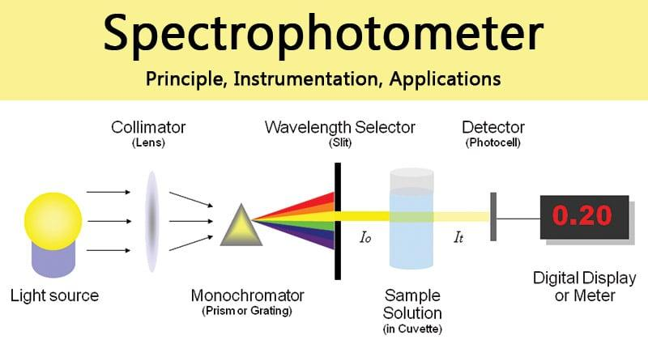

## Table of Contents

## What is a measuring principle?

A measuring principle is the basic idea or method used to measure something. It's like a rule or a guide that tells us how to find out the size, amount, or level of something. For example, when we use a ruler to measure the length of a pencil, the measuring principle is that the length of the pencil is the same as the distance between the two points on the ruler where the pencil starts and ends.

Different tools and methods use different measuring principles. For instance, a thermometer measures temperature based on how much a liquid inside it expands when it gets warm. The principle here is that the liquid's expansion shows the temperature. Understanding these principles helps us use the right tools and get accurate measurements.

## Why are measuring principles important in various fields?

Measuring principles are important in many fields because they help us understand how to measure things correctly. In science, for example, knowing the right way to measure things like temperature, weight, or length helps scientists do their experiments accurately. If they use the wrong measuring principle, their results might be wrong, and they might not learn the right things from their experiments. In everyday life, too, like cooking or building things, using the right measuring principles makes sure we get the results we want.

In medicine, measuring principles are super important because they help doctors measure things like blood pressure or the amount of medicine to give a patient. If doctors use the wrong way to measure, it could make people sicker instead of better. In engineering, measuring principles help engineers build safe and strong structures. They need to measure things like the strength of materials or the size of parts very accurately. Without the right measuring principles, buildings or machines might not work properly or could be dangerous.

## What are the basic types of measuring principles?

There are a few main types of measuring principles that people use. One type is direct measurement, where you measure something straight away with a tool like a ruler or a scale. For example, if you want to know how long a piece of string is, you can put it next to a ruler and see how long it is. Another type is indirect measurement, where you measure something by looking at how it affects something else. For instance, a thermometer measures temperature by seeing how much a liquid inside it expands or contracts.

Another important type of measuring principle is comparative measurement. This is when you compare something to a standard or another object to find out its size or amount. For example, if you want to know if one apple is heavier than another, you can put them on a balance scale and see which one goes down. Finally, there's also digital measurement, which uses electronic devices to measure things. A digital scale, for example, uses sensors to figure out weight and show it on a screen. Each of these types of measuring principles helps us understand and measure the world around us in different ways.

## How does the direct measurement principle work?

Direct measurement is when you measure something right away using a tool. For example, if you want to know how long a pencil is, you can use a ruler. You put one end of the pencil at the zero mark on the ruler and then see where the other end of the pencil reaches. The number on the ruler at that point tells you the length of the pencil. It's simple and quick because you're measuring the thing directly without needing to look at how it affects something else.

This method works well for things like length, weight, and volume. For instance, if you want to weigh an apple, you can put it on a scale. The scale will show you the weight of the apple directly. Direct measurement is useful because it's usually easy to understand and do. But it's important to use the right tool for the job. If you use a ruler to measure weight, you won't get the right answer. So, choosing the correct tool is key to making sure your direct measurements are accurate.

## Can you explain the indirect measurement principle with an example?

Indirect measurement is when you measure something by looking at how it affects something else. It's like figuring out one thing by watching what happens to another thing. For example, think about how a thermometer works. You want to know the temperature, but you can't measure it directly. Instead, you look at how much a liquid inside the thermometer expands or gets bigger when it gets warm. The more the liquid expands, the higher the temperature is. So, by seeing how much the liquid changes, you can tell the temperature.

This kind of measurement is really useful when you can't measure something directly. For instance, if you want to know the height of a tall tree, you can't climb it with a ruler. But you can use indirect measurement. You could measure your own height and the length of your shadow at the same time of day. Then, you measure the tree's shadow. By comparing the lengths of the shadows, you can figure out the tree's height. It's a clever way to measure things that are hard to reach or see directly.

## What is the difference between absolute and relative measurements?

Absolute measurement is when you measure something exactly, using a standard unit. For example, if you say a book is 20 centimeters long, that's an absolute measurement. It tells you the exact length of the book compared to the standard unit of centimeters. Absolute measurements are great because they give clear and exact information that anyone can understand, no matter where they are.

Relative measurement, on the other hand, is when you compare something to something else, without using a standard unit. For example, if you say a book is longer than a pencil, that's a relative measurement. It tells you how the book's length compares to the pencil's length, but it doesn't tell you the exact length of either. Relative measurements are useful when you want to compare things quickly, but they don't give you the exact numbers that absolute measurements do.

## How do measuring principles apply in scientific research?

In scientific research, measuring principles are super important because they help scientists get accurate results. Scientists use different measuring principles to measure things like temperature, weight, or the size of cells. For example, if they want to measure the temperature in an experiment, they use a thermometer. The thermometer works on the principle that the liquid inside it expands when it gets warm. By understanding this principle, scientists can trust that the temperature they read is correct. If they didn't know this, they might not get the right results from their experiments.

Measuring principles also help scientists compare their results with other scientists' work. When everyone uses the same measuring principles, it's easier to understand and trust each other's findings. For instance, if one scientist measures the weight of a sample using a scale, and another scientist does the same, they can compare their results directly. This is important because it helps science move forward. By using the right measuring principles, scientists make sure their work is accurate and useful for everyone.

## What are some common tools and instruments used based on different measuring principles?

Some common tools used for direct measurement include rulers, tape measures, and scales. A ruler is a straight piece of material with marks on it that you use to measure the length of things like pencils or pieces of paper. A tape measure works the same way but is flexible, so you can measure things that are curved or hard to reach. Scales are used to measure weight. You put an object on a scale, and it tells you how heavy it is. These tools are simple to use because they give you a direct measurement of what you want to know.

For indirect measurement, thermometers and barometers are often used. A thermometer measures temperature by looking at how much a liquid inside it expands or contracts. When the temperature goes up, the liquid gets bigger and moves up the tube. A barometer measures air pressure, which can help predict the weather. It works by seeing how high a liquid, like mercury, rises in a tube. The higher the liquid, the higher the air pressure. These tools help measure things you can't see directly by looking at how they affect something else.

Comparative measurement tools include balance scales and calipers. A balance scale compares the weight of two objects by seeing which one is heavier. You put one object on each side, and if they balance, they weigh the same. If one side goes down, that object is heavier. Calipers measure the size of something by comparing it to a known size. You open the caliper until it fits around the object, and then you read the measurement. These tools help you understand how one thing compares to another without needing exact numbers.

## How can errors be minimized when applying measuring principles?

To minimize errors when using measuring principles, it's important to use the right tool for the job. For example, if you want to measure length, use a ruler or tape measure instead of a scale. Make sure the tool is in good condition and working correctly. If a ruler is bent or a scale is not balanced, your measurements will be wrong. Also, always read the instructions and use the tool the right way. If you hold a thermometer wrong, you might not get the correct temperature.

Another way to reduce errors is to take multiple measurements and then find the average. If you measure something once and it might be off a little, measuring it a few times and averaging the results can help. Also, try to control the environment. For example, if you're measuring temperature, make sure the room is not too hot or too cold, as this can affect your readings. Lastly, always check your work and be careful. Mistakes can happen if you're not paying attention, so take your time and double-check your measurements to make sure they're as accurate as possible.

## What advanced technologies have emerged from traditional measuring principles?

Advanced technologies have come from traditional measuring principles, like the use of lasers for precise measurements. Lasers can measure distances very accurately, much better than old tools like rulers. They work by sending out a beam of light and then measuring how long it takes to bounce back. This is used in things like construction to make sure buildings are the right size and shape. Another example is the use of digital sensors in scales. These sensors can measure weight very exactly, and they are used in places like supermarkets and labs.

Another technology that has grown from traditional measuring is the use of satellites for measuring the Earth. Satellites use indirect measurement to gather information about the planet, like its temperature and the amount of rain. They can measure things that are hard to see from the ground, and this helps scientists understand the weather and climate better. Also, 3D scanners use a mix of direct and indirect measurement to make detailed pictures of objects. These scanners send out light and then measure how it bounces back to create a model of the object. This is useful in fields like medicine and manufacturing to make things more accurate and detailed.

## How do measuring principles influence the accuracy and precision of measurements?

Measuring principles are really important for making sure measurements are accurate and precise. Accuracy means how close a measurement is to the true value, and precision means how close repeated measurements are to each other. When we use the right measuring principle, like using a ruler for length or a thermometer for temperature, we can get measurements that are both accurate and precise. For example, if you use a ruler to measure the length of a pencil, the ruler's marks help you get an accurate length. If you measure the pencil several times and get the same length each time, that shows precision.

Sometimes, using the wrong measuring principle can lead to mistakes. If you try to measure temperature with a ruler, you won't get the right answer because a ruler doesn't work for temperature. Also, if you use a tool that isn't working properly, like a bent ruler or a broken scale, your measurements won't be accurate. To make sure measurements are as good as they can be, it's important to choose the right tool and use it correctly. By understanding and applying the right measuring principles, we can trust our measurements and use them to make decisions or do experiments.

## What are the future trends in the development of measuring principles?

In the future, measuring principles will keep getting better thanks to new technology. One big trend is the use of [artificial intelligence](/wiki/ai-artificial-intelligence) (AI) and [machine learning](/wiki/machine-learning) to make measurements more accurate. For example, AI can help analyze data from sensors and find patterns that people might miss. This can make things like medical tests or weather predictions more precise. Another trend is the use of tiny sensors called nanotechnology. These sensors can measure things on a very small scale, like the size of cells or even smaller. This could help in areas like medicine, where understanding tiny changes in the body can lead to better treatments.

Another future trend is the use of more connected devices, or the Internet of Things (IoT). These devices can talk to each other and share data, which can help with measuring things in real-time. For example, smart homes can use sensors to measure temperature, humidity, and air quality, and then adjust the environment automatically. This makes life more comfortable and efficient. Also, as technology gets better, we'll see more use of non-invasive measurements, where we can measure things without touching them. This is already happening with things like lidar, which uses lasers to measure distances and shapes without touching the object. These trends will make measuring principles even more important and useful in our daily lives.

## What are the Measurement Methods in Algorithmic Trading?

Algorithmic trading leverages a variety of measurement methods to analyze market data and execute trading strategies with precision and efficiency. Two primary approaches are technical analysis and [fundamental analysis](/wiki/fundamental-analysis), each offering distinct methodologies and tools for measurement.

**Technical Analysis**

Technical analysis focuses on past market prices and [volume](/wiki/volume-trading-strategy) data to forecast future movements. It assumes that historical trading activity and price changes are the best indicators of future price actions. This method employs various technical indicators, each utilizing mathematical computations on price, volume, or open interest to analyze the market. Key technical indicators used in [algorithmic trading](/wiki/algorithmic-trading) include moving averages, Relative Strength Index (RSI), and Bollinger Bands.

Moving averages smooth out price data to identify the direction of the trend. The simple moving average (SMA) is calculated by taking the arithmetic mean of a given set of prices over a specific number of periods. For instance, a 10-day SMA is calculated as:

$$
\text{SMA} = \frac{\sum_{i=1}^{N} P_i}{N}
$$

where $P_i$ is the price at day $i$, and $N$ is the number of days.

Relative Strength Index (RSI) is a [momentum](/wiki/momentum) oscillator that measures the speed and change of price movements, oscillating between 0 and 100. An RSI reading above 70 is considered overbought, while below 30 is considered oversold. The RSI is calculated using the formula:

$$
\text{RSI} = 100 - \left( \frac{100}{1 + RS} \right)
$$

where RS is the average of $x$ days' up closes divided by the average of $x$ days' down closes.

Bollinger Bands, another essential tool, consist of a middle band (SMA) and two outer bands calculated as:

$$
\text{Upper Band} = \text{SMA} + k \times \text{std\_dev}
$$

$$
\text{Lower Band} = \text{SMA} - k \times \text{std\_dev}
$$

where $std\_dev$ is the standard deviation, and $k$ is a factor (commonly set to 2). This method provides a range in which the asset price is expected to move and helps in identifying overbought or oversold conditions.

**Fundamental Analysis**

In contrast, fundamental analysis examines economic data and financial statements to determine an asset's intrinsic value. It considers factors such as earnings, expenses, assets, and liabilities to forecast an asset's price movements. Fundamental analysis seeks to gauge the financial health and performance of an asset class or company and often involves calculating ratios like the Price-to-Earnings (P/E) ratio, which compares a company's share price to its earnings per share (EPS):

$$
\text{P/E Ratio} = \frac{\text{Share Price}}{\text{EPS}}
$$

Both technical and fundamental analyses provide critical insights that guide algorithmic trading strategies, with traders often using a combination of these methods to optimize their decision-making processes. By leveraging the advantages of each, traders aim to develop models that can predict market trends and execute trades that are both timely and profitable.

## What are some examples of measurements used in trading strategies?

Algorithmic trading heavily relies on quantifiable methods to identify trading opportunities. Measurement techniques form the backbone of these strategies by allowing traders to analyze historical data to identify trends and make informed predictions. Here, we examine some real-world examples of measurement techniques utilized in trading.

One widely used measurement technique is the moving average, which smooths out price data by creating a constantly updated average price. For instance, the simple moving average (SMA) can be calculated using the formula:

$$
\text{SMA}_t = \frac{P_{t-n+1} + P_{t-n+2} + \ldots + P_t}{n}
$$

where $P_t$ is the price at time $t$ and $n$ is the number of time periods. This technique helps traders to ascertain the overall direction of the market. A case study at XYZ Fund reported that implementing a strategy based on the crossover of short-term and long-term moving averages improved trade entry timing, thus enhancing profitability.

The Relative Strength Index (RSI) is another essential measurement tool, used primarily to identify overbought or oversold conditions in a market. RSI is computed with the following formula:

$$
\text{RSI} = 100 - \left( \frac{100}{1 + \frac{\text{Average Gain}}{\text{Average Loss}}} \right)
$$

A historical analysis by ABC Trading illustrated that incorporating RSI into their algorithm allowed them to exploit reversal patterns, leading to a significant reduction in drawdown levels during volatile periods in the stock market.

Bollinger Bands are also frequently employed in trading strategies to measure market [volatility](/wiki/volatility-trading-strategies) and are defined as a set of three curves drawn in relation to a security's price. The middle band is a moving average, and the upper and lower bands are standard deviations above and below the moving average. The mathematical representation can be given as:

- Middle Band = $\text{SMA}(n)$
- Upper Band = $\text{SMA}(n) + (k \times \sigma)$
- Lower Band = $\text{SMA}(n) - (k \times \sigma)$

where $k$ is the number of standard deviations, and $\sigma$ is the standard deviation over the last $n$ periods. Following a market analysis, DEF Brokerage found that integrating Bollinger Band breakouts in their trading algorithms resulted in capturing high momentum breakouts with greater accuracy.

In summary, measurement techniques like moving averages, RSI, and Bollinger Bands have proven instrumental for traders and fund managers aiming to interpret historical data and predict future price movements. These techniques represent effective tools for developing robust trading strategies by revealing market trends and potential reversal points.

## References & Further Reading

[1]: Bergstra, J., Bardenet, R., Bengio, Y., & Kégl, B. (2011). ["Algorithms for Hyper-Parameter Optimization."](https://dl.acm.org/doi/10.5555/2986459.2986743) Advances in Neural Information Processing Systems 24.

[2]: ["Advances in Financial Machine Learning"](https://www.amazon.com/Advances-Financial-Machine-Learning-Marcos/dp/1119482089) by Marcos Lopez de Prado

[3]: ["Evidence-Based Technical Analysis: Applying the Scientific Method and Statistical Inference to Trading Signals"](https://www.amazon.com/Evidence-Based-Technical-Analysis-Scientific-Statistical/dp/0470008741) by David Aronson

[4]: ["Machine Learning for Algorithmic Trading"](https://github.com/stefan-jansen/machine-learning-for-trading) by Stefan Jansen

[5]: ["Quantitative Trading: How to Build Your Own Algorithmic Trading Business"](https://www.amazon.com/Quantitative-Trading-Build-Algorithmic-Business/dp/1119800064) by Ernest P. Chan