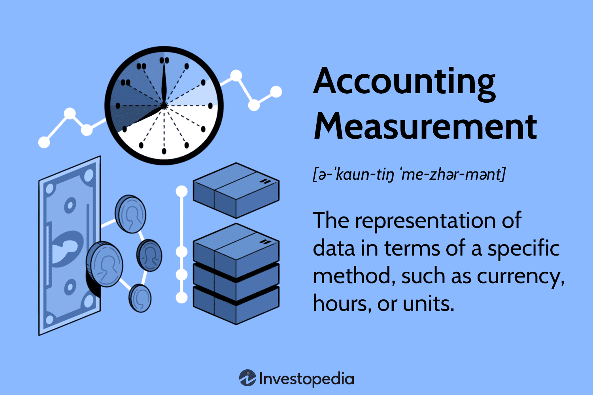

Algorithmic trading, often abbreviated as algo trading, refers to the use of advanced mathematical models and computer algorithms to execute trades at high speeds and frequencies that human traders are unable to accomplish. It leverages computational power to analyze multiple market variables and execute orders based on pre-defined criteria. This form of trading has been growing in significance within financial markets, supplying liquidity and contributing to market efficiency by minimizing transaction costs and eliminating human-induced errors.

In algo trading, the concepts of measurement examples, measurement methods, and measuring principles are pivotal. Measurement examples refer to specific instances where measurement techniques are applied to discern market conditions or assess trading strategies. Measurement methods encompass the diverse statistical and mathematical tools employed to quantify trading variables, enabling traders to make informed decisions. These can include methods from technical analysis—such as moving averages, Relative Strength Index (RSI), and Bollinger Bands—to more complex models like machine learning algorithms. Measuring principles, on the other hand, represent the foundational rules or theories that guide the selection and application of these measurement methods. They ensure consistency and reliability in the analyses conducted.



The purpose of this article is to elucidate how these measurement concepts are interconnected and how they underpin effective trading strategies in algorithmic trading. By understanding and implementing these principles and methods, traders can systematically evaluate market opportunities and risks, optimizing their trading performance in dynamic and often volatile financial landscapes. As algorithmic trading continues to evolve with advancements in technology, gaining a robust grasp of these measurement concepts becomes even more crucial for maintaining competitive advantage and achieving sustained financial success.

## Table of Contents

## Understanding Measurement Principles in Trading

Measurement principles in trading are fundamental guidelines that help traders analyze and interpret relevant market data to make informed decisions. These principles involve the identification, quantification, and evaluation of market variables that influence pricing and trading dynamics. The effective application of measurement principles aids in quantifying risks and potential opportunities, crucial for the formulation of algorithmic trading strategies.

Measurement principles guide decision-making in algorithmic trading by providing structured methodologies for evaluating data patterns, price actions, and market trends. They offer a foundation for developing predictive models and automated systems capable of executing trades with precision. Key aspects of measurement principles include selecting appropriate indicators, calibrating models, and validating results against historical performance metrics.

In assessing trading opportunities, measurement principles assist traders in determining entry and [exit](/wiki/exit-strategy) points by analyzing metrics like price momentum, volatility, and [liquidity](/wiki/liquidity-risk-premium). For instance, metrics such as moving averages are frequently used to smooth out price data and identify the direction of trends. If the short-term moving average crosses above the long-term moving average, it might signify a potential buying opportunity. Conversely, a cross below may indicate a selling opportunity.

When considering risk, measurement principles enable traders to quantify potential losses and the likelihood of different market conditions impacting trading positions. Risk assessment involves statistical measures such as standard deviation and [value at risk](/wiki/var-value-at-risk) (VaR), which assess how much a portfolio might lose given an adverse market movement. Implementing these principles ensures that trading systems remain robust under various market conditions, reducing exposure to unexpected losses.

Incorporating these measurement principles into trading strategies requires a systematic approach to ensure accuracy and reliability. For example, traders might employ Monte Carlo simulations to evaluate the robustness of a trading strategy across numerous scenarios, thereby quantifying the impact of variances in market conditions on strategy performance.

In conclusion, understanding and applying measurement principles is essential for developing effective [algorithmic trading](/wiki/algorithmic-trading) strategies. These principles provide a structured approach to processing and interpreting market data, guiding traders in making strategic decisions that balance opportunities with risks. By integrating rigorous measurement and analytical methods, traders enhance their ability to anticipate market movements and achieve consistent performance.

## Measurement Methods in Algorithmic Trading

Algorithmic trading leverages a variety of measurement methods to analyze market data and execute trading strategies with precision and efficiency. Two primary approaches are technical analysis and [fundamental analysis](/wiki/fundamental-analysis), each offering distinct methodologies and tools for measurement.

**Technical Analysis**

Technical analysis focuses on past market prices and [volume](/wiki/volume-trading-strategy) data to forecast future movements. It assumes that historical trading activity and price changes are the best indicators of future price actions. This method employs various technical indicators, each utilizing mathematical computations on price, volume, or open interest to analyze the market. Key technical indicators used in algorithmic trading include moving averages, Relative Strength Index (RSI), and Bollinger Bands.

Moving averages smooth out price data to identify the direction of the trend. The simple moving average (SMA) is calculated by taking the arithmetic mean of a given set of prices over a specific number of periods. For instance, a 10-day SMA is calculated as:

$$
\text{SMA} = \frac{\sum_{i=1}^{N} P_i}{N}
$$

where $P_i$ is the price at day $i$, and $N$ is the number of days.

Relative Strength Index (RSI) is a [momentum](/wiki/momentum) oscillator that measures the speed and change of price movements, oscillating between 0 and 100. An RSI reading above 70 is considered overbought, while below 30 is considered oversold. The RSI is calculated using the formula:

$$
\text{RSI} = 100 - \left( \frac{100}{1 + RS} \right)
$$

where RS is the average of $x$ days' up closes divided by the average of $x$ days' down closes.

Bollinger Bands, another essential tool, consist of a middle band (SMA) and two outer bands calculated as:

$$
\text{Upper Band} = \text{SMA} + k \times \text{std\_dev}
$$

$$
\text{Lower Band} = \text{SMA} - k \times \text{std\_dev}
$$

where $std\_dev$ is the standard deviation, and $k$ is a factor (commonly set to 2). This method provides a range in which the asset price is expected to move and helps in identifying overbought or oversold conditions.

**Fundamental Analysis**

In contrast, fundamental analysis examines economic data and financial statements to determine an asset's intrinsic value. It considers factors such as earnings, expenses, assets, and liabilities to forecast an asset's price movements. Fundamental analysis seeks to gauge the financial health and performance of an asset class or company and often involves calculating ratios like the Price-to-Earnings (P/E) ratio, which compares a company's share price to its earnings per share (EPS):

$$
\text{P/E Ratio} = \frac{\text{Share Price}}{\text{EPS}}
$$

Both technical and fundamental analyses provide critical insights that guide algorithmic trading strategies, with traders often using a combination of these methods to optimize their decision-making processes. By leveraging the advantages of each, traders aim to develop models that can predict market trends and execute trades that are both timely and profitable.

## Measurement Examples in Trading Strategies

Algorithmic trading heavily relies on quantifiable methods to identify trading opportunities. Measurement techniques form the backbone of these strategies by allowing traders to analyze historical data to identify trends and make informed predictions. Here, we examine some real-world examples of measurement techniques utilized in trading.

One widely used measurement technique is the moving average, which smooths out price data by creating a constantly updated average price. For instance, the simple moving average (SMA) can be calculated using the formula:

$$
\text{SMA}_t = \frac{P_{t-n+1} + P_{t-n+2} + \ldots + P_t}{n}
$$

where $P_t$ is the price at time $t$ and $n$ is the number of time periods. This technique helps traders to ascertain the overall direction of the market. A case study at XYZ Fund reported that implementing a strategy based on the crossover of short-term and long-term moving averages improved trade entry timing, thus enhancing profitability.

The Relative Strength Index (RSI) is another essential measurement tool, used primarily to identify overbought or oversold conditions in a market. RSI is computed with the following formula:

$$
\text{RSI} = 100 - \left( \frac{100}{1 + \frac{\text{Average Gain}}{\text{Average Loss}}} \right)
$$

A historical analysis by ABC Trading illustrated that incorporating RSI into their algorithm allowed them to exploit reversal patterns, leading to a significant reduction in drawdown levels during volatile periods in the stock market.

Bollinger Bands are also frequently employed in trading strategies to measure market [volatility](/wiki/volatility-trading-strategies) and are defined as a set of three curves drawn in relation to a security's price. The middle band is a moving average, and the upper and lower bands are standard deviations above and below the moving average. The mathematical representation can be given as:

- Middle Band = $\text{SMA}(n)$
- Upper Band = $\text{SMA}(n) + (k \times \sigma)$
- Lower Band = $\text{SMA}(n) - (k \times \sigma)$

where $k$ is the number of standard deviations, and $\sigma$ is the standard deviation over the last $n$ periods. Following a market analysis, DEF Brokerage found that integrating Bollinger Band breakouts in their trading algorithms resulted in capturing high momentum breakouts with greater accuracy.

In summary, measurement techniques like moving averages, RSI, and Bollinger Bands have proven instrumental for traders and fund managers aiming to interpret historical data and predict future price movements. These techniques represent effective tools for developing robust trading strategies by revealing market trends and potential reversal points.

## Role of Correlation in Algo Trading

Correlation serves as a fundamental measurement tool in algorithmic trading, aiding in the assessment of relationships between financial instruments or market factors. It quantifies the degree to which two variables move in relation to each other, providing insights into potential trading strategies. Correlation is measured using the correlation coefficient, typically ranging from -1 to 1. A correlation coefficient of 1 implies a perfect positive correlation, meaning that as one asset's price increases, the other asset's price moves in the same direction. Conversely, a correlation of -1 indicates a perfect negative correlation, where the assets move in opposite directions. A correlation of 0 suggests no linear relationship.

### Positive and Negative Correlations in Trading Strategies

Positive correlations are often used to create pairs trading strategies where traders simultaneously buy one asset and short another that is positively correlated. This strategy aims to capitalize on any price convergence. For instance, if two stocks historically move together due to similar market drivers, any divergence might indicate a trading opportunity. A trade placed in the expectation that the prices will revert to their historical relationship is called a mean-reversion strategy.

Negative correlations are crucial in diversification and risk management. In building a diversified portfolio, traders seek assets with low or negative correlations to reduce risk. For example, if an equity position is positively correlated with market movements, hedging with a negatively correlated instrument, such as a put option or a defensive stock, can mitigate downside risk during market downturns.

### Examples of Leveraging Correlation in Algorithms

One practical example is a statistical [arbitrage](/wiki/arbitrage) strategy that leverages correlation. Statistical arbitrage identifies temporary mispricings while relying on the convergence of prices over time. A trader might look at a positively correlated pair, such as [crude oil](/wiki/crude-oil) and oil company stocks. If the price of crude oil rises without a corresponding increase in stock prices, the trader might buy the stock and wait for prices to realign.

Additionally, correlation is essential in assessing the beta of stocks within the Capital Asset Pricing Model (CAPM). Higher correlation with market movements results in higher beta values, affecting portfolio optimization models in algorithmic trading systems. Algorithms might use these correlations to adjust portfolio weights, enhancing returns while reducing risks.

Here is a simple example in Python that computes the correlation between two assets and makes a basic trading decision:

```python
import numpy as np
import pandas as pd

# Generating mock data
np.random.seed(0)
data = pd.DataFrame({
    'Asset1': np.random.normal(size=100),
    'Asset2': np.random.normal(size=100)
})

# Calculating the correlation
correlation_matrix = data.corr()
correlation_value = correlation_matrix.loc['Asset1', 'Asset2']

# Simple trading decision based on correlation
if correlation_value > 0.8:
    print("Assets are highly positively correlated. Consider a pairs trading strategy.")
elif correlation_value < -0.8:
    print("Assets are highly negatively correlated. Consider diversification or hedging.")
else:
    print("Assets show low correlation. Explore other strategies.")
```

This script assesses the correlation between two synthetic assets and provides a recommendation based on the correlation level.

By understanding and leveraging correlation, traders can build sophisticated algorithms that optimize trading decisions, manage risks, and enhance overall strategy effectiveness. As market dynamics evolve, the role of correlation continues to be of paramount importance in algorithmic trading.

## Challenges in Measuring Trading Risks

Algorithmic trading has vastly transformed the landscape of financial markets, yet it is not devoid of challenges, especially when it comes to measuring and managing risks. The inherent uncertainty and volatility of financial markets pose significant challenges in accurately assessing trading risks. Here, we discuss key challenges and potential strategies to address them.

### Limitations of Historical Data

A fundamental challenge in trading risk measurement is the dependence on historical data. Historical data serves as the backbone for many algorithmic models, but it has intrinsic limitations. While past performance can offer valuable insights, it is not always indicative of future results. Market conditions change, and unprecedented events can cause significant deviations from historical trends.

Moreover, historical data can sometimes suffer from survivorship bias, where only successful outcomes are reported or analyzed, potentially leading to overly optimistic models. Additionally, historical datasets might not account for tail events or "black swans," which are rare but have extreme consequences.

### Impact of Market Volatility on Risk Measurement

Market volatility significantly impacts risk measurement. High volatility can exacerbate the inaccuracy of predictive models. Traditional measures of risk, such as Value at Risk (VaR), may underestimate the potential for extreme losses during periods of high volatility. This instability requires more sophisticated approaches that can adapt to changing market conditions.

### Strategies for Overcoming Risk Measurement Challenges

To address these challenges, several strategies can be employed:

1. **Hedging:** This involves taking an offsetting position in a related asset to mitigate the risk of adverse price movements. For example, an investor holding a volatile stock may choose to purchase put options to limit potential losses.

    ```python
    # Example of calculating a simple hedge ratio
    def calculate_hedge_ratio(stock_returns, index_returns):
        covariance = np.cov(stock_returns, index_returns)[0, 1]
        variance = np.var(index_returns)
        hedge_ratio = covariance / variance
        return hedge_ratio
    ```

2. **Diversification:** By investing in a mix of uncorrelated or negatively correlated assets, traders can reduce exposure to individual asset volatility. This reduces the overall portfolio risk and smooths out returns.

3. **Advanced Analytical Techniques:** Employing machine learning and advanced statistical models can improve risk assessment. Techniques such as Monte Carlo simulations allow traders to simulate a wide array of potential market scenarios and observe their impact on portfolio performance.

4. **Stress Testing:** Conducting stress tests helps evaluate how an algorithm performs under extreme market conditions. By simulating adverse scenarios, traders can identify potential vulnerabilities in their strategies.

5. **Dynamic Risk Management Techniques:** Implementing dynamic strategies that adjust based on real-time market data, rather than static models based on historical data alone, can enhance risk management effectiveness.

In conclusion, while measuring trading risks presents significant challenges due to the limitations of historical data and market volatility, employing strategies like hedging, diversification, and advanced analytical methods can effectively manage these risks. Continuous innovation and adaptation are crucial to enhance the robustness of algorithmic trading models in an ever-evolving financial landscape.

## Best Practices and Future Trends

In the rapidly evolving domain of algorithmic trading, adhering to best practices for measurement methods and principles is critical for success. Accurate measurement facilitates informed decision-making and strategy optimization, ensuring robust trading performance.

One of the foremost best practices involves the integration of diverse data sources. Algorithmic traders should use a combination of historical price data, real-time market data, and [alternative data](/wiki/best-alternative-data) sources, such as social media sentiment and macroeconomic indicators, to develop comprehensive trading strategies. This amalgamation of data types enhances the reliability of predictions, providing a balanced view of market conditions.

Another best practice is the continuous validation and [backtesting](/wiki/backtesting) of trading models. Algo traders should employ rigorous backtesting to validate their models against historical data, ensuring these models perform well under various market scenarios. By regularly updating and recalibrating these models with new data, traders can maintain their efficacy and adaptability in dynamic markets.

Risk management is also a crucial component, integrating measurement methods to estimate and mitigate potential losses. Techniques such as Value at Risk (VaR) and Conditional Value at Risk (CVaR) offer quantitative measures of risk, enabling traders to adjust their strategies according to risk tolerance and market conditions.

Technology, particularly [machine learning](/wiki/machine-learning) (ML), plays an increasingly prominent role in enhancing measurement accuracy. ML algorithms can identify patterns and correlations within large datasets that might not be apparent through traditional analysis. By employing supervised learning for predictive modeling or unsupervised learning for anomaly detection, algo traders can enhance the precision of their trading strategies and adapt more swiftly to market changes.

Moreover, advancements in computing power and big data analytics permit the processing of vast datasets at unprecedented speeds, allowing for real-time strategy adjustments. The deployment of cloud computing solutions offers scalable resources for testing and executing trading models without the constraint of physical hardware limitations.

Looking towards future trends, the continued development of [artificial intelligence](/wiki/ai-artificial-intelligence) (AI) promises to revolutionize measurement methods in algo trading. AI-driven analytics have the potential to provide deeper insights into market behavior, automate complex decision-making processes, and optimize trade execution across multiple platforms.

Quantum computing, although still in its infancy, holds the potential to further accelerate complex calculations and optimize trading strategies with unparalleled speed and accuracy. As this technology matures, it could redefine performance benchmarks in algorithmic trading.

In summary, best practices in algorithmic trading measurement revolve around a robust integration of diverse data, rigorous risk management, continual model validation, and the adoption of cutting-edge technologies like machine learning. Keeping abreast of technological advances will be paramount for traders seeking to maintain a competitive edge in the ever-evolving financial markets.

## Conclusion

The understanding and application of measurement principles and methods are crucial for achieving success in algorithmic trading. Measurement principles lay the groundwork for systematic decision-making, enabling traders to effectively assess opportunities and risks. These principles inform the selection of appropriate measurement methods, such as technical and fundamental analysis, which are essential for interpreting market data and developing robust trading strategies.

The careful integration of these measurement techniques is what transforms raw data into actionable insights. For instance, using methods like moving averages or RSI provides traders with signals about potential market movements, thereby allowing for more informed trading decisions. This structured approach not only enhances a trader's ability to predict market behavior but also aids in risk management, ensuring that strategies are both profitable and sustainable.

Moreover, the rapidly evolving landscape of financial markets necessitates a commitment to continuous learning and adaptation. Algorithmic traders must stay abreast of new technologies and methodologies, such as machine learning and artificial intelligence, which promise to enhance the precision of measurements and predictions. This continuous evolution is essential for maintaining a competitive edge and navigating the complexities of market dynamics.

In conclusion, a deep and ongoing understanding of measurement principles and methods is indispensable for the formulation of successful algorithmic trading strategies. By cultivating a mindset of continuous learning and adaptation, traders can better respond to the fluid nature of markets and optimize their strategies for long-term success.

## References & Further Reading

[1]: Bergstra, J., Bardenet, R., Bengio, Y., & Kégl, B. (2011). ["Algorithms for Hyper-Parameter Optimization."](https://dl.acm.org/doi/10.5555/2986459.2986743) Advances in Neural Information Processing Systems 24.

[2]: ["Advances in Financial Machine Learning"](https://www.amazon.com/Advances-Financial-Machine-Learning-Marcos/dp/1119482089) by Marcos Lopez de Prado

[3]: ["Evidence-Based Technical Analysis: Applying the Scientific Method and Statistical Inference to Trading Signals"](https://www.amazon.com/Evidence-Based-Technical-Analysis-Scientific-Statistical/dp/0470008741) by David Aronson

[4]: ["Machine Learning for Algorithmic Trading"](https://github.com/stefan-jansen/machine-learning-for-trading) by Stefan Jansen

[5]: ["Quantitative Trading: How to Build Your Own Algorithmic Trading Business"](https://www.amazon.com/Quantitative-Trading-Build-Algorithmic-Business/dp/1119800064) by Ernest P. Chan