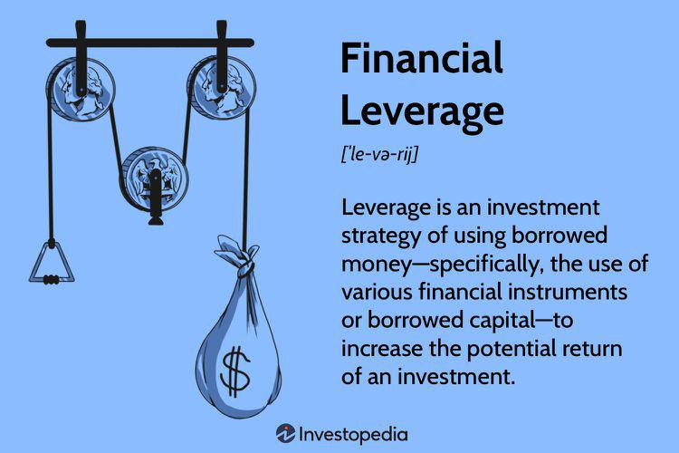

Investment strategy, mechanical investing, portfolio management, and algorithmic trading are essential components of contemporary wealth management. Investment strategies form the backbone of portfolio allocation decisions, guiding investors in selecting suitable assets to achieve specific financial goals. These strategies are diverse, ranging from aggressive growth-focused approaches to conservative income-generating tactics, each tailored to align with an investor's risk tolerance and investment horizon.

Mechanical investing introduces a systematized approach to investment decision-making, driven by predefined rules rather than subjective judgment. By removing emotional biases and creating consistency in trading patterns, mechanical investing enables investors to adhere to a disciplined strategy, which can be particularly beneficial in volatile markets. One popular mechanical investing strategy is the "Dogs of the Dow," which involves selecting high-dividend-yield stocks from the Dow Jones Industrial Average, thereby implementing a value-based approach with reduced emotional interference.



Portfolio management encompasses the strategic allocation and oversight of an investment portfolio, balancing risk and return to achieve desired outcomes. Central to effective portfolio management are diversification and asset allocation, which mitigate risk by spreading investments across various asset classes and sectors. Integrating mechanical investing strategies into portfolio management can further optimize performance by ensuring systematic adherence to chosen investment theses.

Algorithmic trading leverages technological advancements to automate the execution of trades according to predefined criteria. This technology-driven approach boasts advantages such as speed, accuracy, and reduced transaction costs, allowing traders to capitalize on market opportunities swiftly. However, deploying algorithms requires careful consideration of potential pitfalls, such as algorithmic errors and market anomalies.

The modern investment landscape is increasingly data-driven, with a significant shift towards automated solutions. This trend highlights the importance of integrating investment strategy, mechanical investing, portfolio management, and algorithmic trading. By combining these methodologies, investors can craft a holistic financial strategy that is both robust and adaptive to market dynamics. This integration facilitates efficient wealth management, enhancing the ability to achieve financial objectives through methodical and technology-empowered decision-making.

## Table of Contents

## Understanding Investment Strategy

An investment strategy is a systematic plan designed to achieve financial objectives and manage a portfolio according to an investor's goals, risk tolerance, and time horizon. It acts as a guiding framework, helping investors decide which assets to include based on their specific financial targets. Investment strategies are crucial because they provide structure to investment decisions, helping to balance risk and return in line with an individual's or institution's financial profile.

Several types of investment strategies cater to different investor needs:

1. **Growth Investment Strategy**: This approach focuses on capital appreciation. Investors seek out companies that have the potential for above-average growth, often characterized by high earnings growth rates. Growth investors are usually willing to accept the risk of market volatility in exchange for the possibility of higher returns.

2. **Value Investment Strategy**: Value investors look for stocks that appear to be undervalued by the market. They aim to purchase these stocks at a discount and hold them until the market realizes their true potential. This strategy requires thorough financial analysis to determine the intrinsic value of a stock, contrasting it with its current market price.

3. **Income Investment Strategy**: This strategy prioritizes generating regular income over capital appreciation. Investors typically focus on dividend-paying stocks, bonds, and other interest-generating assets. It is often preferred by retirees or those needing a steady cash flow from their investments.

4. **Defensive Investment Strategy**: Defensive strategies aim to minimize losses and protect capital during market downturns. Investors typically opt for low-volatility stocks, which tend to be less sensitive to economic cycles, such as utilities and consumer staples.

Aligning investment strategies with an individual's financial goals and risk tolerance is essential. Financial goals refer to the specific outcomes an investor aims to achieve, such as saving for retirement, purchasing a home, or funding education. Each goal may require a different time horizon and return requirement, influencing strategy choice.

Risk tolerance reflects an investor's capacity and willingness to endure market fluctuations and potential financial loss. It varies significantly among individuals, influenced by factors like age, income, investment experience, and psychological disposition. A clearly defined investment strategy accommodates these personal preferences, often using tools like asset allocation and diversification to mitigate risks.

In summary, an investment strategy is a necessary component of effective portfolio management, providing a structured approach to selecting assets that align with an investor's unique financial circumstances and aspirations.

## The Fundamentals of Mechanical Investing

Mechanical investing is a systematic approach to investment that relies on predefined rules and algorithms to make investment decisions, minimizing human intervention and emotional biases. The primary advantage of this method over traditional investing is its ability to maintain consistency and discipline, executing trades based solely on data-driven criteria without the influence of emotions such as fear or greed.

### Key Elements of Mechanical Investing

1. **Rules-based Systems**: At the core of mechanical investing is the implementation of strict rules that dictate when to buy or sell assets. These rules are typically derived from historical data analysis and are designed to capitalize on patterns that have been observed to produce favorable results. For example, a simple rule might be to buy a stock when its price crosses above its 200-day moving average and sell when it falls below.

    ```python
    # Example of a simple moving average crossover strategy
    def moving_average_strategy(prices, short_window=50, long_window=200):
        signals = pd.DataFrame(index=prices.index)
        signals['price'] = prices
        signals['short_mavg'] = prices.rolling(window=short_window, min_periods=1).mean()
        signals['long_mavg'] = prices.rolling(window=long_window, min_periods=1).mean()

        # Generate buy/sell signals
        signals['signal'] = 0
        signals['signal'][short_window:] = np.where(signals['short_mavg'][short_window:] > signals['long_mavg'][short_window:], 1, -1)

        return signals
    ```

2. **Eliminating Emotional Biases**: By adhering strictly to predefined rules, mechanical investing eliminates emotional decision-making. Many investors fall victim to cognitive biases such as overconfidence, panic selling, or herd mentality, which can lead to suboptimal investment decisions. Mechanical investing avoids these pitfalls by ensuring that all decisions are based on logical and empirical criteria.

### Popular Mechanical Investing Strategies

One of the most well-known mechanical investing strategies is the "Dogs of the Dow." This strategy involves annually investing in the 10 highest-yielding stocks from the 30 in the Dow Jones Industrial Average. The rationale is that these stocks are temporarily undervalued, offering high dividend yields, and have the potential for significant capital appreciation. The simplicity of this strategy makes it a popular choice for individual investors seeking to automate their investment approach.

Overall, mechanical investing offers a structured framework that prioritizes logic and data over human intuition and emotion. While it may not capture every market opportunity, its emphasis on consistency and discipline often results in steady returns and aligns closely with long-term financial goals.

## Portfolio Management: A Structured Approach

Effective portfolio management is critical for achieving optimal investment outcomes, balancing risk with the potential for return. At its core, portfolio management is the art and science of selecting and overseeing a group of investments that meet the long-term financial goals and risk tolerance of an investor. 

### Essentials of Effective Portfolio Management

**Diversification and Asset Allocation**

One of the fundamental principles of portfolio management is diversification, which involves spreading investments across various assets or asset classes to reduce risk. The objective is to create a balanced portfolio that is not overly exposed to the fluctuations of a single security or market segment. This can be mathematically represented by the reduction of portfolio variance through a combination of assets that do not perfectly correlate with each other.

The formula for the variance of a portfolio ($\sigma_p^2$) comprising two assets is given by:
$$
\sigma_p^2 = w_1^2 \sigma_1^2 + w_2^2 \sigma_2^2 + 2 w_1 w_2 \sigma_{1,2}
$$
where:
- $w_1, w_2$ are the asset weights,
- $\sigma_1, \sigma_2$ are the standard deviations of the assets,
- $\sigma_{1,2}$ is the covariance between the two assets.

Strategic asset allocation involves distributing investments across different asset classes such as equities, bonds, real estate, and cash. The allocation aligns with an investor's risk tolerance, investment horizon, and financial goals. Tactical asset allocation, a more dynamic strategy, allows for adjustment of asset weights in response to market changes, potentially enhancing returns.

**Optimizing Portfolio Performance with Mechanical Investing**

Mechanical investing employs a systematic approach to manage portfolios based on predefined rules, minimizing emotional biases and subjectivity. These rules can guide decisions about buying, holding, or selling assets based on quantitative criteria.

Mechanical investing can enhance portfolio performance by enacting disciplined strategies such as rebalancing and tax-loss harvesting. Rebalancing, for instance, is the practice of realigning the proportions of assets in a portfolio to maintain a target asset allocation. Python code can be utilized to automate this rebalancing process, as shown in the following example:

```python
def rebalance_portfolio(portfolio, target_allocation):
    for asset, target in target_allocation.items():
        current_value = portfolio[asset]['value']
        portfolio[asset]['target'] = portfolio['total_value'] * target
        portfolio[asset]['adjustment'] = portfolio[asset]['target'] - current_value
    return portfolio
```

This programmatic approach ensures systematic adherence to investment rules, thereby reducing transaction costs and unintended deviations from the investment strategy. By integrating mechanical investing into portfolio management, investors can achieve a structured, unbiased investment process that optimally allocates resources according to their financial objectives and risk profile.

## Algorithmic Trading: The Power of Technology

Algorithmic trading, often termed algo-trading, involves the use of computer algorithms to execute trades in financial markets. These algorithms operate on predefined criteria such as timing, price, or quantity, enabling automated trading decisions without human intervention. This approach leverages the power of technology to analyze large datasets, ensuring trades are executed with precision and speed that manual trading cannot match.

The primary advantages of [algorithmic trading](/wiki/algorithmic-trading) are speed, accuracy, and cost-efficiency. Algorithms can analyze market conditions and execute trades in milliseconds, providing a significant edge in situations where rapid decision-making is crucial. This speed minimizes the risk of slippage, which occurs when a trade is executed at a less favorable price than expected. Accuracy is another critical advantage; algorithms precisely follow their coded instructions, reducing errors that human traders might make due to emotional factors or lapses in judgment. Cost efficiency arises from reduced transaction costs; algorithms can execute trades at optimal prices by continuously scanning for the best opportunities in the market.

Despite these advantages, algorithmic trading comes with potential pitfalls and considerations. Technical glitches can occur, as demonstrated by incidents like the infamous 2010 "Flash Crash," where algorithmic trades contributed to a rapid, significant drop and recovery in U.S. stock indices. Additionally, algorithms require robust and consistent data inputs; any inaccuracies in data can lead to erroneous trading decisions. The complexity of developing effective algorithms means there's a risk of overfitting, where models perform well on historical data but fail in real-world conditions due to market changes they cannot adapt to quickly. Furthermore, firms deploying these algorithms must be mindful of regulatory requirements, as improper use can lead to market manipulation or other legal issues.

To implement algorithmic trading effectively, it's essential to address these challenges. This process involves rigorous [backtesting](/wiki/backtesting) against historical data, ensuring the algorithm performs well across varying market conditions. Continuous monitoring and adjustment of algorithms are necessary to maintain their effectiveness in dynamic markets. Using languages like Python, traders can write algorithms with libraries such as NumPy and Pandas for data manipulation, and backtesting frameworks like Backtrader to simulate trading strategies. Here is a simple Python example illustrating a basic Moving Average Crossover strategy:

```python
import pandas as pd
import numpy as np

# Generate a DataFrame with dummy data
data = {'price': np.random.randn(100).cumsum() + 100}
df = pd.DataFrame(data)

# Calculate 10-day and 50-day moving averages
df['MA10'] = df['price'].rolling(window=10).mean()
df['MA50'] = df['price'].rolling(window=50).mean()

# Generate trading signals
df['signal'] = 0
df['signal'][10:] = np.where(df['MA10'][10:] > df['MA50'][10:], 1, -1)

# Generate positions
df['position'] = df['signal'].shift()

print(df.head())
```

This code sets up a simple moving average crossover strategy, creating buy (1) and sell (-1) signals based on 10-day and 50-day moving averages.

In conclusion, while algorithmic trading presents substantial opportunities for improved trading performance, it demands careful implementation, continuous monitoring, and adherence to regulatory requirements. Its integration into a broader investment strategy must be approached with a balance of technological capability and strategic oversight.

## Integrating Mechanical Investing with Algorithmic Trading

Integrating mechanical investing with algorithmic trading brings together the systematic discipline of rule-based systems with the technical efficiency of automated processes. Mechanical investing relies on predefined strategies that mitigate emotional biases and ensures consistent application of investment principles. Algorithmic trading, on the other hand, leverages computational algorithms to execute trades at optimal times, often at speeds and efficiencies unachievable by human traders. By combining both, investors can achieve a robust and adaptive investment approach that maximizes returns while managing risks.

### Complementary Nature

Mechanical investing provides a structured framework with clearly defined buy and sell rules, which can be translated directly into algorithms for execution. The clarity of mechanical rules ensures that trading algorithms have precise instructions to follow, minimizing errors due to interpretation. This synergy allows for the creation of automated systems that not only follow investment strategies meticulously but also exploit real-time data for enhanced decision-making and execution speed.

Algorithms can also enhance mechanical strategies by incorporating vast amounts of historical and real-time market data into decision-making processes. Machine learning techniques can be applied to refine strategies continuously, adapting them to evolving market conditions and providing a dynamic edge.

### Case Studies of Successful Integration

1. **Renaissance Technologies**: This hedge fund, founded by James Simons, exemplifies successful integration. Renaissance uses a combination of quantitative models, which are essentially sophisticated mechanical strategies, and advanced algorithmic trading to achieve substantial returns. Their use of massive datasets and complex algorithms illustrates the potential of this integration.

2. **D.E. Shaw Group**: Known for its scientific and methodical approach to investing, D.E. Shaw leverages algorithms based on intricate mathematical models derived from mechanical investment principles. Their success underscores how data analysis and high-speed computing can enhance mechanical strategies.

### Technical Requirements and Tools

1. **Data Management & Analysis Tools**: Reliable access to comprehensive data is crucial. Platforms like Bloomberg Terminal, Reuters Eikon, and Quandl provide real-time and historical data. Python libraries such as Pandas, NumPy, and scikit-learn can be employed for data manipulation and machine learning.

2. **Algorithm Development Platforms**: Platforms like QuantConnect, AlgoTrader, and MetaTrader enable the development and backtesting of trading algorithms. These platforms support various programming languages, including Python, which is popular due to its extensive libraries and ease of use.

3. **Execution Systems**: Automated trading systems require robust execution management systems (EMS) to handle orders efficiently. Integrations with brokers through APIs (like Interactive Brokers' API) are essential for seamless order execution.

4. **Risk Management Software**: Tools such as MATLAB and R’s robust analytical capabilities are critical for developing risk assessment models that monitor portfolios in real-time.

Integrating mechanical investing with algorithmic trading requires both a strong theoretical foundation in investment strategies and proficiency in technical tools for algorithm development and execution. As the financial landscape continues to evolve with technology, this integrated approach offers a promising route toward superior investment outcomes.

## Advantages and Disadvantages of a Mechanical Investing Approach

Mechanical investing refers to a rules-based approach to investing that seeks to eliminate human biases by adhering strictly to predefined criteria. This method offers a range of advantages, but also comes with its own set of challenges.

One of the primary benefits of mechanical investing is its consistency. By applying a fixed set of rules, investors can ensure that each decision is made based on the same criteria, improving reliability over time. This consistency contributes to an overall disciplined approach to investing, reducing the likelihood of impulsive decisions driven by emotions. Traditional investing is often affected by emotional biases, such as fear or greed, which can lead to suboptimal decisions. Mechanical investing, on the other hand, executes trades based on predefined rules, ensuring emotionless execution.

Despite these advantages, mechanical investing is not without its downsides. One significant concern is its rigidity. The fixed nature of the rules can sometimes limit flexibility, potentially preventing investors from responding to sudden shifts or anomalies in the market. This rigidity is further compounded by a reliance on historical data. Mechanical systems are typically designed based on past market behavior. However, the market is inherently unpredictable, and past performance may not always be indicative of future results. This historical dependence can pose risks, especially when market conditions change in ways not anticipated by the system.

Furthermore, mechanical investing strategies are often contingent on specific market conditions. A strategy that performs well in a particular market environment might struggle in another. Therefore, while such strategies can deliver substantial returns during favorable conditions, they might underperform during periods of market stress or instability.

Balancing mechanical rules with human oversight is crucial for addressing these potential downsides. By combining algorithmic approaches with the nuanced understanding of experienced investors, it is possible to achieve optimal results. This balance might involve regular review and adjustment of the rules to ensure they remain relevant in changing market conditions. Leveraging human insight allows for strategic flexibility while maintaining the foundational strengths of mechanical investing. This balanced approach seeks to harness the benefits of automation and discipline, while mitigating risks associated with inflexibility and historical reliance.

## Conclusion

The integration of investment strategy, mechanical investing, and algorithmic trading presents investors with a robust framework for managing and growing wealth. By merging these components, investors can leverage the strategic foresight of traditional investment strategies with the precision and efficiency of mechanical systems and algorithmic trading. This combination enhances decision-making processes, minimizing emotional biases and maximizing returns while keeping risks within acceptable parameters.

The landscape of automated and rule-based investing is poised for significant evolution, driven by technological advancements and the increasing availability of data. As [machine learning](/wiki/machine-learning) and [artificial intelligence](/wiki/ai-artificial-intelligence) develop further, algorithms will likely become more sophisticated, capable of adapting to dynamic market conditions with increased precision. The trend towards democratization of investment tools means more individual investors can access technologies previously reserved for institutional investors, presenting new opportunities for financial growth and diversification.

Encouraging a comprehensive approach to investment management involves understanding the strengths and limitations of each methodology. While mechanical investing and algorithmic trading offer consistency and discipline, they must be balanced with strategic judgment to adapt to changing market environments. Human oversight remains crucial to refining algorithms and making strategic adjustments in response to macroeconomic changes and unexpected market events.

For investors, embracing a holistic approach necessitates ongoing education and adaptation. Exploring platforms that support mechanical and algorithmic strategies, alongside traditional investment avenues, will be vital. As the field progresses, those who remain informed and innovate within this evolving paradigm will be well-positioned to achieve their financial goals. This forward-thinking mindset, combined with methodical execution, positions investors to not only navigate but also thrive in the complexities of contemporary markets.

## Getting Started with Mechanical Investing

Mechanical investing offers a structured, rule-based approach to asset management, minimizing emotional biases and optimizing consistency. For investors looking to adopt mechanical investing practices, the journey involves careful planning, informed decision-making, and ongoing education.

### Practical Steps for Adopting Mechanical Investing

1. **Define Investment Goals and Risk Tolerance**: Start by establishing clear financial objectives and understanding your risk tolerance. This foundational step guides the selection of suitable mechanical strategies that align with personal financial goals.

2. **Develop a Rules-Based System**: Create a set of rules that dictate how investment decisions are made. This system should include criteria for asset selection, buy and sell signals, and rebalancing strategies. For example, a simple mechanical strategy might involve investing in stocks with a Price-to-Earnings (P/E) ratio below a certain value.

3. **Backtesting Strategies**: Utilize historical data to test your mechanical system's performance. Backtesting helps identify potential weaknesses and allows for refinement before actual deployment. Python, a powerful tool for quant analysis, can be used for backtesting with libraries like `pandas`, `numpy`, and `backtrader`.

    ```python
    import pandas as pd
    import backtrader as bt
    import numpy as np

    # Example of a basic backtesting setup using backtrader
    class MyStrategy(bt.Strategy):
        def __init__(self):
            self.sma = bt.indicators.SimpleMovingAverage(period=15)

        def next(self):
            if self.sma > self.data.close:
                self.buy()
            elif self.sma < self.data.close:
                self.sell()

    data = bt.feeds.YahooFinanceData(dataname='AAPL', fromdate=pd.to_datetime('2020-01-01'), todate=pd.to_datetime('2021-01-01'))
    cerebro = bt.Cerebro()
    cerebro.adddata(data)
    cerebro.addstrategy(MyStrategy)
    cerebro.run()
    ```

4. **Implementation and Monitoring**: Once a strategy is backtested, it can be implemented in a real-world scenario. Continuous monitoring is essential to adapt to market changes and refine rules in response to performance insights.

### Resources and Platforms

Several platforms provide the necessary tools for building a mechanical or algorithmic investment approach:

- **QuantConnect and Quantopian**: These platforms offer backtesting capabilities, data access, and community-contributed strategies to help investors develop their systems.

- **MetaTrader and NinjaTrader**: These platforms are popular for algorithmic trading, offering comprehensive software for developing and testing automated strategies.

- **Financial Data Providers**: Access to reliable data is crucial for mechanical investing. Services like Bloomberg, Morningstar, and Quandl provide extensive financial datasets.

### Encouraging Education and Continuous Learning

Successful mechanical investing requires an ongoing commitment to education and learning. Investors should:

- **Stay Informed**: Regularly read financial literature and attend workshops/webinars to keep up with emerging trends and technologies.

- **Join Communities**: Engage with communities of like-minded investors on forums like QuantConnect's community or Stack Exchange's Quantitative Finance section.

- **Experiment and Iterate**: Embrace the iterative nature of mechanical investing. Use insights from continuous learning to refine strategies, adjust rules, and improve performance.

By taking a disciplined approach to mechanical investing and harnessing the wealth of resources available, investors can build robust, data-driven strategies that enhance long-term financial outcomes.

## References & Further Reading

[1]: Bergstra, J., Bardenet, R., Bengio, Y., & Kégl, B. (2011). ["Algorithms for Hyper-Parameter Optimization."](https://dl.acm.org/doi/10.5555/2986459.2986743) Advances in Neural Information Processing Systems 24.

[2]: ["Advances in Financial Machine Learning"](https://www.amazon.com/Advances-Financial-Machine-Learning-Marcos/dp/1119482089) by Marcos Lopez de Prado

[3]: ["Evidence-Based Technical Analysis: Applying the Scientific Method and Statistical Inference to Trading Signals"](https://www.amazon.com/Evidence-Based-Technical-Analysis-Scientific-Statistical/dp/0470008741) by David Aronson

[4]: ["Machine Learning for Algorithmic Trading"](https://github.com/stefan-jansen/machine-learning-for-trading) by Stefan Jansen

[5]: ["Quantitative Trading: How to Build Your Own Algorithmic Trading Business"](https://github.com/LucindaYa/quant-resources/blob/master/Quantitative%20Trading%20How%20to%20Build%20Your%20Own%20Algorithmic%20Trading%20Business.pdf) by Ernest P. Chan