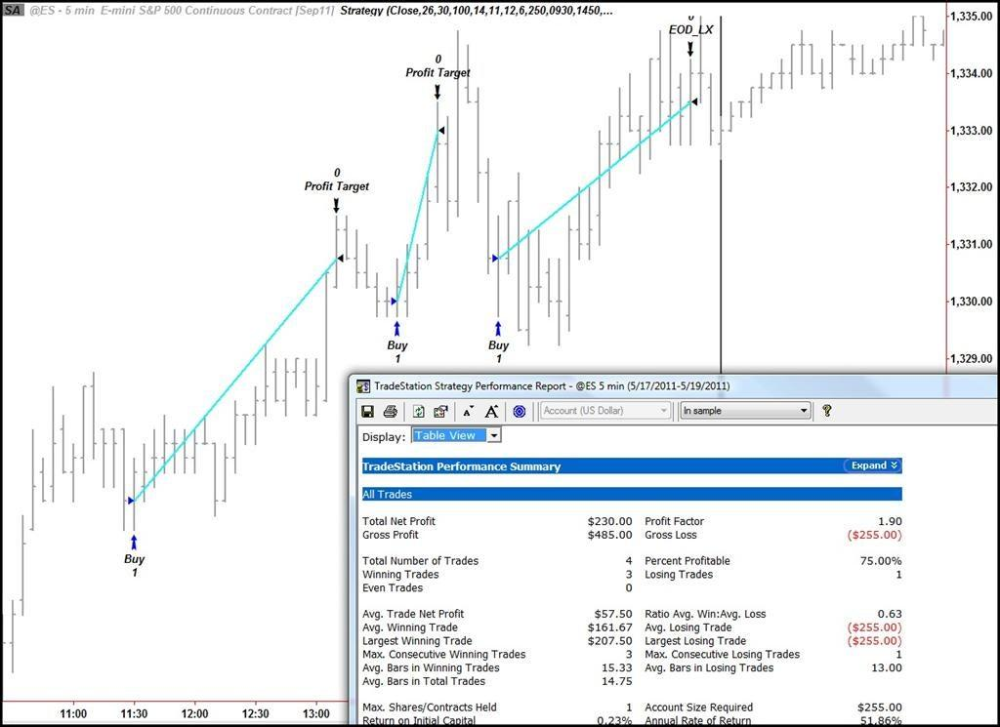

## Table of Contents

## What is a mechanical trading strategy?

A mechanical trading strategy is a set of rules that a trader follows to buy and sell financial assets. These rules are based on specific conditions, like price movements or technical indicators, and they help take emotions out of trading. By following these rules, traders can make decisions more consistently and avoid making mistakes based on feelings like fear or greed.

These strategies can be simple or complex. A simple one might say, "Buy when the price goes above its 50-day moving average and sell when it goes below." A more complex one might use many different indicators and conditions. Traders often use computers to run these strategies automatically, which is called algorithmic trading. This way, the computer can watch the market all the time and make trades without the trader needing to be there every moment.

## How do mechanical trading strategies differ from discretionary trading?

Mechanical trading strategies and discretionary trading are two different ways to make decisions about buying and selling in the financial markets. In mechanical trading, traders use a set of fixed rules to decide when to buy or sell. These rules are often based on technical indicators or specific price levels. The main advantage of this approach is that it removes emotions from trading, making decisions more consistent and disciplined. Traders often program these rules into computers to execute trades automatically, which is known as algorithmic trading.

On the other hand, discretionary trading relies on the trader's judgment and experience. Instead of following strict rules, discretionary traders make decisions based on their analysis of market conditions, news, and other factors. This method allows for more flexibility and the ability to adapt to changing situations. However, it also means that emotions like fear and greed can influence decisions, potentially leading to less consistent results.

In summary, mechanical trading strategies offer a systematic and emotion-free approach to trading, while discretionary trading depends on the trader's personal skills and intuition. Both methods have their pros and cons, and the choice between them often depends on a trader's personality, experience, and trading goals.

## What are the basic components of a mechanical trading system?

A mechanical trading system has a few main parts that help it work well. The first part is the entry rules, which tell the system when to buy or sell something. These rules usually look at things like price patterns or special numbers called indicators. For example, a rule might say to buy when a price goes above a certain line on a chart. The second part is the [exit](/wiki/exit-strategy) rules, which tell the system when to close a trade. These might be based on how much money you want to make or lose, or when the price hits another special level.

The third part of a mechanical trading system is the risk management rules. These are important because they help control how much money you might lose. For example, a rule might say to never risk more than a certain amount of your money on one trade. The last part is the performance monitoring, where you keep track of how well the system is doing. This helps you see if you need to change any of the rules to make the system work better. By using all these parts together, a mechanical trading system can help make trading decisions in a clear and consistent way.

## How can beginners start implementing a simple mechanical trading strategy?

Beginners can start implementing a simple mechanical trading strategy by first choosing a basic rule for entering and exiting trades. A good starting point is using a moving average, which is a line on a chart that shows the average price over a certain number of days. For example, a simple rule could be to buy a stock when its price goes above its 50-day moving average and sell it when the price drops below this line. This rule is easy to understand and follow, making it perfect for beginners.

Next, beginners should set up a way to manage risk. This means deciding how much money they are willing to lose on each trade. A common rule is to never risk more than 1% to 2% of your total trading money on any single trade. This helps protect your money if the trade doesn't go as planned. Once these rules are set, beginners can start tracking their trades to see how well the strategy is working. If the strategy isn't making money, they can adjust the rules a bit to try and improve it.

## What are the common indicators used in mechanical trading strategies?

Common indicators used in mechanical trading strategies include moving averages, which help traders see the average price of a stock over a certain time. For example, a 50-day moving average shows the average price over the last 50 days. Traders often use this to decide when to buy or sell. If the price goes above the moving average, it might be a good time to buy, and if it goes below, it might be a good time to sell. Another popular indicator is the Relative Strength Index (RSI), which measures how fast a stock's price is going up or down. If the RSI is over 70, it might mean the stock is overbought and could go down soon. If it's under 30, it might mean the stock is oversold and could go up.

Other common indicators include the Moving Average Convergence Divergence (MACD), which helps traders see if a stock's [momentum](/wiki/momentum) is changing. The MACD line crossing above the signal line can be a sign to buy, and crossing below can be a sign to sell. Bollinger Bands are also used a lot. They show how much a stock's price is moving around its moving average. If the price touches the upper band, it might be time to sell, and if it touches the lower band, it might be time to buy. By using these indicators, traders can make more informed decisions about when to enter and exit trades.

## How do you backtest a mechanical trading strategy?

Backtesting a mechanical trading strategy means checking how well it would have worked in the past. You do this by using old market data to see what would have happened if you had used your strategy back then. First, you need to get historical data for the stock or asset you want to trade. Then, you apply your trading rules to this data. For example, if your rule is to buy when the price goes above the 50-day moving average, you would see all the times in the past when this happened and check if buying then would have made money.

After running the strategy on the historical data, you look at the results. You want to see how much money you would have made or lost, how often you would have made winning trades, and how big those wins and losses were. It's important to look at these numbers carefully to see if the strategy worked well. If it didn't, you might need to change some of your rules and try [backtesting](/wiki/backtesting) again. Backtesting helps you feel more confident that your strategy can work in the future, but remember, past results don't always mean the same thing will happen going forward.

## What are the risks associated with mechanical trading strategies?

Mechanical trading strategies can have some risks that traders need to be aware of. One big risk is that these strategies are based on past data, and what worked in the past might not work in the future. The market can change because of new news, events, or other things that the strategy didn't plan for. This means that even if your strategy did well in backtesting, it might not do well when you start using it for real. Another risk is that mechanical trading can lead to over-trading. If the computer is making trades all the time based on the rules you set, it might make more trades than you would if you were doing it yourself. This can lead to higher costs from fees and can also increase the chance of losing money.

Another risk to think about is that mechanical trading strategies can sometimes miss important market events. For example, if there's big news that affects the market, your strategy might not react to it quickly enough because it's following set rules. This can lead to losses if the market moves in a way that your strategy didn't expect. Also, if too many people are using the same or similar strategies, it can affect the market in ways that make those strategies less effective. This is called "crowding" and it can make it harder to make money with your strategy. It's important for traders to keep watching and adjusting their strategies to try and manage these risks.

## How can you optimize a mechanical trading strategy for better performance?

To optimize a mechanical trading strategy, you need to keep testing and tweaking the rules. Start by looking at the results of your backtesting. If your strategy is not making enough money or is losing too much, think about changing the entry and exit rules. Maybe you need to adjust the moving average period or try a different indicator like the RSI. It's also important to play around with your risk management rules. Try different levels of risk to see if it helps your strategy do better. The key is to keep testing these changes on old data to see what works best before using them for real.

Another way to make your strategy better is to keep an eye on how it's doing in real time. Markets change, so a strategy that worked last month might not work this month. If you see that your strategy is not doing well, don't be afraid to make changes. Maybe you need to add new rules or take away old ones. It's also a good idea to test your strategy on different stocks or markets to see if it works better somewhere else. By always watching and adjusting your strategy, you can help make sure it keeps working well even when the market changes.

## What role does psychology play in mechanical trading?

Even though mechanical trading strategies use set rules to make decisions, psychology still plays a big part. Traders can feel stressed or worried when their strategy isn't working well. They might want to change the rules or stop using the strategy altogether, even if it's just going through a rough patch. This is because emotions like fear and doubt can make it hard to stick with a plan, especially when the market is moving in unexpected ways.

To deal with these feelings, it's important for traders to trust their strategies and not let emotions take over. Keeping a clear head and following the rules they set up can help them stay on track. It's also helpful to have a plan for what to do if things go wrong, so they don't make quick decisions based on how they feel at the moment. By understanding their own psychology and managing their emotions, traders can use mechanical trading strategies more effectively.

## How do advanced traders incorporate machine learning into mechanical trading strategies?

Advanced traders use [machine learning](/wiki/machine-learning) to make their mechanical trading strategies smarter. Machine learning helps them look at a lot of data and find patterns that are hard for people to see. They use this to make rules for buying and selling that can change over time as the market changes. For example, they might use machine learning to predict how a stock's price will move based on past prices, news, and other data. This can help them make better decisions about when to trade.

To use machine learning, traders need to collect a lot of data and teach a computer program to find useful patterns. They keep updating the program with new data so it can keep learning and getting better. This way, their trading strategy can adapt to new market conditions. But it's important to remember that machine learning is not perfect. The market can still surprise them, so they need to keep watching and adjusting their strategies to make sure they work well.

## What are the latest trends and innovations in mechanical trading strategies?

One of the latest trends in mechanical trading strategies is the use of [artificial intelligence](/wiki/ai-artificial-intelligence) (AI) and machine learning. Traders are using these technologies to analyze huge amounts of data and find patterns that they couldn't see before. This helps them make smarter decisions about when to buy and sell. For example, AI can look at news, social media, and other data to predict how the market might move. This makes the trading strategies more adaptable and able to learn from new information.

Another innovation is the use of high-frequency trading ([HFT](/wiki/high-frequency-trading-strategies)). This is when computers make a lot of trades very quickly, sometimes in just a few seconds. HFT uses complex algorithms to take advantage of small price changes in the market. It's becoming more popular because it can make money from tiny differences in prices that human traders might miss. However, it also comes with risks because the market can move very fast and in unexpected ways.

## How can one evaluate the effectiveness of a mechanical trading strategy over time?

To evaluate the effectiveness of a mechanical trading strategy over time, you need to keep track of how it performs in the real market. Start by looking at how much money the strategy makes or loses. This is called the return. You also need to check how often the strategy wins or loses, which is called the win rate. It's important to see if the strategy keeps making money over time or if it starts to lose money. You can do this by keeping a record of all the trades and looking at the results every month or every year.

Another way to see if a mechanical trading strategy is working well is to compare it with other ways of investing. For example, you might compare it to just putting your money in a savings account or in a stock market index like the S&P 500. If your strategy does better than these other options, it's a good sign. But if it does worse, you might need to change the rules of your strategy. It's also important to keep updating your strategy as the market changes, so it stays effective over time.

## Foundations of Mechanical Trading Strategies

Mechanical trading strategies provide a structured approach to the chaotic world of financial markets. By adhering to predefined rules and parameters, these strategies aim to remove human emotions from the trading equation. The foundational elements of these systems are crucial for their success and are comprised of several core components.

**Market Selection**: Before any strategy can be applied, a market or group of markets must be chosen. This is often based on the liquidity, volatility, and specific characteristics of an asset class. For example, a strategy designed for equity markets might not be suitable for commodities or forex due to their distinct price dynamics[1].

**Position Sizing**: This refers to the amount of capital allocated to a particular trade. Determining position size is crucial for managing risk. The famous "2% rule", which suggests never risking more than 2% of your trading capital on a single trade, is a common heuristic in this arena[2].

**Entry and Exit**: These are the specific conditions under which a trade is initiated or closed. Entry could be triggered by various indicators, such as a moving average crossover or a breakout from a price range. Exit points, on the other hand, are defined to either lock in profits or limit losses.

**Stops and Targets**: Stop orders are used to limit potential losses. For instance, a trader might set a stop-loss order 1% below the purchase price. Targets, conversely, specify a price at which profits will be taken. These components ensure that trades are closed at predetermined levels, adding a layer of protection and profit-taking discipline.

**Systematized Decision-Making**: Central to mechanical trading is the shift from ad-hoc decisions to a structured approach. Each component must interplay seamlessly, and every possible market scenario should be anticipated, with a clear action plan in place. This level of regimentation aims to ensure that even during periods of market stress or euphoria, the strategy remains robust and unaffected by the biases that often plague human judgment.

In essence, the success of mechanical trading lies in its foundational components. By focusing on a well-defined market, adhering to risk management through proper position sizing, and having clear entry, [exit](/wiki/exit-strategy), stops, and targets, traders can navigate the markets with precision. Coupled with the rigorous discipline of systematized decision-making, mechanical trading offers a way to harness the markets' movements methodically and consistently.

## Mechanics Behind the Strategy: Indicators & Triggers

Mechanical trading strategies heavily rely on technical indicators to inform and validate trading decisions. These indicators can be classified into two broad categories: [trend-following](https://paperswithbacktest.com/paper/does-trend-following-work-on-stocks) and [mean reversion](https://paperswithbacktest.com/paper/pairs-trading-performance-of-a-relative-value-[arbitrage](/wiki/arbitrage)-rule).

**Trend-following Indicators**: As the name implies, these indicators aim to identify and capitalize on existing market trends. Some of the most common trend-following indicators include:

- **Moving Averages (MA)**: By averaging prices over a specific period, MAs smooth out price data to identify a potential trend. The most popular variations include the Simple Moving Average (SMA) and the Exponential Moving Average (EMA).
- **Moving Average Convergence Divergence (MACD)**: This indicator subtracts the longer MA from the shorter MA, offering insights into potential trend reversals.
- **Average True Range (ATR)**: Measures market volatility by calculating the difference between the highest and lowest prices of an asset.

**Mean Reversion Indicators**: These indicators operate on the assumption that prices will revert to their mean or average level over time. Prominent mean reversion indicators include:

- **Relative Strength Index (RSI)**: Measures the speed and change of price movements and indicates overbought or oversold conditions on a scale of 0 to 100[3].
- **Bollinger Bands**: Comprises of a middle band being an N-period SMA and two outer bands which are standard deviations away from the SMA. It identifies when an asset is overbought or oversold.

Beyond these indicators, various market metrics play pivotal roles in the mechanics of trading strategies:

- **Price**: The most fundamental metric, it reflects the equilibrium between supply and demand forces.
- **Volume**: Represents the number of shares or contracts traded in an asset or security. High volume often indicates strong market interest, while low volume might indicate a lack of conviction or disinterest.
- **Volatility**: Captures the rate and magnitude of asset price changes. High volatility suggests significant price uncertainty, while low volatility indicates more consistent prices.
- **Other Market Metrics**: Factors like open interest in futures markets, bid-ask spreads, and market depth can provide additional insights into market sentiment and potential price direction.

[Understanding these indicators and metrics is crucial for the development and refinement of mechanical trading strategies.](https://paperswithbacktest.com/paper/the-volatility-effect-lower-risk-without-lower-return) Their proper application can offer traders a data-driven edge, facilitating informed and strategic decision-making in various market conditions.

## System Development: From Conception to Execution

Developing a mechanical trading system is a rigorous and iterative process that ensures strategies not only perform well with [historical data](https://blog.paperswithbacktest.com/p/mastering-data-preparation-the-key) but also hold promise for future trading. Here's a detailed overview:

1. **Design**: Start by formulating a hypothesis. For instance, you might hypothesize that stocks showing a rapid increase in trading volume will experience price surges. This hypothesis forms the foundation of your strategy. Tools like Python's pandas library or platforms like MetaTrader can aid in this design phase[3].
2. **Backtest**: Once you've established a strategy, [test it against historical data to see how it would have performed](https://blog.paperswithbacktest.com/p/how-to-collect-data-for-backtesting). This step is vital because it offers a first glance at the strategy's viability. It's essential, however, to ensure that this backtesting doesn't inadvertently peek into the future, causing lookahead bias.
3. **Optimize**: If the strategy shows promise, you might be tempted to tweak parameters to maximize its performance. This could involve adjusting stop-loss levels, changing the duration for moving averages, or modifying any other parameters intrinsic to your strategy.
4. **Deploy**: With optimization complete, the strategy is ready for live markets. However, start with a 'paper trading' phase where trades are simulated in real-time but with no real money at risk[4]. This phase offers additional validation.

To ensure a system's robustness, a couple of measures are indispensable:

- **Out-of-Sample Testing**: After backtesting on a specific data set, validate the strategy on a separate, unseen data set. This process helps confirm that the system's performance isn't just a result of overfitting to known data.
- **Forward Testing**: Also known as 'walk-forward testing', this involves testing the strategy on new data points as they become available. It's a way to see how the system adapts to changing market conditions over time.

Lastly, system developers must be vigilant about several pitfalls:

- **Overfitting**: If a strategy is excessively tailored to fit historical data perfectly, it might perform poorly in real-world trading. It's akin to memorizing answers for past exam papers and being unprepared for new questions.
- **Curve-fitting**: A close cousin of overfitting, this involves creating a trading system that fits the historical data too closely, capturing noise and anomalies rather than genuine market patterns[5].
- **Data Snooping**: This occurs when a data set is used repeatedly, and strategies are adapted based on the same set of data. The risk is that the system becomes too specialized for that specific data set and may not generalize well.

Developing a robust mechanical trading system is as much an art as it is science. While the process can be data-driven and analytical, intuition, experience, and a deep understanding of market dynamics play a pivotal role in crafting successful strategies.

## Expanding the Horizon: Multi-market & Multi-strategy Systems

Diversification has long been heralded as a cornerstone of investment strategy, as championed by Nobel laureate Harry Markowitz's Modern Portfolio Theory[6]. In mechanical trading, diversification's power isn't just about asset classes; it extends to trading across multiple markets and leveraging varied strategies.

Trading across different markets, whether they are geographically diverse stock exchanges, different asset classes like commodities, equities, or [forex](/wiki/forex-system), or even distinct sectors within an economy, can provide insulation against localized economic shocks or market anomalies. For instance, while tech stocks might face a downturn, agricultural commodities could be on an upswing, creating opportunities for traders. Furthermore, markets have varied levels of [liquidity](/wiki/liquidity-risk-premium), trading hours, and [volatility](/wiki/volatility-trading-strategies), offering an assortment of risk and reward profiles.

Similarly, employing multiple strategies offers another layer of diversification. Consider the difference between trend-following strategies and mean reversion strategies. While trend-followers bank on the continuation of existing market movements, mean reversion strategies bet on price corrections back to an average or equilibrium. Using both strategies in tandem means that a trader can profit from markets that are both trending and range-bound.

However, with this broadened horizon comes the need for judicious resource allocation. Here's how traders ensure balance:

1. **Capital Allocation**: Distributing capital across markets and strategies requires understanding the risk associated with each. A high-risk strategy or volatile market might necessitate a smaller capital allocation compared to a more stable counterpart.
2. **Computational Resources**: High-frequency trading in multiple markets might require significant computational power. Ensuring strategies are executed without latency calls for investments in technology and infrastructure[7].
3. **Research & Development**: Keeping abreast of multiple markets and strategies necessitates a dedicated research effort. This might mean a larger team, more sophisticated tools, or even partnerships with research firms.
4. **Monitoring & Review**: With more strategies and markets in play, regular monitoring becomes critical. Real-time dashboards, alert systems, and periodic reviews can ensure that no market or strategy goes off the rails.

Diversifying across markets and strategies can be likened to not putting all eggs in one basket. While it offers the promise of steadier returns and risk mitigation, it demands meticulous planning, resource management, and continual vigilance.

## Risk Management in Mechanical Trading

Risk is an inherent part of trading, and its management is the bedrock on which successful mechanical trading strategies are built. Risk in the trading world can be broadly classified into two categories: volatility and drawdown.

**Volatility** refers to the degree of variation in the price of a security over time. High volatility can mean higher profits, but it also implies greater potential losses. For traders, volatility isn't just about the magnitude but also about unpredictability. It's essential to understand and quantify this, especially for strategies that rely on predictable price movements.

**Drawdown**, on the other hand, represents the decline in the value of a portfolio from its peak to its trough. It provides a measure of the sustained losses a trader can expect to face before a return to peak performance. A deep drawdown or a series of consecutive drawdowns can be devastating for a trader's capital and confidence.

Given this dual nature of risk, traders employ a suite of techniques to manage and mitigate potential downsides:

1. **Stop-loss**: This is an order placed with a broker to sell a security when it reaches a certain price. It's a pre-determined exit point that ensures a trader's losses do not exceed a set threshold. While it protects from significant losses, it also poses the risk of exiting a position prematurely during short-term price fluctuations.
2. **Value at Risk (VaR)**: VaR estimates the maximum potential loss an investment portfolio could face over a specified period for a given confidence interval[8]. For example, a VaR of 1% over a 10-day period indicates that there's only a 1% chance that losses will exceed this value in the next ten days.
3. **Position Sizing**: This technique involves determining the amount of capital to allocate to a trade based on the potential loss. By risking only a small percentage of the total capital on any single trade, traders can ensure that they remain in the game even after a series of losses.
4. **Stress Testing**: This involves subjecting trading strategies to hypothetical worst-case scenarios to understand potential vulnerabilities. It's especially crucial for understanding "black swan" events – rare but catastrophic occurrences that can decimate a trading account[9].

Risk management isn't about avoiding losses but about making informed decisions with a clear understanding of the potential downsides. It's a delicate balance between protecting capital and capturing opportunities, making it a central component of successful mechanical trading.

## References & Further Reading

[1]: Murphy, J.J. (1999). "[Technical Analysis of the Financial Markets](https://www.amazon.com/Technical-Analysis-Financial-Markets-Comprehensive/dp/0735200661)". New York Institute of Finance.

[2]: Tharp, V.K. (2008). "[Definitive Guide to Position Sizing](https://www.amazon.com/Definitive-Guide-Position-Sizing-Objectives/dp/0935219099)". International Institute of Trading Mastery.

[3]: Wilder, J.W. (1978). "[New Concepts in Technical Trading Systems](https://www.amazon.com/New-Concepts-Technical-Trading-Systems/dp/0894590278)". Trend Research.

[3]: McKinney, W. (2012). "[Python for Data Analysis](https://www.oreilly.com/library/view/python-for-data/9781449323592/)". O'Reilly Media.

[4]: Tomasini, E., & Jaekle, U. (2009). "[Trading Systems: A new approach to system development and portfolio optimisation](https://www.amazon.com/Trading-Systems-Development-Portfolio-Optimisation/dp/1905641796)". Harriman House.

[5]: Aronson, D. (2006). "[Evidence-Based Technical Analysis](https://onlinelibrary.wiley.com/doi/book/10.1002/9781118268315)". John Wiley & Sons.

[6]: Markowitz, H. (1952). [Portfolio Selection](https://www.jstor.org/stable/2975974). The Journal of Finance, 7(1), 77-91.

[7]: Aldridge, I. (2010). [High-frequency trading: a practical guide to algorithmic strategies and trading systems](https://www.amazon.com/High-Frequency-Trading-Practical-Algorithmic-Strategies/dp/1118343506). John Wiley & Sons.

[8]: Jorion, P. (2006). [Value at risk: The new benchmark for managing financial risk](https://www.amazon.com/Value-Risk-Benchmark-Managing-Financial/dp/0071355022). McGraw-Hill.

[9]: Taleb, N. N. (2007). [The black swan: The impact of the highly improbable](https://www.amazon.com/Black-Swan-Improbable-Robustness-Fragility/dp/081297381X). Random House.

[10]: Elder, A. (1993). [Trading for a Living: Psychology, Trading Tactics, Money Management](https://www.amazon.com/Trading-Living-Psychology-Tactics-Management/dp/0471592242). John Wiley & Sons.

[11]: Tversky, A., & Kahneman, D. (1974). [Judgment under Uncertainty: Heuristics and Biases](https://www.science.org/doi/10.1126/science.185.4157.1124). Science, 185(4157), 1124-1131.

[12]: Tharp, V. K. (2003). [Trade Your Way to Financial Freedom](https://www.amazon.com/Trade-Your-Way-Financial-Freedom/dp/007147871X). McGraw Hill Professional.

[13]: Kaufman, P. J. (2005). [New Trading Systems and Methods](https://www.amazon.com/Trading-Systems-Methods-Wiley/dp/1119605350). John Wiley & Sons.

[14]: Schwager, J. D. (1993). [The New Market Wizards: Conversations with America's Top Traders](https://www.amazon.com/New-Market-Wizards-Conversations-Americas/dp/0887306675). HarperCollins.

[15]: Steenbarger, B. N. (2002). [The Psychology of Trading: Tools and Techniques for Minding the Markets](https://www.amazon.fr/Psychology-Trading-Techniques-Minding-Markets/dp/0471267619). John Wiley & Sons.