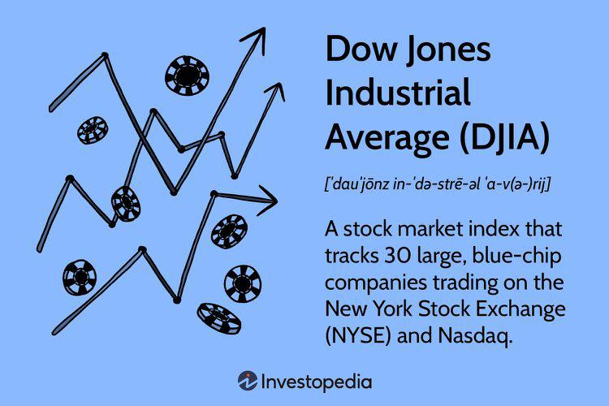

The Dow Jones Industrial Average (DJIA) holds a prominent position in the world of stock indices, representing the performance of 30 major U.S. blue-chip companies. Established in 1896 by Charles Dow and Edward Jones, the DJIA serves as a critical indicator of market trends and economic health in the United States. Despite its relatively narrow focus, compared to broader indices like the S&P 500, the DJIA continues to attract significant attention from investors, analysts, and the media.

In recent years, the landscape of trading and investment management has been dramatically altered by advancements in technology, particularly through the adoption of algorithmic trading. Algorithmic trading uses complex computer programs to execute trades rapidly and often at high volumes, based on a set of predetermined criteria or algorithms. This automation allows for improved accuracy, efficiency, and the capacity to analyze vast datasets far beyond human capability.



The purpose of this article is to explore the fundamental aspects of the DJIA, its historical importance, and how algorithmic trading is reshaping investor interactions with this key stock market index. Through leveraging technology, investors can achieve more precise control over their investment strategies in DJIA stocks, capitalizing on opportunities that arise from market fluctuations. As algorithmic trading continues to advance, its influence on DJIA investments is expected to grow, offering both new prospects and challenges in the financial markets.

## Table of Contents

## Understanding the Dow Jones Industrial Average

The Dow Jones Industrial Average (DJIA) functions as a vital indicator of the overall economic health of the United States by summarizing the performance of a selection of 30 notable publicly-owned companies. These companies, representing diverse industries, are generally regarded as blue-chip stocks that are leaders in their sectors. The DJIA reflects economic conditions through the price movements of these stocks, often reacting to a variety of factors including corporate earnings reports, economic data releases, and geopolitical events.

Despite encompassing just 30 companies compared to larger indices like the S&P 500, which tracks 500 stocks, the DJIA remains highly influential. Its prominence is largely historical, being one of the oldest indices, having been established in 1896 by Charles Dow and Edward Jones. The DJIA's influence extends beyond just financial markets; media outlets frequently quote its daily performance as a summary of how the stock market and by extension, the economy, are performing.

One unique aspect of the DJIA is its price-weighted calculation method. Unlike market-cap weighted indices, where the influence of each stock is proportional to its market capitalization, the price-weighted method assigns greater influence to stocks with higher per-share prices. This means that a stock with a higher price will have a more significant impact on the DJIA's movement than a lower-priced stock, irrespective of the companies’ market capitalizations.

The formula used to calculate the DJIA is:

$$
\text{DJIA} = \frac{\sum \text{P}_i}{\text{D}}
$$

where $\sum \text{P}_i$ is the sum of the prices of all 30 stocks, and $D$ is the Dow divisor, a factor that is adjusted in response to stock splits, spin-offs, and other structural changes to maintain the index's consistency over time. This divisor is periodically reviewed and adjusted by S&P Dow Jones Indices to ensure that the changes in the index reflect only the price changes in its constituent stocks and not structural changes to the index itself.

Thus, variations in the price-weighted method can lead to unique movements in the DJIA that might not necessarily represent movements in the broader market or economy, especially when compared to indices with alternative weighting methodologies. Nevertheless, the DJIA’s ability to quickly reflect changes in investor sentiment and economic conditions has solidified its role as a critical benchmark for investors and policymakers alike.

## The Role of Algorithmic Trading in the Dow Jones

Algorithmic trading represents a significant transformation in the financial markets by utilizing computer algorithms to execute trades with remarkable speed and accuracy. In the context of the Dow Jones Industrial Average (DJIA), [algorithmic trading](/wiki/algorithmic-trading) has become an important tool for investors seeking to manage and optimize their investment strategies.

Algorithms employed in trading are designed to automatically analyze market data, identify patterns, and make trading decisions based on predefined criteria. These algorithms can process vast amounts of historical and real-time data, allowing for a comprehensive assessment of market trends that would be challenging to achieve manually. For instance, by applying complex statistical methods and [machine learning](/wiki/machine-learning) techniques, algorithms can discern subtle signals in the market data that might predict future price movements of DJIA stocks.

One of the major advantages of algorithmic trading is its efficiency. Algorithms can execute thousands of trades per second, well beyond human capability, thereby increasing the number of market opportunities that traders can capitalize on. This high-frequency trading can lead to greater [liquidity](/wiki/liquidity-risk-premium) in the market, narrowing bid-ask spreads and improving pricing for all market participants.

Moreover, by automating the trading process, algorithms reduce the potential for human error, which can often arise from emotional decision-making or fatigue. Automation ensures that trading strategies are executed consistently according to the defined parameters, enhancing the reliability of investment operations.

Algorithmic trading also introduces advanced capabilities for exploiting market opportunities through strategies such as [arbitrage](/wiki/arbitrage), [momentum](/wiki/momentum) trading, and [market making](/wiki/market-making). These strategies involve leveraging statistical analysis and real-time data feeds to make quick, informed decisions. For example, an arbitrage strategy might capitalize on temporary disparities in stock prices across different exchanges, ensuring profits through rapid, simultaneous buying and selling.

Consider Python as a tool for implementing algorithmic trading strategies. With libraries such as `pandas` and `numpy` for data manipulation, and `scikit-learn` for machine learning, traders can develop sophisticated algorithms. Here's a simple illustration of using Python to identify a moving average crossover strategy, a common algorithmic trading approach:

```python
import pandas as pd
import numpy as np

# Load historical DJIA data
data = pd.read_csv('djia_data.csv', parse_dates=True, index_col='Date')

# Calculate moving averages
short_window = 40
long_window = 100

data['Short_MA'] = data['Close'].rolling(window=short_window, min_periods=1).mean()
data['Long_MA'] = data['Close'].rolling(window=long_window, min_periods=1).mean()

# Generate signals
data['Signal'] = 0
data['Signal'][short_window:] = np.where(data['Short_MA'][short_window:] > data['Long_MA'][short_window:], 1, 0)
data['Position'] = data['Signal'].diff()

# Display signals
print(data.loc[data['Position'] == 1.0]) # Buy signals
print(data.loc[data['Position'] == -1.0]) # Sell signals
```

This example demonstrates how the crossover of short and long-term moving averages is used to generate buy and sell signals. When the short-term average crosses above the long-term one, a buy signal is triggered, and vice versa, illustrating the power of algorithmic trading in automating and optimizing trading decisions on DJIA stocks.

## How Algorithmic Trading Works with the DJIA

Algorithmic trading leverages advanced mathematical models and computational power to execute trades at speeds and volumes that far exceed human capabilities. When applied to the Dow Jones Industrial Average (DJIA), these algorithms are designed to identify and exploit micro-level trading opportunities based on extensive data analysis.

A common strategy employed in algorithmic trading is [statistical arbitrage](/wiki/statistical-arbitrage). This method involves exploiting statistical mispricings between correlated financial instruments. For instance, if two stocks in the DJIA historically move in tandem but diverge temporarily, an algorithm may identify this as an arbitrage opportunity. By calculating historical correlations and standard deviations, traders determine the likelihood of mean reversion, allowing them to capitalize on these price discrepancies.

Market making is another prevalent strategy. Here, algorithms provide liquidity to the market by continuously quoting buy and sell prices. By doing so, they aim to profit from the bid-ask spread while managing inventory risk efficiently. Market-making algorithms must be adept at quickly adjusting to sudden changes in market conditions to minimize losses, which requires robust real-time data analysis and decision-making capabilities.

Trend following algorithms, on the other hand, try to capture asset momentum. They are designed to enter trades when a significant trend is identified, based on metrics such as moving averages or price breakouts. For example, a simple Python implementation of a moving average crossover strategy can be expressed as follows:

```python
def moving_average(series, n):
    return series.rolling(window=n).mean()

def crossover_strategy(prices, short_window, long_window):
    short_mavg = moving_average(prices, short_window)
    long_mavg = moving_average(prices, long_window)

    signals = pd.DataFrame(index=prices.index)
    signals['signal'] = 0
    signals['signal'][short_window:] = np.where(short_mavg[short_window:] > long_mavg[short_window:], 1.0, 0.0)
    signals['positions'] = signals['signal'].diff()
    return signals
```

The strategy generates buy or sell signals when the short-term moving average crosses above or below the long-term moving average, respectively.

Backtesting is essential for evaluating the potential effectiveness of these algorithms. It involves running the algorithm against historical DJIA market data to simulate its performance in past market conditions. This process helps traders refine their models by identifying parameters that lead to outperformance or underperformance. Backtesting requires accurate historical data and a framework to emulate trading costs and slippage to ensure realistic results.

In conclusion, a combination of statistical techniques, market analysis, and rigorous testing forms the backbone of algorithmic trading in the context of the DJIA. These methodologies allow traders to systematically approach market opportunities with precision and scalability.

## Challenges and Risks of DJIA Algorithmic Trading

Algorithmic trading, while transformative, introduces several challenges and risks, especially when interfacing with the Dow Jones Industrial Average (DJIA). The intricate algorithms employed in high-frequency trading ([HFT](/wiki/high-frequency-trading-strategies)) can inadvertently contribute to market [volatility](/wiki/volatility-trading-strategies) and even trigger market crashes. One reason is the potential for algorithms to interact in unforeseen ways, leading to rapid and significant price fluctuations. A notable example of such risk is the "Flash Crash" of May 6, 2010, when the DJIA plummeted nearly 1,000 points within minutes before a swift recovery. This incident highlighted the vulnerabilities inherent in automated trading systems, illustrating how algorithms could amplify market disturbances.

Technical failures present another significant challenge. Algorithms rely on robust IT infrastructure to execute trades in milliseconds. Any disruption, whether software bugs, hardware malfunctions, or network connectivity issues, can hinder trading effectiveness and lead to substantial financial losses. These technical risks necessitate constant monitoring and maintenance of trading systems, often requiring sophisticated error checking and debugging procedures.

To address these risks, robust risk management practices and regulatory oversight are essential. Risk management strategies may include deploying circuit breakers, which pause trading during extreme volatility to prevent panic-driven actions. Additionally, regular stress testing and scenario analysis can help identify potential weaknesses in algorithmic models before they manifest in live trading environments.

Regulatory bodies such as the Securities and Exchange Commission (SEC) and Commodity Futures Trading Commission (CFTC) provide essential oversight to ensure fair and orderly markets, including specific rules addressing the transparency and stability of automated trading systems. For example, the SEC has implemented "Regulation SCI" to ensure that core market participants' systems have sufficient capacity, integrity, resiliency, and security.

As algorithmic trading continues to integrate into the DJIA and broader financial markets, the balance between technological innovation and regulatory measures will be crucial in managing these challenges and mitigating associated risks. Without appropriate controls, the advantages offered by algorithmic trading—such as speed and efficiency—may be overshadowed by its potential to destabilize market operations.

## Future of DJIA and Algorithmic Trading

With advancements in [artificial intelligence](/wiki/ai-artificial-intelligence) (AI) and machine learning (ML), algorithmic trading is poised to play an increasingly significant role in the Dow Jones Industrial Average (DJIA) and broader stock markets. AI and ML technologies facilitate more sophisticated analyses by employing vast datasets to identify patterns and predict market behavior with greater accuracy. These capabilities enhance investment strategies by providing detailed insights into market trends, allowing traders to develop predictive models that can outperform traditional methods.

Machine learning algorithms, such as supervised and unsupervised learning models, can process enormous amounts of historical trading data to detect non-linear relationships and anomalies. For example, the use of neural networks and [deep learning](/wiki/deep-learning) models allows for the recognition of intricate patterns that humans might overlook. As these algorithms learn and improve over time, they enable more precise predictions and informed decision-making in trading DJIA stocks.

Python is widely used in this field due to its robust libraries like TensorFlow and PyTorch, which support the development and training of complex AI models. For example, a simple implementation of a trading algorithm using a machine learning model might look like this:

```python
import pandas as pd
from sklearn.model_selection import train_test_split
from sklearn.ensemble import RandomForestClassifier

# Loading historical stock data
data = pd.read_csv('djia_stock_data.csv')

# Feature engineering and target variable setting
features = data.drop('target', axis=1)
target = data['target']

# Splitting data into training and testing sets
X_train, X_test, y_train, y_test = train_test_split(features, target, test_size=0.2, random_state=42)

# Initializing and training the model
model = RandomForestClassifier(n_estimators=100)
model.fit(X_train, y_train)

# Predicting and evaluating model performance
predictions = model.predict(X_test)
```

While these technological advancements promise enhanced investment strategies, they also introduce challenges. The rapid pace of innovation necessitates a balance with effective market regulation. Regulatory measures are crucial to ensuring market stability and preventing abuses that may arise from increasingly autonomous algorithms. The market's future landscape will depend on the industry's ability to integrate cutting-edge technologies while maintaining rigorous oversight. This balance is essential to protect market integrity and foster sustainable growth within the DJIA and global financial systems.

As algorithmic trading continues to evolve, it brings both opportunities for increased efficiency and performance and necessitates caution and responsibility. Investors and traders must remain vigilant about technological and regulatory developments to harness the full potential of these innovations responsibly.

## Conclusion

The integration of algorithmic trading into Dow Jones Industrial Average (DJIA) investment strategies has brought transformative changes to traditional trading models. This technological evolution offers opportunities for enhanced efficiency, improved performance, and the ability to capitalize on market opportunities. Algorithmic trading enables high-speed execution, minimizes human error, and allows for precise, data-driven decision-making. However, with these advancements come responsibilities and challenges that market participants must navigate carefully.

The efficiency of algorithmic trading does not eliminate the need for caution. Technical failures, data inaccuracies, and unforeseen interactions between algorithms can pose significant risks, potentially leading to market disruptions or exacerbating financial instability. Historical incidents have shown that algorithm-driven market crashes can occur when trading algorithms react to short-term imbalances in unforeseen ways. Therefore, it remains crucial for traders to maintain robust risk management practices and to be aware of potential systemic impacts. Furthermore, regulatory oversight continues to play an essential role in ensuring that algorithmic trading practices do not undermine market integrity.

As the financial sector evolves, staying informed about emerging trends and technologies that influence the DJIA and broader financial markets is vital for traders and investors. The continued advancement of artificial intelligence and machine learning promises even more sophisticated trading models, offering insights that were previously unattainable. These technologies will likely enhance predictive capabilities and investment strategies, further shifting the dynamics of stock indices like the DJIA.

In conclusion, the landscape of trading on the Dow Jones is undergoing significant change as algorithmic trading becomes more prevalent. Market participants must balance the benefits of greater efficiency and precision with the inherent responsibilities of managing the associated risks. Keeping abreast of technological advancements and fostering a culture of responsible trading will be paramount to ensuring a resilient and productive financial market environment.

## References & Further Reading

[1]: ["Advances in Financial Machine Learning"](https://www.amazon.com/Advances-Financial-Machine-Learning-Marcos/dp/1119482089) by Marcos Lopez de Prado

[2]: ["Machine Learning for Algorithmic Trading"](https://github.com/stefan-jansen/machine-learning-for-trading) by Stefan Jansen

[3]: ["Quantitative Trading: How to Build Your Own Algorithmic Trading Business"](https://www.amazon.com/Quantitative-Trading-Build-Algorithmic-Business/dp/1119800064) by Ernest P. Chan

[4]: Bergstra, J., Bardenet, R., Bengio, Y., & Kégl, B. (2011). ["Algorithms for Hyper-Parameter Optimization."](https://dl.acm.org/doi/10.5555/2986459.2986743) Advances in Neural Information Processing Systems 24.

[5]: ["Evidence-Based Technical Analysis: Applying the Scientific Method and Statistical Inference to Trading Signals"](https://www.amazon.com/Evidence-Based-Technical-Analysis-Scientific-Statistical/dp/0470008741) by David Aronson