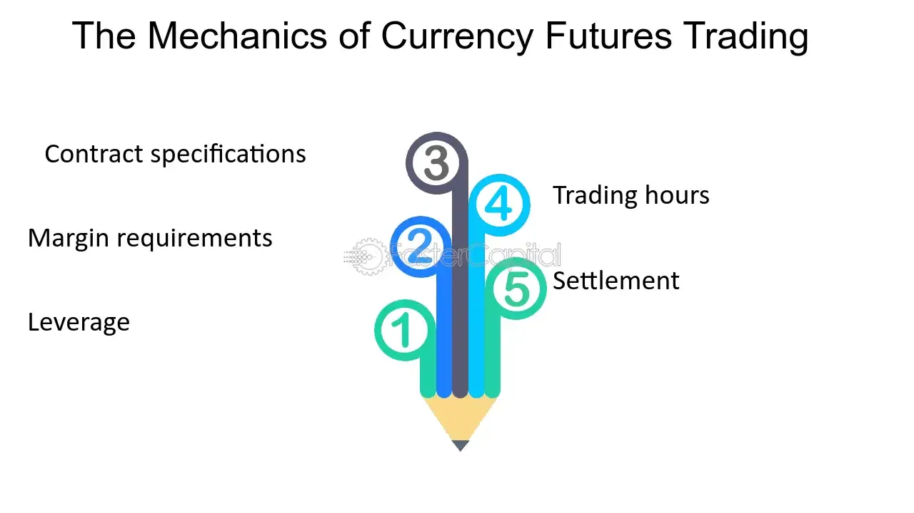

## Table of Contents

## What is currency and why is it important in an economy?

Currency is a type of money that people use to buy things and pay for services. It can be coins, paper money, or even digital money. In every country, there is a special currency that people use. For example, in the United States, people use dollars, and in Japan, they use yen. Currency makes it easier for people to trade things without having to barter, which means swapping one thing directly for another.

Currency is very important in an economy because it helps keep everything running smoothly. When people use currency, they can easily buy what they need and sell what they have. This helps businesses grow and creates jobs for people. If there is too much or too little currency, it can cause problems like inflation, where prices go up a lot, or deflation, where prices go down. So, having the right amount of currency helps keep the economy stable and makes life easier for everyone.

## How does currency function as a medium of exchange?

Currency works as a medium of exchange by allowing people to trade goods and services easily. Instead of having to find someone who wants what you have and has what you want, you can just use currency. For example, if you want to buy a toy, you don't need to find someone who has a toy and wants your apples. You can sell your apples for money and then use that money to buy the toy. This makes trading much simpler and faster.

Using currency as a medium of exchange also helps in keeping track of the value of things. When you use money, you can easily see how much something is worth because it has a set price in currency. This helps people make fair trades and know if they are getting a good deal. Without currency, it would be hard to figure out if trading a basket of apples for a toy is a good trade, but with money, you can see the price and decide if it's worth it.

## What are the different types of currency?

There are several types of currency that people use around the world. The most common type is physical currency, which includes coins and paper money. These are the things you can touch and use to buy things at stores. Every country has its own physical currency, like the dollar in the United States or the euro in many European countries. Another type of currency is digital currency, which is money that exists only on computers and the internet. This includes things like cryptocurrencies, such as Bitcoin, which people can use to buy things online.

Another type of currency is called commodity money. This is when things that have value on their own, like gold or silver, are used as money. In the past, people used to trade with gold coins because gold was valuable. Nowadays, we mostly use fiat money, which is money that has value because the government says it does. It's not backed by anything physical like gold, but people trust it because it's supported by the government. Each type of currency has its own way of helping people buy and sell things, and they all play an important role in the economy.

## What is the role of central banks in managing currency?

Central banks play a big role in managing currency. They are like the bosses of money in a country. One of their main jobs is to control how much money is in the economy. If there's too much money, prices can go up a lot, which is called inflation. If there's too little money, prices can go down, which is called deflation. Central banks try to keep the amount of money just right so that the economy stays stable and people can buy things without worrying too much about prices changing.

Another important job of central banks is to set interest rates. Interest rates are what banks charge people for borrowing money. When central banks change these rates, it can affect how much people want to borrow and spend. If the [interest rate](/wiki/interest-rate-trading-strategies) is low, people might borrow more money to buy things like houses or cars, which can help the economy grow. If the interest rate is high, people might borrow less, which can slow down the economy. By adjusting interest rates, central banks can help keep the economy balanced and make sure that the currency keeps its value.

## How is currency value determined?

Currency value is determined by what people think it's worth and by how much of it is available. When a lot of people want a currency, its value goes up. For example, if everyone wants to buy dollars, the value of the dollar will increase. On the other hand, if there's too much of a currency around, its value can go down. This is like when you have a lot of something, it becomes less special and people might not want it as much.

Another way currency value is determined is by comparing it to other currencies. This is called the exchange rate. If one dollar can buy more euros than before, the value of the dollar has gone up compared to the euro. Many things can affect exchange rates, like how strong a country's economy is or what people think will happen in the future. Central banks also play a big role by controlling how much money is in the economy and setting interest rates. All these things together help decide how much a currency is worth.

## What are exchange rates and how do they affect currency mechanics?

Exchange rates are like a price tag that shows how much one country's money is worth compared to another country's money. For example, if one US dollar can buy 110 Japanese yen, the exchange rate between the dollar and the yen is 1 to 110. This rate changes all the time based on what people think about the economy of each country and how much they want to buy or sell that currency.

Exchange rates affect how people and businesses do things across different countries. If the exchange rate makes a currency stronger, it means that currency can buy more of another country's money. This can make things cheaper for people who have that strong currency when they buy things from other countries. But it can also make their own country's products more expensive for people in other countries to buy. On the other hand, if a currency gets weaker, it can make a country's exports cheaper for other countries, which might help businesses sell more, but it can also make imports more expensive for people at home.

## What is inflation and how does it impact currency?

Inflation is when the prices of things go up over time. It means that the same amount of money can buy less stuff than it used to. For example, if a toy cost $10 last year and now it costs $12, that's inflation. It happens because there's more money around, or because it costs more to make things, or because more people want to buy things than there are things to buy.

Inflation affects currency by making it worth less. If prices are going up, then each dollar, euro, or yen can't buy as much as before. This can make people feel like their money is losing value. But a little bit of inflation is normal and can even be good for the economy. It encourages people to spend and invest their money now instead of saving it for later, which helps businesses grow and creates jobs. But if inflation gets too high, it can cause problems like making it hard for people to afford things they need.

## How do governments and financial institutions control money supply?

Governments and financial institutions control the money supply by using different tools. One big way they do this is by changing the interest rates. When the interest rate is low, borrowing money becomes cheaper, so people and businesses might borrow more and spend more. This can increase the amount of money in the economy. If the interest rate is high, borrowing money is more expensive, so people might borrow less and spend less, which can decrease the amount of money in the economy. Another way they control money supply is by buying or selling government bonds. When the government buys bonds, it puts more money into the economy. When it sells bonds, it takes money out of the economy.

Another tool they use is called reserve requirements. This is a rule that says banks have to keep a certain amount of money in reserve and can't lend it all out. If the reserve requirement is low, banks can lend out more money, which increases the money supply. If the reserve requirement is high, banks can lend out less money, which decreases the money supply. Central banks also use something called open market operations, where they buy or sell securities to influence how much money is in the economy. All these tools help governments and financial institutions keep the money supply at the right level to help the economy stay stable and healthy.

## What are the effects of monetary policy on currency mechanics?

Monetary policy is how central banks control the amount of money in an economy. When they change things like interest rates or buy and sell bonds, it affects how much money people and businesses have to spend. If the central bank wants more money in the economy, it might lower interest rates so borrowing becomes cheaper. This can make people spend more and businesses invest more, which can help the economy grow. But if there's too much money, prices can go up a lot, which is called inflation. So, the central bank has to be careful not to let this happen.

When the central bank wants less money in the economy, it might raise interest rates to make borrowing more expensive. This can make people save more and spend less, which can slow down the economy but also help control inflation. By changing the money supply, the central bank can also affect the value of the currency. If there's less money around, the currency can become stronger, making it worth more compared to other countries' money. But if there's too much money, the currency can become weaker, making it worth less. So, monetary policy is a big tool that helps keep the economy and currency stable.

## How do international trade and foreign investment influence currency dynamics?

International trade and foreign investment have a big impact on how a country's currency works. When a country exports a lot of things, it means other countries need to buy its currency to pay for those goods. This can make the currency stronger because more people want it. On the other hand, if a country imports a lot, it has to use its own currency to buy things from other countries, which can make the currency weaker because there's more of it around. Foreign investment works the same way. If investors from other countries want to put their money into a country's businesses or buy its stocks and bonds, they need to buy that country's currency. This can also make the currency stronger.

But it's not just about buying and selling things. The overall health of a country's economy also matters. If a country's economy is doing well, more people might want to invest there, which can make the currency stronger. But if the economy is doing poorly, investors might pull their money out, which can make the currency weaker. Governments and central banks keep an eye on all these things and try to make policies that help keep the currency stable. By understanding how trade and investment affect currency, they can make better decisions to help the economy grow and stay strong.

## What are the advanced theories of currency valuation, such as purchasing power parity?

One advanced theory of currency valuation is called purchasing power parity (PPP). This theory says that the value of different currencies should be the same when you look at how much they can buy. For example, if a burger costs $5 in the United States and 500 yen in Japan, the exchange rate between the dollar and the yen should be 1 to 100. If it's not, then people might buy burgers in the country where they're cheaper and sell them in the country where they're more expensive, which would make the exchange rate go back to where it should be according to PPP. This theory helps explain why exchange rates change over time based on what people can buy with different currencies.

Another important theory is the interest rate parity, which looks at how interest rates affect currency values. This theory says that the difference in interest rates between two countries should be the same as the expected change in the exchange rate between their currencies. For example, if interest rates are higher in the United States than in Japan, people might move their money to the U.S. to get a better return on their savings. This would make the dollar stronger and the yen weaker. But if people expect the yen to get stronger in the future, they might not move their money, which would keep the exchange rate stable. Interest rate parity helps explain how interest rates and expected changes in currency values work together to keep things balanced in the global economy.

## How do cryptocurrencies and digital currencies alter traditional currency mechanics?

Cryptocurrencies and digital currencies change how we think about money. Unlike regular money, which is controlled by governments and banks, cryptocurrencies like Bitcoin are managed by a computer network. This means that no single person or group can decide how much money there is or change its value. Instead, the value of a [cryptocurrency](/wiki/cryptocurrency) goes up or down based on what people think it's worth and how much they want to buy or sell it. This can make the value of cryptocurrencies go up and down a lot more than regular money, which can be risky but also exciting for people who want to invest in them.

Digital currencies also make it easier to send money around the world. With regular money, it can take a long time and cost a lot to send money to another country. But with digital currencies, you can send money to anyone, anywhere, almost instantly and often for less money. This can help people who need to send money home to their families or businesses that want to pay people in different countries. But because digital currencies are new and not everyone trusts them yet, they can be hard to use for everyday things like buying groceries or paying bills. Still, as more people start using them, they might change how we use money in the future.

## References & Further Reading

[1]: Austin, A., & Lo, K. (2018). ["Machine Learning and AI in Trading."](https://www.nature.com/articles/s41599-020-0501-9) Financial Analysts Journal.

[2]: ["Algorithmic Trading: Winning Strategies and Their Rationale"](https://www.wiley.com/en-us/Algorithmic+Trading%3A+Winning+Strategies+and+Their+Rationale-p-9781118460146) by Ernie Chan

[3]: Hasbrouck, J., & Saar, G. (2013). ["Low-latency trading."](https://papers.ssrn.com/sol3/papers.cfm?abstract_id=1695460) Journal of Financial Markets.

[4]: Hull, J. C. (2018). ["Options, Futures, and Other Derivatives"](https://www.semanticscholar.org/paper/Options%2C-Futures%2C-and-Other-Derivatives-Hull/89bdee500c8623864fc9eb7a471546aa713acc44) (10th ed.). Pearson.

[5]: Narang, R. K. (2009). ["Inside the Black Box: A Simple Guide to Quantitative and High Frequency Trading"](https://onlinelibrary.wiley.com/doi/book/10.1002/9781118267738) by Rishi K. Narang