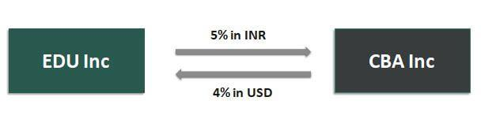

The modern financial landscape is increasingly shaped by the intersection of technology and money. This relationship plays a crucial role in areas such as currency, economic mechanisms, and algorithmic trading, each of which is integral to the functioning of global markets. The evolution of currency, influenced by technological advancements and monetary policies, continues to redefine economic transactions. Similarly, the emergence of algorithmic trading is transforming how financial markets operate, using complex algorithms to facilitate high-speed trading decisions.

As we navigate these changes, understanding the interaction between technology and finance is essential. The convergence of these elements determines how global economic systems function today and will likely dictate their future trajectories. Exploring these concepts reveals insights into burgeoning trends and their implications for the global economy. This article aims to provide a comprehensive overview of these multifaceted relationships, offering a glimpse into the interconnected world of modern finance and technology.



## Table of Contents

## Understanding Economics and Money Mechanisms

Economics forms the backbone of how money flows through a system, impacting every facet of life. Central to this flow is the concept of money mechanisms, which encompass the methods and channels through which money is supplied, distributed, and utilized within an economy. These money mechanisms are profoundly influenced by governmental policies, banking systems, and market dynamics.

Central banks play a pivotal role in money supply through monetary policies, such as adjusting interest rates and conducting open market operations. By altering these parameters, central banks can influence inflation rates, employment levels, and overall economic growth. For example, lowering interest rates generally encourages borrowing and investment, leading to increased money circulation within the economy. Conversely, raising interest rates can help to temper inflation by reducing spending and borrowing.

Banking systems serve as primary facilitators of money distribution. They manage deposit accounts, provide loans, and engage in interbank lending, ensuring the seamless flow of money between various sectors of the economy. Commercial banks, through fractional reserve banking, can create money by lending a portion of their deposits, further amplifying the money supply.

Market dynamics, including supply and demand, competition, and consumer behavior, also play a crucial role in shaping how money is utilized. For instance, currency exchange markets can affect the purchasing power of money across borders, influencing international trade and investment decisions. As currencies fluctuate in value based on market conditions, they impact the cost of imports and exports, directly affecting a country’s trade balance and economic health.

Understanding these intricate components is essential for decoding the broader economic frameworks affecting global markets. Money serves critical functions in this system: as a medium of exchange, it facilitates transactions by eliminating the inefficiencies of a barter system; as a unit of account, it provides a standard measure of value, aiding in the pricing of goods and services; and as a store of value, it enables individuals and businesses to transfer purchasing power from the present to the future.

In summary, effective money mechanisms are crucial for ensuring economic stability and growth. Their influence extends beyond national borders, affecting global economic trends and relations. For professionals and enthusiasts in finance and economics, comprehending these elements is fundamental to understanding the complexities of modern economies.

## The Role of Currency in Global Markets

Currency is a cornerstone of economic systems globally, acting as both a medium for exchange and a measure of value. In contemporary economies, fiat money is predominantly used, whose value is not based on physical commodities but rather on the trust and authority of government backing. The effectiveness of fiat currencies hinges on the public's confidence in the issuing authority and the economic stability of the nation.

Modern currencies play a crucial role in facilitating global trade by simplifying transactions across nations. This capacity for simplification is vital in a globalized economy where trade dependencies are profound. However, currencies are subject to fluctuations arising from various economic factors, such as inflation rates, interest rates, political stability, and differential growth rates among countries. These fluctuations can significantly impact international economic relations, influencing trade balances and creating uncertainties in cross-border transactions.

Exchange rate policies are pivotal for market stabilization and enhancing international competitiveness. Countries may adopt different exchange rate systems, such as floating, fixed, or pegged exchange rates, each with particular advantages and drawbacks. A floating exchange rate, determined by market forces, can absorb economic shocks automatically, whereas a fixed exchange rate provides stability in international prices but may require frequent monetary interventions. Pegged or managed floating systems combine both approaches, allowing a currency to fluctuate within a controlled range, providing a balance between stability and flexibility.

An examination of historical currency exchange trends reveals numerous implications for global economies. For instance, the Bretton Woods system, established in 1944, pegged major currencies to the US dollar, which was convertible into gold, creating a stable trade environment. However, when the system collapsed in 1971, it ushered in an era of floating exchange rates, leading to increased [volatility](/wiki/volatility-trading-strategies) but also adjustability in international trade dynamics.

Recent trends, such as the rise of digital currencies and increasing geopolitical tensions, have further complicated the currency landscape. Cryptocurrencies, like Bitcoin, challenge traditional fiat currencies by offering decentralized means of transaction and value storage, albeit with heightened volatility and regulatory challenges. Simultaneously, geopolitical conflicts can lead to volatile currency fluctuations, affecting global trade and investment patterns.

In conclusion, understanding the multifaceted role of currency in global markets is crucial. The balance between government intervention and market-driven exchange rate adjustments remains a delicate yet essential aspect of modern economics. As we navigate an increasingly interconnected world, the strategic management of currencies will continue to have far-reaching implications for global economic stability and growth.

## Algorithmic Trading: Transforming Financial Markets

Algorithmic trading utilizes computer algorithms to automate and execute trading decisions based on pre-set criteria, providing numerous advantages over traditional trading methods. Primarily, it facilitates rapid and efficient trades that can be executed on a scale and speed that human traders cannot achieve, thus significantly enhancing market [liquidity](/wiki/liquidity-risk-premium). This increased liquidity is crucial as it allows for smoother transactions, tighter bid-ask spreads, and reduced trading costs.

The financial sector is undergoing a profound transformation due to [algorithmic trading](/wiki/algorithmic-trading), which influences how markets operate and interact. Various types of trading algorithms are employed, each with distinct characteristics and purposes. Among these, black-box trading algorithms are particularly noteworthy, as they operate using complex, proprietary logic that is often not disclosed publicly. This opacity poses challenges in terms of transparency and oversight.

High-frequency trading ([HFT](/wiki/high-frequency-trading-strategies)) is a subset of algorithmic trading that capitalizes on ultra-short-term opportunities presented in the market. HFT strategies execute a high [volume](/wiki/volume-trading-strategy) of orders at exceptionally high speeds, usually within fractions of a second. This type of trading relies on advanced technology and infrastructure, such as co-location services that minimize latency, giving traders a competitive edge through faster access to market data and order execution.

Understanding the risks and benefits of algorithmic trading is crucial for both market participants and regulators. On the one hand, the technology enhances market efficiency and provides faster price discovery. On the other hand, it carries risks, including potential market disruption due to algorithmic errors or malfunctions. Additionally, the proliferation of HFT has raised concerns about market fairness and stability, as these strategies can exacerbate market volatility.

To mitigate these risks, regulatory bodies have introduced various measures aimed at ensuring fair and orderly markets. These measures include the implementation of circuit breakers, which halt trading during periods of extreme volatility, and the requirement for rigorous testing of algorithms before deployment.

Algorithmic trading represents a transformative shift in the financial industry, offering both opportunities and challenges. The continued evolution of this technology necessitates ongoing adaptation by market participants and regulators alike, to ensure that the benefits of increased efficiency and liquidity do not come at the expense of market stability and integrity.

## The Intersection of Currency and Algorithmic Trading

Algorithmic trading significantly impacts currency markets by influencing exchange rates and overall market behavior. This trading approach uses complex algorithms and computational power to execute trades based on predefined criteria, allowing traders to react rapidly to market changes. The inherent volatility and liquidity of currency markets make them well-suited for algorithmic strategies, as they require quick, precise actions to exploit opportunities that human traders might miss.

One primary application of algorithmic trading in currency markets involves [arbitrage](/wiki/arbitrage) strategies. Arbitrageurs use algorithms to identify and capitalize on price discrepancies between different currency pairs across multiple markets. This process often involves executing high-frequency trades to secure small profits that accumulate over time. By consistently seeking out these small discrepancies, algorithms can achieve significant profitability with minimal risk. An example of a basic arbitrage strategy could be:

```python
def arbitrage_strategy(exchange_1, exchange_2, currency_pair):
    price_1 = exchange_1.get_price(currency_pair)
    price_2 = exchange_2.get_price(currency_pair)

    if price_1 < price_2:
        exchange_1.buy(currency_pair)
        exchange_2.sell(currency_pair)
    elif price_1 > price_2:
        exchange_1.sell(currency_pair)
        exchange_2.buy(currency_pair)
```

Moreover, algorithms are adept at handling the intensive computational tasks required for market-making strategies in currency trading. These strategies involve continuously quoting buy and sell prices for currency pairs, capturing the spread, and providing liquidity to the market. Algorithms can adjust prices in real-time based on market conditions, ensuring minimal exposure to adverse price movements.

Algorithmic trading strategies also include trend-following and mean-reversion approaches, which analyze historical price data and patterns. Trend-following algorithms might employ moving averages to identify and trade in the direction of market [momentum](/wiki/momentum), while mean-reversion strategies aim to profit from temporary price dislocations by predicting reversals to an average level.

Although algorithmic trading enhances efficiency and speed in currency markets, it also introduces challenges. The high velocity and volume of trades can lead to market instability during volatile periods, highlighted by events such as the "flash crash" where algorithms interact at lightning speeds, momentarily destabilizing markets. Therefore, while algorithms offer opportunities for profit and efficiency, they also necessitate diligent oversight to mitigate potential risks.

Real-world applications exemplify how technology has transformed traditional trading paradigms. Financial institutions leverage sophisticated algorithms to execute vast numbers of trades with precision, indicative of the ongoing evolution in the trading landscape. As technology progresses, the use of [machine learning](/wiki/machine-learning) and [artificial intelligence](/wiki/ai-artificial-intelligence) in developing advanced trading algorithms is anticipated to further redefine market strategies, showcasing the significant intersection between currency markets and algorithmic trading.

## Challenges and Future Trends

Despite the significant advantages offered by algorithmic trading and currency management, these technologies face notable challenges that must be addressed to ensure their long-term viability and effectiveness. Among the primary concerns are system failures, which can arise from technical glitches or errors in algorithm design. Such failures can lead to significant financial losses and market disruptions. Furthermore, regulatory uncertainty presents a formidable challenge, as the rapid pace of technological advancement often outstrips the ability of legislative bodies to create appropriate, coherent regulations. This regulatory lag can result in ambiguous guidelines, leaving market participants unsure of compliance requirements and potentially exposing the financial system to undue risks.

Ethical concerns also play a critical role in the discourse surrounding algorithmic trading and currency management. As algorithms increasingly influence financial markets, questions about market fairness, transparency, and accountability come to the fore. The potential for these technologies to exacerbate market volatility and contribute to unfair advantages for those with the resources to deploy sophisticated algorithms cannot be overlooked.

Looking to the future, one of the key trends is the further integration of artificial intelligence (AI) and machine learning (ML) into trading algorithms. These technologies have the potential to enhance the adaptability and predictive power of trading strategies. AI and ML can process vast amounts of data at speeds far exceeding human capabilities, enabling more accurate market predictions and decision-making. However, this also necessitates careful consideration of the implications, as reliance on AI-driven systems can lead to new types of systemic risks if not properly managed.

Cryptocurrencies and digital currencies are reshaping the future landscape of money and are a testament to the evolving nature of currency management. The rise of digital currencies introduces alternative mechanisms for value transfer and poses challenges to traditional financial institutions and regulatory frameworks. As digital currencies gain traction, their impact on global financial systems and markets is increasingly profound, necessitating adaptations in how currencies are managed and traded algorithmically.

The future evolution of algorithmic trading will likely hinge on the interplay between human oversight and automation. While automation offers unparalleled efficiencies, the need for human judgment in monitoring, managing, and mitigating risks remains crucial. Striking the right balance between these elements will be key to ensuring that financial markets operate smoothly and fairly. As these technologies continue to advance, stakeholders must remain vigilant, adaptable, and forward-thinking to navigate the complexities that lie ahead.

## Conclusion

The convergence of money mechanisms, currency dynamics, and algorithmic trading marks a transformative phase in the field of economics. This intersection is reshaping how financial markets operate, offering a blend of challenges and opportunities that professionals and enthusiasts in finance and economics must engage with closely. Understanding these concepts is not just beneficial but essential, as they redefine both traditional and modern financial paradigms.

As technological advancements increasingly influence financial systems, staying informed about these changes becomes a priority. Algorithmic trading, supported by rapid computational technologies, enhances market efficiency but also introduces complexities that require continuous monitoring and regulation. The intricate dance between human oversight and automated processes illustrates the delicate balance needed in leveraging technology without compromise to market stability.

The integration of these elements – currency dynamics, money mechanisms, and trading algorithms – provides a dual-faceted pathway towards more efficient markets, balancing the precision of algorithms with the nuanced understanding of economic principles. This synergy holds the promise of more fluid and responsive markets but also demands rigorous understanding and strategic foresight from market participants.

Ultimately, comprehending these complex mechanisms is crucial for navigating the modern financial world. In an era where economic and technological boundaries are increasingly interlinked, becoming adept in these domains enhances our capacity to adapt and thrive in the evolving landscape of global finance. While the journey may be fraught with challenges, the convergence of these components also opens up unprecedented possibilities for innovation and economic progress.

## References & Further Reading

[1]: Austin, A., & Lo, K. (2018). ["Machine Learning and AI in Trading."](https://www.nature.com/articles/s41599-020-0501-9) Financial Analysts Journal.

[2]: ["Algorithmic Trading: Winning Strategies and Their Rationale"](https://www.wiley.com/en-us/Algorithmic+Trading%3A+Winning+Strategies+and+Their+Rationale-p-9781118460146) by Ernie Chan

[3]: Hasbrouck, J., & Saar, G. (2013). ["Low-latency trading."](https://papers.ssrn.com/sol3/papers.cfm?abstract_id=1695460) Journal of Financial Markets.

[4]: Hull, J. C. (2018). ["Options, Futures, and Other Derivatives"](https://www.semanticscholar.org/paper/Options%2C-Futures%2C-and-Other-Derivatives-Hull/89bdee500c8623864fc9eb7a471546aa713acc44) (10th ed.). Pearson.

[5]: Narang, R. K. (2009). ["Inside the Black Box: A Simple Guide to Quantitative and High Frequency Trading"](https://onlinelibrary.wiley.com/doi/book/10.1002/9781118267738) by Rishi K. Narang