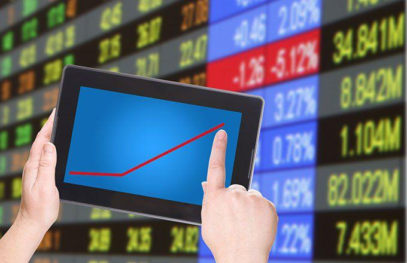

Electronic trading has become a cornerstone in modern financial markets, revolutionizing how assets are bought and sold. This method of trading refers to the use of electronic platforms and networks to conduct trading activities, replacing the traditional open outcry system found on physical trading floors. The shift towards electronic trading has been driven by advances in technology, notably the development of high-speed computers and sophisticated software that facilitate rapid transaction processing.

Algorithmic strategies, which involve the use of complex algorithms to execute trades, are integral to electronic trading. These strategies allow for the automation of trading processes, minimizing human intervention and significantly reducing the time taken to execute trades. Automated systems can process a vast amount of market data and execute trades based on predefined criteria, enabling quicker responses to market conditions. This has enhanced market efficiency by narrowing bid-ask spreads and increasing liquidity.



The evolution of electronic trading has also impacted market operations, altering the dynamics of trading and influencing market participants' behavior. Electronic systems have democratized market access, enabling a broader range of investors, including retail traders, to participate in markets that were once dominated by large institutional players. This has led to more competition and innovation as market participants strive to leverage technology for better trading outcomes.

The impact of electronic trading extends beyond efficiency and access. The rapid execution speeds and increased trading volumes have sparked concerns over market stability and transparency. As trading has accelerated, so has the potential for significant volatility and systemic risks, necessitating new regulatory frameworks to ensure fair and orderly markets.

This article examines the mechanisms underpinning electronic trading and the critical role that algorithmic strategies play within this ecosystem. By exploring their evolution and impact, we aim to provide a comprehensive understanding of how these technologies are shaping the current and future landscape of financial markets.

## Table of Contents

## The Evolution of Electronic Trading

Electronic trading has marked a significant shift in the functioning of financial markets, transitioning from bustling trading floors to sophisticated electronic systems. Historically, financial exchanges operated with traders physically present on exchange floors, where they would execute deals through an open outcry system. This traditional method was not only slow but also limited in terms of who could participate due to geographical and temporal constraints.

The advent of electronic trading systems began in the late 20th century, gradually transforming the landscape by the early 2000s. These systems replaced the physical trading floor with digital platforms, enabling trades to be executed electronically. This transition was facilitated by advancements in computing technology, which offered faster processing speeds, more robust software, and reliable communication networks. 

One of the most profound impacts of electronic trading has been the democratization of market access. Previously, trading was mostly confined to professional traders and firms with the resources to maintain a physical presence on exchange floors. Electronic trading systems, however, opened markets to a broader range of participants, including smaller firms and individual investors. These systems reduced barriers to entry by lowering transaction costs and enabling remote access to global markets.

In terms of speed and efficiency, electronic trading significantly outperforms traditional methods. In an electronic system, trades can be executed in fractions of a second, as opposed to the minutes or hours it could take on a physical trading floor. This increase in speed is attributable to the automated nature of electronic trading, where computers match buy and sell orders almost instantaneously. The efficiency gains from electronic trading have led to increased market [liquidity](/wiki/liquidity-risk-premium), as trades can occur more frequently and with greater ease.

Moreover, electronic trading has improved price discovery and transparency. The continuous flow of information and the ability to process data quickly allow for real-time pricing, which reflects the most current market conditions. As a result, electronic platforms provide participants with greater insight into market movements, helping them make informed decisions.

In conclusion, the evolution from traditional trading floors to electronic systems has had a profound impact on financial markets. Enabled by technological advances, electronic trading has democratized access, enhanced the speed and efficiency of transactions, and brought unprecedented transparency and liquidity to market operations.

## Mechanics of Electronic Trading

Electronic trading is underpinned by a robust and sophisticated infrastructure that ensures efficient and seamless operations. At its core, this infrastructure comprises several key components, including electronic communication networks (ECNs), trading platforms, and data centers, which collectively facilitate the rapid execution of trades and the handling of large volumes of market data.

Order Types and Matching Engines

A critical aspect of electronic trading is the variety of order types available to traders, each designed to optimize execution strategies based on market conditions and trader objectives. Common order types include market orders, limit orders, stop orders, and stop-limit orders. Market orders are executed immediately at current market prices, while limit orders specify a price at which the trader is willing to buy or sell. Stop orders trigger a market order once a specified price level is reached, and stop-limit orders combine elements of both stop and limit orders.

The role of matching engines in electronic trading systems is pivotal. These engines are software applications that match buy and sell orders based on predefined algorithms and rules. When an order is submitted, the matching engine evaluates it against existing orders in the [order book](/wiki/order-book-trading-strategies), determining if there is a match. If there is, the trade is executed; if not, the order is added to the book and waits for a corresponding match. The efficiency of a matching engine is crucial, as it impacts the speed and reliability of trade execution, and by extension, market liquidity and [volatility](/wiki/volatility-trading-strategies).

Brokerage and Exchange Interactions

Technology serves as the linchpin in interactions between brokerages and exchanges, facilitating seamless communication and data flow. Trading platforms act as interfaces that connect traders to the market, providing real-time price quotes, charting tools, and execution capabilities. These platforms communicate with both the brokerage's back-end systems and the exchange's infrastructure, ensuring that orders are accurately transmitted and executed.

Moreover, the use of application programming interfaces (APIs) has revolutionized how brokerages and exchanges interact. APIs allow different systems to communicate and share data, enabling automated trading strategies and the integration of third-party tools and services. For instance, a trader might use an API to automatically execute trades based on signals generated by a proprietary algorithm or integrate risk management software that adjusts trading strategies in real-time.

The technological architecture of electronic trading also includes secure and reliable data centers, where critical trading infrastructure is hosted. These data centers provide the computational power necessary for processing and analyzing vast amounts of market data, ensuring low-latency communication and high availability. Advanced networking technologies, such as fiber optics and microwave transmission, further enhance the speed at which data is relayed between different components of the trading ecosystem.

In summary, the mechanics of electronic trading rely on a complex interplay of sophisticated technologies and infrastructure components. These elements work in concert to provide traders with the tools and capabilities necessary to efficiently navigate modern financial markets, ensuring rapid execution, broad access, and robust market liquidity.

 to Algorithmic Trading

Algorithmic trading, a cornerstone of modern financial markets, is the practice of using computer programs to execute trades based on a set of predefined conditions. At its core, it leverages mathematical models and algorithms to determine the optimal time, price, and quantity to execute trades, often executing them at speeds and frequencies beyond human capability. The primary aim is to increase efficiency and profitability while minimizing human error.

The scope of [algorithmic trading](/wiki/algorithmic-trading) extends across various market conditions and asset classes, encompassing equities, commodities, foreign exchange, and more. This breadth allows for the development of diverse algorithmic trading strategies, each with its specific objectives and methodologies.

One key strategy is **statistical [arbitrage](/wiki/arbitrage)**, which involves the identification and exploitation of pricing inefficiencies between related securities. Traders using this method employ statistical models to discover price discrepancies and execute trades to capitalize on the temporary inefficiencies. Another prevalent strategy is **[trend following](/wiki/trend-following)**, which aims to capitalize on [momentum](/wiki/momentum) in asset prices by taking positions that align with prevailing market trends. This strategy is often used in commodities and currencies where price trends can persist over time.

**Market making** is another vital strategy where algorithms provide liquidity to markets by simultaneously posting buy and sell orders. By continuously adjusting their orders, market makers aim to profit from the bid-ask spread while facilitating trade execution for other market participants. Additionally, **high-frequency trading (HFT)**, a subset of algorithmic trading, involves executing a large number of orders at extremely fast speeds. HFT algorithms analyze multiple markets and execute complex trading strategies within fractions of a second to exploit short-lived opportunities.

The design of algorithms for trading requires a multidisciplinary approach, integrating finance, [statistics](/wiki/bayesian-statistics), and technology. A basic structure of an algorithm includes a **signal generator**, which identifies trading opportunities, and an **execution mechanism**, which places trades without human intervention. Python, with its libraries like NumPy for mathematical operations and pandas for data management, is widely used for developing algorithmic trading strategies. Here is a simple Python example illustrating the skeleton of an algorithmic trading strategy:

```python
import pandas as pd

# Load market data
data = pd.read_csv('market_data.csv')

# Define a simple moving average strategy
short_window = 40
long_window = 100

# Calculate moving averages
data['short_mavg'] = data['Close'].rolling(window=short_window, min_periods=1).mean()
data['long_mavg'] = data['Close'].rolling(window=long_window, min_periods=1).mean()

# Generate trading signals
data['signal'] = 0.0
data['signal'][short_window:] = np.where(data['short_mavg'][short_window:] > data['long_mavg'][short_window:], 1.0, 0.0)

# Generate trading orders
data['positions'] = data['signal'].diff()

# Output the signals and positions
print(data[['Close', 'short_mavg', 'long_mavg', 'signal', 'positions']].tail())
```

This code snippet illustrates a basic moving average crossover strategy, where trades are executed based on the crossover of short and long-term moving averages. The algorithm generates signals and corresponding trading positions, thereby automating the decision-making process.

Overall, algorithmic trading has revolutionized financial markets by enhancing trading efficiency, increasing liquidity, and providing sophisticated tools for risk management. Its evolution continues to be shaped by advancements in computational finance, predictive analytics, and [machine learning](/wiki/machine-learning), further expanding its scope and applications in the financial industry.

## High-Frequency Trading HFT

High-frequency trading ([HFT](/wiki/high-frequency-trading-strategies)) represents a subset of algorithmic trading where high-speed and sophisticated technologies are employed to execute a large number of orders rapidly. These trades occur in fractions of a second, capitalizing on small price discrepancies and market inefficiencies. HFT firms typically use direct market access (DMA) and co-located servers to minimize latency, which is critical for gaining a competitive edge. The mechanics of HFT involve the utilization of complex algorithms and high-performance computing systems to analyze market data and execute orders at ultra-high speeds. 

**Impact on Market Liquidity and Volatility**

High-frequency trading has a notable impact on market liquidity. By submitting numerous buy and sell orders, HFT firms often increase the liquidity available in the market, narrowing bid-ask spreads and potentially enhancing price discovery. This increased liquidity can lead to reduced transaction costs for other investors. A study by Brogaard, Hendershott, and Riordan (2014) found that HFT contributes positively to liquidity and price efficiency.

However, the presence of HFT in financial markets has also been associated with increased volatility, notably in times of market stress. Events such as the Flash Crash of May 6, 2010, demonstrated how the rapid withdrawal of HFT liquidity could exacerbate market swings. These dynamics have sparked debates over the true influence of HFT on market stability.

**Controversies and Regulatory Challenges**

High-frequency trading has been at the center of numerous controversies. Critics argue that HFT creates an uneven playing field, where firms with advanced technology and vast capital can exploit minute market fluctuations to the detriment of traditional investors. Concerns over market manipulation tactics, such as spoofing and layering—where traders place orders they intend to cancel to mislead the market—have led to increased scrutiny.

Regulatory bodies worldwide face challenges in overseeing HFT activities due to their complexity and rapid pace. The U.S. Securities and Exchange Commission (SEC) and the European Securities and Markets Authority (ESMA) have implemented measures like circuit breakers and monitoring systems to mitigate HFT-related risks. However, the balance between regulation and allowing technological innovation continues to be a contentious issue.

In summary, high-frequency trading plays a significant role in modern markets by providing liquidity and enhancing efficiency, yet it also presents unique challenges that necessitate ongoing regulatory and technological adaptations.

## The Role of Artificial Intelligence in Trading

Artificial Intelligence (AI) has revolutionized trading by enhancing capabilities through improved data analysis, execution speed, and decision support systems. AI, paired with machine learning (ML), enables traders to process vast amounts of data to make informed decisions rapidly. This technological integration is reshaping how financial markets operate.

AI and ML technologies enhance trading by employing complex algorithms to analyze historical trends, market conditions, and economic indicators. These algorithms facilitate predictive analytics, enabling traders to forecast market movements and identify profitable opportunities with greater accuracy. In risk management, AI systems evaluate potential risks by recognizing patterns and correlations in massive datasets, allowing firms to mitigate potential losses effectively.

AI also plays a critical role in trend following, a popular trading strategy that capitalizes on the direction of market prices. Machine learning models, particularly neural networks, can be trained to identify emerging trends by learning from previous data and adapting to new market signals. This dynamic capability gives traders a competitive edge in swiftly changing markets.

The integration of AI in financial markets is expected to expand. Advancements in AI technology will likely lead to more sophisticated algorithms capable of self-improvement and adaptation to unforeseen market conditions. These advancements could result in algorithms that autonomously learn and modify trading strategies in real-time, potentially increasing returns while minimizing risk exposure.

Furthermore, the future of AI in trading holds potential for greater automation and decentralized trading systems. As AI becomes more embedded in trading platforms, it may transform traditional trading roles, emphasizing the need for continuous adaptation and learning among market participants. This evolution could lead to a financial landscape where AI-driven decision-making is the norm, necessitating updated regulations and ethical standards to ensure market integrity and fairness.

In conclusion, AI is fundamentally altering trading practices, enabling enhanced predictive capabilities and more effective risk management. Its continued integration into financial markets promises significant advancements, offering both challenges and opportunities for traders and regulators alike.

## Regulatory Landscape for Electronic Trading

Electronic trading operates under a framework of regulations designed to ensure fair and transparent market environments. These regulations are critical in maintaining trust and stability in financial markets, where billions of transactions occur daily. Regulatory bodies worldwide, such as the U.S. Securities and Exchange Commission (SEC) and the European Securities and Markets Authority (ESMA), have established rules to protect investors and promote orderly market operation.

One primary objective of these regulations is to preserve market fairness and transparency. This involves mandating the disclosure of trade-related information and ensuring that all market participants have equal access to market data. Regulations like the Markets in Financial Instruments Directive II (MiFID II) in Europe require detailed reporting of trades to prevent market abuse and provide transparency. In the United States, the SEC’s Rule 605 and Rule 606 enforce transparency in trade execution quality and order routing practices, respectively.

However, regulators face significant challenges in overseeing electronic and algorithmic trading. The rapid pace and high complexity of these trades can make real-time monitoring difficult. High-frequency trading (HFT), characterized by extremely fast transactions, poses a particular challenge due to its potential to cause market disruptions or "flash crashes." As a result, regulators need sophisticated technologies to monitor trading activities and identify irregular patterns that could suggest manipulation or abuse.

Balancing innovation with market integrity is another core challenge for regulators. While regulations are essential in preventing misconduct and ensuring efficient markets, overly stringent rules may stifle innovation and limit the competitive edge of financial institutions. A balance is needed where regulations protect market participants without hindering technological advancement. This balance is particularly relevant given the rapid evolution of trading technologies and strategies.

To address this balance, regulatory approaches often use a principles-based framework that outlines broad objectives rather than prescriptive rules. This approach grants some flexibility, allowing firms to develop innovative solutions while adhering to regulatory principles. Moreover, regulators engage with market participants through consultations and working groups to understand emerging trends and challenges, thus shaping informed regulatory policies.

Additionally, regulatory technology (RegTech) solutions are increasingly employed to enhance compliance and monitoring capabilities. These technologies leverage [artificial intelligence](/wiki/ai-artificial-intelligence) and data analytics to process large volumes of trading data, helping regulators identify non-compliance and ensure that firms adhere to trading rules.

In conclusion, the regulatory landscape for electronic trading aims to ensure fair and transparent markets while grappling with the challenges of overseeing complex trading activities. Achieving a balance between fostering innovation and maintaining market integrity is crucial for ensuring the sustainable development of electronic markets.

## Risk Management in Algorithmic Trading

Algorithmic trading presents unique risks that require diligent management to ensure both the stability of trading operations and compliance with regulatory standards. These risks can broadly be categorized into market risk, model risk, operational risk, and systemic risk. 

1. **Market Risk**: This refers to the potential for a trading strategy to incur losses due to adverse price movements. Algorithms, particularly those operating at high frequencies, must be finely tuned to market conditions to mitigate these risks.

2. **Model Risk**: Algorithms rely on mathematical models to make trading decisions. Model risk arises when these models are incorrect or mis-specified. This can lead to significant trading losses if the model does not accurately reflect market realities.

3. **Operational Risk**: Errors in trade execution, technology failures, and inaccuracies in data input can all lead to substantial losses. Ensuring seamless operation of trading systems is crucial to minimize operational risk.

4. **Systemic Risk**: The interconnected nature of modern financial markets means that a malfunction in one algorithmic trading system can have cascading effects on the broader market ecosystem, posing systemic risks.

To manage these risks effectively, trading firms employ several techniques:

- **Backtesting**: This involves testing trading algorithms on historical data to assess how they would have performed in past market conditions. Backtesting allows traders to refine strategies, understand potential pitfalls, and optimize performance metrics. For example:

  ```python
  import pandas as pd
  from backtesting import Backtest, Strategy

  class MyStrategy(Strategy):
      def init(self):
          pass
      def next(self):
          pass  # define trading logic here

  data = pd.read_csv('historical_market_data.csv')
  bt = Backtest(data, MyStrategy, cash=10000)
  stats = bt.run()
  bt.plot()
  ```

- **Scenario Analysis**: By simulating different market scenarios, firms can evaluate how trading algorithms perform under various conditions, such as large market swings or sudden volatility spikes. This helps in preparing for rare but impactful market events.

- **Stress Testing**: Complementary to scenario analysis, stress testing assesses the resilience of trading strategies under extreme but plausible adverse conditions. It involves applying 'shock' scenarios to determine the potential impact on portfolio values and losses.

Implementing robust risk management frameworks is essential for algorithmic trading firms. This includes rigorous model validation processes, real-time monitoring of trade execution, and compliance with regulatory standards. Firms also employ risk management software to automatically flag or halt trading algorithms when thresholds related to market conditions or trading losses are exceeded.

Ultimately, the effectiveness of risk management in algorithmic trading hinges on the ability to anticipate potential failures and react swiftly to mitigate losses. Firms must continuously refine their risk management protocols in response to evolving market landscapes and technological advancements.

## Future Trends in Electronic Markets

Electronic markets are undergoing rapid transformation driven by technological innovation and regulatory shifts, with emerging trends reshaping the financial landscape. One significant trend is decentralized finance (DeFi), which leverages blockchain technology to provide financial services without traditional intermediaries. DeFi platforms enable peer-to-peer transactions, offering potential cost savings and increased accessibility. These platforms rely on smart contracts, which automatically execute, control, or document legally relevant events and actions according to the terms of a contract or an agreement.

Another critical development is the growing sophistication of artificial intelligence (AI) in trading. AI technologies, such as machine learning and natural language processing, enhance predictive analytics, allowing traders to identify patterns and trends with greater accuracy. These advancements support algorithmic strategies that dynamically adjust to market conditions, improving efficiency and execution speed. AI-driven tools also aid in risk management by assessing potential market risks and enabling scenario analysis.

Environmental, social, and governance ([ESG](/wiki/esg-investing)) investing is gaining momentum as traders and investors seek to align their portfolios with sustainable and ethical principles. ESG criteria are increasingly integrated into investment decisions, affecting asset valuation and market dynamics. This shift reflects a broader trend towards responsible investing and impacts how financial products are structured and marketed.

Regulatory changes play a significant role in shaping future electronic markets. Authorities worldwide are developing frameworks to address innovation and market integrity challenges. Regulations aim to ensure fair trading practices, protect investors, and promote financial stability. However, balancing regulation with fostering innovation remains a challenge, as overly stringent rules could stifle technological advancements and market growth.

Technological advancements offer numerous opportunities but also pose challenges for traders. The integration of AI and DeFi can lead to improved trading strategies and cost efficiencies, but they also require traders to adapt to new technologies and skill sets. The rapid pace of change necessitates ongoing education and adaptation to remain competitive in evolving markets.

Overall, the future of electronic markets is characterized by continuous innovation and evolution. The confluence of DeFi, AI advancements, and ESG investing, along with regulatory developments, presents both opportunities and challenges. Traders and market participants must remain vigilant and adaptable to capitalize on the potential benefits of these emerging trends while navigating the associated risks.

## Conclusion: The Symbiosis of Technology and Markets

Technology and financial markets have become inextricably linked, creating a dynamic landscape where each drives the evolution of the other. Technological advances have transformed market operations, from executing trades with remarkable speed to analyzing data with unprecedented precision. This symbiosis has led to significant improvements in market efficiency and accessibility, enabling traders across the globe to participate in financial markets and redefining the trading experience.

Looking towards the future, the integration of sophisticated technologies such as artificial intelligence and blockchain will continue to redefine trading paradigms. AI's capacity to make data-driven decisions can enhance predictive analytics and risk assessment, offering traders a more robust toolkit for navigating complex markets. The proliferation of decentralized finance (DeFi) platforms, built on blockchain technology, offers the promise of reduced reliance on central intermediaries, further democratizing access to financial instruments.

However, with rapid technological advancements come new challenges. As high-frequency trading and complex algorithmic strategies become more prevalent, markets face increased volatility risks and regulatory scrutiny. It is imperative for market participants to remain adaptable and vigilant, continuously updating their strategies and systems to mitigate potential risks associated with these innovations. Robust risk management frameworks, which include [backtesting](/wiki/backtesting) and scenario analyses, become crucial in identifying and managing threats in an increasingly automated environment.

The intertwining of technology and finance necessitates a careful balance between fostering innovation and maintaining market integrity. Regulators and market participants alike must work collaboratively to establish guidelines that ensure fairness and transparency without stifling technological progress. The ongoing evolution of the regulatory landscape will be critical in safeguarding the interests of all stakeholders involved.

As technology continues to influence financial markets, traders must embrace a mindset of continuous adaptation, leveraging emerging tools and strategies to stay competitive. The enduring relationship between technology and market dynamics underscores the need for skillful navigation of this complex and ever-evolving landscape, ensuring that both traders and markets thrive in a tech-driven future.

## References & Further Reading

[1]: Brogaard, J., Hendershott, T., & Riordan, R. (2014). "[High-Frequency Trading and Price Discovery](https://academic.oup.com/rfs/article-abstract/27/8/2267/1582754)." Review of Financial Studies, 27(8), 2267-2306.

[2]: MacKenzie, D. (2017). "[A Material Political Economy: Automated Trading Desk and Price Prediction in High-Frequency Trading](https://journals.sagepub.com/doi/10.1177/0306312716676900)." Economy and Society, 46(2), 181-205.

[3]: Lopez de Prado, M. (2018). ["Advances in Financial Machine Learning."](https://www.amazon.com/Advances-Financial-Machine-Learning-Marcos/dp/1119482089) Wiley.

[4]: Chan, E. P. (2008). ["Quantitative Trading: How to Build Your Own Algorithmic Trading Business."](https://github.com/egorpe/EPChan-QuantitativeTrading/blob/master/example7_6.m) Wiley.

[5]: Aronson, D. R. (2006). ["Evidence-Based Technical Analysis: Applying the Scientific Method and Statistical Inference to Trading Signals."](https://www.amazon.com/Evidence-Based-Technical-Analysis-Scientific-Statistical/dp/0470008741) Wiley.

[6]: Jansen, S. (2020). ["Machine Learning for Algorithmic Trading."](https://github.com/stefan-jansen/machine-learning-for-trading) Packt Publishing.