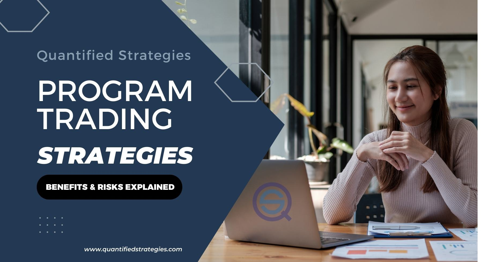

## Table of Contents

## What is program trading and how does it differ from traditional trading?

Program trading is when computers use special programs to buy and sell lots of stocks and other things quickly. These programs follow rules that people set up, and they can make trades in seconds. This kind of trading is used a lot by big companies and people who invest a lot of money. It's different because it uses computers to make decisions fast, instead of people thinking and deciding slowly.

Traditional trading is when people, not computers, make the decisions to buy and sell. Traders look at information, like news and numbers, and then decide what to do. This can take more time because people need to think and sometimes talk to others before they trade. The main difference is that traditional trading relies on human judgment and can be slower, while program trading is faster and uses computer rules.

## What are the basic components of a program trading strategy?

A program trading strategy has a few main parts that work together to make trades. First, there are the rules or algorithms that tell the computer what to do. These rules look at things like stock prices, how much stocks are going up or down, and other market information. The computer uses these rules to decide when to buy or sell. Second, there's the data that the computer uses. This includes numbers from the stock market, news, and other information that can affect stock prices. The computer needs this data to follow the rules and make good decisions.

Another important part is the trading platform or software that actually makes the trades happen. This software connects to the stock market and sends the buy and sell orders based on what the rules say. The last part is risk management. This means the strategy has ways to stop big losses if things go wrong. It might include setting limits on how much to buy or sell, or stopping trading if the market gets too wild. All these parts need to work well together for the program trading strategy to be successful.

## How do program trading strategies utilize algorithms?

Program trading strategies use algorithms to make quick decisions about buying and selling stocks. An algorithm is like a set of instructions that the computer follows. These instructions tell the computer what to do based on things like stock prices, how much the prices are changing, and other information from the market. For example, an algorithm might say to buy a stock if its price goes up by a certain amount, or to sell it if the price starts to drop quickly. By using these rules, the computer can make trades faster than a person could, which can be important in the fast-moving world of stock trading.

These algorithms are also smart because they can look at a lot of information at once. They can check many different stocks and market conditions to find the best times to trade. This means they can spot patterns or trends that might be hard for a person to see. Plus, algorithms can be set up to manage risk, like stopping trading if the market gets too crazy or if the strategy starts losing too much money. This helps keep the trading safe and can prevent big losses. So, algorithms are a key part of program trading because they make fast, smart decisions based on lots of data.

## What are the common types of program trading strategies used by beginners?

Beginners often start with simple program trading strategies that are easy to understand and set up. One common strategy is called "[momentum](/wiki/momentum) trading." This strategy looks at how fast a stock's price is going up or down. If a stock's price is going up quickly, the algorithm might decide to buy it, hoping the price will keep going up. If the price starts to fall fast, the algorithm might sell it to avoid losing money. Momentum trading is popular because it's simple and can work well in markets that are moving a lot.

Another strategy beginners might use is "mean reversion." This strategy believes that if a stock's price goes too high or too low, it will eventually come back to its normal level. So, if a stock's price is much higher than usual, the algorithm might sell it, expecting the price to drop back down. If the price is much lower than usual, the algorithm might buy it, expecting the price to go back up. Mean reversion can be a good way for beginners to start because it's based on the idea that prices don't stay extreme forever. Both of these strategies help beginners get used to how program trading works without needing too much complicated setup.

## How can one evaluate the performance of a program trading strategy?

To evaluate the performance of a program trading strategy, you need to look at some important numbers. One key number is the return, which shows how much money the strategy made. You compare this to how much money you started with to see if the strategy was successful. Another important number is the risk, which shows how much the strategy could lose. A good way to measure risk is by looking at the [volatility](/wiki/volatility-trading-strategies), which is how much the returns go up and down. You also want to look at the Sharpe ratio, which tells you if the returns are good compared to the risk. A higher Sharpe ratio means the strategy did well for the amount of risk it took.

Another way to evaluate a program trading strategy is by doing a backtest. This means you run the strategy on old market data to see how it would have done in the past. Backtesting can show you if the strategy would have made money or lost money in different market conditions. But remember, just because a strategy did well in the past doesn't mean it will do well in the future. So, it's also a good idea to test the strategy in a live market with a small amount of money first. This way, you can see how it performs in real time without risking too much. By looking at these numbers and doing these tests, you can get a good idea of how well your program trading strategy is working.

## What are the risks associated with program trading and how can they be mitigated?

Program trading can be risky because it uses computers to make quick decisions. One big risk is that the market can change fast, and the computer might not react in the right way. This can lead to big losses if the strategy doesn't work as expected. Another risk is that the algorithms might have mistakes or bugs that cause them to make bad trades. Also, if a lot of people are using the same strategy, it can make the market move in ways that are hard to predict, which can be dangerous.

To lower these risks, it's important to test the trading strategy a lot before using it for real. This means running the strategy on old data to see how it would have done in the past, and also trying it out with a small amount of money in the real market. It's also a good idea to have rules that stop trading if things start going wrong, like if the losses get too big. Keeping an eye on the strategy and updating it when needed can help make sure it keeps working well. By being careful and prepared, you can make program trading safer.

## How do advanced program trading strategies incorporate machine learning?

Advanced program trading strategies use [machine learning](/wiki/machine-learning) to make smarter decisions. Machine learning is like teaching a computer to learn from data, so it can find patterns and make predictions. In trading, this means the computer can look at lots of old stock prices, news, and other information to figure out what might happen next. Instead of just following simple rules, the computer can change its strategy based on what it learns. This can help the trading strategy work better because it can adapt to new market conditions.

For example, a machine learning model might spot that certain news stories often make stock prices go up or down. The computer can then use this knowledge to decide when to buy or sell. Another way machine learning helps is by figuring out which pieces of information are most important for making good trades. This can make the strategy more accurate and less risky. By using machine learning, advanced program trading strategies can be more flexible and effective, helping traders make better decisions in the fast-changing world of the stock market.

## What role does market data analysis play in developing effective program trading strategies?

Market data analysis is really important for making good program trading strategies. It's like looking at a lot of information about what's happening in the stock market, like stock prices, how much they're going up or down, and news that might affect them. By studying this data, you can find patterns and trends that can help you decide when to buy or sell. For example, if you see that a certain stock always goes up after a company announces good news, your trading strategy can use that information to make money.

Using market data well can also help you manage risk better. If you know how much the market usually moves around, you can set up your strategy to stop trading if things get too wild. This can keep you from losing too much money. Plus, by looking at a lot of data, you can test your strategy to see if it would have worked in the past. This helps you make it better before you use it for real. So, market data analysis is key to making a smart and safe program trading strategy.

## How do regulatory environments affect the implementation of program trading strategies?

Regulatory environments can have a big impact on how program trading strategies are used. Different countries have rules about what you can and can't do when trading stocks with computers. For example, some places might limit how much you can trade at once or require you to report your trades to make sure everything is fair and safe. These rules can make it harder to set up and run a program trading strategy because you need to make sure your strategy follows all the rules. If you don't, you could get in trouble or have to pay fines.

Because of these rules, people who use program trading need to keep up with changes in the law. They might need to change their strategies or use different tools to make sure they're following the rules. This can slow down the process of setting up a new strategy and might even limit how well it can work. But following the rules is important to keep the market safe and fair for everyone. So, understanding and working within the regulatory environment is a key part of using program trading successfully.

## What are the latest trends in program trading strategies among expert traders?

Expert traders are increasingly using [artificial intelligence](/wiki/ai-artificial-intelligence) (AI) and machine learning in their program trading strategies. These technologies help the computers learn from lots of data, like stock prices and news, to make better trading decisions. AI can find patterns that are hard for people to see, and it can change the trading strategy as the market changes. This makes the strategy more flexible and can help it make more money. Many expert traders also use something called "sentiment analysis," which looks at what people are saying on social media and news to guess how the market might move.

Another big trend is the use of high-frequency trading ([HFT](/wiki/high-frequency-trading-strategies)). This is when computers make a lot of trades very quickly, sometimes in just a few seconds. HFT tries to take advantage of small changes in stock prices to make small profits many times. Expert traders also focus more on risk management, using tools that can stop trading if things start going wrong. They're always trying to find new ways to predict the market better and manage their risks, which makes their program trading strategies more advanced and safer.

## How can one optimize a program trading strategy for different market conditions?

To optimize a program trading strategy for different market conditions, it's important to make the strategy flexible. This means the strategy should be able to change based on what's happening in the market. For example, if the market is moving a lot and prices are going up and down quickly, the strategy might need to trade less often to avoid big losses. On the other hand, if the market is calm and prices are stable, the strategy could trade more often to take advantage of small price changes. By using machine learning, the strategy can learn from past data and figure out what works best in different situations. This helps the strategy adapt and make better decisions no matter what the market is doing.

Another way to optimize a program trading strategy is by using different rules for different market conditions. For example, the strategy might use one set of rules when the market is going up and another set when it's going down. This can help the strategy make money in both good and bad market times. It's also important to keep testing and updating the strategy. By looking at how the strategy did in the past and trying it out in real time with a small amount of money, you can see what needs to be changed. This way, the strategy stays effective and can handle whatever the market throws at it.

## What advanced techniques are used to manage and scale program trading operations?

To manage and scale program trading operations, expert traders use advanced techniques like cloud computing. Cloud computing lets them use a lot of computer power without having to buy and set up their own machines. This means they can run their trading strategies faster and handle more trades at the same time. It also makes it easier to keep everything safe and working well, because the cloud service takes care of the technical stuff. Another technique is using something called "distributed computing," where the trading tasks are split up among many computers. This helps the strategy work even faster and can handle more data, making it better at finding good trading opportunities.

Another important technique is using advanced risk management tools. These tools help traders keep an eye on how much risk they're taking and can stop trading if things start going wrong. For example, they might use "stop-loss orders" that automatically sell a stock if its price drops too much. This can help prevent big losses. To scale up, traders also use "modular design" for their strategies. This means they build their strategies in smaller parts that can be changed or added to easily. This way, they can keep improving their strategies and make them work better as they grow their trading operations.

## References & Further Reading

[1]: Bergstra, J., Bardenet, R., Bengio, Y., & Kégl, B. (2011). ["Algorithms for Hyper-Parameter Optimization."](https://dl.acm.org/doi/10.5555/2986459.2986743) Advances in Neural Information Processing Systems 24.

[2]: ["Advances in Financial Machine Learning"](https://www.amazon.com/Advances-Financial-Machine-Learning-Marcos/dp/1119482089) by Marcos Lopez de Prado

[3]: ["Evidence-Based Technical Analysis: Applying the Scientific Method and Statistical Inference to Trading Signals"](https://www.amazon.com/Evidence-Based-Technical-Analysis-Scientific-Statistical/dp/0470008741) by David Aronson

[4]: ["Machine Learning for Algorithmic Trading"](https://github.com/stefan-jansen/machine-learning-for-trading) by Stefan Jansen

[5]: ["Quantitative Trading: How to Build Your Own Algorithmic Trading Business"](https://www.amazon.com/Quantitative-Trading-Build-Algorithmic-Business/dp/1119800064) by Ernest P. Chan