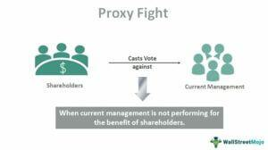

In finance and corporate governance, the dynamics of shareholder interaction and decision-making have evolved considerably. Traditional boardroom meetings, once the cornerstone of corporate interaction, have been complemented and sometimes replaced by novel concepts such as algorithmic trading. This shift presents both challenges and opportunities for stakeholders and investors alike, as the ability to adapt to these changes becomes increasingly essential.

Shareholder voting, proxy fights, corporate governance, and algorithmic trading represent interconnected elements that collectively reshape the corporate landscape. Shareholder voting empowers investors to influence company decisions, while proxy fights can significantly alter corporate governance structures. These events are not isolated; the rise of algorithmic trading introduces a level of complexity that can affect how these interactions play out in financial markets.



Technology, specifically the use of algorithms in trading, adds a new layer of efficiency and speed to trading activities. This technological advancement allows for more informed decision-making but also necessitates a deeper understanding of its implications on traditional governance practices. Recognizing the interplay between these components is crucial for anyone involved in finance—be it an investor seeking to leverage market opportunities or a corporate leader aiming to navigate governance challenges effectively.

Understanding these concepts is vital in today's rapidly changing financial environment. As these elements continue to influence one another, grasping their individual roles and collective impact is key to thriving in the corporate and financial sectors.

## Table of Contents

## Understanding Shareholder Voting and Proxy Fights

Shareholder voting is an essential component of corporate governance, enabling shareholders to exert influence over company decisions. It is typically exercised during annual general meetings (AGMs) or special meetings, where investors vote on matters such as the election of board members, approval of mergers and acquisitions, and other significant policy changes. The decision-making process is primarily grounded in the principle of "one share, one vote," although variations can exist depending on a company's share structure.

Proxy fights present a scenario where shareholders challenge the current board’s decisions and seek to implement change by leveraging their voting power. These conflicts can reshape a corporation’s future and are often centered around pivotal issues like the election of new board members, alterations to corporate policies, or shifts in strategic direction. When a proxy fight occurs, shareholders receive proxy statements that detail the proposals being contested and the arguments from both the challenging shareholders and the existing management.

The mechanics of a proxy fight involve intricate strategies aimed at rallying shareholder support and countering the resistance of the incumbent board. These strategies may include public campaigns to influence shareholder opinions, alliances with influential investor groups, and negotiations with stakeholders to gain backing. Successful proxy fights depend heavily on the ability to communicate effectively and sway shareholder sentiment.

Understanding proxy fights reveals the underlying power dynamics within a corporation. These battles illustrate the tension between management and shareholders, where the latter seek to hold the former accountable and ensure alignment with shareholder interests. This dynamic is a cornerstone of corporate governance, reflecting the balance of power between those who control the company and those who own it.

## The Role of Corporate Governance

Corporate governance is a framework that involves a set of rules, practices, and processes used to direct and control a company. It establishes the foundation for accountability, fairness, and transparency in the relationship between a corporation and its stakeholders, which include shareholders, management, customers, suppliers, financiers, government, and the community. Sound governance is pivotal in ensuring that a company functions efficiently, effectively, and within the bounds of legal and ethical standards.

Effective corporate governance plays a crucial role in achieving sustainable business growth. It nurtures an environment that fosters decision-making processes centered around long-term value creation rather than short-term gains. With well-structured governance, companies can mitigate risks, avert potential crises, and maintain investor confidence. For instance, transparent financial reporting and robust internal controls deter fraudulent activities, thus safeguarding a corporation's reputation and securing the trust of investors and other stakeholders.

Proxy fights emerge as a strategic mechanism to realign corporate governance. In scenarios where existing board members or company strategies do not resonate with the interests and expectations of shareholders, proxy fights provide a platform for change. Through these contests, shareholders can rally support to elect new board members who better align with their vision for the company. Such realignment can lead to shifts in corporate policy and strategy that may better reflect shareholder value objectives.

Strong corporate governance is integral to preventing corporate crises, as it instills a culture of ethical business operations and strategic foresight. By prioritizing accountability and fairness within managerial levels, companies are less likely to encounter conflicts of interest or engage in decisions that are detrimental to shareholder wealth. Therefore, corporate governance serves not only as a regulatory framework but also as a competitive advantage that enhances a company's operational resilience and market standing.

## Algorithmic Trading: A New Dimension

Algorithmic trading utilizes computer programs to execute trades based on pre-defined criteria, revolutionizing the financial markets with increased speed and efficiency. This technological advancement has significantly impacted the way trading is conducted, reducing the time and cost associated with transactions by automating the process. Automated systems can analyze vast amounts of data and execute orders in milliseconds, allowing traders to capitalize on even the smallest market movements.

The influence of [algorithmic trading](/wiki/algorithmic-trading) on shareholder voting and proxy fights is profound. Trading algorithms can swiftly adjust trading strategies in response to fluctuations in stock prices caused by corporate actions and shareholder activities, such as proxy fights. For example, if a proxy fight signals potential changes in a company's management or strategic direction, algorithmic trading systems may interpret such signals as indicators for future stock performance, leading to shifts in trading volumes and stock prices.

Algorithms are capable of identifying patterns and signals from corporate events. They can be programmed to evaluate data from annual reports, press releases, and news articles to predict how these events might affect a company's market value. This predictive ability can determine trading strategies by anticipating how corporate governance changes, such as the outcome of a proxy fight, might influence investor sentiment and market behavior.

Moreover, sophisticated algorithms are designed to optimize decision-making processes by integrating historical data with real-time information. For example, using [machine learning](/wiki/machine-learning) techniques, these systems can improve their predictive accuracy over time, learning from previous trades to refine their approach. In Python, a basic example of such an algorithmic trading strategy can be implemented using libraries like `pandas` for data manipulation and `scikit-learn` for machine learning:

```python
import pandas as pd
from sklearn.linear_model import LinearRegression

# Load historical stock data
data = pd.read_csv('stock_data.csv')
features = data[['Volume', 'Open', 'High', 'Low']]
target = data['Close']

# Train a simple linear regression model
model = LinearRegression()
model.fit(features, target)

# Predict the next closing price
predicted_close = model.predict([[volume, open_price, high, low]])
```

In integrating such technologies, it is crucial to consider regulatory frameworks that ensure the transparency and fairness of market operations. The rapid, automated nature of algorithmic trading can sometimes lead to volatile market conditions, highlighting the need for robust regulations to maintain market integrity. As algorithmic trading continues to evolve, its role in shaping financial markets, particularly through its impact on shareholder activities and corporate governance changes, is expected to grow.

## The Intersection of Proxies and Algorithmic Trading

Proxies in algorithmic trading extend beyond shareholder voting to encompass advanced decision-making processes. At their core, algorithmic proxies leverage sophisticated data analytics and machine learning algorithms to interpret and predict the outcomes of corporate events, such as mergers and acquisitions, based on proxy results. By analyzing vast datasets, these proxies can identify patterns and signals that suggest how a particular vote might sway or how corporate governance shifts may occur.

The use of algorithmic proxies in this context enables more precise predictions of market movements and enhances the ability of traders to swiftly exploit opportunities arising from corporate actions. For instance, an algorithm might assess proxy voting results along with other market indicators to decide on a trading strategy that positions a firm advantageously ahead of a merger decision. This predictive capacity is amplified by the speed and efficiency inherent in algorithmic trading platforms, which can execute trades within milliseconds as new information becomes available.

Moreover, the responsiveness of trading platforms to changes in corporate governance is crucial. Algorithms programmed with sophisticated financial models can adjust their trading parameters in real-time to reflect new governance structures or strategic directions determined by shareholder votes. This dynamic adaptability ensures that traders can react promptly and effectively to the outcomes of corporate voting, potentially optimizing their investment returns.

However, the integration of proxies in algorithmic trading underscores the necessity for robust regulatory frameworks. As these systems become more prevalent and complex, ensuring the integrity and fairness of market operations is paramount. Regulatory bodies must balance facilitating innovation with protecting market participants from manipulation or unfair practices. Clear guidelines and oversight mechanisms are essential to maintain market stability and investor confidence amid these technologically-driven changes. Thus, the blend of proxies and algorithmic trading presents opportunities and challenges, requiring vigilant regulation and responsible deployment.

## Case Studies and Real-world Impacts

The clash between Trian Fund Management and Procter & Gamble (P&G) serves as a quintessential example of a high-profile proxy fight with substantial implications for corporate governance. This confrontation began in 2017 when Nelson Peltz, founder of Trian Fund Management, sought a seat on P&G’s board, advocating for strategic changes aimed at rejuvenating the company's growth and financial performance. The campaign centered on proposals such as reorganizing business segments and cutting costs, which Trian argued would unlock shareholder value.

Despite P&G initially opposing Peltz's nomination, the proxy fight illustrated the significant influence of activist shareholders in demanding greater accountability and responsiveness from corporate management. Peltz's eventual appointment to the board, following one of the most expensive proxy battles in history, underscored the potential of shareholder activism to induce significant shifts in corporate policy and governance practices. This outcome not only highlighted the power dynamics within large corporations but also set a precedent for how shareholders could leverage their votes to instigate change.

Algorithmic trading played a noteworthy role in the context of such corporate disputes, influencing market perceptions and stock price [volatility](/wiki/volatility-trading-strategies). When activist campaigns such as Peltz’s gain traction, they often lead to fluctuations in stock prices as the market reacts to anticipated changes in corporate governance and strategic direction. Algorithms, designed to analyze and respond to news and market signals, may execute trades based on the evolving probabilities of events such as board appointments or policy shifts, adjusting positions as new information emerges.

These trading algorithms can assess factors like voting outcomes from proxy fights, enabling traders to preemptively position themselves based on the anticipated market response. For instance, if an algorithm detects increasing support for an activist-driven change, it might trigger buy or sell orders reflecting expected shifts in company valuation. This can lead to heightened market activity as traders seek to capitalize on the potential impacts of governance changes initiated through shareholder votes.

The interaction between shareholder activism and algorithmic trading thus illustrates a complex dynamic where market technology and corporate governance are interconnected. By analyzing real-world cases like the Trian Fund Management vs. P&G proxy fight, stakeholders gain insights into the broader implications of financial technology in shaping corporate landscapes. While shareholder activism has the potential to realign corporate priorities, the rapid response capabilities provided by algorithmic trading highlight the need for robust frameworks to manage the interplay between human-led decisions and technology-driven market movements.

## Conclusion

As technology advances, the interaction between shareholder activities and trading strategies is set to intensify, reflecting a paradigm shift in corporate finance. Understanding the interplay of proxy fights and corporate governance is essential for both investors and companies. Proxy fights, where shareholders use their voting rights to advocate for change, are fundamental to influencing company policies and compositions. These activities are deeply intertwined with corporate governance, which lays down the framework for accountability and transparency within organizations. By comprehensively understanding these dynamics, stakeholders can better advocate for strategies that align with their interests and uphold good governance standards.

Algorithmic trading plays a pivotal role in modern finance, markedly influencing shareholder decisions and shaping market perceptions. The use of sophisticated algorithms allows for rapid transaction execution and market trend analysis, facilitating quick responses to corporate governance changes and proxy fights. These algorithm-driven techniques enable traders to incorporate real-time data and predictive analytics, further shaping the decision-making landscape by impacting stock prices and trading volumes. As technology progresses, its role in influencing shareholder actions and market dynamics is expected to expand, creating an intricate interplay that stakeholders must comprehend.

Stakeholders, including investors and corporate leaders, need to remain aware of these evolving trends to successfully navigate the corporate landscape. Embracing technological advancements while staying informed about regulatory changes and market shifts will be crucial for adaptation and success. Moreover, as the financial ecosystem grows more complex with technological integration, developing strategies that leverage these advancements will play a critical role in ensuring sustained growth and stability. Staying vigilant and adaptable in understanding these trends will empower stakeholders to capitalize on opportunities and mitigate risks in this evolving financial milieu.

## References & Further Reading

[1]: Lopez de Prado, M. (2018). ["Advances in Financial Machine Learning"](https://www.amazon.com/Advances-Financial-Machine-Learning-Marcos/dp/1119482089). Wiley.

[2]: Aronson, D. R. (2006). ["Evidence-Based Technical Analysis: Applying the Scientific Method and Statistical Inference to Trading Signals"](https://www.amazon.com/Evidence-Based-Technical-Analysis-Scientific-Statistical/dp/0470008741). Wiley.

[3]: Jansen, S. (2020). ["Machine Learning for Algorithmic Trading"](https://github.com/stefan-jansen/machine-learning-for-trading). Packt Publishing.

[4]: Chan, E. P. (2008). ["Quantitative Trading: How to Build Your Own Algorithmic Trading Business"](https://github.com/egorpe/EPChan-QuantitativeTrading/blob/master/example7_6.m). Wiley.

[5]: Hu, G. X., & Noe, T. (2019). ["The Effect of Machine Based Responses on Proxy Fights"](https://www.sciencedirect.com/science/article/pii/S221128552030567X). Journal of Financial Economics.

[6]: Brunnermeier, M. K., & Pedersen, L. H. (2009). ["Market Liquidity and Funding Liquidity"](https://www.jstor.org/stable/30225714). Review of Financial Studies.

[7]: Kahan, M., & Rock, E. B. (2007). ["Hedge Funds in Corporate Governance and Corporate Control"](https://papers.ssrn.com/sol3/papers.cfm?abstract_id=919881). University of Pennsylvania Law Review.