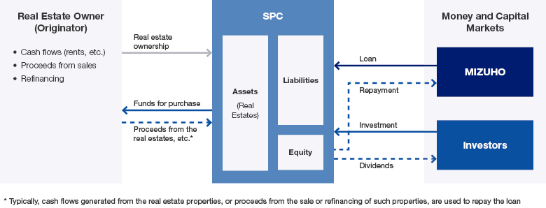

## Table of Contents

## What is real estate banking?

Real estate banking involves banks and financial institutions providing services related to property. This includes giving loans to people who want to buy homes, or to businesses that want to buy or develop properties. Banks also help with managing money for real estate projects, like construction or buying land. They look at the value of the property and decide how much money to lend based on that.

Banks make money from real estate banking by charging interest on the loans they give out. They also earn fees for services like helping to manage properties or advising on real estate investments. It's important for banks to be careful because if people can't pay back their loans, the bank might lose money. So, they check a lot of information before deciding to lend money for real estate.

## How does real estate banking differ from traditional banking?

Real estate banking is a special part of banking that focuses on properties, like homes and buildings. It's different from traditional banking, which deals with all kinds of money services, like savings accounts, checking accounts, and loans for cars or school. In real estate banking, banks give loans to people who want to buy houses or to companies that want to build or buy properties. They also help manage the money for these projects and make sure the properties are worth the loans they give out.

Traditional banking, on the other hand, is more general. It includes services that people use every day, like putting money into a savings account, using a debit card, or getting a loan for a car or to go to school. Traditional banks look at things like your income and credit score to decide if they will give you a loan. Real estate banking, though, looks closely at the property itself to see if it's a good investment and if the loan will be paid back.

Both types of banking are important, but they focus on different things. Real estate banking is all about properties and making sure the money used for them is safe and will be paid back. Traditional banking is about helping people and businesses manage their money in everyday ways, from saving to spending to borrowing.

## What are the basic financial products offered in real estate banking?

In real estate banking, one of the main financial products offered is the mortgage loan. This is a loan that people use to buy a house or property. The bank gives the money to buy the property, and the person who gets the loan pays it back over time, usually with interest. The house itself is used as security for the loan, which means if the person can't pay back the loan, the bank can take the house.

Another important product is the construction loan. This is a loan that businesses or developers use to build new properties or to fix up old ones. The bank gives money in stages as the work gets done, and the loan is paid back once the project is finished. This helps make sure the money is used properly and the project gets completed.

Real estate banking also includes lines of credit. These are like loans that businesses can use to buy or improve properties. They can take out money as they need it and only pay interest on the amount they use. This helps businesses manage their money better and grow their real estate projects.

## How do mortgages work in the context of real estate banking?

A mortgage is a loan that people use to buy a house or property. When someone wants to buy a home, they usually don't have all the money to pay for it right away. So, they go to a bank and ask for a mortgage. The bank gives them the money to buy the house, and in return, the person agrees to pay back the loan over time, usually many years. The bank charges interest on the loan, which is extra money the person has to pay. The house itself acts as security for the loan, which means if the person can't pay back the loan, the bank can take the house.

When someone gets a mortgage, they make monthly payments to the bank. Each payment is split into two parts: one part goes towards paying back the loan itself (this is called the principal), and the other part goes towards paying the interest. Over time, as the person keeps making payments, they own more and more of the house. This is called building equity. If they keep paying the mortgage on time, eventually they will own the house completely, and they won't have to make payments anymore.

## What role do real estate investment trusts (REITs) play in real estate banking?

Real estate investment trusts, or REITs, are companies that own or finance income-generating real estate. They play an important role in real estate banking by making it easier for people to invest in properties without having to buy them directly. When someone invests in a REIT, they are buying shares of the company, which then uses the money to buy, develop, or manage properties. This means people can earn money from real estate without the hassle of being a landlord or managing properties themselves.

REITs also help banks by providing another way to invest in real estate. Banks can lend money to REITs, which then use that money to buy more properties. This can be good for banks because it spreads out the risk. Instead of lending money to just one person or company for one property, they can lend to a REIT that owns many properties. This can make it safer for the bank because if one property doesn't do well, the others might still be making money. So, REITs help connect the world of banking with the world of real estate, making it easier for everyone to invest and grow.

## How are real estate loans structured and what are the common terms?

Real estate loans are structured based on the needs of the borrower and the type of property involved. The loan amount is usually a big part of the property's value, often up to 80% for a home. The rest, called the down payment, is paid by the borrower. The loan term, or how long the borrower has to pay back the loan, can be short, like 15 years, or longer, like 30 years. The [interest rate](/wiki/interest-rate-trading-strategies) can be fixed, meaning it stays the same over the life of the loan, or variable, meaning it can change. The monthly payment includes both the principal, which is the amount borrowed, and the interest, which is the cost of borrowing the money.

Common terms in real estate loans include the interest rate, which is the percentage of the loan amount that the borrower pays as the cost of borrowing. Another term is the loan-to-value ratio, which is the loan amount divided by the value of the property. This helps the bank decide how much to lend. Amortization is another important term, which means the process of paying off the loan over time through regular payments. The payments are set up so that over time, more of the payment goes towards the principal and less towards the interest. Lastly, there might be fees, like origination fees, which are charged by the bank for setting up the loan.

## What are the key risk factors in real estate banking that banks need to manage?

Banks that deal with real estate need to be careful about many things because there are a lot of risks. One big risk is that people might not pay back their loans. If someone loses their job or if the value of their house goes down, they might not be able to make their mortgage payments. This can be a big problem for the bank because they might have to take the house and sell it, but if the house is worth less than the loan, the bank could lose money. Another risk is that the real estate market can change a lot. If a lot of people want to buy houses, prices go up, but if fewer people want to buy, prices can fall. Banks need to keep an eye on these changes to make good decisions about lending money.

Another risk banks face is interest rate changes. If interest rates go up, it can make it harder for people to pay back their loans because their monthly payments might get bigger. Also, if the bank has a lot of money tied up in real estate loans and something goes wrong, like a big economic problem, it could be hard for the bank to get that money back quickly. Banks need to be careful about how much money they lend for real estate and make sure they have other ways to make money, too. By watching these risks closely and being ready to change their plans, banks can help keep their money safe and keep lending to people who need it.

## How does the securitization of real estate assets impact banking operations?

Securitization of real estate assets means turning loans, like mortgages, into securities that can be sold to investors. This helps banks because it lets them get money back from the loans they made without waiting for people to pay them back over many years. When banks sell these securities, they can use the money to make new loans. This makes it easier for banks to help more people buy homes or for businesses to start new projects. But, it also means banks need to be very careful about the quality of the loans they make because if the loans are bad, the securities might not be worth much, and investors could lose money.

Securitization can also make the real estate market more stable because it spreads the risk around. Instead of one bank holding all the risk from a bunch of loans, many investors share the risk. This can be good because if something goes wrong with one loan, it won't hurt the bank as much. But, it can also be risky because if a lot of loans start to fail at the same time, it can cause big problems for the whole economy. Banks need to keep a close watch on the loans they turn into securities and make sure they are following all the rules to keep everything safe and fair for everyone involved.

## What advanced financial instruments are used in real estate banking?

In real estate banking, one advanced financial instrument used is the mortgage-backed security (MBS). This is when a bank takes a bunch of mortgages and turns them into a security that can be sold to investors. The investors then get payments from the mortgages, which can be a good way to earn money from real estate without buying a house. MBS help banks because they can get money back from the loans faster, which lets them make new loans to other people. But, they need to be careful because if a lot of people can't pay their mortgages, the MBS could lose value, which would be bad for the investors.

Another advanced instrument is the commercial mortgage-backed security (CMBS). This works like MBS but for commercial properties, like office buildings or shopping centers. Banks use CMBS to turn loans for these big projects into securities that investors can buy. This can help businesses get money to build or buy properties, and it can help banks manage their money better. But, like with MBS, if the businesses can't pay back their loans, the CMBS could lose value, which is a risk for everyone involved. Both MBS and CMBS are important tools in real estate banking, but they need to be used carefully to keep the financial system safe.

## How do regulatory frameworks affect real estate banking practices?

Regulatory frameworks play a big role in how banks handle real estate banking. Governments and financial watchdogs set rules to make sure banks are lending money safely and fairly. These rules help stop banks from taking too many risks with real estate loans, which could hurt the economy if things go wrong. For example, banks have to check how much people can really afford to borrow and make sure they don't give out too many loans that might not get paid back. This helps keep the housing market stable and protects both the banks and the people borrowing money.

Also, regulations make sure banks are clear about the terms of their loans. They have to tell people exactly what they're getting into, like how much interest they'll pay and what happens if they can't pay back the loan. This helps people make better choices about buying homes and keeps banks honest. Sometimes, these rules can make it harder for banks to lend money quickly or to as many people, but they're important for keeping the whole system safe and fair for everyone.

## What are the current trends and innovations in real estate banking?

One big trend in real estate banking is the use of technology to make things easier and faster. Banks are using digital tools to help people apply for loans online, without having to go to a bank branch. This is called digital mortgage processing, and it can make buying a house quicker and less stressful. Another new thing is using data and computer programs to figure out how much a house is worth or how likely someone is to pay back their loan. This helps banks make better decisions and can make loans safer for everyone.

Another trend is focusing on green and sustainable real estate. More people want to live in homes that are good for the environment, so banks are starting to offer special loans for these kinds of properties. These loans might have lower interest rates or other benefits to encourage people to buy or build green homes. Banks are also looking at ways to help with projects that make neighborhoods better, like fixing up old buildings or building new parks. This can help make communities stronger and more attractive places to live.

## How can banks optimize their real estate banking strategies to maximize returns and minimize risks?

Banks can optimize their real estate banking strategies by focusing on careful loan underwriting. This means they should check the borrower's ability to pay back the loan and the value of the property very closely. By doing this, banks can lower the chances of people not paying back their loans. Another way to optimize is by using technology to make the loan process faster and easier for customers. Digital tools can help banks process loans quicker and reach more people, which can lead to more business and higher returns. Also, banks should keep an eye on the real estate market and be ready to change their strategies if the market changes a lot.

Another important strategy is to diversify their real estate loan portfolio. This means banks should not put all their money into one type of property or one area. By lending to different kinds of properties and in different places, banks can spread out the risk. If one type of property or one area does badly, the bank won't lose as much money. Banks can also use advanced financial instruments like mortgage-backed securities to get money back from loans faster and make new loans. But they need to be very careful with these instruments and make sure they are following all the rules to keep everything safe and fair.

## References & Further Reading

[1]: Lopez de Prado, Marcos. ["Advances in Financial Machine Learning"](https://www.amazon.com/Advances-Financial-Machine-Learning-Marcos/dp/1119482089). Wiley, 2018.

[2]: Chan, Ernest P. ["Quantitative Trading: How to Build Your Own Algorithmic Trading Business"](https://github.com/ftvision/quant_trading_echan_book). Wiley, 2008.

[3]: Aronson, David. ["Evidence-Based Technical Analysis: Applying the Scientific Method and Statistical Inference to Trading Signals"](https://www.amazon.com/Evidence-Based-Technical-Analysis-Scientific-Statistical/dp/0470008741). Wiley, 2006.

[4]: Jansen, Stefan. ["Machine Learning for Algorithmic Trading"](https://github.com/stefan-jansen/machine-learning-for-trading). Packt Publishing, 2020.

[5]: Bennett, Drew D., and Dixon, Michael J. ["Real Estate Investment Trusts and Volatility Prediction"](https://www.jstor.org/stable/44103282). Journal of Real Estate Portfolio Management, 2015.