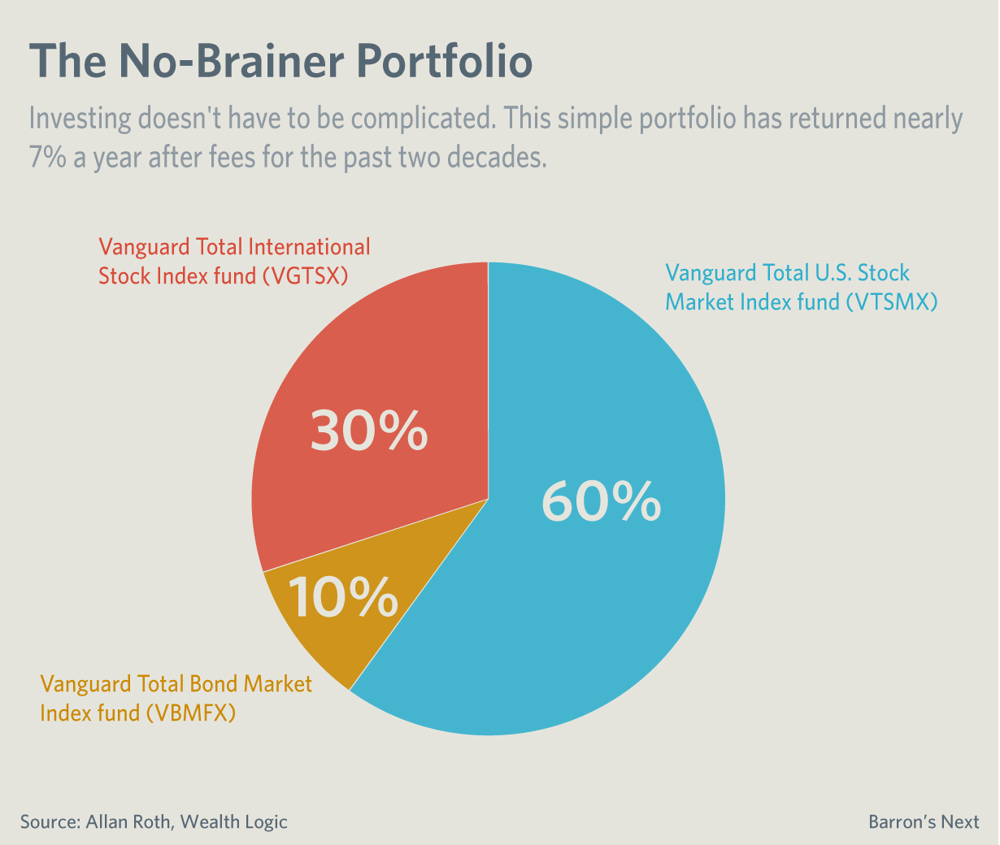

## Table of Contents

## What are Vanguard Index Funds?

Vanguard Index Funds are a type of investment that tracks the performance of a specific market index, like the S&P 500. This means they try to match the returns of the index they follow, rather than trying to beat it. They are managed by Vanguard, a well-known investment company. People like index funds because they usually have lower costs and are easier to manage than other types of investments.

These funds are popular because they offer a simple way to invest in a broad range of stocks or bonds. Instead of picking individual stocks, you can buy into an index fund and own a small piece of many companies at once. This can help spread out risk, which is good for people who want a safer way to invest their money. Plus, because they are passively managed, the fees are often much lower than those of actively managed funds.

## How do Vanguard Index Funds work?

Vanguard Index Funds work by trying to copy the performance of a specific market index, like the S&P 500. This means they buy the same stocks or bonds that are in the index, in the same amounts. When the index goes up, the fund goes up too, and when the index goes down, the fund goes down as well. This is different from other funds where managers try to pick stocks they think will do better than the market. With Vanguard Index Funds, there's no guessing or trying to beat the market; they just aim to match it.

These funds are managed by Vanguard, a big company that's known for keeping costs low. Because Vanguard Index Funds are designed to follow an index, they don't need a lot of people to manage them, which means the fees are usually smaller than other types of funds. When you invest in a Vanguard Index Fund, you're buying a little bit of all the companies in the index. This can be a good way to spread out your risk because if one company does badly, it won't hurt your whole investment as much. Plus, it's easier to manage because you don't have to keep track of lots of different stocks yourself.

## What is the difference between an index fund and an actively managed fund?

An index fund tries to match the performance of a specific market index, like the S&P 500. It does this by buying the same stocks or bonds that are in the index, in the same amounts. This means the fund goes up and down with the index. Index funds are usually cheaper to own because they don't need a lot of people to manage them. They are a good choice for people who want a simple way to invest in a broad range of stocks or bonds without trying to beat the market.

An actively managed fund, on the other hand, has managers who try to pick stocks or bonds they think will do better than the market. These managers are always buying and selling to try to get the best returns. Because of this, actively managed funds usually cost more because you're paying for the managers' time and expertise. Some people like actively managed funds because they think the managers can find good investments that will make more money, but it's not always easy to beat the market.

In short, index funds are about matching the market and keeping costs low, while actively managed funds are about trying to beat the market but often come with higher fees. Both types of funds have their place, and it depends on what you're looking for in an investment.

## What are the benefits of investing in Vanguard Index Funds?

Investing in Vanguard Index Funds has several benefits. One big benefit is that they are usually cheaper than other types of funds. This is because they don't need a lot of people to manage them. They just copy the performance of a market index, like the S&P 500. When you pay less in fees, more of your money stays in your pocket and can grow over time. Another benefit is that they help you spread out your risk. Instead of [picking](/wiki/asset-class-picking) one or two stocks, you get a piece of many companies all at once. This can make your investment safer because if one company does badly, it won't hurt your whole investment as much.

Another advantage of Vanguard Index Funds is that they are easy to manage. You don't need to spend a lot of time watching the market or picking stocks. Once you invest in an index fund, it pretty much takes care of itself. This can be a big relief for people who don't want to be active investors but still want to grow their money. Plus, because Vanguard is a well-known company, you can feel more secure knowing your money is in good hands. Overall, Vanguard Index Funds offer a simple, cost-effective way to invest in the market and build wealth over time.

## How do you choose the right Vanguard Index Fund for your investment goals?

Choosing the right Vanguard Index Fund for your investment goals depends on what you want to achieve with your money. If you're looking to grow your money over a long time, you might want to pick a fund that tracks a broad stock market index like the S&P 500. This can give you a good chance of [earning](/wiki/earning-announcement) higher returns over many years, but remember that stocks can go up and down a lot in the short term. If you need your money to be safer and don't mind earning less, you might choose a bond index fund. These funds usually don't grow as much as stock funds, but they also don't lose as much value when the market goes down.

Another thing to think about is how much risk you're comfortable with. If big ups and downs in your investment make you nervous, you might want to pick a fund that's a mix of stocks and bonds. This can help smooth out the bumps in the market. Vanguard has many different index funds, so you can find one that matches your comfort level with risk. It's also a good idea to think about how long you plan to keep your money invested. If you're saving for something far in the future, like retirement, you can take on more risk with stock funds. But if you need the money sooner, you might want to be more careful and choose funds with less risk.

Lastly, consider the fees of the Vanguard Index Fund. Even small differences in fees can add up over time, so it's smart to pick a fund with low costs. Vanguard is known for keeping their fees low, but it's still worth checking which fund has the lowest fees for the type of investment you want. By thinking about your goals, how much risk you can handle, and the fees, you can choose the right Vanguard Index Fund to help you reach your financial dreams.

## What are the costs associated with Vanguard Index Funds?

Vanguard Index Funds are known for having low costs. The main cost you'll see is the expense ratio, which is a small percentage of your investment that Vanguard charges each year to manage the fund. For example, the expense ratio for the Vanguard S&P 500 Index Fund (VFIAX) is just 0.04%. This means if you have $10,000 invested, you'll pay about $4 a year in fees. These low expense ratios are one of the reasons people like Vanguard Index Funds; they help you keep more of your money working for you.

There might be other small costs, too, like trading fees if you're buying or selling shares of the fund. But Vanguard often has low or no trading fees, especially if you use their online platform. Another cost to think about is the bid-ask spread if you're buying or selling shares of a Vanguard [ETF](/wiki/etf-trading-strategies). This is the difference between the price someone is willing to sell the ETF for and the price someone is willing to buy it for. But these costs are usually very small, and Vanguard works hard to keep them low so you can focus on growing your investment.

## How does the mechanics of buying and selling Vanguard Index Funds work?

Buying and selling Vanguard Index Funds is easy and can be done through Vanguard's website or through a brokerage account. If you're using Vanguard's website, you'll need to open an account first. Once you have an account, you can pick the index fund you want to buy, like the Vanguard S&P 500 Index Fund. Then, you decide how much money you want to invest and place your order. The price you pay is based on the fund's net asset value (NAV), which is calculated at the end of each trading day. When you want to sell, you just tell Vanguard how many shares you want to get rid of, and they'll sell them at the end-of-day NAV.

If you're using a brokerage account, the process is similar but you might have to pay a small trading fee. You log into your brokerage account, search for the Vanguard Index Fund you want, and place your buy or sell order. The price you get will be the NAV at the end of the trading day, just like with Vanguard's website. It's important to remember that buying and selling shares of a mutual fund like a Vanguard Index Fund happens at the end of the trading day, not right away like with stocks or ETFs. This makes it a bit different but still pretty straightforward.

## What is the role of the expense ratio in Vanguard Index Funds?

The expense ratio in Vanguard Index Funds is like a small fee you pay every year for the fund to be managed. It's shown as a percentage of the money you have invested in the fund. For example, if a fund has an expense ratio of 0.04% and you have $10,000 invested, you'll pay about $4 a year. This fee is taken out of the fund's assets, so it affects how much your investment grows over time. Vanguard is known for keeping these fees really low, which is one reason why their index funds are popular.

A lower expense ratio means more of your money stays in your investment, which can make a big difference over many years. Even small differences in fees can add up, so choosing a fund with a low expense ratio can help your money grow faster. Vanguard works hard to keep their costs down so that investors like you can keep more of their returns. This makes Vanguard Index Funds a good choice for people who want to save on fees and still get a good return on their investment.

## How does rebalancing affect Vanguard Index Funds?

Rebalancing is when you adjust your investments to keep them in line with your goals. For Vanguard Index Funds, rebalancing means making sure you still have the right mix of stocks and bonds or different types of funds. If one part of your investment grows more than the others, you might need to sell some of it and buy more of the other parts to get back to your original plan. This helps keep your risk level the same over time.

For example, if you started with 60% of your money in a stock index fund and 40% in a bond index fund, but the stock fund did really well and now it's 70% of your investment, you might sell some of the stock fund and buy more of the bond fund to get back to 60/40. Rebalancing can help you stick to your investment strategy and manage risk, but it can also mean you have to pay some small fees or taxes when you buy and sell. Still, it's an important part of keeping your investments on track with what you want to achieve.

## What are the tax implications of investing in Vanguard Index Funds?

When you invest in Vanguard Index Funds, you need to think about taxes. One thing to know is that these funds can create capital gains, which are profits you make when you sell your shares for more than you paid for them. If you hold your shares for more than a year, you'll pay a lower tax rate on these gains, called long-term capital gains tax. But if you sell your shares within a year, you'll pay a higher rate, known as short-term capital gains tax. Also, Vanguard Index Funds might pay out dividends, which are parts of the company's profits. These dividends can be taxed as regular income or at a lower rate, depending on the type of dividend.

Another tax thing to consider is that Vanguard Index Funds might have to sell stocks or bonds inside the fund to keep it balanced with the index it follows. When they do this, it can create capital gains for the fund itself, and these gains get passed on to you as the investor. This is called a capital gains distribution, and you'll have to pay taxes on it even if you didn't sell any of your shares. But Vanguard is good at keeping these taxes low by doing things like using a method called tax-managed investing. This means they try to buy and sell in a way that reduces the tax you have to pay. Overall, while there are taxes to think about, Vanguard works hard to keep them as low as possible so you can keep more of your money.

## How does Vanguard ensure the tracking accuracy of its index funds?

Vanguard makes sure its index funds closely follow the indexes they are supposed to by carefully choosing and buying the right mix of stocks or bonds that make up the index. They use computers and special methods to keep the fund's holdings as close as possible to the index. This is called "tracking error," and Vanguard works hard to keep this error very small. They do this by trading often enough to keep up with changes in the index, but not so much that it costs a lot in fees.

Vanguard also pays attention to things like dividends and corporate actions, like mergers or splits, that can affect the index. They make sure the fund reflects these changes quickly and accurately. By doing all these things, Vanguard helps make sure that when you invest in one of their index funds, your investment goes up and down just like the index it's tracking. This gives you a good chance to get the same returns as the market, without the high costs of trying to beat it.

## What advanced strategies can be used with Vanguard Index Funds for portfolio optimization?

One advanced strategy for optimizing a portfolio with Vanguard Index Funds is called asset allocation. This means deciding how much of your money to put into different types of investments, like stocks and bonds, to match your goals and how much risk you're okay with. You might start with a mix of 60% in stock index funds and 40% in bond index funds. Over time, as the stock market goes up and down, you can rebalance your portfolio to keep this mix. This can help you manage risk and maybe get better returns. Another part of this strategy is to use tax-efficient funds, like Vanguard's tax-managed funds, to keep your taxes low.

Another strategy is called dollar-cost averaging. This means you put a set amount of money into your Vanguard Index Funds at regular times, like every month. This can help smooth out the ups and downs of the market because you're buying more shares when prices are low and fewer when prices are high. Over time, this can lead to a lower average cost for your shares. You can also use this strategy with different funds to spread out your investments even more. By doing this, you can build a strong, balanced portfolio that grows over time without trying to guess what the market will do next.

## References & Further Reading

[1]: ["The Little Book of Common Sense Investing: The Only Way to Guarantee Your Fair Share of Stock Market Returns"](https://www.amazon.com/Little-Book-Common-Sense-Investing/dp/1119404509) by John C. Bogle

[2]: ["Advances in Financial Machine Learning"](https://www.amazon.com/Advances-Financial-Machine-Learning-Marcos/dp/1119482089) by Marcos Lopez de Prado

[3]: ["Quantitative Trading: How to Build Your Own Algorithmic Trading Business"](https://www.amazon.com/Quantitative-Trading-Build-Algorithmic-Business/dp/1119800064) by Ernest P. Chan

[4]: ["Algorithmic and High-Frequency Trading"](https://www.cambridge.org/us/universitypress/subjects/mathematics/mathematical-finance/algorithmic-and-high-frequency-trading) by Álvaro Cartea, Sebastian Jaimungal, and José Penalva

[5]: ["The Index Revolution: Why Investors Should Join It Now"](https://www.amazon.com/Index-Revolution-Investors-Should-Join/dp/1119313074) by Charles D. Ellis