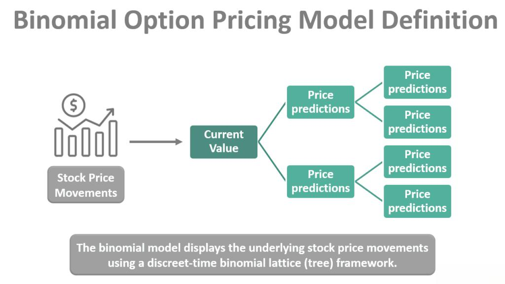

The options market plays a crucial role in financial trading by offering mechanisms for hedging, speculation, and managing financial risk. Options are derivative instruments that derive their value from an underlying asset, such as stocks, indices, or commodities. These contracts grant holders the right, but not the obligation, to buy (call option) or sell (put option) the underlying asset at a specified price known as the strike price, before or on a certain date termed the expiration date. As such, the options market is fundamental for investors seeking to capitalize on market movements or to secure their portfolios against volatility.

Options pricing is a pivotal aspect for traders and investors as it determines the premium paid for the option contract. The premium reflects the intrinsic value and the time value of the option, where the intrinsic value is the difference between the underlying asset's price and the strike price, and the time value accounts for the probability of the option gaining additional intrinsic value before expiry. Accurate pricing is critical for making informed trading decisions and identifying profitable opportunities.

Financial modeling in the context of options pricing involves the use of quantitative techniques and mathematical models to estimate and forecast the fair value of options. These models consider several factors including the price of the underlying asset, volatility, time to expiration, and interest rates. They are instrumental in assessing risk and informing trading strategies.

Algorithmic trading, driven by sophisticated algorithms and high-speed data analysis, has transformed the landscape of modern finance. This approach allows traders to automate and execute a multitude of trades at speeds and volumes unattainable through traditional trading methods, leveraging complex pricing models for decision-making.

Among the various techniques for options pricing, the binomial option pricing model stands out for its simplicity and effectiveness. Developed by Cox, Ross, and Rubinstein in 1979, the binomial model adopts a discrete-time framework to approximate the price of options through a series of potential future price movements of the underlying asset. It simulates possible paths the asset price could take until expiration, calculating option values at each point and working backward through the tree to ascertain the option's present value.

The binomial model offers considerable benefits, including intuitive structure and adaptable framework for American options which can be exercised any time up to expiration. Its application in financial modeling and algo trading has empowered investors to make better-informed decisions and optimize their trading strategies in real-time environments. As financial markets evolve, further development of algorithms incorporating advanced options pricing models like the binomial approach is anticipated, promising enhanced accuracy and efficiency in trading operations.

## Table of Contents

## Understanding Options Pricing

Options are derivative securities that provide the buyer the right, but not the obligation, to purchase or sell an underlying asset at a predetermined price on or before a specified date. These financial instruments are integral in markets as they offer versatile strategies for managing financial risks and leveraging investment positions. 

A standard options contract is defined by three key terms: the strike price, the expiration date, and the premium. The strike price is the fixed price at which the holder can buy (in the case of a call option) or sell (in the case of a put option) the underlying asset. The expiration date is the deadline by which the option must be exercised, after which it ceases to exist. The premium is the price paid by the buyer to the seller (also known as the option writer) to acquire the option.

Options pricing is of critical importance because it enables investors to value these contracts under various market conditions. Proper valuation assists in optimal decision-making related to hedging, speculation, and portfolio allocation. For example, through options contracts, traders can hedge against potential losses in their portfolios by securing positions on moves in underlying asset prices. Moreover, by strategically employing options, investors can leverage their investments, potentially amplifying returns while simultaneously managing risks.

Various options pricing models help in estimating the fair value of an options contract. Some of the most widely used models in the financial industry include the Black-Scholes model, the binomial option pricing model, and the Monte Carlo simulation. Each model uses distinct methodologies to account for factors such as [volatility](/wiki/volatility-trading-strategies), interest rates, and the time until expiration, which influence an option's price. 

The Black-Scholes model, introduced in the early 1970s, is predominantly used for pricing European options and is known for its closed-form solution, which assumes constant volatility and interest rates. Conversely, the binomial model involves a discrete-time framework that models price movements as a series of potential up or down steps over time, thus accommodating the valuation of American options which can be exercised at any time before expiration.

Understanding these models is pivotal for traders and investors focused on crafting strategies that optimize options use in their portfolios. These tools not only assist in accurate pricing but also facilitate better risk assessment and strategic planning in response to dynamic market conditions.

## Financial Modeling for Options Pricing

Financial modeling for options pricing is a critical aspect of modern financial analysis, enabling traders and investors to make informed decisions in the options market. This process involves various techniques and models designed to assess the fair price of options based on numerous influencing factors.

One of the primary variables in options pricing is volatility, which measures the degree of variation in the price of the underlying asset over time. Higher volatility typically leads to higher option premiums, as the uncertainty increases the potential for significant price movement. Interest rates also play a significant role; they affect the cost of carrying the underlying asset, which influences options prices. Additionally, factors such as the time remaining until expiration, the current price of the underlying asset, and the specific characteristics of the option (e.g., American vs. European) are crucial.

Several models have been developed to price options, each with its own merits and application scenarios. The Black-Scholes model is one of the most famous continuous-time models. It assumes a log-normal distribution of asset prices and uses partial differential equations to derive the option price. This model, however, is best suited for European options and does not accommodate the exercise feature of American options.

Another widely used approach is the binomial option pricing model. This model uses a discrete-time framework to estimate the price of options by simulating different potential price paths of the underlying asset. By creating a binomial tree, this model accounts for the possibility of early exercise, making it suitable for both American and European options. Unlike the Black-Scholes model, which outputs a single price, the binomial model provides a range of potential prices based on different scenarios.

When selecting a model for options pricing, market participants must consider several key factors. The characteristics of the option—such as expiration and exercise style—dictate the appropriateness of a particular model. Market conditions like [liquidity](/wiki/liquidity-risk-premium) and volatility also influence the choice. For instance, in highly volatile markets, models that incorporate changing volatility, such as the GARCH (Generalized Autoregressive Conditional Heteroskedasticity) model, might be preferred. On the other hand, in stable market environments, simpler models might suffice for accuracy and speed.

In conclusion, financial modeling is indispensable for accurate options pricing. Different models offer varied advantages depending on the market conditions and specific features of the options in question. While the Black-Scholes model is beneficial for European options under specific assumptions, the binomial model's flexibility makes it advantageous for a broader range of option types and market scenarios. The selection of an option pricing model should always be informed by the characteristics of both the option and the prevailing market dynamics.

## The Binomial Option Pricing Model

The binomial option pricing model is a mathematical approach used to evaluate options by constructing a simplified representation of possible price movements of an asset over time. This model was introduced by John Cox, Stephen Ross, and Mark Rubinstein in 1979. It presents an intuitive framework for pricing options through discrete-time processes, often serving as a precursor to the more complex Black-Scholes model.

The binomial model simulates option pricing by envisioning the price of the underlying asset as capable of moving to one of two possible outcomes in each time step: moving up or down. This creates a binomial tree, where each node represents a possible price of the underlying asset at a given point in time. By working backward from the expiration date, the model calculates the option's value at each node, eventually arriving at the present option price.

### Step-by-Step Guide to Constructing a Binomial Pricing Model

1. **Define Parameters**: Begin by establishing the model's parameters, including the current stock price ($S_0$), the strike price (K), the risk-free interest rate (r), the option's expiration time (T), the volatility ($\sigma$), and the number of time steps (N).

2. **Time Increment**: Calculate the time increment $\Delta t$ as $T/N$.

3. **Price Movement Factors**: Determine the up ($u$) and down ($d$) movement factors:
$$
   u = e^{\sigma \sqrt{\Delta t}}

$$
$$
   d = \frac{1}{u}

$$

4. **Risk-neutral Probability**: Calculate the risk-neutral probability $p$ that the price will move up:
$$
   p = \frac{e^{r \Delta t} - d}{u - d}

$$

5. **Calculate Stock Prices**: Construct the binomial tree by calculating the possible stock prices at each node. For each time step $i$ and movement sequence $j$:
$$
   S_{i,j} = S_0 \cdot u^j \cdot d^{i-j}

$$

6. **Option Value at Expiration**: Compute the option's payoff at expiration for each possible stock price:
$$
   C_{i,j} = \max(S_{i,j} - K, 0) \quad \text{for call options}

$$

7. **Backwards Induction for Option Pricing**: Starting from the final time step, calculate the option's value at each previous node using the expectation of future payoffs:
$$
   C_{i,j} = e^{-r \Delta t} \cdot (p \cdot C_{i+1,j+1} + (1-p) \cdot C_{i+1,j})

$$

8. **Present Option Price**: The option's value at the initial node ($i = 0$, $j = 0$) gives the price of the option.

### Advantages and Limitations

**Advantages**:
- **Flexibility**: The binomial model accommodates American-style options, which can be exercised at any time before expiration, unlike the Black-Scholes model which is designed for European-style options.
- **Intuitive Framework**: It provides an intuitive approach to understanding how option prices are derived based on discrete-time stock price movements.
- **Adjustable Precision**: Increasing the number of steps (N) enhances accuracy and converges towards continuous-time models like Black-Scholes.

**Limitations**:
- **Complexity with Increased Steps**: Greater computational effort is required for high precision, as the number of calculations grows exponentially with the number of steps.
- **Simplified Assumptions**: The assumptions of constant volatility and risk-free rates may not hold in real-market environments, affecting the model's effectiveness.
- **Computational Limitations**: As N increases, the calculations become more demanding, potentially requiring sophisticated computational resources for large models.

The binomial model remains a fundamental tool for financial professionals, facilitating better understanding and decision-making in options trading environments.

## Algorithmic Trading and Options Pricing

Algorithmic trading is a method of executing orders using automated pre-programmed trading instructions, accounting for variables such as time, price, and [volume](/wiki/volume-trading-strategy). The system's primary objective is to trade more efficiently and effectively than a human trader. With advancements in technology, [algorithmic trading](/wiki/algorithmic-trading) has become crucial in modern financial markets, especially in the options markets where speed and precision are key. 

Options markets involve buying and selling options, which are financial derivatives that give the buyer the right, but not the obligation, to buy or sell an underlying asset at a predetermined price on or before a specific date. To efficiently manage these transactions, algorithmic trading incorporates complex options pricing models to determine the fair value of options and to identify profitable trading opportunities.

Algorithms in trading strategies often use options pricing models like the Black-Scholes model or the Binomial Option Pricing Model. These models help in estimating the theoretical value of options contracts based on factors such as volatility, interest rates, and the price of the underlying asset. For example, the binomial model uses a discrete-time framework, allowing traders to create a multi-period model for pricing options. This is achieved by simulating multiple stages in the life of an option, where the price of the underlying asset can move up or down at each stage.

One key benefit of using algorithms in options trading is the ability to process vast amounts of market data in real time, facilitating rapid decision-making. Algorithms can analyze multiple sources of information simultaneously, providing insights that are impossible to achieve manually. Additionally, algorithmic trading minimizes the risk of human errors, reduces transaction costs, and optimizes trading strategies for maximum return with minimal risk.

Implementing binomial and other pricing models in algorithmic trading, however, presents challenges. One significant issue is ensuring that the model remains accurate and relevant under varying market conditions, as financial markets are inherently volatile and unpredictable. Furthermore, while the binomial model is easy to implement for single-period options, its complexity increases with multi-period options, which can strain computational resources. Maintaining a balance between model complexity and computational efficiency is critical.

Incorporating the binomial option pricing model in algorithmic trading requires high-performance computing solutions given the model's iterative nature over multiple time periods. Efficient coding practices, possibly like implementing algorithms in compiled languages such as C++ or leveraging parallel computing capabilities in Python, can help overcome these computational challenges. As technology progresses, further innovations are expected to refine the integration of sophisticated option pricing models, including the binomial model, into algorithmic trading frameworks, enhancing the accuracy and scope of automated trading strategies.

## Integrating Binomial Models in Algo Trading

Integrating binomial models into algorithmic trading systems offers substantial technical benefits and challenges that require careful consideration. The binomial option pricing model, based on a discrete-time lattice approach, provides a detailed framework for assessing the price of options by simulating potential future movements in an underlying asset's price. This model is built on the assumption of a recombining price tree where at each node, the asset price can move up or down until the option's expiration.

**Technical Considerations for Integration**  
When incorporating the binomial model into trading algorithms, several technical factors must be addressed. First and foremost, the computational efficiency of the algorithm is critical. While the binomial model can compute option prices with precision, the nature of algorithmic trading demands rapid calculations. This necessitates the optimization of the model’s implementation to minimize latency and enhance execution speed. The choice of programming language and algorithm structure, such as vectorization in Python or utilizing efficient data handling libraries like NumPy, plays a significant role in achieving this efficiency.

Additionally, the structure of the binomial tree must be adaptable to fit real-time data feeds. The dynamic nature of markets means that inputs such as volatility and interest rates must be updated in real-time, requiring the trading algorithm to recalibrate rapidly and accurately. This necessitates a robust integration with data sources to ensure the latest market conditions are reflected in the binary tree calculations.

**Case Studies of Successful Implementations**  
Some successful implementations showcase the adaptability and accuracy of binomial models within trading algorithms. For instance, quant trading firms have integrated binomial models to optimize option pricing in fast-moving markets, achieving superior pricing accuracy compared to simpler models such as Black-Scholes. These firms often employ hybrid models that leverage the binomial structure for short-maturity options and Monte Carlo simulations for long-dated options where path dependency becomes significant.

**Performance Analysis in Various Market Conditions**  
The performance of binomial-driven algorithms varies subject to market volatility and liquidity. In stable market conditions, the binomial model provides precise pricing with minimal computational burden. However, during volatile periods, the model's recalibration needs can become frequent, increasing the computational load. Adaptive algorithms that selectively use the binomial model under different market conditions have shown promise, thereby enabling efficient resource allocation.

Moreover, the model's performance is influenced by the depth of the binomial tree used. A deeper tree, while offering greater accuracy, also demands more computational power. Striking a balance between depth and speed is essential, and [machine learning](/wiki/machine-learning) algorithms are increasingly employed to determine optimal tree configurations in real-time based on current and predicted market movements.

**Future Prospects and Innovations**  
Looking ahead, the integration of binomial models in algorithmic trading is poised for further evolution with advancements in computational technology and data science techniques. Quantum computing, albeit in its nascent stages, holds the potential to radically enhance the speed and precision of binomial calculations, allowing for even deeper and more complex tree structures to be calculated instantaneously. Furthermore, the incorporation of machine learning can enhance the binomial model's predictive capabilities, aiding in the real-time adjustment of tree parameters based on market sentiment analysis from large-scale data.

In conclusion, the integration of binomial models into algorithmic trading systems leverages their structured approach to option pricing while posing a number of technical and operational challenges. The continuous evolution of computational technologies and incorporation of AI techniques will likely expand their utility and applicability across various trading strategies.

## Conclusion

Options pricing and financial modeling are integral components of the modern financial ecosystem, acting as key drivers of innovation and efficiency in trading strategies. Options, with their inherent leverage and risk management characteristics, necessitate precise and dynamic pricing models to provide accurate valuations. Among these models, the binomial option pricing model stands out for its intuitive structure and its applicability in various market scenarios. The binomial model provides a framework wherein options pricing is viewed through a discrete-time process, mapping potential future asset prices through a multi-period tree lattice. This is especially relevant today as trading strategies require adaptability to rapid market changes.

The relevance of the binomial model in contemporary trading strategies cannot be understated. Its simplicity allows for quick computations which are beneficial in real-time trading environments. Additionally, the model’s adaptability makes it suitable for American options, offering advantages in early exercise scenarios. As algorithmic trading continues to advance, the integration of rigorous and reliable pricing models like the binomial model becomes vital. Algorithms can leverage such models to not only execute trades more effectively but also to manage risk with precision, reflecting the true value of options dynamically.

Looking forward, the evolution of algorithmic trading is likely to incorporate more advanced options pricing models that build on the strengths of the binomial approach, such as integrating elements of [artificial intelligence](/wiki/ai-artificial-intelligence) and machine learning. These technologies have the potential to enhance predictive accuracy and model efficiency, addressing existing limitations of classical models and enriching algorithms with capabilities for deeper market analysis and automated decision-making. Future developments might include the use of quantum computing to further optimize these processes, presenting new frontiers for speed and complexity handling that existing systems are limited by.

In conclusion, the synergy between financial modeling and algorithmic trading is shaping the future of finance, offering unprecedented opportunities for growth and innovation. Financial professionals are continually exploring new methodologies and technologies to respond to the demands of increasingly complex financial markets. The binomial option pricing model, with its historic and ongoing impact, exemplifies the profound influence that robust financial modeling can have on trading strategies. As the field advances, the integration of sophisticated models into algorithmic environments will undoubtedly redefine efficiency and accuracy in financial markets.

## References & Further Reading

[1]: Cox, J. C., Ross, S. A., & Rubinstein, M. (1979). ["Option Pricing: A Simplified Approach"](https://www.sciencedirect.com/science/article/pii/0304405X79900151). Journal of Financial Economics, 7(3), 229-263.

[2]: Hull, J.C. (2006). ["Options, Futures, and Other Derivatives"](https://www.semanticscholar.org/paper/Options%2C-Futures%2C-and-Other-Derivatives-Hull/89bdee500c8623864fc9eb7a471546aa713acc44). Prentice Hall.

[3]: Black, F., & Scholes, M. (1973). ["The Pricing of Options and Corporate Liabilities"](https://www.jstor.org/stable/1831029). Journal of Political Economy, 81(3), 637-654.

[4]: Haug, E. G. (2007). ["The Complete Guide to Option Pricing Formulas"](https://www.amazon.com/Complete-Guide-Option-Pricing-Formulas/dp/0786312408). McGraw-Hill.

[5]: Wilmott, P. (2006). ["Paul Wilmott Introduces Quantitative Finance"](https://www.wiley.com/en-us/Paul+Wilmott+Introduces+Quantitative+Finance,+2nd+Edition-p-9781118836798). Wiley.

[6]: Jarrow, R., & Turnbull, S. (1996). ["Derivative Securities."](https://archive.org/details/derivativesecuri0000jarr) South-Western College Publishing.