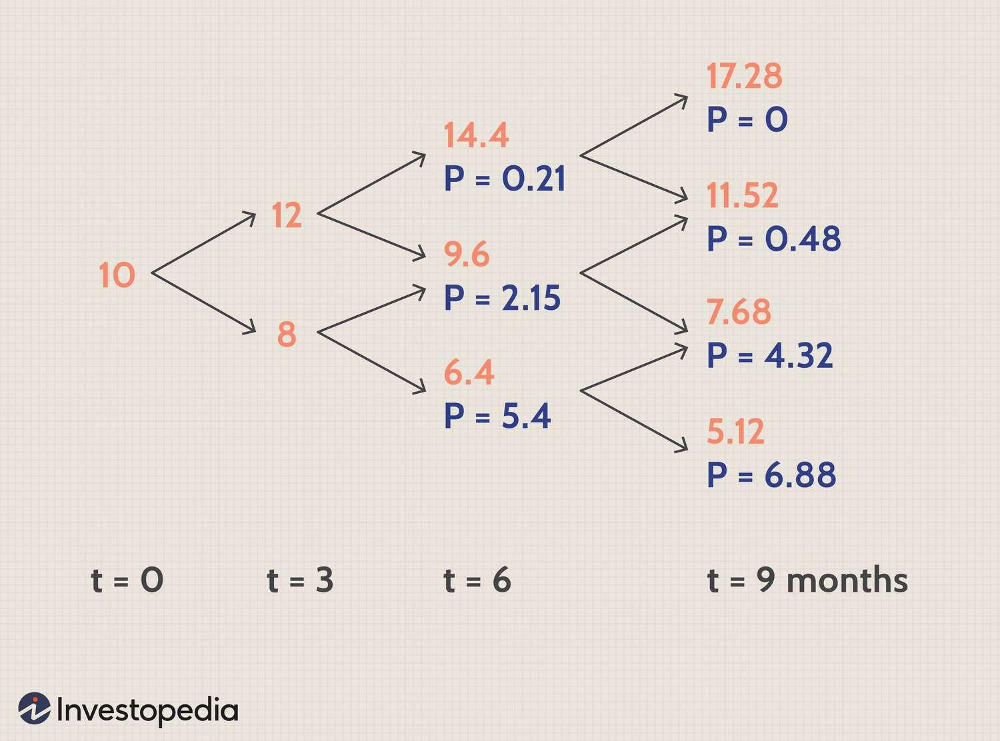

## Table of Contents

## What is the Binomial Option Pricing Model?

The Binomial Option Pricing Model is a way to figure out how much an option is worth. It breaks down the time until the option expires into smaller steps, like a series of yes or no decisions. Imagine you're flipping a coin at each step. If it's heads, the price of the stock goes up a bit. If it's tails, the price goes down a bit. By looking at all the possible paths the stock price could take, you can calculate the option's value at the end and work backward to find its value today.

This model is helpful because it's easy to understand and use, even if you're not a math expert. You can adjust the model to fit different situations by changing how much the stock price might go up or down with each step, and how many steps there are until the option expires. While it's a simpler method compared to some other models, it's still very useful for making decisions about buying or selling options.

## How does the Binomial Option Pricing Model differ from other option pricing models?

The Binomial Option Pricing Model is different from other models like the Black-Scholes Model because it's simpler and more flexible. The Binomial Model works by breaking down the time until an option expires into smaller steps. At each step, the stock price can either go up or down, kind of like flipping a coin. This lets you look at all the different ways the stock price could move over time. On the other hand, the Black-Scholes Model uses a math formula that assumes the stock price follows a normal distribution and doesn't break it down into steps. This makes the Black-Scholes Model harder to understand and use, especially for people who aren't good at math.

Another big difference is that the Binomial Model can handle things that the Black-Scholes Model can't. For example, if a company is about to pay a dividend, the Binomial Model can take that into account at the right time, while the Black-Scholes Model can't do this easily. Also, the Binomial Model is better at pricing American options, which can be exercised before they expire. The Black-Scholes Model is really made for European options, which can only be exercised at expiration. So, the Binomial Model is more flexible and can be used in more situations, making it a good choice for many investors and traders.

## What are the basic assumptions of the Binomial Option Pricing Model?

The Binomial Option Pricing Model works by assuming that the price of a stock can only move up or down at each step until the option expires. It's like flipping a coin at each step, where heads means the stock price goes up by a certain amount, and tails means it goes down by a certain amount. This model also assumes that you can borrow and lend money at a risk-free rate, which is the rate you'd get from a super safe investment like a government bond. It also assumes that you can buy and sell the stock without any costs like fees or taxes, and that you can do this as many times as you want.

Another important assumption is that the stock doesn't pay any dividends during the time until the option expires, unless you specifically include dividends in the model. The model also assumes that everyone knows all the important information about the stock and the market, so there are no surprises. This means that the price movements are based on chance, not on new information coming out. These assumptions make the Binomial Model simpler to use, but they also mean it might not always match the real world perfectly.

## Can you explain the concept of a binomial tree in the context of option pricing?

A binomial tree is a way to show how the price of a stock might change over time when you're trying to figure out the value of an option. Imagine you're drawing a tree that starts with one point at the bottom, which is the current price of the stock. From this point, the tree splits into two branches: one where the stock price goes up a little bit, and another where it goes down a little bit. Each of these new points then splits again into two more branches, and this keeps happening until you reach the end of the time period you're looking at, which is when the option expires. Each step in the tree represents a small amount of time passing, and the whole tree shows all the different paths the stock price could take.

By looking at the binomial tree, you can see all the possible prices the stock could be at when the option expires. You then work backward from the end of the tree to the beginning, figuring out the value of the option at each step. If it's a call option, you look at how much the option would be worth if the stock price is higher than the option's strike price. If it's a put option, you look at how much it would be worth if the stock price is lower than the strike price. By calculating the value of the option at each point on the tree and moving back to the start, you can find out what the option is worth right now. This method helps you understand how the option's value changes with the stock price and time, making it easier to decide if you should buy or sell the option.

## How is the price of an option calculated using the Binomial Option Pricing Model?

The Binomial Option Pricing Model calculates the price of an option by breaking down the time until the option expires into smaller steps, like a tree with branches. At each step, the stock price can either go up or down a bit. Imagine you're drawing this tree starting with the current stock price at the bottom. Each time you move up a step, the stock price goes up, and each time you move down a step, the stock price goes down. By the time you reach the end of the tree, which is when the option expires, you'll have many different possible stock prices. You then figure out what the option would be worth at each of these end points. For a call option, you look at how much the stock price is above the strike price. For a put option, you look at how much the stock price is below the strike price.

Once you know the value of the option at the end of the tree, you work backward to find its value today. At each step, you calculate the option's value as a weighted average of the values of the two branches that come next. You use the risk-free [interest rate](/wiki/interest-rate-trading-strategies) to figure out how much to discount these future values back to the present. This process continues all the way back to the start of the tree, where you find the current value of the option. This method helps you see how the option's value changes with the stock price and time, making it easier to decide if you should buy or sell the option.

## What is the role of risk-neutral valuation in the Binomial Option Pricing Model?

Risk-neutral valuation is a key part of the Binomial Option Pricing Model. It's a way to figure out the value of an option by pretending that everyone in the market is okay with taking risks. In this pretend world, people don't care if the stock price goes up or down because they can balance their risks perfectly. This makes it easier to calculate the option's value because you don't have to worry about how much risk people are willing to take. Instead, you use the risk-free interest rate, which is the rate you'd get from a super safe investment like a government bond, to figure out what the option is worth today.

In the Binomial Model, you use risk-neutral valuation by working backward through the tree of possible stock prices. At each step, you calculate the option's value as a weighted average of the values of the two branches that come next, using the risk-free interest rate to discount these future values back to the present. This method helps you see how the option's value changes with the stock price and time, making it easier to decide if you should buy or sell the option. By using risk-neutral valuation, the Binomial Model simplifies the math and makes it easier to understand and use, even if you're not a math expert.

## How do you determine the up and down movements in a binomial tree?

In a binomial tree, the up and down movements represent how the stock price might change at each step. To figure out these movements, you need to decide on two things: the size of the up move, often called "u," and the size of the down move, often called "d." The up move "u" is usually set as a number a bit bigger than 1, like 1.1, which means the stock price goes up by 10% at that step. The down move "d" is set as a number a bit smaller than 1, like 0.9, meaning the stock price goes down by 10% at that step. These numbers are often based on how much the stock price typically moves up or down over a short time, like a day or a week.

Once you have "u" and "d," you also need to figure out the chance that the stock price will go up or down at each step. In a risk-neutral world, this chance is called the "risk-neutral probability" and is usually written as "p." To find "p," you use the risk-free interest rate, which is the rate you'd get from a super safe investment like a government bond. The formula to find "p" is a bit tricky, but it makes sure that the expected return on the stock matches the risk-free rate. This way, you can calculate the value of the option by working backward through the tree, using "p" to weigh the possible future values of the option at each step.

## What is the significance of the number of steps in a binomial tree?

The number of steps in a binomial tree is important because it affects how accurate your option pricing will be. More steps mean the tree is more detailed and can show more possible paths the stock price might take. Imagine you're drawing a picture: with more steps, your picture gets clearer and more like the real thing. This means that using more steps can make your option price closer to what it would be in the real world, especially if the stock price moves a lot or if the option is close to expiring.

However, using more steps also makes the math harder and takes more time to calculate. If you use too few steps, your option price might not be very accurate, but it's quick and easy to figure out. So, you have to find a balance. For most people, using around 10 to 50 steps is a good middle ground. It gives you a pretty accurate option price without making the calculations too hard. As you get better at using the binomial model, you can play around with the number of steps to see what works best for your needs.

## How can the Binomial Option Pricing Model be used to price American options?

The Binomial Option Pricing Model is really helpful for pricing American options because these options can be used before they expire. In the model, you draw a tree that shows how the stock price might go up or down over time. At each step of the tree, you look at the option's value if you keep it until the next step, and also what it would be worth if you used it right then. If the option's value from using it now is higher than keeping it, you would use the option at that step. This way, you can find out the best time to use the American option, which makes the model really useful for these kinds of options.

To figure out the price of an American option, you work backward through the tree, starting from the end where the option expires. At each step, you compare the option's value if you keep it versus if you use it right away. You use the risk-free interest rate to figure out what these future values are worth today. By doing this at every step and moving back to the start of the tree, you find out what the American option is worth right now. This method helps you see how the option's value changes with the stock price and time, making it easier to decide if you should buy or sell the option.

## What are the limitations of the Binomial Option Pricing Model?

The Binomial Option Pricing Model is helpful, but it has some downsides. One big problem is that it can take a lot of time to calculate if you use a lot of steps. The more steps you use, the more accurate your option price will be, but it also means more work. This can be a hassle, especially if you need to figure out the price quickly. Also, the model assumes that the stock price can only go up or down by a certain amount at each step, which might not match how stock prices really move in the real world.

Another limitation is that the model's results can be sensitive to the numbers you choose for the up and down movements and the risk-free interest rate. If you pick the wrong numbers, your option price might not be very accurate. The model also assumes that you can buy and sell the stock without any costs like fees or taxes, which isn't true in real life. These assumptions can make the model less useful for some situations. Even with these limitations, the Binomial Option Pricing Model is still a good tool for many people trying to figure out option prices.

## How can the Binomial Option Pricing Model be extended to include dividends?

The Binomial Option Pricing Model can be changed to include dividends by adjusting the stock price at certain steps in the tree. Dividends are payments that a company makes to its shareholders, and they can affect the stock price. When a company pays a dividend, the stock price usually goes down by the amount of the dividend on the day it's paid. So, in the model, you can lower the stock price at the step where the dividend is paid. This makes the model more realistic because it takes into account how dividends affect the stock price and the option's value.

To do this, you need to know when the dividend will be paid and how much it will be. At the step in the tree where the dividend is paid, you reduce the stock price by the dividend amount for both the up and down branches. Then, you continue building the tree and calculating the option's value as usual, but with these adjusted stock prices. This way, the model can give you a more accurate price for the option, especially if the option is an American option that can be used before it expires. Including dividends makes the model more useful for real-world situations where companies often pay dividends to their shareholders.

## What advanced techniques can be used to improve the accuracy of the Binomial Option Pricing Model?

One way to make the Binomial Option Pricing Model more accurate is by using more steps in the tree. The more steps you use, the closer your option price will be to what it would be in the real world. This is because more steps let you see more of the possible ways the stock price could move. But, using a lot of steps can make the math harder and take longer to figure out. So, you have to find a balance between how accurate you want your option price to be and how much time and effort you want to spend.

Another way to improve the model is by using something called the "trinomial tree" instead of a regular binomial tree. A trinomial tree has three branches at each step instead of two, which means the stock price can go up, stay the same, or go down. This gives you a more detailed picture of how the stock price might move, which can make your option price more accurate. You can also use what's called "Monte Carlo simulation" with the binomial model. This means you run the model many times with different random paths for the stock price and then average the results. This can help you get a better idea of what the option might be worth, especially if the stock price moves in a way that's hard to predict.

## What is the Binomial Option Pricing Model?

The binomial option pricing model is a mathematical approach used to evaluate options by constructing a simplified representation of possible price movements of an asset over time. This model was introduced by John Cox, Stephen Ross, and Mark Rubinstein in 1979. It presents an intuitive framework for pricing options through discrete-time processes, often serving as a precursor to the more complex Black-Scholes model.

The binomial model simulates option pricing by envisioning the price of the underlying asset as capable of moving to one of two possible outcomes in each time step: moving up or down. This creates a binomial tree, where each node represents a possible price of the underlying asset at a given point in time. By working backward from the expiration date, the model calculates the option's value at each node, eventually arriving at the present option price.

### Step-by-Step Guide to Constructing a Binomial Pricing Model

1. **Define Parameters**: Begin by establishing the model's parameters, including the current stock price ($S_0$), the strike price (K), the risk-free interest rate (r), the option's expiration time (T), the volatility ($\sigma$), and the number of time steps (N).

2. **Time Increment**: Calculate the time increment $\Delta t$ as $T/N$.

3. **Price Movement Factors**: Determine the up ($u$) and down ($d$) movement factors:
$$
   u = e^{\sigma \sqrt{\Delta t}}

$$
$$
   d = \frac{1}{u}

$$

4. **Risk-neutral Probability**: Calculate the risk-neutral probability $p$ that the price will move up:
$$
   p = \frac{e^{r \Delta t} - d}{u - d}

$$

5. **Calculate Stock Prices**: Construct the binomial tree by calculating the possible stock prices at each node. For each time step $i$ and movement sequence $j$:
$$
   S_{i,j} = S_0 \cdot u^j \cdot d^{i-j}

$$

6. **Option Value at Expiration**: Compute the option's payoff at expiration for each possible stock price:
$$
   C_{i,j} = \max(S_{i,j} - K, 0) \quad \text{for call options}

$$

7. **Backwards Induction for Option Pricing**: Starting from the final time step, calculate the option's value at each previous node using the expectation of future payoffs:
$$
   C_{i,j} = e^{-r \Delta t} \cdot (p \cdot C_{i+1,j+1} + (1-p) \cdot C_{i+1,j})

$$

8. **Present Option Price**: The option's value at the initial node ($i = 0$, $j = 0$) gives the price of the option.

### Advantages and Limitations

**Advantages**:
- **Flexibility**: The binomial model accommodates American-style options, which can be exercised at any time before expiration, unlike the Black-Scholes model which is designed for European-style options.
- **Intuitive Framework**: It provides an intuitive approach to understanding how option prices are derived based on discrete-time stock price movements.
- **Adjustable Precision**: Increasing the number of steps (N) enhances accuracy and converges towards continuous-time models like Black-Scholes.

**Limitations**:
- **Complexity with Increased Steps**: Greater computational effort is required for high precision, as the number of calculations grows exponentially with the number of steps.
- **Simplified Assumptions**: The assumptions of constant volatility and risk-free rates may not hold in real-market environments, affecting the model's effectiveness.
- **Computational Limitations**: As N increases, the calculations become more demanding, potentially requiring sophisticated computational resources for large models.

The binomial model remains a fundamental tool for financial professionals, facilitating better understanding and decision-making in options trading environments.

## References & Further Reading

[1]: Cox, J. C., Ross, S. A., & Rubinstein, M. (1979). ["Option Pricing: A Simplified Approach"](https://www.sciencedirect.com/science/article/pii/0304405X79900151). Journal of Financial Economics, 7(3), 229-263.

[2]: Hull, J.C. (2006). ["Options, Futures, and Other Derivatives"](https://www.semanticscholar.org/paper/Options%2C-Futures%2C-and-Other-Derivatives-Hull/89bdee500c8623864fc9eb7a471546aa713acc44). Prentice Hall.

[3]: Black, F., & Scholes, M. (1973). ["The Pricing of Options and Corporate Liabilities"](https://www.jstor.org/stable/1831029). Journal of Political Economy, 81(3), 637-654.

[4]: Haug, E. G. (2007). ["The Complete Guide to Option Pricing Formulas"](https://www.amazon.com/Complete-Guide-Option-Pricing-Formulas/dp/0786312408). McGraw-Hill.

[5]: Wilmott, P. (2006). ["Paul Wilmott Introduces Quantitative Finance"](https://www.wiley.com/en-us/Paul+Wilmott+Introduces+Quantitative+Finance,+2nd+Edition-p-9781118836798). Wiley.

[6]: Jarrow, R., & Turnbull, S. (1996). ["Derivative Securities."](https://archive.org/details/derivativesecuri0000jarr) South-Western College Publishing.