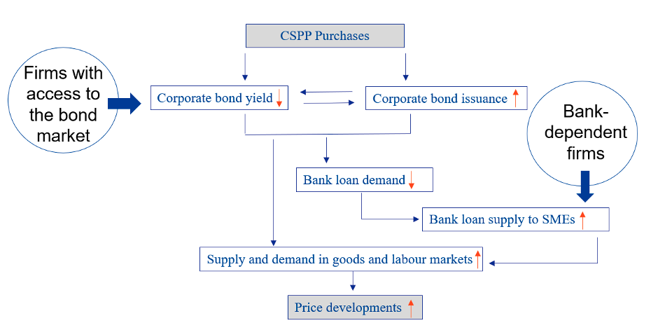

## Table of Contents

## What is an unlimited bond purchase?

An unlimited bond purchase is when a central bank, like a country's main financial authority, decides to buy as many bonds as needed without setting a limit. This is often done to help the economy during tough times. By buying bonds, the central bank puts more money into the economy, which can help businesses and people borrow and spend more easily.

This kind of action is also called "quantitative easing." It's used when normal ways of helping the economy, like lowering interest rates, aren't working well enough. By buying bonds, the central bank can lower long-term interest rates, making it cheaper for people and businesses to borrow money. This can help boost spending and investment, which can help the economy grow.

## Why do central banks engage in unlimited bond purchases?

Central banks engage in unlimited bond purchases to help the economy when it's struggling. When the economy is not doing well, people might not spend or invest as much. This can make things worse. By buying bonds without a limit, the central bank can put more money into the economy. This extra money can help businesses and people borrow more easily, which can lead to more spending and investment. This is important because more spending and investment can help the economy grow again.

Sometimes, just lowering interest rates isn't enough to fix the economy. That's when central banks use unlimited bond purchases, also known as quantitative easing. By buying bonds, the central bank can lower long-term interest rates. When long-term interest rates are lower, it's cheaper for people and businesses to borrow money for big things like houses or new factories. This can help get the economy moving again by encouraging more spending and investment.

## What is the mechanism behind unlimited bond purchases?

When a central bank does unlimited bond purchases, it means they buy government or other types of bonds without setting a limit on how many they will buy. They do this by creating new money electronically. This new money is used to pay for the bonds they buy from banks and other financial institutions. When the central bank buys these bonds, it gives the sellers money, which increases the amount of money in the economy.

This increase in money can help the economy in a few ways. First, it can lower interest rates because when the central bank buys bonds, it pushes up the price of bonds. When bond prices go up, their interest rates, or yields, go down. Lower interest rates make it cheaper for people and businesses to borrow money. This can encourage them to spend more on things like houses, cars, or new business projects. More spending can help the economy grow. So, by doing unlimited bond purchases, the central bank tries to help the economy when it's not doing well.

## How does an unlimited bond purchase affect the economy?

When a central bank does an unlimited bond purchase, it puts more money into the economy. This happens because the central bank creates new money to buy the bonds. When banks and other financial institutions sell their bonds to the central bank, they get this new money. This increase in money supply can help the economy because it makes it easier for people and businesses to borrow. When borrowing is easier, people might spend more on things like houses or cars, and businesses might invest in new projects. More spending and investment can help the economy grow.

Also, unlimited bond purchases can lower interest rates. When the central bank buys bonds, it makes the price of bonds go up. When bond prices go up, the interest rates, or yields, on those bonds go down. Lower interest rates mean it's cheaper for people and businesses to borrow money. This can encourage more spending and investment, which is good for the economy. By doing unlimited bond purchases, the central bank tries to help the economy when it's struggling and normal ways of helping, like lowering interest rates, aren't working well enough.

## What are the potential risks associated with unlimited bond purchases?

Unlimited bond purchases can lead to inflation. When a central bank buys a lot of bonds, it puts more money into the economy. If there's too much money chasing too few goods, prices can go up. This is called inflation. If inflation gets too high, it can make it hard for people to afford things, and it can hurt the economy.

Another risk is that it can make people worry about the central bank's ability to control the economy. If people think the central bank is just printing money without a plan, they might lose trust in the bank and the currency. This can lead to more problems, like people not wanting to hold onto the currency, which can make the economy unstable.

Also, unlimited bond purchases can create bubbles in the economy. When interest rates are very low because of these purchases, people might borrow a lot of money to buy things like houses or stocks. If too many people do this, it can create bubbles where prices go up a lot but are not based on real value. When these bubbles burst, it can lead to big problems in the economy, like a financial crisis.

## Can you explain the historical context of unlimited bond purchases?

Unlimited bond purchases became more common after the 2008 financial crisis. Many countries, like the United States, the United Kingdom, and Japan, faced big economic problems. Normal ways of helping the economy, like lowering interest rates, were not working well enough. So, central banks started buying bonds without setting a limit on how many they would buy. This was called "quantitative easing." The goal was to put more money into the economy and lower long-term interest rates to help businesses and people borrow and spend more easily.

Since then, unlimited bond purchases have been used in other tough times too. For example, during the COVID-19 pandemic in 2020, many central banks used this tool again to help their economies. They wanted to stop the economy from getting worse because of the virus. By buying bonds without a limit, they hoped to keep money flowing and help people and businesses through a hard time. While this has helped in some ways, it has also made some people worry about risks like inflation and economic bubbles.

## What are some notable case studies of unlimited bond purchases?

One notable case of unlimited bond purchases happened in the United States after the 2008 financial crisis. The Federal Reserve, which is the central bank of the U.S., started buying bonds without a limit to help the economy. They did this because the usual way of helping, like lowering interest rates, was not working well enough. By buying bonds, the Federal Reserve put more money into the economy and helped lower long-term interest rates. This made it easier for people and businesses to borrow money and spend more, which helped the economy recover over time. 

Another important case was in Japan. The Bank of Japan started doing unlimited bond purchases in the early 2000s and continued to use this tool in later years. Japan had been struggling with a slow economy for a long time, and the central bank hoped that buying bonds without a limit would help. By doing this, they wanted to put more money into the economy and lower interest rates to encourage people and businesses to spend and invest more. This was a big part of their plan to help the economy grow again, even though it faced challenges like high government debt and low inflation.

## How do unlimited bond purchases influence inflation?

Unlimited bond purchases can lead to more inflation. When a central bank buys a lot of bonds, it creates new money to pay for them. This puts more money into the economy. If there's too much money chasing the same amount of goods and services, prices can go up. This is what we call inflation. If inflation gets too high, it can make things more expensive for people and businesses, which can be bad for the economy.

However, not all unlimited bond purchases lead to high inflation. It depends on how much money is already in the economy and how fast the economy is growing. If the economy is not growing very fast, the extra money from bond purchases might not cause a big jump in prices. Central banks try to balance this by watching the economy closely and adjusting their actions to keep inflation under control. They want to help the economy without causing too much inflation.

## What is the impact of unlimited bond purchases on interest rates?

When a central bank does unlimited bond purchases, it usually makes interest rates go down. This happens because when the central bank buys a lot of bonds, it pushes up the price of those bonds. When bond prices go up, the interest rates, or yields, on those bonds go down. Lower interest rates mean it's cheaper for people and businesses to borrow money. This can help the economy by encouraging more spending and investment.

But, unlimited bond purchases can also affect interest rates in other ways. If people start to worry about inflation because of all the new money being put into the economy, they might want higher interest rates to protect their money. This can make long-term interest rates go up, even if the central bank is trying to keep them low. So, while unlimited bond purchases usually lower interest rates, it's not always simple, and other things can change how it works.

## How do unlimited bond purchases affect currency value?

When a central bank does unlimited bond purchases, it can make the country's currency weaker. This happens because the central bank is putting more money into the economy. When there's more money around, people might think the currency is not as valuable. Also, if other countries see that a central bank is printing a lot of money, they might not want to hold onto that currency as much. This can make the currency go down in value compared to other currencies.

But, it's not always that simple. Sometimes, if the economy starts to do better because of the bond purchases, people might want to invest in that country more. This can make the currency stronger. It depends on a lot of things, like how the economy is doing and what other countries are doing with their money. So, unlimited bond purchases can make the currency weaker, but it can also have other effects depending on what's happening in the world.

## What are the long-term implications of unlimited bond purchases on financial markets?

When central banks do unlimited bond purchases over a long time, it can change how financial markets work. More money in the economy from these purchases can make people and businesses borrow more easily. This can push up prices of things like stocks and real estate because more people can afford to buy them. But, if prices go up too fast, it can create bubbles. Bubbles are when prices are much higher than what things are really worth. When these bubbles burst, it can cause big problems in the financial markets, like a crash or a crisis.

Also, unlimited bond purchases can make people worry about inflation. If there's too much money around, prices of goods and services can go up. This can make investors nervous and change how they invest. They might want higher returns to keep up with inflation, which can make interest rates go up even if the central bank is trying to keep them low. This can make borrowing more expensive and slow down the economy. So, while unlimited bond purchases can help in the short term, they can also create challenges for financial markets in the long run.

## How do different economic theories interpret the effects of unlimited bond purchases?

Different economic theories have different ideas about how unlimited bond purchases affect the economy. Some economists who follow Keynesian theory think that unlimited bond purchases can help a lot when the economy is in trouble. They believe that when central banks buy bonds and put more money into the economy, it can encourage people and businesses to spend and invest more. This can help the economy grow again, especially when normal ways of helping, like lowering interest rates, aren't working well enough.

On the other hand, economists who follow the monetarist theory might worry more about the risks of unlimited bond purchases. They think that putting too much money into the economy can lead to high inflation. If there's too much money chasing too few goods, prices can go up a lot. Monetarists might say that central banks need to be careful and not just print money without a good plan, or it could cause problems like people losing trust in the currency.

Some economists who follow the Austrian school of thought might be even more worried. They think that unlimited bond purchases can create big problems in the long run. They believe that when central banks interfere too much in the economy, it can lead to bubbles in things like housing or stocks. When these bubbles burst, it can cause a financial crisis. Austrian economists might argue that it's better to let the economy fix itself without too much help from the central bank.

## References & Further Reading

[1]: Bernanke, B. S. (2009). ["The Federal Reserve's Balance Sheet."](https://www.federalreserve.gov/newsevents/speech/bernanke20091008a.htm) Speech at the Federal Reserve Bank of Richmond.

[2]: Krishnamurthy, A., & Vissing-Jorgensen, A. (2011). ["The Effects of Quantitative Easing on Interest Rates: Channels and Implications for Policy."](https://www.brookings.edu/wp-content/uploads/2016/07/2011b_bpea_krishnamurthy.pdf) Brookings Papers on Economic Activity.

[3]: Hendershott, T., Jones, C. M., & Menkveld, A. J. (2011). ["Does Algorithmic Trading Improve Liquidity?"](https://onlinelibrary.wiley.com/doi/full/10.1111/j.1540-6261.2010.01624.x) Journal of Financial Markets, 14(1), 1-46.

[4]: Gagnon, J., Raskin, M., Remache, J., & Sack, B. (2011). ["The Financial Market Effects of the Federal Reserve's Large-Scale Asset Purchases."](https://www.ijcb.org/journal/ijcb11q1a1.pdf) International Journal of Central Banking, 7(1), 3-43.

[5]: Aizenman, J., Chinn, M. D., & Ito, H. (2016). ["Monetary Policy Spillovers and the Trilemma in the New Normal: Periphery Country Sensitivity to Core Country Conditions."](https://www.sciencedirect.com/science/article/pii/S0261560616000322) National Bureau of Economic Research.