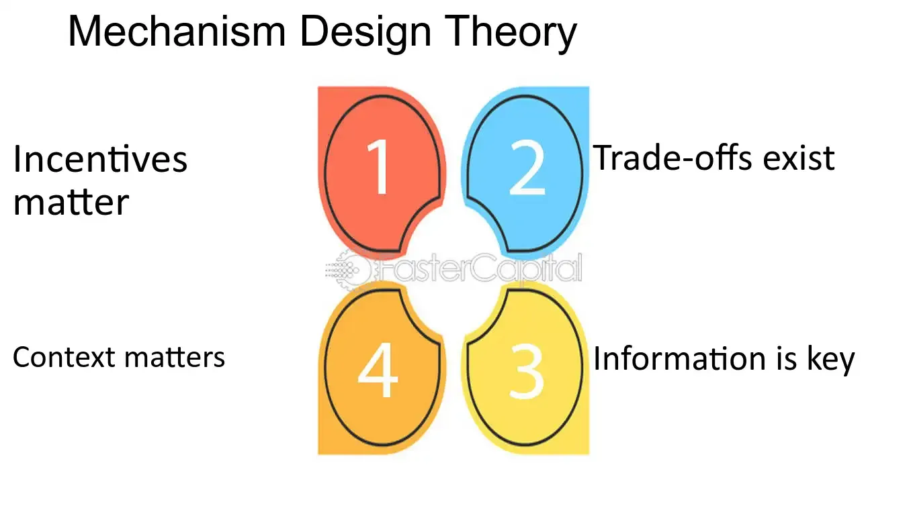

## Table of Contents

## What is Mechanism Design Theory?

Mechanism Design Theory is a part of economics and game theory that helps create rules or systems to make people do what we want them to do, even if they are just looking out for themselves. Imagine you want people to share information honestly or to work together better. Mechanism Design helps you set up a game or a system where everyone ends up doing the right thing because it's in their best interest.

For example, think about an auction. You want the item to go to the person who values it the most, but you also want them to bid honestly. Mechanism Design can help you design the auction rules so that bidding your true value is the best strategy for everyone. This way, the auction works well and everyone plays fair because the rules make it the smart thing to do.

In simple terms, Mechanism Design is like making up the rules of a game so that when everyone plays to win, they also help achieve a bigger goal, like fairness or efficiency. It's used in many places, like setting prices for public services, designing voting systems, or even organizing how resources are shared in a community. By carefully crafting these rules, we can guide people's actions to create better outcomes for everyone involved.

## How does Mechanism Design Theory differ from traditional economic theory?

Mechanism Design Theory and traditional economic theory both deal with how people make choices and how those choices affect the economy. But they look at things from different angles. Traditional economic theory usually starts by looking at how people behave and then tries to understand what happens in the economy because of those behaviors. It's like watching a game and trying to figure out the rules by seeing how players act. Economists using this approach often assume that markets work well on their own and focus on how supply and demand balance out.

Mechanism Design Theory flips this around. Instead of just watching and analyzing, it's about creating the rules of the game to get the results you want. It's like being the game designer who can change the rules to make sure players do what's best for everyone, not just themselves. This approach is useful when markets don't work perfectly on their own, or when you want to achieve specific goals like fairness or efficiency. So, while traditional economic theory is more about understanding and predicting, Mechanism Design Theory is about shaping and controlling outcomes through smart rule-making.

## What are the basic elements of a mechanism in Mechanism Design Theory?

In Mechanism Design Theory, a mechanism is made up of a few key parts that work together to guide people's actions. The first part is the set of rules or the "game" that people play. These rules tell everyone what they can do and what will happen based on their choices. For example, in an auction, the rules might say how people can bid and who wins the item. The second part is the information that people have or share. This can be what they know about themselves, like how much they value something, or what they know about others, like how much others might bid.

The third part of a mechanism is the outcomes or results that come from people's choices. These outcomes can be rewards or penalties, like getting the item in an auction or paying a certain price. The last part is the incentives, which are the reasons people have to act a certain way. Good mechanisms make sure that the incentives line up with the goals you want to achieve, so people end up doing what's best for everyone. By carefully designing these parts, you can create a system where people's self-interest leads to good overall results.

## Can you explain the concept of incentive compatibility in Mechanism Design?

Incentive compatibility is a key idea in Mechanism Design. It means setting up the rules of a game so that everyone wants to play honestly and do what's best for the group, even if they're just looking out for themselves. Imagine you're in a game where telling the truth helps you win. If the rules are set up right, you'll want to be honest because it's the best way to get what you want. That's what incentive compatibility is all about – making sure that what's good for you is also good for everyone else.

In simple terms, a mechanism is incentive compatible if people have no reason to lie or cheat. For example, in an auction, if bidding your true value for an item is the best strategy, then the auction is incentive compatible. This way, everyone plays fair because the rules make it the smart thing to do. By designing mechanisms that are incentive compatible, we can guide people's actions to create better outcomes for everyone involved.

## What is the Revelation Principle and why is it important in Mechanism Design?

The Revelation Principle is a big idea in Mechanism Design. It says that if you can make a game where people have to tell the truth about what they want or know, you can get the same results as any other game, but in a simpler way. Imagine you're trying to figure out how much people want something. Instead of making a complicated game where they might lie, you can just ask them directly and design the game so they want to tell the truth. This makes things easier because you don't have to worry about people trying to trick the system.

This principle is important because it helps designers focus on creating games that work well when people are honest. It's like a shortcut that lets you skip all the complicated ways people might try to game the system. By using the Revelation Principle, you can make rules that encourage people to be upfront about their true feelings or information, which leads to better results for everyone involved. It simplifies the process of designing mechanisms and makes sure that the outcomes are fair and efficient.

## How does the Vickrey-Clarke-Groves (VCG) mechanism work?

The Vickrey-Clarke-Groves (VCG) mechanism is a special way to run an auction or make group decisions that makes sure everyone tells the truth about what they want. Imagine you're at an auction where you want to buy a painting. In a VCG auction, instead of just bidding the highest amount, you tell the auctioneer how much you value the painting. The auctioneer then figures out who gets the painting and how much they pay based on everyone's true values. The winner pays a price that is the difference between what everyone else would have gotten without them and what they get with them. This way, it's best for everyone to be honest about what they really want because lying won't help them win or save money.

The VCG mechanism works well because it encourages people to be truthful, which leads to better outcomes for the group. For example, if you value the painting at $100 and someone else values it at $80, you would win the auction but only pay $80, which is what the other person would have paid if you weren't there. This makes sure the painting goes to the person who values it the most, and everyone else is happy because they're not paying more than they would have without you. By making honesty the best strategy, the VCG mechanism helps create fair and efficient results in auctions and other group decisions.

## What are some common applications of Mechanism Design in real-world scenarios?

Mechanism Design is used in many real-life situations where we want to make sure people do what's best for everyone, even if they're just thinking about themselves. One common use is in auctions, like when governments sell things like radio frequencies or when companies sell off their assets. By using smart rules, like the VCG mechanism, these auctions can make sure the items go to the people who value them the most, and everyone bids honestly because it's the best thing for them to do. This makes the whole process fair and efficient, helping the government or company get the best price while making sure the right people get the items.

Another place where Mechanism Design is used a lot is in setting prices for public services, like electricity or water. By designing the right rules, we can make sure these services are used in a way that's good for everyone. For example, if the price goes up when people use too much, they'll be more careful, which helps keep the service running smoothly for everyone. This kind of system can also be used in things like traffic management, where tolls might change based on how busy the roads are, encouraging people to drive at different times and reducing congestion. By using Mechanism Design, we can create systems that work better for the whole community.

## How can Mechanism Design be used to address issues of asymmetric information?

Mechanism Design can help solve problems where some people know more than others, which is called asymmetric information. Imagine you're selling a used car, and you know it's in great shape, but the buyer doesn't. This can make it hard to agree on a fair price. Mechanism Design can create rules for a game where you tell the truth about the car's condition, and the buyer pays a price that makes sense for both of you. By setting up the game this way, it encourages honesty and helps everyone get a fair deal, even when one person knows more than the other.

For example, in insurance, people might know more about their own health than the insurance company does. This can lead to problems like people only buying insurance when they're sick, which makes it hard for the company to set fair prices. Mechanism Design can help by creating a system where people are encouraged to be honest about their health. The insurance company might offer different plans with different prices, making it in everyone's best interest to pick the plan that matches their true health. This way, the insurance company can offer fair prices, and people get the coverage they need without taking advantage of the system.

## What are the challenges in implementing mechanisms in practice?

Implementing mechanisms in real life can be tricky because people don't always behave the way we expect. Even if a mechanism looks perfect on paper, it might not work as well in the real world. For example, people might not understand the rules or they might find ways to cheat the system. Also, it can be hard to gather all the information needed to make the mechanism work well. If some people know more than others, it can mess up the whole plan.

Another challenge is that mechanisms often need to be fair and easy to use for everyone. If the rules are too complicated, people might not follow them or they might feel like the system is unfair. Governments and organizations also need to think about how much it will cost to set up and run the mechanism. Sometimes, the benefits of a perfect mechanism might not be worth the time and money it takes to make it work. So, finding the right balance between a good mechanism and what's practical in the real world is a big challenge.

## How does Mechanism Design Theory incorporate game theory?

Mechanism Design Theory is closely tied to game theory because it uses the ideas of games to create rules that guide people's actions. In game theory, people are players in a game, and they make choices based on what they think others will do. Mechanism Design takes this a step further by designing the game itself. It sets up the rules so that when people play to win, they also help achieve a bigger goal, like fairness or efficiency. For example, in an auction, game theory might predict how people will bid, but Mechanism Design would create the auction rules to make sure people bid honestly and the item goes to the person who values it the most.

This connection is important because it helps Mechanism Design use the strategies and predictions from game theory to make better rules. By understanding how people make choices in games, designers can create mechanisms that work well in real life. For instance, if game theory shows that people might lie in certain situations, Mechanism Design can set up the game so that telling the truth is the best strategy. This way, the mechanism can guide people's actions to create good outcomes for everyone, even when they're just looking out for themselves.

## What advanced techniques are used to analyze and design mechanisms?

Advanced techniques in Mechanism Design often use math to figure out the best rules for a game. One common way is to use something called "optimization," which is like finding the best path on a map. By using math, designers can see how different rules might change what people do and then pick the rules that lead to the best results. Another technique is "simulation," where computers run the game many times with different rules to see what happens. This helps designers understand how people might act in real life and tweak the rules to make the game work better.

Another important technique is "game-theoretic analysis," which looks at how people make choices in games. By studying these choices, designers can create rules that make people want to do what's best for everyone. For example, they might use the "Revelation Principle" to make a game where telling the truth is the best strategy. This helps make sure the game works well even when people know different things. By combining these techniques, Mechanism Design can create smart rules that guide people's actions to achieve big goals like fairness and efficiency.

## Can you discuss some frontier research areas in Mechanism Design Theory?

One exciting area in Mechanism Design Theory is looking at how to make mechanisms work well in big, complex systems. Imagine trying to set up rules for a huge online marketplace where millions of people are buying and selling things. It's hard to make sure everyone plays fair and gets a good deal when there are so many people involved. Researchers are working on new ways to use computers and math to design mechanisms that can handle these big, complicated situations. They're trying to figure out how to keep things running smoothly and fairly, even when the system is really big and changing all the time.

Another frontier in Mechanism Design is dealing with situations where people don't always know everything or might make mistakes. In real life, people often don't have all the information they need, and they might not always make the best choices. Researchers are trying to create mechanisms that work well even when people are unsure or make errors. They're using ideas from psychology and behavioral economics to understand how people really behave and then design rules that help guide them to good outcomes. This kind of research is important because it helps make mechanisms that work better in the messy, unpredictable world we live in.

## What is the relationship between Game Theory and Mechanism Design?

Mechanism design and game theory are intimately connected as mechanism design leverages concepts from game theory to create systems that yield desired outcomes. A foundational concept borrowed from game theory is the Nash equilibrium, where each player's strategy is optimal given the strategies of other players. In the context of mechanism design, Nash equilibrium helps ensure that participants' strategic choices lead to an overall desired outcome without requiring extensive knowledge about others' preferences or strategies.

Mechanism design also employs dominant strategies, which occur when a strategy is best for a player, regardless of what others choose. By aligning individuals' dominant strategies with the desired outcome of the mechanism, designers can ensure that rational participants will naturally tend to make decisions that lead to optimal economic and social results. For instance, in auction settings, such as those described by the Vickrey-Clarke-Groves (VCG) mechanism, ensuring that truthful bidding is the dominant strategy can lead to efficient allocation of resources.

The interplay between cooperative and non-cooperative games is critical in achieving desired outcomes through mechanism design. In non-cooperative games, individuals act independently without collaboration, often pursuing personal gain. Mechanism design tackles the challenge of self-interest by structuring incentives so that even self-interested behavior leads to socially optimal outcomes. Cooperative game theory complements this by exploring how individuals can cooperate to achieve mutually beneficial results. Mechanism design may incorporate elements encouraging cooperation, such as creating coalitions or sharing gains equitably among participants.

Balanced incentives underpin many successful mechanism designs by motivating participants to act in ways that align personal interests with broader system goals. By carefully structuring payoffs, designers can guide [agents](/wiki/agents) towards equitable distribution and efficient resource allocation. For example, in public goods allocation, mechanisms must ensure that individuals contribute fairly without overloading others. Mathematical formulations can optimize these structures:

$$
\text{Maximize } \sum_{i=1}^n u_i(a) \quad \text{subject to } a \in A
$$

where $u_i$ is the utility of participant $i$, and $A$ represents the set of possible actions.

Through leveraging game theory, mechanism design enables the creation of systems that achieve desirable outcomes by aligning individual incentives with collective goals. By understanding and applying these concepts, mechanism designers can develop frameworks that manage resources effectively and equitably, even in environments characterized by self-interest and incomplete information.

## References & Further Reading

[1]: Hurwicz, L., Maskin, E., & Myerson, R. (2007). ["Designing Economic Mechanisms."](https://www.web.stanford.edu/~jacksonm/nobelbackground-2007.pdf) MIT Press.

[2]: Nisan, N., Roughgarden, T., Tardos, E., & Vazirani, V. V. (Eds.). (2007). ["Algorithmic Game Theory."](https://www.cambridge.org/core/books/algorithmic-game-theory/0092C07CA8B724E1B1BE2238DDD66B38) Cambridge University Press.

[3]: Vickrey, W. (1961). ["Counterspeculation, Auctions, and Competitive Sealed Tenders."](https://onlinelibrary.wiley.com/doi/10.1111/j.1540-6261.1961.tb02789.x) Journal of Finance, 16(1), 8-37.

[4]: Maskin, E., & Tirole, J. (2001). ["Markov Perfect Equilibrium: I. Observable Actions."](https://www.sciencedirect.com/science/article/pii/S0022053100927856) Journal of Economic Theory, 100(2), 191-219.

[5]: Myerson, R. B. (1981). ["Optimal Auction Design."](https://www.cs.princeton.edu/courses/archive/spr09/cos444/papers/myerson81.pdf) Mathematics of Operations Research, 6(1), 58-73.