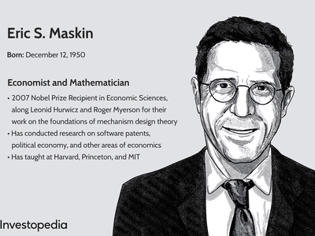

Mechanism design theory is a foundational aspect of economic modeling, integral to understanding and guiding the outcomes of myriad economic and social interactions. By considering how individuals follow their own self-interest, mechanism design provides frameworks to align these interests with socially desirable outcomes. As a subset of game theory, mechanism design involves constructing games in a manner that ensures players, acting rationally with their private information, lead to outcomes that fulfill specified objectives.

The relationship between mechanism design and game theory is pivotal. Game theory's exploration of strategic interactions between rational agents sets the groundwork upon which mechanism design builds. While game theory analyzes existing strategic situations, mechanism design reverses this perspective by constructing mechanisms with predetermined goals. In this way, economic models, grounded in mechanism design, can harness strategic behavior to foster optimal outcomes, notably in scenarios characterized by incomplete information, such as auctions and voting systems.



Algorithmic trading, an increasingly significant component of financial markets, highlights the practical applications of mechanism design. Algorithmic mechanism design, a convergence of computer science and economic theory, enables the creation of algorithms that perform efficiently in complex market environments. These algorithms, informed by mechanism design principles, must navigate and optimize within the confines of substantial information asymmetry and strategic behavior.

The necessity of mechanism design becomes evident when considering markets plagued by incomplete information and divergent incentives. Economic models utilizing mechanism design strive to reconcile individual rationality with collective efficiency. Despite the self-serving nature of individuals, these models aim to establish environments where desirable market outcomes are not just probable but strategically incentivized.

Through a sophisticated understanding of mechanism design, both theoretical economists and market practitioners can develop tools to influence economic processes beneficially. This convergence of theory and practice underscores the relevance of mechanism design in crafting systems that can potentially transform economic and social structures, fostering environments where fair and efficient outcomes prevail even amid individualistic intentions and asymmetrical information.

## Table of Contents

## Understanding Mechanism Design Theory

Mechanism design theory, often described as 'reverse game theory,' is centered around creating frameworks that can ensure specific, desired outcomes in strategic settings. Unlike traditional game theory, where the focus is on predicting the outcomes of given games, mechanism design deals with crafting the rules of the game itself to achieve predetermined objectives.

The primary challenge addressed by mechanism design is how to achieve beneficial societal outcomes when individuals are guided by self-interest. This theory attempts to align individual incentives with social welfare by designing mechanisms or games where rational [agents](/wiki/agents), acting in their own best interest, ultimately drive the system towards a desirable outcome.

A pivotal idea is the notion that individuals possess private information, known only to themselves, which they utilize to maximize their own payoffs. Mechanism design seeks to construct rules that motivate these individuals to truthfully reveal their private information or to act in a way that leads to socially optimal outcomes. For instance, in auctions, bidders might have information about how much they value items privately. Here, mechanism design, through techniques like the Vickrey auction, encourages bidders to truthfully report their valuations.

Key contributors to mechanism design theory include economists Eric Maskin, Leonid Hurwicz, and Roger Myerson, whose seminal contributions earned them the Nobel Prize in Economic Sciences in 2007. Leonid Hurwicz laid the foundational groundwork by introducing the concept of incentive compatibility, a crucial property where participants' best interests are aligned with truthfully reporting their private information. Eric Maskin built on these concepts and formalized the conditions under which mechanism design can be effectively implemented. Roger Myerson's work further extended these ideas, particularly through the development of the revelation principle, which states that for any desired outcome implementable by some mechanism, there is a direct mechanism where truth-telling constitutes an equilibrium.

The mathematics of mechanism design is rooted in creating incentive-compatible mechanisms that take into account agents' strategy spaces and payoff functions. A fundamental concept is the Nash equilibrium, which mechanism designers use to forecast how individuals will act. Designing a mechanism involves ensuring that reaching the Nash equilibrium also achieves the social objectives.

In conclusion, mechanism design theory is a fundamental tool for structuring economic and strategic interactions that accommodate individual interests yet still guide them towards beneficial collective outcomes. This intricate balance between private incentives and social welfare underscores the sophistication and importance of mechanism design in modern economics.

## Mechanism Design in Economic Models

Economic models employing mechanism design create frameworks that aim to achieve optimal outcomes in various market scenarios, with a particular focus on auction settings. Auctions are a primary area where mechanism design demonstrates its potential, offering strategies to allocate resources efficiently while accounting for self-interested behaviors. A prominent example within auction theory is the Vickrey-Clarke-Groves (VCG) mechanism, which is designed to elicit truthful bidding and achieve efficient resource allocation.

The VCG mechanism is a pivotal solution concept in auction theory, emphasizing an auction format where participants are incentivized to bid their true valuations. Under the VCG framework, each participant's payment is determined by the externalities their presence imposes on other participants. This encourages bidders to reveal their true valuations to ensure an efficient allocation of goods. The mathematical formulation of the VCG mechanism seeks to maximize social welfare, defined as the sum of the valuations of all participants, thus achieving a socially optimal outcome. This is accomplished by aligning individual incentives with collective goals, minimizing the loss of potential value due to strategic misrepresentation.

Implementing VCG in real-world auction settings, such as in the telecommunications sector, showcases the complexities that mechanism design must address. Spectrum auctions, which allocate radio frequencies to telecom operators, serve as a practical application where mechanism design methodologies are crucial. These auctions involve multiple licenses and require carefully structured bidding processes to prevent collusion, ensure competition, and maximize government revenue. The auction design must also consider various constraints like budget limits and investment sustainability.

Mechanism design faces several challenges in these applications due to the intrinsic complexity and variability of real-world markets. Factors such as asymmetry among bidders, uncertainty in valuations, and the potential for collusion present significant hurdles. Furthermore, the dynamic nature of telecommunications markets, with rapidly evolving technology and regulatory landscapes, demands flexible and adaptive auction designs. By employing mechanism design strategies like the VCG mechanism, economic models attempt to mitigate these issues, aligning private incentives with the desired efficient and fair allocation outcomes.

In summary, mechanism design in economic models aims to achieve optimal market outcomes by crafting incentives that guide self-interested participants toward socially beneficial actions. Through mechanisms like VCG, this field addresses the intricacies of auction settings, particularly in sectors such as telecommunications, providing insights into how theoretical constructs can be effectively applied in practice to handle real-world economic complexities.

## Game Theory and Mechanism Design

Mechanism design and game theory are intimately connected as mechanism design leverages concepts from game theory to create systems that yield desired outcomes. A foundational concept borrowed from game theory is the Nash equilibrium, where each player's strategy is optimal given the strategies of other players. In the context of mechanism design, Nash equilibrium helps ensure that participants' strategic choices lead to an overall desired outcome without requiring extensive knowledge about others' preferences or strategies.

Mechanism design also employs dominant strategies, which occur when a strategy is best for a player, regardless of what others choose. By aligning individuals' dominant strategies with the desired outcome of the mechanism, designers can ensure that rational participants will naturally tend to make decisions that lead to optimal economic and social results. For instance, in auction settings, such as those described by the Vickrey-Clarke-Groves (VCG) mechanism, ensuring that truthful bidding is the dominant strategy can lead to efficient allocation of resources.

The interplay between cooperative and non-cooperative games is critical in achieving desired outcomes through mechanism design. In non-cooperative games, individuals act independently without collaboration, often pursuing personal gain. Mechanism design tackles the challenge of self-interest by structuring incentives so that even self-interested behavior leads to socially optimal outcomes. Cooperative game theory complements this by exploring how individuals can cooperate to achieve mutually beneficial results. Mechanism design may incorporate elements encouraging cooperation, such as creating coalitions or sharing gains equitably among participants.

Balanced incentives underpin many successful mechanism designs by motivating participants to act in ways that align personal interests with broader system goals. By carefully structuring payoffs, designers can guide agents towards equitable distribution and efficient resource allocation. For example, in public goods allocation, mechanisms must ensure that individuals contribute fairly without overloading others. Mathematical formulations can optimize these structures:

$$
\text{Maximize } \sum_{i=1}^n u_i(a) \quad \text{subject to } a \in A
$$

where $u_i$ is the utility of participant $i$, and $A$ represents the set of possible actions.

Through leveraging game theory, mechanism design enables the creation of systems that achieve desirable outcomes by aligning individual incentives with collective goals. By understanding and applying these concepts, mechanism designers can develop frameworks that manage resources effectively and equitably, even in environments characterized by self-interest and incomplete information.

## Algorithmic Trading and Mechanism Design

Mechanism design principles are increasingly integral to the domain of [algorithmic trading](/wiki/algorithmic-trading), particularly in tailoring trading algorithms to align with specified economic outcomes. These principles are essential in scenarios such as high-frequency trading ([HFT](/wiki/high-frequency-trading-strategies)) and the development of automated financial strategies. An essential aspect of this application lies in constructing algorithms that can efficiently operate within the complex and dynamic environments of modern financial markets.

Algorithmic mechanism design focuses on integrating incentives into algorithmic processes to achieve desired outcomes, even in settings where participants have private information or conflicting interests. In the context of trading, this involves designing algorithms that not only optimize financial objectives but do so while considering the strategic behavior of market participants. High-frequency trading, characterized by rapid, automated execution of trades, benefits from such designs by ensuring that trades are executed in a manner that balances speed and efficiency with strategic market positioning.

The implementation of these concepts often requires solving optimization problems that incorporate game-theoretic considerations. For instance, one might employ a Nash equilibrium framework to model how automated trading algorithms can find optimal strategies amid competing trading agendas. This involves evaluating possible outcomes and establishing dominant strategies that can be reliably executed by trading bots.

```python
# Simplified Python code snippet for modeling a basic trading scenario with game theory
import numpy as np
from scipy.optimize import minimize

# Define a hypothetical utility function for the trading strategy
def utility(strategy, market_conditions):
    return -np.sum((strategy - market_conditions)**2)  # Simplified example

# Example market conditions (e.g., estimated price movements)
market_conditions = np.array([0.1, -0.05, 0.2])

# Initial guess for strategy
initial_strategy = np.zeros_like(market_conditions)

# Optimize strategy within a Nash equilibrium framework
result = minimize(lambda s: -utility(s, market_conditions), initial_strategy)

optimal_strategy = result.x
```

One of the challenges in the fast-paced world of financial markets is the computational and data demands required to implement mechanism design effectively. Algorithmic trading systems must process large volumes of data in real-time and make decisions almost instantaneously. This necessitates robust computing infrastructures and efficient algorithms capable of handling high-throughput data streams.

Additionally, algorithmic mechanism design must address the limitations imposed by data availability and quality. Incomplete or noisy data can obscure the true state of the market, leading to suboptimal decision-making. Furthermore, ensuring that trading algorithms remain compliant with regulatory frameworks concerning fair trading practices and market stability adds another layer of complexity.

In conclusion, while mechanism design principles provide a powerful framework for developing sophisticated algorithmic trading strategies, the practical implementation of these concepts faces significant challenges. Solutions must balance the theoretical underpinnings of game theory and optimization with the pragmatic constraints of the financial environment, ensuring strategies not only perform optimally but are adaptable to the ever-evolving landscape of global markets.

## Challenges and Future Directions

The dynamic landscape of modern markets demands mechanism designs that are not only effective but also adaptable to the constant influx of new information and evolving technologies. A primary challenge in developing these designs is computational complexity. As markets grow in intricacy, the calculations needed to devise optimal mechanisms increase exponentially. This complexity becomes particularly burdensome when striving to balance efficiency with precision, especially in high-stakes environments like financial markets or large-scale online platforms. 

Moreover, data privacy concerns present significant hurdles. Mechanism designs must ensure that participants' private information remains confidential while still leveraging that data to achieve desirable outcomes. This necessity leads to the challenge of creating methodologies that can operate effectively even with incomplete information, which is often the case when privacy is a priority.

Looking ahead, the integration of [deep learning](/wiki/deep-learning) and [machine learning](/wiki/machine-learning) with mechanism design holds immense potential for addressing these challenges. These advanced computational techniques can enhance decision-making capabilities by processing vast amounts of data and identifying patterns or strategies that may not be readily apparent through traditional methods. For instance, [reinforcement learning](/wiki/reinforcement-learning) algorithms could be used to develop mechanisms that continually adapt to real-time market changes, thereby maintaining or even enhancing their effectiveness over time.

To illustrate, consider a machine learning model tasked with designing an optimal auction mechanism for a changing market. This model would need to:

```python
import numpy as np
from sklearn.ensemble import RandomForestRegressor

# Hypothetical data representing dynamic market conditions
market_data = np.array([
    [1, 0.5, 300],
    [2, 0.7, 450],
    [3, 0.9, 600],
    # ... more data points
])

# Simulated outcomes from a past auction under similar conditions
auction_outcomes = np.array([20, 35, 50, ...])

# Train a random forest model to predict auction outcomes based on market conditions
model = RandomForestRegressor(n_estimators=100, random_state=42)
model.fit(market_data, auction_outcomes)

# Predict outcomes for a new set of market conditions
new_conditions = np.array([[1.5, 0.6, 350]])
predicted_outcomes = model.predict(new_conditions)

print(f"Predicted auction outcome: {predicted_outcomes[0]}")
```

This simple illustrative code represents how a model might predict the outcomes of an auction based on prior data, allowing for real-time adjustments and better decision-making. Such adaptive strategies, enabled by machine learning, are essential for future mechanism designs to remain relevant and beneficial amidst shifting economic landscapes.

In conclusion, the future of mechanism design lies in its ability to evolve alongside technological advancements, effectively addressing present challenges, and paving the way for mechanisms that are both innovative and robust. The integration of AI and machine learning tools represents a pivotal step forward, with ongoing research set to refine these approaches further for enhanced real-time decision-making and efficiency in complex market environments.

## Conclusion

Mechanism design theory serves as a pivotal framework within economics, intertwining closely with game theory, economic models, and algorithmic trading. This field of study focuses on constructing economic mechanisms and institutions that produce desirable outcomes despite the challenges posed by self-interest and incomplete information. At the nexus of these domains, mechanism design provides critical insights and tools to influence and optimize both economic interactions and trading systems.

Throughout this article, we addressed how mechanism design, fondly termed as 'reverse game theory', lays the groundwork for achieving optimal outcomes in markets. By employing concepts like Nash equilibrium and dominant strategies, it deftly navigates the nuances of cooperative and non-cooperative games, steering participants towards fair and efficient resource allocation. Within auction settings, mechanisms such as the Vickrey-Clarke-Groves (VCG) showcase how these principles are valuable in real-world applications, such as telecommunications auctions, ensuring that strategic behavior leads towards socially optimal results.

The influence of mechanism design extends into algorithmic trading, where the principles guide the development of sophisticated algorithms capable of adapting to complex market dynamics. High-frequency and automated trading strategies benefit from the structured decision-making that mechanism design supports, although challenges persist, such as computational demands and data limitations in fast-paced financial environments.

Looking forward, the potential for mechanism design to transform and enhance economic and trading systems is substantial. Its methodologies promise continued relevance as markets evolve with advances in technology and data processing. The integration of machine learning and deep learning techniques with mechanism design heralds new opportunities for real-time decision-making and adaptation to dynamic market information, paving the way for more efficient and equitable economic and social systems. Through continuous advancement in this field, mechanism design stands to bolster fairness and efficiency, fundamentally reshaping the economic landscape.

## References & Further Reading

[1]: Hurwicz, L., Maskin, E., & Myerson, R. (2007). ["Designing Economic Mechanisms."](https://www.web.stanford.edu/~jacksonm/nobelbackground-2007.pdf) MIT Press.

[2]: Nisan, N., Roughgarden, T., Tardos, E., & Vazirani, V. V. (Eds.). (2007). ["Algorithmic Game Theory."](https://www.cambridge.org/core/books/algorithmic-game-theory/0092C07CA8B724E1B1BE2238DDD66B38) Cambridge University Press.

[3]: Vickrey, W. (1961). ["Counterspeculation, Auctions, and Competitive Sealed Tenders."](https://onlinelibrary.wiley.com/doi/10.1111/j.1540-6261.1961.tb02789.x) Journal of Finance, 16(1), 8-37.

[4]: Maskin, E., & Tirole, J. (2001). ["Markov Perfect Equilibrium: I. Observable Actions."](https://www.sciencedirect.com/science/article/pii/S0022053100927856) Journal of Economic Theory, 100(2), 191-219.

[5]: Myerson, R. B. (1981). ["Optimal Auction Design."](https://www.cs.princeton.edu/courses/archive/spr09/cos444/papers/myerson81.pdf) Mathematics of Operations Research, 6(1), 58-73.