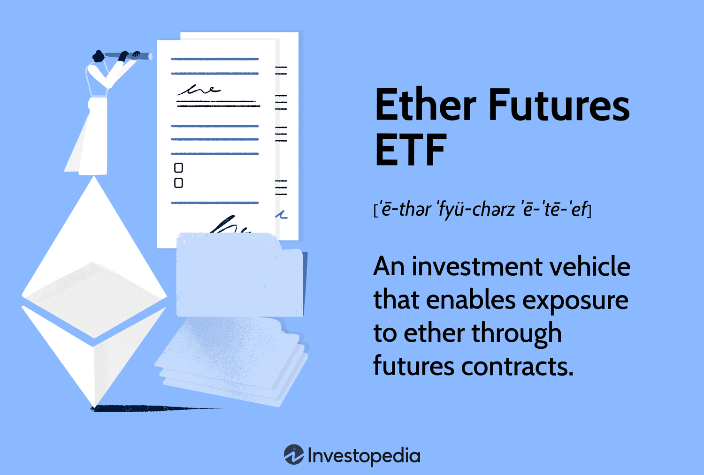

## Table of Contents

## What are Ether Futures ETFs?

Ether Futures ETFs are a type of investment fund that lets you invest in Ethereum, a popular cryptocurrency, without actually owning it. Instead of buying Ethereum directly, these ETFs invest in futures contracts, which are agreements to buy or sell Ethereum at a set price in the future. This way, you can bet on whether the price of Ethereum will go up or down without dealing with the complexities of owning the cryptocurrency itself.

These ETFs are traded on traditional stock exchanges, making them easier for regular investors to buy and sell compared to buying Ethereum on a crypto exchange. They are also regulated, which can make them feel safer for some people. However, investing in Ether Futures ETFs still carries risks, as the price of Ethereum can be very volatile, meaning it can change a lot in a short amount of time. So, it's important to understand these risks before deciding to invest.

## How do Ether Futures ETFs differ from traditional ETFs?

Ether Futures ETFs and traditional ETFs are both types of investment funds, but they work a bit differently. Traditional ETFs usually invest in stocks, bonds, or other assets like commodities. They buy these assets and hold them, and the value of the ETF goes up or down based on how well those assets are doing. For example, if a traditional ETF invests in a bunch of tech company stocks and those stocks go up, the value of the ETF goes up too.

On the other hand, Ether Futures ETFs don't actually buy Ethereum, the [cryptocurrency](/wiki/cryptocurrency). Instead, they invest in futures contracts, which are agreements to buy or sell Ethereum at a future date for a set price. The value of these ETFs goes up or down based on what people think the price of Ethereum will be in the future, not on the current price of Ethereum itself. This makes Ether Futures ETFs a way to bet on the future price of Ethereum without owning the cryptocurrency directly.

## What is the basic mechanism behind Ether Futures ETFs?

Ether Futures ETFs work by investing in futures contracts instead of buying Ethereum directly. Futures contracts are agreements to buy or sell Ethereum at a certain price on a specific date in the future. When you invest in an Ether Futures [ETF](/wiki/etf-trading-strategies), you're betting on what the price of Ethereum will be in the future, not what it is right now. If people think the price of Ethereum will go up, the value of the ETF might go up too, even if the current price of Ethereum stays the same.

These ETFs are traded on regular stock exchanges, which makes them easier for people to buy and sell compared to buying Ethereum on a cryptocurrency exchange. They are also regulated, which can make them feel safer for some investors. However, investing in Ether Futures ETFs can still be risky because the price of Ethereum can change a lot and be hard to predict. So, it's important to understand these risks before deciding to invest.

## How are Ether futures contracts used in these ETFs?

Ether futures contracts are agreements to buy or sell Ethereum at a certain price on a specific date in the future. When an Ether Futures ETF uses these contracts, it's betting on what the price of Ethereum will be at that future date. If the ETF thinks the price of Ethereum will go up, it will buy futures contracts. If it thinks the price will go down, it might sell futures contracts or buy ones that will benefit if the price drops.

The value of the Ether Futures ETF goes up or down based on the value of these futures contracts. If the price of Ethereum goes up as predicted, the futures contracts become more valuable, and so does the ETF. But if the price goes down, the futures contracts lose value, and the ETF loses value too. This way, people can invest in Ethereum's future price without actually owning the cryptocurrency.

## What role do market makers play in Ether Futures ETFs?

Market makers are important for Ether Futures ETFs because they help keep the market running smoothly. They do this by always being ready to buy or sell the ETF shares. This means if you want to buy or sell shares in an Ether Futures ETF, there's always someone there to trade with you. This makes it easier for people to trade the ETFs and helps keep the price stable.

Market makers also help make sure the price of the ETF stays close to the value of the futures contracts it holds. They do this by watching the price of the ETF and the futures contracts. If the ETF price gets too high or too low compared to the futures, market makers will step in and buy or sell to bring the prices back in line. This is important because it helps keep the ETF a good reflection of what's happening with Ethereum's future price.

## How is the price of an Ether Futures ETF determined?

The price of an Ether Futures ETF is determined by the value of the Ethereum futures contracts it holds. These futures contracts are agreements to buy or sell Ethereum at a certain price on a specific date in the future. If people think the price of Ethereum will go up, the value of the futures contracts goes up too, and so does the price of the ETF. If they think the price will go down, the value of the futures contracts and the ETF goes down.

Market makers also play a big role in setting the price of an Ether Futures ETF. They are always ready to buy or sell the ETF shares, which helps keep the market running smoothly. They watch the price of the ETF and the futures contracts, and if the ETF price gets too high or too low compared to the futures, they step in to buy or sell and bring the prices back in line. This helps keep the ETF's price a good reflection of what's happening with Ethereum's future price.

## What are the risks associated with investing in Ether Futures ETFs?

Investing in Ether Futures ETFs can be risky because the price of Ethereum can change a lot. This means the value of the futures contracts, which the ETF is based on, can go up and down quickly. If you invest in an Ether Futures ETF and the price of Ethereum goes down, the value of your investment could drop a lot too. This kind of big price change is called [volatility](/wiki/volatility-trading-strategies), and it's something you need to be ready for when you invest in these ETFs.

Another risk is that Ether Futures ETFs use futures contracts, which are agreements to buy or sell Ethereum in the future. If the price of Ethereum doesn't go the way the ETF predicts, the futures contracts can lose value. This can make the ETF lose money, even if the current price of Ethereum is doing well. So, it's important to understand that you're not just betting on the current price of Ethereum, but on what people think it will be in the future.

Also, these ETFs are new and not as well understood as traditional investments. This means there might be less information available, and it can be harder to predict how they will do. If you're thinking about investing in Ether Futures ETFs, it's a good idea to learn as much as you can and maybe talk to a financial advisor to understand all the risks involved.

## How do regulatory frameworks affect Ether Futures ETFs?

Regulatory frameworks play a big role in how Ether Futures ETFs work. These ETFs are traded on regular stock exchanges, which means they have to follow rules set by financial regulators. This can make them feel safer for some people because they know there's someone watching to make sure everything is done right. The rules can affect things like how much information the ETF has to share with investors, how it's allowed to invest in futures contracts, and how it's taxed. This means that the way these ETFs are set up and managed can change depending on what the regulators say.

But, the rules can also make it harder for new Ether Futures ETFs to start up. Regulators might be careful about letting new kinds of investments like these ETFs go forward because they want to make sure they're safe for people to invest in. This can slow things down and make it more expensive for companies to create these ETFs. So, while the rules help keep things safe, they can also make it trickier for new Ether Futures ETFs to come into the market.

## What are the tax implications of trading Ether Futures ETFs?

When you trade Ether Futures ETFs, you need to think about taxes. These ETFs are treated differently than if you were trading stocks or the actual cryptocurrency. When you buy and sell these ETFs, you might have to pay taxes on any profits you make. These profits are usually taxed as capital gains. If you hold the ETF for less than a year before selling, you'll pay short-term capital gains tax, which is the same as your regular income tax rate. If you hold it for more than a year, you'll pay long-term capital gains tax, which is usually lower.

Another thing to know is that Ether Futures ETFs might also be subject to something called the "wash-sale rule." This rule says you can't sell an investment at a loss and then buy it back right away to get a tax break. If you do this with an Ether Futures ETF, the IRS might not let you claim that loss on your taxes. So, it's a good idea to talk to a tax advisor to understand all the rules and make sure you're doing everything right when it comes to taxes on these ETFs.

## How do Ether Futures ETFs impact the broader cryptocurrency market?

Ether Futures ETFs can have a big effect on the whole cryptocurrency market. When these ETFs become popular, more people start paying attention to Ethereum. This can make the price of Ethereum go up because more people want to buy it. Also, when big investors like banks or investment funds start trading these ETFs, they bring a lot of money into the market. This can make the market more stable and help it grow because there's more money moving around.

But there are also some downsides. If a lot of people start trading Ether Futures ETFs, it can make the price of Ethereum go up and down a lot. This is because people might start betting on the future price of Ethereum without actually buying it, which can cause big swings in the market. Also, if something goes wrong with the ETFs, like if they lose a lot of money, it can make people lose trust in the whole cryptocurrency market. So, while Ether Futures ETFs can help the market grow, they can also make it more risky.

## What advanced strategies can be used when trading Ether Futures ETFs?

When trading Ether Futures ETFs, one advanced strategy you can use is called "hedging." This means you buy or sell other investments to protect your money from big changes in the price of Ethereum. For example, if you own a lot of Ethereum and you're worried the price might go down, you can buy an Ether Futures ETF that will go up in value if the price of Ethereum goes down. This way, if the price of Ethereum drops, you lose money on your Ethereum but make money on the ETF, which helps balance things out.

Another strategy is "[arbitrage](/wiki/arbitrage)." This is when you buy and sell the same thing in different places to make a profit from the difference in price. With Ether Futures ETFs, you can look at the price of the ETF and the price of Ethereum futures contracts. If the ETF is cheaper than the futures contracts, you can buy the ETF and sell the futures contracts at the same time. Then, when the prices come back together, you can make money from the difference. But, this strategy needs a lot of watching and quick action because the prices can change fast.

## How might future developments in blockchain technology influence Ether Futures ETFs?

Future developments in blockchain technology could change how Ether Futures ETFs work. If blockchain gets better and faster, it might make Ethereum more popular and valuable. This could make more people want to invest in Ether Futures ETFs because they would be betting on a cryptocurrency that's doing well. Also, if new kinds of blockchain technology come out, like ones that use less energy or are easier to use, it might make Ethereum and its ETFs even more attractive to investors.

On the other hand, if blockchain technology changes a lot, it could also make Ether Futures ETFs riskier. If new technology comes out that makes Ethereum less important, the value of the ETFs could go down. Also, if the rules about how blockchain and cryptocurrencies work change, it might affect how these ETFs are allowed to invest and how they're taxed. So, while new blockchain technology could help Ether Futures ETFs grow, it could also make them more unpredictable.

## References & Further Reading

[1]: Chapelle, O., Haffner, P., & Vapnik, V. N. (1999). ["Support Vector Machines for Histogram-Based Image Classification."](https://pubmed.ncbi.nlm.nih.gov/18252608/) IEEE Transactions on Neural Networks.

[2]: Antonopoulos, A. M., & Wood, G. (2018). ["Mastering Ethereum: Building Smart Contracts and DApps."](https://www.amazon.com/Mastering-Ethereum-Building-Smart-Contracts/dp/1491971940) O'Reilly Media.

[3]: Narayanan, A., Bonneau, J., Felten, E., Miller, A., & Goldfeder, S. (2016). ["Bitcoin and Cryptocurrency Technologies."](https://press.princeton.edu/books/hardcover/9780691171692/bitcoin-and-cryptocurrency-technologies) Princeton University Press.

[4]: Durbin, M. (2011). ["All About High-Frequency Trading."](https://www.amazon.com/All-About-High-Frequency-Trading/dp/0071743448) McGraw-Hill Education.

[5]: Hougan, M., & Lawant, D. (2021). ["Cryptocurrency Investing for Dummies."](https://papers.ssrn.com/sol3/papers.cfm?abstract_id=3792541) Wiley.