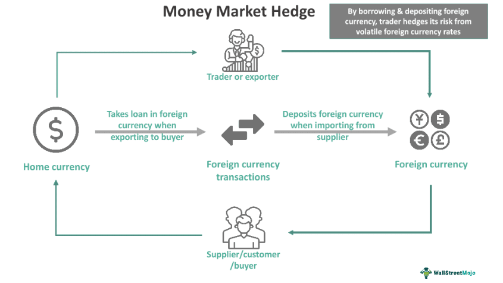

## Table of Contents

## What is a money market hedge?

A money market hedge is a way for businesses to protect themselves from changes in currency exchange rates. When a company knows it will receive money in a different currency in the future, it can use a money market hedge to make sure it gets the same amount of money in its own currency, no matter what happens to exchange rates. This is done by borrowing money in the foreign currency now, converting it to the home currency, and then using the future foreign currency payment to pay back the loan.

For example, imagine a U.S. company is expecting to receive €1 million from a European customer in six months. The company can borrow €1 million now, convert it to dollars at today's exchange rate, and invest those dollars until the payment arrives. When the €1 million arrives, it uses that money to pay back the loan. This way, the company knows exactly how many dollars it will have, even if the exchange rate changes. It's like locking in today's exchange rate for a future transaction.

## How does a money market hedge work?

A money market hedge is a way for companies to protect themselves from changes in currency exchange rates. Imagine a U.S. company is expecting to receive €1 million from a European customer in six months. The company can use a money market hedge to make sure it gets the same amount of money in dollars, no matter what happens to the exchange rate. To do this, the company borrows €1 million now, converts it to dollars at today's exchange rate, and then invests those dollars until the payment from Europe arrives.

When the €1 million arrives in six months, the company uses that money to pay back the loan it took out earlier. This way, the company knows exactly how many dollars it will have, even if the exchange rate between the euro and the dollar changes. It's like locking in today's exchange rate for a future transaction, which helps the company plan its finances better and avoid surprises from currency fluctuations.

## What are the basic steps to implement a money market hedge?

To implement a money market hedge, a company first needs to figure out how much money it will get in a foreign currency in the future. Let's say a U.S. company knows it will receive €1 million in six months. The company then borrows that amount, €1 million, in the foreign currency right away. This loan is taken from a bank that deals in euros.

Next, the company converts the borrowed €1 million into its home currency, which is dollars in this case, at the current exchange rate. The company then invests these dollars until the €1 million payment from the European customer arrives in six months. When the payment comes, the company uses it to pay back the euro loan, including any interest. This way, the company knows exactly how many dollars it will have, no matter what happens to the exchange rate between the euro and the dollar.

## What are the key differences between a money market hedge and other hedging techniques like forward contracts?

A money market hedge and a forward contract are both ways to protect against changes in currency exchange rates, but they work a bit differently. With a money market hedge, a company borrows money in the foreign currency right away, converts it to its home currency, and then uses the future foreign currency payment to pay back the loan. This means the company locks in the current exchange rate by taking out a loan and managing it until the payment arrives. On the other hand, a forward contract is simpler because it's just an agreement to buy or sell a certain amount of currency at a set exchange rate on a future date. The company doesn't need to borrow money; it just needs to make sure it can meet the terms of the contract when the time comes.

The main difference between these two methods is how they handle the risk and the steps involved. A money market hedge involves more steps because it includes borrowing, converting, and investing money, which can be more complex to manage. It also involves dealing with interest rates on the borrowed money, which can add another layer of risk and cost. A forward contract is more straightforward because it's just a promise to exchange currencies at a set rate in the future, without the need to manage loans or investments. However, forward contracts might not be as flexible if a company's needs change before the contract date arrives.

## What are the advantages of using a money market hedge?

One big advantage of using a money market hedge is that it helps a company know exactly how much money it will have in the future, even if exchange rates change. Imagine a U.S. company expecting to get €1 million in six months. By borrowing €1 million now, turning it into dollars, and then paying back the loan with the incoming euros, the company locks in today's exchange rate. This means no surprises from currency changes, which helps the company plan its finances better.

Another advantage is that a money market hedge can be more flexible than other hedging methods like forward contracts. If a company's needs change before the money arrives, it can adjust its investments or pay back the loan early. This flexibility can be really helpful in a fast-changing business world. Plus, using a money market hedge can also help a company learn more about managing different currencies and interest rates, which can be good for its overall financial strategy.

## What are the potential disadvantages or risks associated with money market hedges?

One potential disadvantage of using a money market hedge is that it can be more complicated than other hedging methods. A company has to borrow money in a foreign currency, convert it to its home currency, invest it, and then pay back the loan when the payment arrives. All these steps mean more work and more chances for something to go wrong. If the company doesn't manage these steps well, it could end up losing money or facing unexpected costs.

Another risk is that money market hedges involve dealing with interest rates. When a company borrows money in a foreign currency, it has to pay interest on that loan. If interest rates change, this could affect how much the company has to pay back. If interest rates go up, the cost of the hedge could be higher than expected, which might make the hedge less effective or even lead to losses. So, companies need to think carefully about interest rates when they decide to use a money market hedge.

## Can you provide a simple example of how a money market hedge might be used by a company?

Imagine a U.S. company is going to get €1 million from a European customer in six months. The company wants to make sure it knows exactly how many dollars it will have, even if the exchange rate changes. So, the company decides to use a money market hedge. It goes to a bank and borrows €1 million right away. Then, it converts those euros into dollars at today's exchange rate. Let's say the exchange rate is €1 = $1.10, so the company gets $1.1 million. The company then puts these dollars into a safe investment until the €1 million payment comes in six months.

When the €1 million arrives from Europe, the company uses it to pay back the loan it took out earlier. This means the company doesn't have to worry about the exchange rate anymore because it already turned the €1 million into dollars at the old rate. Even if the euro gets weaker or stronger against the dollar, the company knows it will have $1.1 million, minus any interest it has to pay on the loan. This way, the company can plan its finances better and avoid surprises from currency changes.

## How do interest rates impact the effectiveness of a money market hedge?

Interest rates can really affect how well a money market hedge works. When a company borrows money in a foreign currency for a money market hedge, it has to pay interest on that loan. If interest rates go up, the cost of borrowing that money goes up too. This means the company might have to pay back more money than it expected, which can make the hedge less effective. The company might end up with less money in its home currency after paying back the loan and interest.

On the other hand, if interest rates go down, the cost of borrowing the foreign currency could be lower. This could make the money market hedge more effective because the company would have to pay back less money. But it's not just about the interest rates on the loan. The company also needs to think about the interest it earns on the money it invests after converting the borrowed foreign currency into its home currency. If the investment earns a good return, it can help offset the cost of the loan and make the hedge work better. So, interest rates on both the loan and the investment play a big role in how well a money market hedge works.

## What role does currency valuation play in the decision to use a money market hedge?

Currency valuation is super important when a company decides to use a money market hedge. Imagine a U.S. company knows it will get €1 million in six months. If the euro is strong now but might get weaker, the company might want to lock in the current exchange rate. By using a money market hedge, the company can borrow €1 million now, turn it into dollars at today's rate, and then use the future €1 million to pay back the loan. This way, the company doesn't have to worry about the euro getting weaker and losing money when it converts the payment to dollars.

But if the euro is expected to get stronger, the company might think twice about using a money market hedge. If the euro does get stronger, the company could end up with more dollars if it waits until the payment arrives to convert it. Using a money market hedge in this case might mean missing out on extra money. So, the company needs to think about what might happen to the value of the euro and decide if locking in today's rate is worth it or if waiting might be better.

## How can a company determine if a money market hedge is more cost-effective than other hedging options?

To figure out if a money market hedge is more cost-effective than other hedging options, a company needs to look at a few things. First, it should compare the costs of the money market hedge, like the interest it has to pay on the loan in the foreign currency, with the costs of other methods, like forward contracts or options. A money market hedge involves borrowing money, converting it, and then investing it, so there are more steps and costs to think about. The company also needs to consider how flexible it needs to be. If its plans might change, a money market hedge might be better because it can be adjusted more easily than a forward contract.

Another thing to consider is how well the company can predict changes in currency values and interest rates. If it's good at guessing these things, a money market hedge might work out better because it can take advantage of good interest rates on the investment side. But if the company isn't sure about future exchange rates, a simpler method like a forward contract might be safer and more cost-effective. By weighing all these factors, the company can decide if a money market hedge will save it more money than other hedging options.

## What advanced strategies can be employed to optimize the use of money market hedges in complex financial environments?

In complex financial environments, companies can optimize the use of money market hedges by carefully managing [interest rate](/wiki/interest-rate-trading-strategies) exposure. This involves closely monitoring both the interest rates on the borrowed foreign currency and the returns on the investments made in the home currency. For example, if a company expects interest rates to rise in the foreign currency, it might choose to borrow at a fixed rate to lock in the current lower rate. On the other hand, if it expects rates to fall, borrowing at a variable rate could be more beneficial. Additionally, the company can look for investment opportunities in the home currency that offer higher returns to offset the costs of the loan, making the hedge more cost-effective.

Another advanced strategy is to use multiple currencies for hedging. If a company has operations in several countries, it can borrow in different currencies and convert them into its home currency. This can help spread the risk and take advantage of different interest rate environments. For example, if the euro has a lower interest rate than the yen, the company might borrow in euros and invest in a higher-yielding currency like the dollar. By diversifying its borrowing and investment strategies, the company can better manage currency fluctuations and interest rate changes, making the money market hedge more effective in a complex financial environment.

## How do regulatory environments affect the implementation and effectiveness of money market hedges across different countries?

Regulatory environments can really change how a company uses money market hedges in different countries. Each country has its own rules about borrowing and investing money, and these rules can make it harder or easier to set up a money market hedge. For example, some countries might have strict limits on how much money a company can borrow in foreign currencies, which could stop a company from using a money market hedge the way it wants to. Also, different countries might have different rules about how much interest a company has to pay on loans or how it can invest the money it borrows. These rules can affect how much it costs to use a money market hedge and whether it's worth it.

Another way regulations can affect money market hedges is by changing how well they work. If a country has tight controls on moving money in and out, it can be harder for a company to convert the foreign currency it borrows into its home currency. This can make the hedge less effective because the company might not be able to lock in the exchange rate it wants. Also, if a country's rules about interest rates change a lot, it can be hard for a company to predict how much it will have to pay back on its loan. This uncertainty can make it tougher to decide if a money market hedge is the best choice. So, companies need to think about these regulatory differences when they plan their hedging strategies.

## References & Further Reading

[1]: ["Foreign Exchange Risk Management: Which Hedging Techniques can be Effectively Used by a Company?"](https://www.usbank.com/financialiq/improve-your-operations/minimize-risk/risk-management-strategies-foreign-exchange-hedging.html) Journal of Corporate Accounting & Finance.

[2]: ["Currency Risk Management: A Case Study on the Haitian Effect"](https://www.sciencedirect.com/science/article/pii/S0927538X17303517) by M. Nagarajan in Defense and Peace Economics.

[3]: ["Algorithmic Trading and DMA: An Introduction to Direct Access Trading Strategies"](https://www.amazon.com/Algorithmic-Trading-DMA-introduction-strategies/dp/0956399207) by Barry Johnson.

[4]: ["Algorithmic and High-Frequency Trading"](https://www.amazon.com/Algorithmic-High-Frequency-Trading-Mathematics-Finance/dp/1107091144) by Álvaro Cartea, Sebastian Jaimungal, and José Penalva.

[5]: ["Managing Currency Risk - Using Financial Derivatives"](https://www.amazon.com/Managing-Currency-Risk-Financial-Derivatives/dp/0471498866) by John J. Stephens.

[6]: ["The Basics of Foreign Exchange Markets"](https://www.investopedia.com/terms/forex/f/foreign-exchange-markets.asp) by Cornelis A. Los, CFA Institute Research Foundation.