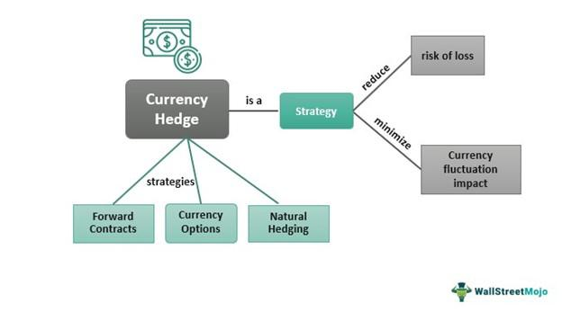

In today's globalized financial landscape, managing currency risk has become essential for enterprises engaged in international trade. Currency fluctuations can profoundly affect profit margins, alter cost structures, and pose risks to financial stability. Given these potential impacts, financial managers are increasingly seeking strategies to mitigate currency risks and maintain stability in financial operations.

One prominent strategy that arises in this context is the money market hedge. This approach is particularly appealing for smaller businesses and individual traders who may not have access to complex derivative products. A money market hedge provides a method to lock in exchange rates for future transactions, protecting businesses from unfavorable currency movements and allowing for more predictable financial planning.



In tandem with traditional hedging methods, algorithmic trading has gained prominence as a sophisticated tool for managing currency risks. Algorithmic trading utilizes computer algorithms to automate trading strategies, optimizing the execution speed and pricing of trades. This technological advancement enables businesses to engage in high-speed, accurate transactions that can better anticipate and respond to market changes.

This article explores financial instruments and the strategies associated with money market hedging while examining the burgeoning role of algorithmic trading in currency risk management. By understanding these mechanisms, businesses can enhance their financial strategies to safeguard against the inherent uncertainties of global markets.

## Table of Contents

## Understanding Financial Instruments

Financial instruments are crucial for businesses aiming to manage currency risk effectively. These instruments encompass a wide range of products such as stocks, bonds, options, futures, and others, each serving distinct purposes in the financial ecosystem. A primary function of financial instruments is to provide liquidity, which is essential for ensuring that businesses can both meet their short-term obligations and seize opportunities as they arise. For instance, stocks and bonds can be rapidly converted into cash, enabling firms to maintain operational continuity even during challenging periods.

Moreover, these instruments play a significant role in managing risk. Options and futures, in particular, are designed to mitigate uncertainties in currency fluctuations. An option grants the purchaser the right, but not the obligation, to buy or sell a currency at a predetermined price within a set timeframe, providing a safeguard against unfavorable exchange rate movements. Futures contracts, on the other hand, obligate the parties involved to exchange a specified amount of currency at a predetermined price and date, offering a hedge against potential adverse movements in exchange rates.

Additionally, financial instruments are vital for facilitating the transfer of resources across time, industries, and international borders. This aspect is particularly important as it enables businesses to plan and allocate resources more efficiently. By using derivatives, companies can secure prices for future transactions, helping them lock in costs and avoid [volatility](/wiki/volatility-trading-strategies)-associated losses, thereby stabilizing cash flows and enabling better financial planning.

Among these varied instruments, the money market stands out for providing a suite of short-term solutions that are integral for hedging purposes. Money market instruments, including treasury bills, commercial paper, and certificates of deposit, offer a combination of high [liquidity](/wiki/liquidity-risk-premium) and low risk. These instruments enable businesses to manage their short-term funding needs and mitigate the risks associated with currency exchange volatility. For example, by using a treasury bill as a hedge, a company can ensure it maintains a predictable cost structure, safeguarding its profit margins against unforeseen currency value fluctuations.

In summary, financial instruments are indispensable for businesses engaged in international trade or operations. They offer the tools necessary to manage liquidity, mitigate risks, and ensure resource allocation across various temporal and spatial dimensions, with money market instruments being particularly effective in providing short-term hedging solutions.

## The Concept of Money Market Hedge

A money market hedge is a financial strategy that employs short-term financial instruments to protect against the volatility of currency exchange rates. This approach is particularly advantageous for smaller enterprises engaged in cross-border operations, as they often face significant exposure to currency risk without the resources to employ more complex financial derivatives.

The basic mechanism of a money market hedge involves borrowing and lending in both domestic and foreign currencies to effectively "lock in" an exchange rate for future transactions. The aim is to offset potential losses due to fluctuations in currency value, thereby stabilizing financial outcomes. For instance, if a company anticipates receiving a payment in a foreign currency at a future date, it can hedge against the risk of the foreign currency depreciating by using a money market hedge.

Here's how it generally works:

1. **Determine the Amount to Hedge:** Suppose a business expects to receive an amount in foreign currency, say 100,000 EUR, in three months.

2. **Borrow in Foreign Currency:** The business borrows the present value of this amount in the foreign currency. If the current interest rate for a three-month loan in EUR is 2%, the company will borrow $\frac{100,000}{(1 + 0.02/4)} \approx 99,504$ EUR.

3. **Convert to Domestic Currency:** The borrowed amount is then converted to the domestic currency at the current spot rate. If the current exchange rate is 1 EUR = 1.10 USD, the business converts 99,504 EUR to 109,454.40 USD.

4. **Invest in Domestic Currency:** The domestic currency amount is then invested at the domestic interest rate for the same period. Assume the domestic interest rate is 1%. The company will invest 109,454.40 USD for three months.

5. **Repay the Foreign Currency Loan:** At the end of the three-month term, when the company receives the 100,000 EUR, it repays the foreign currency loan with the amount received.

6. **Receive the Maturity Amount in Domestic Currency:** Simultaneously, the investment in domestic currency matures, creating a fixed and predictable inflow in domestic currency, mitigating the risk of unfavorable currency movements in the interim.

This process ensures that the company knows precisely the amount it will receive in its domestic currency, regardless of exchange rate movements. As such, money market hedging serves as a straightforward method to neutralize potential losses from exchange rate variations over time, providing firms with better financial predictability and stability.

## Benefits of Money Market Hedging

Money market hedging is a tactical approach employed by businesses to shield themselves from adverse currency movements, thus stabilizing cash flow. This strategy is particularly advantageous for businesses because it allows them to engage in risk management without resorting to complex financial derivatives, making it more accessible, especially for smaller enterprises.

By utilizing money market instruments, companies can focus on optimizing operational efficiencies without the constant worry of exchange rate risks affecting their bottom line. For instance, by locking in specific exchange rates for future transactions, businesses can ensure that their financial planning remains consistent and effective. This predictability simplifies budgeting and financial forecasting by setting fixed currency rates for expected inflows and outflows, thus minimizing the uncertainties brought about by fluctuating foreign exchange markets.

The simplicity and accessibility of money market hedges make them a preferred choice compared to more intricate financial derivatives, which may require a deeper understanding of financial markets and possibly entail higher costs and risks. This practical approach not only secures a firm's financial health but also allows management to concentrate on core business operations, ultimately fostering an environment conducive to growth and sustainability.

## Role of Algorithmic Trading in Currency Risk Management

Algorithmic trading uses computer algorithms to automate the execution of trading strategies, aiming for optimization in both speed and pricing. This approach plays a significant role in managing currency risk, as it allows traders to implement swift and precise transactions. By utilizing high-frequency trading systems, [algorithmic trading](/wiki/algorithmic-trading) enables market participants to react instantly to fluctuations in currency markets, thus facilitating more effective risk management.

One of the primary advantages of algorithmic trading is its ability to continuously monitor market conditions. Algorithms can analyze vast amounts of market data, identify trends, and make predictions about future currency movements. This computational capacity allows for the execution of trades based on predefined parameters, which can be adjusted dynamically to better align with changing market conditions. 

For example, consider an algorithm designed to hedge against foreign exchange risk. This algorithm could be programmed to buy or sell currency pairs when specific indicators, such as moving averages or relative strength indices, signal a potential market shift. By executing trades automatically, the algorithm can mitigate risks associated with adverse currency movements, thus boosting hedge efficiency.

Moreover, algorithmic trading minimizes the influence of human emotions on trading decisions. Emotional biases, such as fear or overconfidence, can obstruct rational decision-making and lead to suboptimal trading outcomes. By relying on algorithms, traders can maintain a disciplined approach, ensuring that decisions are made based on quantitative data rather than subjective judgment.

To illustrate the benefit, consider an algorithm trading strategy based on mean reversion. In Python, a simplified version might involve checking if the exchange rate of a currency pair deviates significantly from its historical average, then executing a trade upon this condition:

```python
def mean_reversion_strategy(exchange_rates, short_window, long_window):
    short_mavg = exchange_rates.rolling(window=short_window).mean()
    long_mavg = exchange_rates.rolling(window=long_window).mean()
    buy_signals = short_mavg < long_mavg
    sell_signals = short_mavg > long_mavg

    for date, is_buy in buy_signals.iteritems():
        if is_buy:
            print(f"Buying on {date}")
    for date, is_sell in sell_signals.iteritems():
        if is_sell:
            print(f"Selling on {date}")

# Example usage with hypothetical exchange rate data
import pandas as pd
exchange_rate_data = pd.Series([1.1, 1.2, 1.15, 1.25, 1.22, 1.3, 1.28, 1.35])
mean_reversion_strategy(exchange_rate_data, short_window=2, long_window=4)
```

This strategy automatically determines buy or sell actions based on historical data patterns. By implementing such strategies, algorithmic trading provides a powerful tool for managing currency risk, allowing for the execution of disciplined and data-driven trades. This method offers a competitive edge in international financial markets, helping businesses maintain stability amidst volatile currency movements.

## Practical Applications and Examples

Businesses of various sizes have successfully used money market hedges to maintain financial health by mitigating exposure to currency fluctuations. 

One practical example of this hedging strategy can be observed in a Canadian company that needed to manage its USD receivables efficiently. By implementing a money market hedge, the company was able to lock in the exchange rate for upcoming transactions. This involved borrowing an equivalent amount in Canadian dollars to the expected USD receivables, then converting it to USD at the current spot rate, and investing this amount in a USD-denominated financial instrument. When the receivable was due, the company would use the proceeds to pay off the borrowed amount, thereby neutralizing the impact of any unfavorable exchange rate movements. This approach ensured that the company could focus on their operational strategy without the added concern of currency appreciation affecting their cost structures.

Another illustrative example involves a vacation planner who faced expenditures in euros. To shield against the potential volatility in the EUR/USD exchange rate, the planner secured a forward contract to lock in a specific rate for future expenses. By doing so, the planner could confidently budget for travel packages, knowing that the cost would remain stable regardless of market movements. This predictability in expenses allowed the planner to offer competitive pricing to clients, enhancing their market position.

These examples underscore the practical utility of money market hedging in managing currency risk. Firms can stabilize their finances and focus on growth strategies, while individuals can ensure cost predictability, both of which contribute to a robust financial management framework in a world where currency volatility is a given.

## Pros and Cons of Money Market Hedging and Algo Trading

Money market hedging and algorithmic trading are prominent strategies for managing currency risk, each with distinct advantages and drawbacks. Understanding these can aid businesses and traders in selecting the most fitting approach for their needs.

**Pros of Money Market Hedging**

Money market hedging is particularly effective for stabilizing exchange risks. By locking in currency rates through borrowing and lending in different currencies, businesses can ensure predictable cash flows. This stability is crucial in protecting profit margins from the volatility often seen in foreign exchange markets. Additionally, money market hedging is generally more cost-efficient compared to some complex derivatives like options or swaps, which may require higher premiums or fees. Its accessibility is another benefit, as smaller businesses and individual traders can implement this strategy without requiring access to sophisticated financial instruments or platforms.

**Cons of Money Market Hedging**

Despite its benefits, money market hedging can be complex to set up. It requires a thorough understanding of financial markets and an ability to predict future currency movements. Discrepancies between anticipated and actual market conditions can affect the effectiveness of the hedge, leading to potential financial losses. This necessitates continuous monitoring and adjustments to the hedging strategy, which can be resource-intensive.

**Algorithmic Trading**

Algorithmic trading streamlines processes by leveraging computer algorithms to automate trade execution. This automation allows for high-speed transactions, accommodating swift changes in market conditions and enhancing the precision of currency risk management. Algorithms can analyze vast amounts of market data, recognize patterns, and execute trades based on predefined criteria, reducing the influence of human biases and emotions.

However, algorithmic trading requires a significant initial setup and ongoing investment in technology and expertise to maintain and update the algorithms. The market environment is continually evolving, and algorithms must adapt swiftly to prevent obsolescence. Therefore, continuous monitoring is vital to ensure that trading strategies remain effective and aligned with current market dynamics.

While both money market hedging and algorithmic trading offer robust solutions for currency risk management, choosing between them depends on a business’s size, financial capacity, and strategic priorities. Careful consideration of each approach's pros and cons can guide organizations in optimizing their risk management practices.

## Conclusion

Managing currency risk is essential for strategic financial management in international business. Currency fluctuations can jeopardize profit margins, increase transaction costs, and potentially destabilize financial stability. To counter these risks, employing financial strategies like money market hedges and algorithmic trading has become a practical necessity.

Money market hedges offer an efficient way to mitigate currency fluctuations by using short-term financial instruments. They allow businesses to lock in exchange rates for future transactions, creating a reliable economic landscape where firms can plan and operate without the constant worry of adverse currency movements. This method is particularly advantageous for smaller enterprises, providing a straightforward, yet effective, tool to ensure predictable cash flows.

Furthermore, algorithmic trading, which automates trading strategies through advanced computer algorithms, significantly enhances the ability to manage currency risks. These algorithms can swiftly analyze market conditions, predict currency trends, and execute trades with precision, optimizing transaction efficiency and lowering the likelihood of human error. By relying on algorithmic trading, businesses can make well-informed and disciplined financial decisions, which are crucial for maintaining profitability in dynamic market environments.

Although the adoption of these strategies comes with its own set of challenges—such as the complexity of setting up hedging instruments and the need for continuous monitoring of algorithmic systems—the benefits they confer in terms of financial stability are substantial. Understanding the intricacies of financial markets is crucial when using these tools, but the potential rewards in safeguarding profits and ensuring long-term operational sustainability make these efforts worthwhile.

Overall, a robust approach to currency risk management, integrating both money market hedges and algorithmic trading, is invaluable for businesses navigating the uncertainties of the global marketplace.

## References & Further Reading

[1]: ["Foreign Exchange Risk Management: Which Hedging Techniques can be Effectively Used by a Company?"](https://www.usbank.com/financialiq/improve-your-operations/minimize-risk/risk-management-strategies-foreign-exchange-hedging.html) Journal of Corporate Accounting & Finance.

[2]: ["Currency Risk Management: A Case Study on the Haitian Effect"](https://www.sciencedirect.com/science/article/pii/S0927538X17303517) by M. Nagarajan in Defense and Peace Economics.

[3]: ["Algorithmic Trading and DMA: An Introduction to Direct Access Trading Strategies"](https://www.amazon.com/Algorithmic-Trading-DMA-introduction-strategies/dp/0956399207) by Barry Johnson.

[4]: ["Algorithmic and High-Frequency Trading"](https://www.amazon.com/Algorithmic-High-Frequency-Trading-Mathematics-Finance/dp/1107091144) by Álvaro Cartea, Sebastian Jaimungal, and José Penalva.

[5]: ["Managing Currency Risk - Using Financial Derivatives"](https://www.amazon.com/Managing-Currency-Risk-Financial-Derivatives/dp/0471498866) by John J. Stephens.

[6]: ["The Basics of Foreign Exchange Markets"](https://www.investopedia.com/terms/forex/f/foreign-exchange-markets.asp) by Cornelis A. Los, CFA Institute Research Foundation.