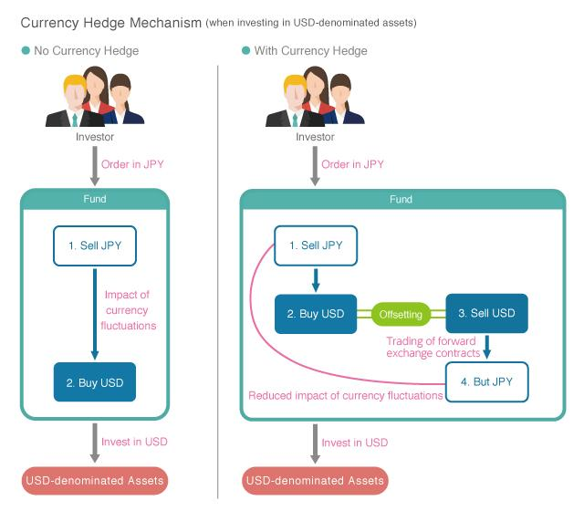

## Table of Contents

## What is a currency-hedged ETF?

A currency-hedged ETF is a type of exchange-traded fund that helps protect investors from changes in currency exchange rates. When you invest in foreign stocks or bonds, the value of your investment can go up or down because of changes in the value of the foreign currency compared to your home currency. A currency-hedged ETF uses special financial tools to reduce this risk, so your investment's value is more stable.

These ETFs are popular among investors who want to invest in foreign markets but don't want their returns affected by currency fluctuations. For example, if you're an American investor buying a European stock ETF, a currency-hedged version would try to minimize the impact of changes in the value of the euro compared to the dollar. This way, your investment's performance depends more on the actual performance of the stocks in the ETF, rather than on currency movements.

## Why would an investor choose a currency-hedged ETF over a traditional ETF?

An investor might choose a currency-hedged ETF over a traditional ETF if they want to focus on the performance of the foreign stocks or bonds without worrying about currency changes. When you invest in a traditional ETF that holds foreign assets, the value of your investment can go up or down because of changes in the exchange rate between your home currency and the foreign currency. A currency-hedged ETF uses special tools to reduce this risk, so your investment's value is more stable and depends more on the actual performance of the stocks or bonds in the ETF.

For example, if you're an American investor looking to invest in European stocks, a currency-hedged [ETF](/wiki/etf-trading-strategies) can help protect your investment from the ups and downs of the euro compared to the dollar. This can be especially important during times when currency values are very volatile. By choosing a currency-hedged ETF, you can have more peace of mind knowing that your returns are less likely to be affected by currency fluctuations, allowing you to focus on the growth potential of the foreign market you're investing in.

## How does currency hedging work in ETFs?

Currency hedging in ETFs works by using financial tools called derivatives, like forward contracts or options, to protect the value of the ETF from changes in currency exchange rates. When an ETF is currency-hedged, it tries to cancel out the effects of currency movements on the value of the foreign investments it holds. For example, if the ETF holds European stocks and the euro weakens against the dollar, the ETF uses these derivatives to offset the loss in value due to the weaker euro.

The goal is to make sure that the ETF's performance is based more on how well the foreign stocks or bonds are doing, rather than on how the currency is doing. This is done by setting up contracts that lock in exchange rates for a certain period. If the currency moves against the ETF's favor, the gains from these contracts help balance out the losses from the currency change. This way, investors can focus on the performance of the foreign market without worrying too much about currency ups and downs.

## What are the common strategies used for currency hedging in ETFs?

Currency hedging in ETFs often uses forward contracts, which are agreements to buy or sell a currency at a set price on a future date. This helps lock in the exchange rate, so if the currency moves against the ETF, the forward contract can offset the loss. For example, if an ETF holds European stocks and the euro weakens against the dollar, the forward contract can help maintain the value of the investment in dollar terms.

Another common strategy is using currency options, which give the ETF the right, but not the obligation, to buy or sell a currency at a set price before a certain date. Options can be more flexible than forward contracts because the ETF can choose whether to use them, depending on how the currency is moving. This can be useful in volatile markets where the direction of currency changes is hard to predict.

Sometimes, ETFs also use currency swaps, which involve exchanging one currency for another at a set rate and then swapping back at a later date. This can help manage currency exposure over longer periods. Each of these strategies aims to reduce the impact of currency fluctuations, allowing investors to focus on the performance of the underlying assets in the ETF.

## What are the costs associated with currency hedging in ETFs?

Currency hedging in ETFs can add extra costs for investors. These costs come from the fees for using financial tools like forward contracts, options, and swaps. These tools help protect the ETF from changes in currency values, but they are not free. The ETF has to pay for these tools, and those costs are usually passed on to investors through higher expense ratios. This means the overall cost of owning a currency-hedged ETF can be more than a regular ETF.

The exact cost can vary depending on how much the ETF needs to hedge and how often it needs to adjust its hedging strategy. If the currency markets are very volatile, the ETF might need to use more hedging tools, which can increase the costs. Over time, these extra costs can add up and affect the total return of the investment. It's important for investors to weigh these costs against the benefits of currency protection when deciding if a currency-hedged ETF is right for them.

## How does currency hedging impact the performance of an ETF?

Currency hedging can help an ETF perform better by reducing the impact of currency changes on its value. When you invest in a foreign ETF, the value of your investment can go up or down because of changes in the exchange rate between your home currency and the foreign currency. A currency-hedged ETF uses special tools like forward contracts or options to protect against these changes. This means that the ETF's performance depends more on how well the foreign stocks or bonds are doing, rather than on how the currency is doing. So, if the currency weakens, the hedging can help keep the value of your investment more stable.

However, currency hedging also adds extra costs to the ETF. These costs come from the fees for using the hedging tools, which can make the expense ratio of a currency-hedged ETF higher than a regular ETF. Over time, these extra costs can add up and might reduce the overall return of your investment. So, while currency hedging can protect against currency fluctuations, it's important to consider if the benefits of this protection are worth the extra costs. It depends on how much the currency changes and how much the hedging costs.

## What are the risks involved in investing in currency-hedged ETFs?

Investing in currency-hedged ETFs can help protect your money from changes in currency values, but it also comes with some risks. One big risk is the cost of hedging. Currency-hedged ETFs use special tools like forward contracts or options to manage currency changes, but these tools cost money. These costs can make the expense ratio of the ETF higher, which means you might earn less money over time because of these extra fees.

Another risk is that the hedging might not work perfectly. Even with hedging, there can still be some effect from currency changes. If the currency moves a lot, the tools used for hedging might not fully protect your investment. Also, if the currency moves in a way that helps your investment, the hedging could stop you from gaining extra money from these changes. So, you need to think about if the protection from currency changes is worth the extra costs and potential limits on your gains.

## How do currency-hedged ETFs handle currency fluctuations?

Currency-hedged ETFs use special tools to help protect your money from changes in currency values. They do this by using things called forward contracts, options, or swaps. These tools help lock in the exchange rate between the currency of the ETF's investments and your home currency. So, if the foreign currency weakens, the ETF can use these tools to make up for the loss in value. This way, the ETF's performance depends more on how well the stocks or bonds it holds are doing, rather than on how the currency is doing.

However, these tools cost money, which can make the ETF more expensive to own. The costs come from the fees for using these special tools, and they can add up over time. This means you might earn less money from the ETF because of these extra costs. Also, the hedging might not work perfectly. Even with these tools, there can still be some effect from currency changes. If the currency moves a lot, the tools might not fully protect your investment. And if the currency moves in a way that helps your investment, the hedging could stop you from gaining extra money from these changes.

## Can you explain the process of rebalancing in currency-hedged ETFs?

Rebalancing in currency-hedged ETFs is like making sure the ETF stays protected from changes in currency values. Over time, the value of the foreign currency can go up or down compared to your home currency. To keep the ETF safe, it needs to adjust its special tools, like forward contracts or options, to match these changes. This process of adjusting is called rebalancing. It helps make sure the ETF's performance still depends more on how well the stocks or bonds are doing, rather than on how the currency is doing.

Rebalancing happens regularly, often every month or quarter. When the ETF rebalances, it might need to buy or sell more of these special tools to keep the right level of protection. This can add to the costs of the ETF because using these tools isn't free. But rebalancing is important to keep the ETF working the way it's supposed to, helping to protect your investment from big swings in currency values.

## What are the tax implications of investing in currency-hedged ETFs?

Investing in currency-hedged ETFs can affect your taxes. When these ETFs use special tools like forward contracts or options to protect against currency changes, it can create what's called "capital gains" or "capital losses." These gains or losses happen because the ETF is buying and selling these tools. If the ETF makes money from these tools, it might have to pay capital gains taxes, and these taxes could be passed on to you, the investor. On the other hand, if the ETF loses money, you might be able to use those losses to lower your taxes.

The tax rules can be different depending on where you live. In the U.S., for example, these gains or losses might be treated as short-term or long-term capital gains, depending on how long the ETF held the tools. Short-term gains are taxed at your regular income tax rate, while long-term gains have a lower tax rate. It's a good idea to talk to a tax advisor to understand how investing in currency-hedged ETFs might affect your taxes, because the rules can be tricky and change over time.

## How do currency-hedged ETFs compare to other currency risk management tools?

Currency-hedged ETFs are one way to protect your money from changes in currency values. They use special tools like forward contracts or options to lock in exchange rates. This means your investment's value depends more on how well the stocks or bonds are doing, rather than on how the currency is doing. But these tools cost money, which can make the ETF more expensive to own. Also, the protection might not be perfect, and it could stop you from gaining extra money if the currency moves in a good way.

Other currency risk management tools include things like currency futures, options, and swaps. Currency futures are agreements to buy or sell a currency at a set price on a future date. They can help lock in exchange rates, but they need to be managed carefully because they can be risky. Options give you the right, but not the obligation, to buy or sell a currency at a set price. They can be more flexible but also more complex to use. Swaps involve exchanging one currency for another at a set rate and then swapping back later. They can be useful for managing currency exposure over longer periods, but they also come with costs and risks.

Compared to these other tools, currency-hedged ETFs are easier to use because you don't need to manage them yourself. You just buy the ETF, and it does the hedging for you. But the costs and how well it works can be different from using futures, options, or swaps directly. It's important to think about what you want to achieve and how much you're willing to pay for protection when choosing between these different tools.

## What advanced techniques are used to optimize the hedging strategy in currency-hedged ETFs?

To make the hedging strategy in currency-hedged ETFs work better, some advanced techniques are used. One technique is called dynamic hedging. This means the ETF changes how it uses its special tools, like forward contracts or options, based on how the currency is moving. If the currency is very volatile, the ETF might use more tools to protect against big changes. This helps keep the ETF's value more stable, but it can also add to the costs because using these tools isn't free.

Another technique is called layered hedging. This means the ETF uses different tools at different times to protect against currency changes. For example, it might use short-term forward contracts to cover the next few months and longer-term options for the next year. This can help the ETF be more flexible and better protected against different kinds of currency changes. But it also needs careful management to work well, and the costs can add up over time.

These advanced techniques can make currency-hedged ETFs more effective at protecting your money from currency changes. But they also make the ETFs more complex and can increase the costs. So, it's important to think about if the extra protection is worth the extra costs when choosing to invest in a currency-hedged ETF.

## References & Further Reading

[1]: Mongkollertsakul, T., & Tan, E. (2020). ["A comprehensive review of modern portfolio theory in the context of currency risk."](https://link.springer.com/article/10.1007/s11408-020-00352-6) International Review of Economics & Finance, 67, 89-101.

[2]: BlackRock. (2019). ["The Case for Currency Hedging."](https://www.wisdomtree.com/api/sitecore/pdf/getblogpdf?id=b1549900-c719-49a4-b513-a40da1d1dcb3)

[3]: ["Algorithmic and High-Frequency Trading"](https://www.cambridge.org/us/universitypress/subjects/mathematics/mathematical-finance/algorithmic-and-high-frequency-trading) by Álvaro Cartea, Sebastian Jaimungal, and José Penalva

[4]: Pojarliev, M., & Levich, R. M. (2011). ["Detection and impact of currency hedging in global equity portfolios."](https://www.nber.org/papers/w15698) Journal of Asset Management, 12(4), 257-268.

[5]: Cliff, D. (2018). ["Adaptive trading in agent-based models: Comparing automated currency-hedged and traditional approaches."](https://papers.ssrn.com/sol3/papers.cfm?abstract_id=4154426) In Complex Systems Modeling and Simulation in Economics and Finance.