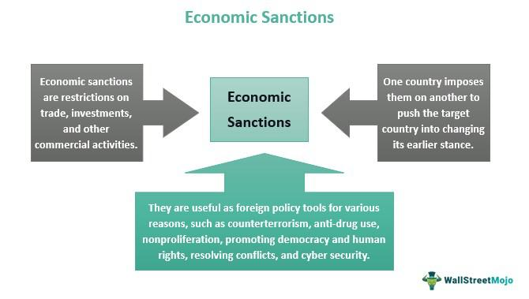

International trade sanctions have become an increasingly pivotal element in global policy frameworks, primarily serving as instruments to achieve foreign policy objectives. Economic sanctions, a subset of trade sanctions, are strategically employed by countries or international bodies to compel behavioral changes from other states or entities. These sanctions can manifest in various measures, including restrictions on trade, investments, and diplomatic relations, fundamentally aiming to exert economic pressure on target nations or groups [1].

The implementation of such sanctions involves intricate processes and mechanisms, often governed by a multitude of international laws and agreements. Key international players, such as the United Nations (UN), the European Union (EU), and other regional organizations, play significant roles in the establishment, enforcement, and monitoring of these sanctions. Ensuring compliance with sanctions requires sophisticated strategies and a thorough understanding of not only international law but also global trade dynamics.



In recent years, the advent of advanced technologies, particularly algorithmic trading, has introduced a new layer of complexity to the enforcement and navigation of economic sanctions. Algorithmic trading, which involves using computer programs to trade securities at high speeds and volumes, poses unique challenges and opportunities in the context of sanctions. While these algorithms can potentially be used to circumvent sanctions, they also offer mechanisms for enhancing compliance by monitoring financial transactions and trade patterns in real-time.

This article aims to dissect the multifaceted nature of international trade sanctions and the emerging interplay with technology. Readers will gain insights into the historical evolution and geopolitical implications of sanctions, the mechanisms of their enforcement, their impact on global trade, and the burgeoning role of algorithmic trading. Through this exploration, the article will highlight the complexities involved in sanctions enforcement, discuss the challenges faced, and evaluate future directions in the evolving global landscape of international trade sanctions.

[1] Joyner, D. H. (2005). International Law and the Proliferation of Weapons of Mass Destruction. Oxford University Press.

## Table of Contents

## Understanding International Trade Sanctions

International trade sanctions are measures adopted by countries or international organizations to achieve foreign policy and national security objectives. These sanctions are designed to restrict or completely halt trade with targeted nations, entities, or individuals. Their primary purpose is to influence the behavior of targeted parties by exerting economic pressure without resorting to military conflict, thereby serving as a diplomatic tool to address issues such as human rights violations, terrorism, nuclear proliferation, and other threats to global peace and security.

Trade sanctions come in various forms, each designed to achieve specific outcomes:

1. **Trade Embargoes**: Complete bans on trade with a specific nation or region. These are often comprehensive and prohibit exports and imports of all goods and services. For example, the United States had a longstanding trade embargo against Cuba, which limited nearly all forms of economic exchange.

2. **Financial Sanctions**: Restrictions on financial transactions involving targeted countries or individuals. These may include freezing assets, prohibiting financial services, and restricting access to capital markets. The intent is to isolate the target economically and disrupt its financial networks, as seen in the sanctions against Iran regarding its nuclear program.

3. **Travel Bans**: Restrictions on the movement of individuals associated with a targeted regime or entity. These bans prevent entry into or transit through sanctioning countries and are often used in conjunction with other measures to limit the influence of a regime's key figures.

Historically, trade sanctions have evolved from simple blockades and embargoes used in ancient and medieval times to sophisticated economic measures tailored to specific issues. The League of Nations and later the United Nations formalized sanctions as part of international diplomacy. A notable historical instance is the oil embargo enforced by OPEC against countries supporting Israel during the Yom Kippur War in 1973, drastically impacting global oil supply and economics.

The enforcement and compliance with international trade sanctions involve several key players:

- **National Governments**: They implement and enforce sanctions through legislation and regulation. Governments like the U.S. and the EU set the framework for sanctions and monitor compliance through agencies such as the U.S. Office of Foreign Assets Control (OFAC).

- **International Organizations**: Groups like the United Nations and the European Union play crucial roles in legitimizing and coordinating sanctions. The U.N. Security Council can impose sanctions to maintain international peace when agreed upon by member states.

- **Financial Institutions and Corporations**: Banks and businesses must comply with sanctions regulations, often at significant cost. They implement systems to ensure transactions do not involve prohibited entities, minimizing legal and financial risks.

Geopolitically, sanctions can significantly alter international relations, sometimes strengthening alliances and at other times straining diplomatic ties. For example, the sanctions against Russia following its annexation of Crimea in 2014 led to tense relations between Russia and the Western world, affecting global politics and economies. Sanctions can also lead to economic hardship and destabilization in the targeted country, as seen in the prolonged economic struggles in North Korea and Venezuela.

In conclusion, international trade sanctions are complex tools used to address global challenges. Their ability to influence the actions of nation-states and non-state actors underscores their importance in modern international relations, despite ongoing debates about their effectiveness and potential unintended consequences.

## Mechanisms of Economic Sanctions

Economic sanctions are a powerful tool wielded by governments and international bodies to influence political and economic situations globally. These sanctions are implemented through various mechanisms, relying on intricate legal frameworks and compliance strategies that present both challenges and controversies.

### Legal Framework and International Laws

Economic sanctions are governed by a robust legal framework composed of national and international laws intended to regulate their application. At the international level, the United Nations Security Council (UNSC) holds the authority to impose sanctions under Chapter VII of the UN Charter, which allows it to take action to maintain or restore international peace and security. When the UNSC imposes sanctions, these measures typically become binding for all UN member states, ensuring global compliance and uniformity.

Within individual countries, the legal basis for sanctions can vary. For example, in the United States, the Office of Foreign Assets Control (OFAC) within the Department of the Treasury administers and enforces economic and trade sanctions based on US foreign policy and national security goals. The European Union (EU) implements its sanctions through regulations agreed upon by its member states, which become directly applicable across the union.

### Role of International Organizations

International organizations such as the UN, EU, and other regional bodies play crucial roles in the enforcement of sanctions. The UNSC, as the primary entity for mandating sanctions, works in concert with member states to monitor and ensure adherence. The EU, as a significant economic player, introduces restrictive measures that its member countries must implement, often coordinating closely with allied nations to enhance the effectiveness of sanctions.

In addition to these bodies, non-governmental organizations (NGOs) and think tanks provide analysis and monitoring tools to track compliance and measure the impact of sanctions.

### Monitoring and Compliance Strategies

Ensuring compliance with economic sanctions involves several processes and strategies. National governments, often through dedicated agencies like OFAC, regularly update lists of sanctioned entities and individuals, requiring businesses and financial institutions to conduct due diligence. Compliance solutions might involve the integration of these lists into trading and financial systems to flag transactions involving sanctioned parties.

Technology plays a significant role in monitoring compliance, with advanced software systems enabling real-time transaction screening. For instance, algorithms can be deployed to parse through vast data sets, identifying prohibited transactions or connections to sanctioned entities.

### Challenges and Controversies

The enforcement of economic sanctions is fraught with challenges and controversies. A significant challenge is ensuring the consistency and comprehensiveness of sanctions across different jurisdictions, given the varied legal frameworks and levels of enforcement capabilities. Furthermore, sanctions can inadvertently harm civilian populations in targeted countries, leading to humanitarian concerns.

Controversies also arise over the effectiveness of sanctions. Critics argue that certain regimes may not yield the desired political outcomes and can sometimes strengthen the resolve of target governments, leading to prolonged conflicts or economic hardship without achieving policy goals.

In conclusion, the mechanisms underpinning economic sanctions are complex, involving an interconnected array of legal, strategic, and technological components. While they serve as vital instruments of foreign policy, the challenges associated with their enforcement necessitate continual evaluation and adaptation to evolving global dynamics.

## The Impact of Sanctions on Global Trade

International trade sanctions are significant tools employed by countries or international organizations to exert economic pressure on target nations, aiming to influence political or economic behavior. These sanctions can have profound impacts on both the economies of the sanctioned countries and the broader landscape of global trade.

### Economic Impact on Targeted Countries

Sanctions act as a formidable barrier, isolating targeted countries from international markets and financial systems. This isolation can lead to severe economic repercussions, such as reduced export and import opportunities, leading to shortages of essential goods and services. For instance, sanctions against Iran have significantly affected its oil exports, which are a vital source of revenue for the country, leading to a decrease in GDP growth and increased inflation rates.

### Market Dynamics and International Business Operations

The imposition of sanctions can alter market dynamics by reshuffling trade routes and partnerships. Businesses operating in sanctioned countries or regions often face heightened risks and uncertainties, complicating supply chain logistics and contractual obligations. Global companies may have to suspend operations or seek new partners, impacting their growth and profitability. For example, the sanctions placed on Russia following its annexation of Crimea led to a realignment of energy export routes, affecting European energy markets.

### Case Studies of Notable Sanction Regimes

One of the most notable cases is the comprehensive sanctions imposed on North Korea, aimed at curtailing its nuclear weapons program. This regime led to significant drops in trade [volume](/wiki/volume-trading-strategy) between North Korea and its major trading partners, like China, affecting its economy severely. Another case is the sanctions on Venezuela, which have compounded the nation's economic crisis by restricting its oil exports and access to international financial systems.

### Unintended Effects and Collateral Damage

Sanctions often lead to unintended effects, impacting not only the targeted country but also its allies and global economies. Collateral damage is observed when allied or neutral economies suffer from disrupted trade relations or financial flows. For instance, European economies experienced adverse effects due to the sanctions on Russia, given Europe's reliance on Russian natural gas.

```python
# Example Python code to simulate trade impact due to sanctions
import matplotlib.pyplot as plt
import numpy as np

# Simulate trade volume data before and after sanctions
time = np.arange(0, 10, 0.1)
trade_volume_before = np.sin(time) + time
trade_volume_after = np.sin(time) + time - 3

plt.plot(time, trade_volume_before, label='Trade Volume Before Sanctions')
plt.plot(time, trade_volume_after, label='Trade Volume After Sanctions', linestyle='--')
plt.xlabel('Time (years)')
plt.ylabel('Trade Volume (arbitrary units)')
plt.title('Impact of Sanctions on Trade Volume')
plt.legend()
plt.show()
```

### Effectiveness of Sanctions as a Policy Tool

The effectiveness of sanctions as a policy tool is subject to debate. While sanctions can succeed in pressuring governments to modify policies, as observed in cases like South Africa during apartheid, their success rate varies. Critics argue that sanctions often fail to achieve intended political objectives and may instead strengthen the resolve of target governments or harm civilian populations more than the political elites.

In conclusion, while sanctions remain a critical component of international diplomacy, their economic impact is complex and multifaceted, affecting not only the targeted countries but also global trade dynamics and economies. Their application requires careful consideration of potential outcomes and collateral consequences to ensure they serve as effective instruments of policy.

## Algorithmic Trading in the Context of Economic Sanctions

Algorithmic trading has become a transformative force in global financial markets, automating and enhancing the speed and efficiency of trading operations. Defined as the use of complex algorithms to execute trades at a speed and volume beyond human capability, [algorithmic trading](/wiki/algorithmic-trading) is involved in activities ranging from [market making](/wiki/market-making) to [arbitrage](/wiki/arbitrage). The integration of algorithmic trading in financial systems has been propelled by the advancement of computing power and data analytics capabilities, establishing a significant presence in global markets.

The intersection of algorithmic trading with markets subject to economic sanctions presents unique challenges and opportunities. Economic sanctions, intended to restrict trade and financial interactions with specified nations or entities, may create significant barriers that algorithms must navigate. Algorithms, which rely on a multitude of market signals and historical data, need modification to comply with evolving legal and regulatory frameworks associated with sanctions. This involves ensuring that trading algorithms can be dynamically updated to exclude transactions involving sanctioned entities or regions, effectively altering trading strategies to adhere to legal mandates.

To adjust algorithmic trading mechanisms to navigate sanctions, firms may incorporate real-time sanctions lists into their decision-making processes. This could involve using APIs to automatically update trading systems with the latest sanction designations, thereby reducing the risk of non-compliance. Moreover, these trading systems may employ [machine learning](/wiki/machine-learning) algorithms capable of adapting strategies based on changes in market conditions that could be influenced by sanctions. For example, if a sanction unexpectedly causes a supply shock in a commodity market, algorithmic adjustments can mitigate potential financial losses.

The role of technology in circumventing or enforcing sanctions is multifaceted. On one hand, sophisticated algorithms have the potential to create complex trading pathways that obscure the true nature of transactions, thus enabling the circumvention of sanctions. On the other hand, technology can play an instrumental role in enforcing sanctions by providing transparency and traceability in transactions, helping regulatory authorities to monitor compliance. Blockchain technology, for example, offers potential in creating immutable and transparent records of transactions that could aid in the enforcement of sanctions by ensuring all steps in the trading process are visible and verifiable.

In terms of regulation, authorities have actively sought measures to control the application of algorithmic trading in scenarios involving sanctioned markets. Regulatory bodies are increasingly focusing on implementing compliance frameworks that require financial institutions to demonstrate the robustness of their algorithmic trading systems in avoiding transactions with sanctioned entities. This includes periodic audits, stress testing of algorithms against possible sanctions evasion scenarios, and ensuring that systems are equipped to enforce trade restrictions swiftly as new sanctions are imposed.

Algorithmic trading, while offering enhanced efficiency and responsiveness in global markets, must be carefully managed to ensure adherence to international sanctions. Continued regulatory scrutiny and technological innovation are vital to balance these sophisticated tools' potential benefits and risks in sanctioned contexts.

## Challenges and Future Directions

International trade sanctions play a crucial role in global policy, but their enforcement and effectiveness face several challenges. One primary challenge is ensuring compliance amid the diverse global landscape. Countries and companies can find ways to circumvent these rules, often exploiting loopholes or leveraging third-party arrangements to continue prohibited trade activities. Monitoring and tracking such evasions require significant resources, advanced technologies, and international cooperation.

Technology and innovation are pivotal in shaping the future of sanctions. Blockchain, [artificial intelligence](/wiki/ai-artificial-intelligence) (AI), and machine learning tools are increasingly utilized to create more transparent and traceable transaction networks. Blockchain, for instance, offers decentralized tracking of goods, making it harder for particular entities to disguise illicit trade activities[1]. AI and machine learning can analyze vast datasets to identify suspicious patterns indicative of sanction breaches, automating the detection and enforcement processes.

The evolution of sanctions mechanisms is likely to be influenced by advancements in algorithmic trading. Algorithmic trading systems are designed to automatically execute trades at high speed and volume, which can be adjusted to react to sanction announcements or modify strategies in compliance with the evolving sanctions landscape. The integration of real-time regulatory updates into algorithmic trading models could be a trend, where automated systems instantly adapt to new sanctions, ensuring adherence without manual intervention.

However, the rapid advancement of technology raises ethical considerations. The ability to utilize sophisticated algorithms and AI systems to enforce sanctions might lead to unintended consequences, such as over-enforcement or discrimination against specific entities unjustly flagged by automated systems. It raises questions about fairness, accountability, and the potential for misuse of technology in pursuit of political or economic objectives.

The future landscape of international trade sanctions will likely be characterized by a tighter integration of technology-driven tools aimed at enhancing transparency, compliance, and effectiveness. Policymakers and traders need to remain vigilant, balancing the pace of technological adoption with ethical considerations to ensure sanctions contribute positively to global political and economic stability.

---

[1] Nakamoto, S. (2008). Bitcoin: A Peer-to-Peer Electronic Cash System. bitcoin.org.

## Conclusion

International trade sanctions represent a complex and multifaceted tool in global policy, requiring a deep understanding of their mechanisms, impacts, and the evolving role of technology. These sanctions serve as a means to achieve foreign policy objectives, but their execution and effects are far-reaching, influencing international relations, market dynamics, and geopolitical landscapes.

For policymakers, comprehending the intricacies of these sanctions is crucial for designing effective strategies that balance economic objectives with ethical considerations. As sanctions continue to play a significant role in international politics, businesses and traders must navigate the challenges posed by restricted trade environments, ensuring compliance while minimizing economic disruptions.

The involvement of technology, particularly algorithmic trading, introduces both opportunities and challenges in the context of sanctions. This demands ongoing research and adaptation to ensure that technological advancements align with regulatory frameworks and do not undermine the intended impact of sanctions. The intersection of technology and regulation highlights the need for continuous discourse among global stakeholders to address emerging challenges proactively.

Ultimately, the application of international trade sanctions is a delicate act that requires ongoing dialogue and innovation. Balancing the economic imperatives with ethical standards remains a fundamental consideration, urging policymakers to pursue strategies that are effective, equitable, and sustainable in an ever-changing global economy. The future of sanctions enforcement and compliance will likely depend on the ability to harmonize these elements, ensuring that the pursuit of political ambitions does not overshadow broader humanitarian and ethical responsibilities.

## References & Further Reading

[1]: Joyner, D. H. (2005). ["International Law and the Proliferation of Weapons of Mass Destruction."](https://academic.oup.com/book/1622) Oxford University Press.

[2]: O'Sullivan, M. L. (2003). ["Shrewd Sanctions: Statecraft and State Sponsors of Terrorism."](https://www.jstor.org/stable/20753413) Brookings Institution Press.

[3]: Cortright, D., & Lopez, G. A. (2002). ["Smart Sanctions: Targeting Economic Statecraft."](https://kroc.nd.edu/research/books/smart-sanctions-targeting-economic-statecraft-2002/) Rowman & Littlefield Publishers.

[4]: Lopez de Prado, M. (2018). ["Advances in Financial Machine Learning."](https://www.amazon.com/Advances-Financial-Machine-Learning-Marcos/dp/1119482089) Wiley.

[5]: Farahani, M., & Gill, P. (2019). ["Iran's Relations with China: From Sanctions to the Joint Comprehensive Plan of Action."](https://pmc.ncbi.nlm.nih.gov/articles/PMC7237115/) British Journal of Middle Eastern Studies.

[6]: Eisenstadt, M. (2011). ["Iran's Nuclear Program: Status and Responses."](https://en.wikipedia.org/wiki/Axial_Age) The Washington Institute for Near East Policy.

[7]: Nakamoto, S. (2008). ["Bitcoin: A Peer-to-Peer Electronic Cash System."](https://nakamotoinstitute.org/library/bitcoin/) Bitcoin.org.