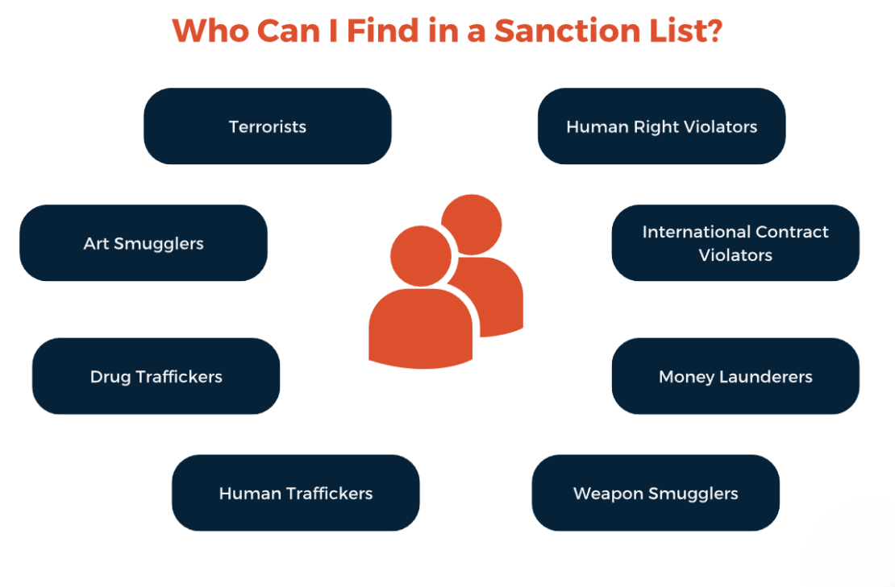

## Table of Contents

## What are economic sanctions?

Economic sanctions are actions taken by countries to limit or stop trade and financial activities with other countries. They are often used to put pressure on a country to change its behavior. For example, if a country is doing something wrong, like violating human rights or trying to make nuclear weapons, other countries might use sanctions to make them stop.

Sanctions can include things like stopping trade, freezing bank accounts, or not allowing certain people to travel. These actions can hurt a country's economy and make life harder for its people. The idea is that if the country's leaders see their people suffering, they might decide to change their policies to get the sanctions lifted. However, sanctions can also cause a lot of problems for regular people who are not involved in the government's decisions.

## What are the primary goals of imposing economic sanctions?

The main goal of economic sanctions is to make a country change its behavior. When a country does something that other countries don't like, like breaking human rights or trying to make dangerous weapons, other countries might use sanctions to make them stop. By limiting trade or freezing bank accounts, the countries imposing the sanctions hope to put pressure on the leaders of the targeted country to change their policies.

Another important goal is to send a message. Sanctions show that the international community disapproves of what the targeted country is doing. This can make other countries think twice before doing the same thing. It's like a warning that if they do something wrong, they might face similar consequences.

Sometimes, sanctions are also used to weaken a country's economy or military power. By cutting off resources and money, the countries imposing the sanctions hope to reduce the targeted country's ability to cause trouble or harm. This can be part of a larger strategy to keep peace and stability in the world.

## How do economic sanctions differ from other forms of economic policy?

Economic sanctions are different from other economic policies because they are used to punish or pressure another country. While other economic policies, like tariffs or subsidies, are usually about protecting a country's own economy or helping certain industries grow, sanctions are about making another country change its behavior. For example, a country might raise tariffs on imports to protect its own businesses, but it would use sanctions to stop trading with a country that is doing something wrong.

Sanctions can also be more targeted than other economic policies. Instead of affecting the whole economy, sanctions can be aimed at specific people, companies, or industries. For instance, a country might freeze the bank accounts of certain leaders or ban trade with companies that are helping to build weapons. Other economic policies, like changing interest rates or taxes, usually affect everyone in the country in the same way. So, sanctions are a special tool that countries use when they want to send a strong message or force another country to do something different.

## What are the common types of economic sanctions?

Economic sanctions come in different forms, but they all aim to put pressure on a country to change its behavior. One common type is trade sanctions, where countries stop trading certain goods or all goods with the targeted country. This can hurt the economy of the country being sanctioned because they can't buy or sell things they need. Another type is financial sanctions, where countries freeze bank accounts or stop financial transactions with the targeted country. This makes it hard for the country to get money to run its government or pay for things.

There are also targeted sanctions, which focus on specific people or groups instead of the whole country. For example, countries might ban travel for certain leaders or stop them from using their bank accounts. This is meant to put pressure on the leaders directly without hurting everyone in the country. Another type is secondary sanctions, where countries punish other countries or companies that do business with the sanctioned country. This makes it even harder for the targeted country to find trading partners or get the things they need.

## Who has the authority to impose economic sanctions?

Countries and international groups can impose economic sanctions. Usually, it's the government of a country that decides to use sanctions. For example, the United States or the European Union might decide to stop trading with a country that is doing something they don't like. The government makes these decisions through laws and special orders. Sometimes, they need to work with other countries to make the sanctions stronger and more effective.

International groups, like the United Nations, can also impose sanctions. These groups are made up of many countries working together. When the United Nations decides to use sanctions, it's because a lot of countries agree that something needs to be done. The United Nations can make rules that all its member countries have to follow. This makes the sanctions even more powerful because more countries are involved.

## How are economic sanctions enforced?

Economic sanctions are enforced by countries and international groups working together. When a country decides to use sanctions, they make laws and rules that their businesses and people have to follow. For example, if the United States wants to stop trading with another country, they might tell American companies that they can't sell things to that country anymore. They can also freeze bank accounts or stop money from moving between the two countries. This means that banks and businesses have to check carefully to make sure they are following the rules, or they could get in trouble.

Sometimes, international groups like the United Nations help enforce sanctions too. When the United Nations decides to use sanctions, they tell all their member countries to follow the rules. This makes the sanctions stronger because more countries are involved. If a country or a company breaks the rules, they might face penalties or even more sanctions. It's a big effort to make sure everyone is doing what they're supposed to do, and it can be hard to keep track of everything, but it's important for the sanctions to work.

## What are the direct economic impacts of sanctions on the targeted country?

When a country faces economic sanctions, it can hurt their economy in many ways. One big problem is that they can't trade as much. If other countries stop buying their goods or selling them things they need, it can make it hard for businesses to keep going. This can lead to less money coming into the country and fewer jobs for people. The government might also find it hard to pay for things like schools and hospitals because they have less money coming in from taxes and trade.

Another impact is that sanctions can make it hard for the country to get money from other places. If banks in other countries freeze their accounts or stop doing business with them, it can be tough to get loans or move money around. This can slow down the economy even more because businesses and the government need money to keep things running. In the end, the people in the country might have a harder time finding things they need, like food and medicine, which can make life very difficult.

## How do economic sanctions affect global trade?

Economic sanctions can change the way countries trade with each other. When one country puts sanctions on another, it means they stop trading certain things or all things with that country. This can make it hard for the sanctioned country to sell its goods to other countries, which can hurt their economy. Other countries might also be afraid to trade with the sanctioned country because they don't want to get in trouble too. This can make global trade more complicated and slower because countries have to find new places to buy and sell things.

Sanctions can also affect countries that are not directly involved. If a big country like the United States puts sanctions on another country, other countries might have to follow the rules too, even if they don't want to. This can make it hard for them to trade with the sanctioned country, and they might lose money or have to find new trading partners. In the end, economic sanctions can make global trade less smooth and can cause problems for many countries, not just the one being sanctioned.

## What are the unintended consequences of economic sanctions?

Economic sanctions can have unintended consequences that make life harder for people who are not involved in the government's decisions. When a country is sanctioned, it might be harder for people to get things they need, like food and medicine. This can lead to more poverty and health problems. Sometimes, the leaders of the sanctioned country might find ways to get around the sanctions, like trading with other countries that don't follow the rules. This means the sanctions might not work as well as planned, and regular people end up suffering more.

Another unintended consequence is that sanctions can hurt the countries that use them too. When a country stops trading with another country, it might lose money and jobs. This can make their own economy weaker. Also, if the sanctioned country finds new trading partners, it can change the way global trade works. This can cause problems for other countries that were not planning to be involved. In the end, economic sanctions can have big effects that are hard to predict and can make life harder for many people around the world.

## How can a country mitigate the effects of economic sanctions?

When a country faces economic sanctions, it can try different things to make the effects less bad. One way is to find new friends to trade with. If the country can sell its goods to other countries that don't follow the sanctions, it can still make money. Another way is to try to make more things at home instead of buying them from other countries. This can help the country be less dependent on the countries that are sanctioning it. The government can also help by giving money or support to businesses and people who are having a hard time because of the sanctions.

Sometimes, a country can also try to talk to the countries that put the sanctions on them. If they can show that they are trying to change or fix the problems that caused the sanctions, the other countries might lift them. It's also important for the country to be smart about how it spends its money and to find ways to keep its economy going, even if it's hard. By working together and being creative, a country can make the effects of sanctions less painful for its people.

## What role does international law play in the application of economic sanctions?

International law helps decide how and when countries can use economic sanctions. It sets rules that countries should follow when they want to stop trading with another country. For example, the United Nations can make rules about sanctions that all its member countries have to follow. These rules make sure that sanctions are used fairly and only when there is a good reason, like if a country is breaking human rights or trying to make dangerous weapons. International law also helps make sure that sanctions don't hurt innocent people too much.

Sometimes, international law can make it harder for a country to use sanctions. If a country doesn't follow the rules set by international groups like the United Nations, other countries might not agree with their sanctions. This can make the sanctions weaker because fewer countries will join in. But when countries do follow international law, their sanctions can be stronger and more effective because more countries will help enforce them. So, international law plays a big role in making sure that economic sanctions are used the right way and can actually work to change a country's behavior.

## How effective are economic sanctions in achieving their intended political or economic outcomes?

Economic sanctions can work sometimes, but they don't always do what they are supposed to do. When they work, they can make a country change its behavior because the leaders see that their people are suffering. For example, if a country stops trying to make nuclear weapons because of sanctions, then the sanctions were effective. But it's hard to know if the sanctions really made the difference, or if other things, like talking or other pressures, helped too.

Sanctions can also have problems. They might not work at all if the leaders of the sanctioned country don't care about their people's suffering. Sometimes, the leaders find ways to get around the sanctions, like trading with other countries that don't follow the rules. Also, sanctions can hurt innocent people a lot, making them poor or sick, even if they didn't do anything wrong. So, while sanctions can be a powerful tool, they are not always the best way to make a country change, and they can cause a lot of problems too.

## References & Further Reading

[1]: Joyner, D. H. (2005). ["International Law and the Proliferation of Weapons of Mass Destruction."](https://academic.oup.com/book/1622) Oxford University Press.

[2]: O'Sullivan, M. L. (2003). ["Shrewd Sanctions: Statecraft and State Sponsors of Terrorism."](https://www.jstor.org/stable/20753413) Brookings Institution Press.

[3]: Cortright, D., & Lopez, G. A. (2002). ["Smart Sanctions: Targeting Economic Statecraft."](https://kroc.nd.edu/research/books/smart-sanctions-targeting-economic-statecraft-2002/) Rowman & Littlefield Publishers.

[4]: Lopez de Prado, M. (2018). ["Advances in Financial Machine Learning."](https://www.amazon.com/Advances-Financial-Machine-Learning-Marcos/dp/1119482089) Wiley.

[5]: Farahani, M., & Gill, P. (2019). ["Iran's Relations with China: From Sanctions to the Joint Comprehensive Plan of Action."](https://pmc.ncbi.nlm.nih.gov/articles/PMC7237115/) British Journal of Middle Eastern Studies.

[6]: Eisenstadt, M. (2011). ["Iran's Nuclear Program: Status and Responses."](https://en.wikipedia.org/wiki/Axial_Age) The Washington Institute for Near East Policy.

[7]: Nakamoto, S. (2008). ["Bitcoin: A Peer-to-Peer Electronic Cash System."](https://nakamotoinstitute.org/library/bitcoin/) Bitcoin.org.