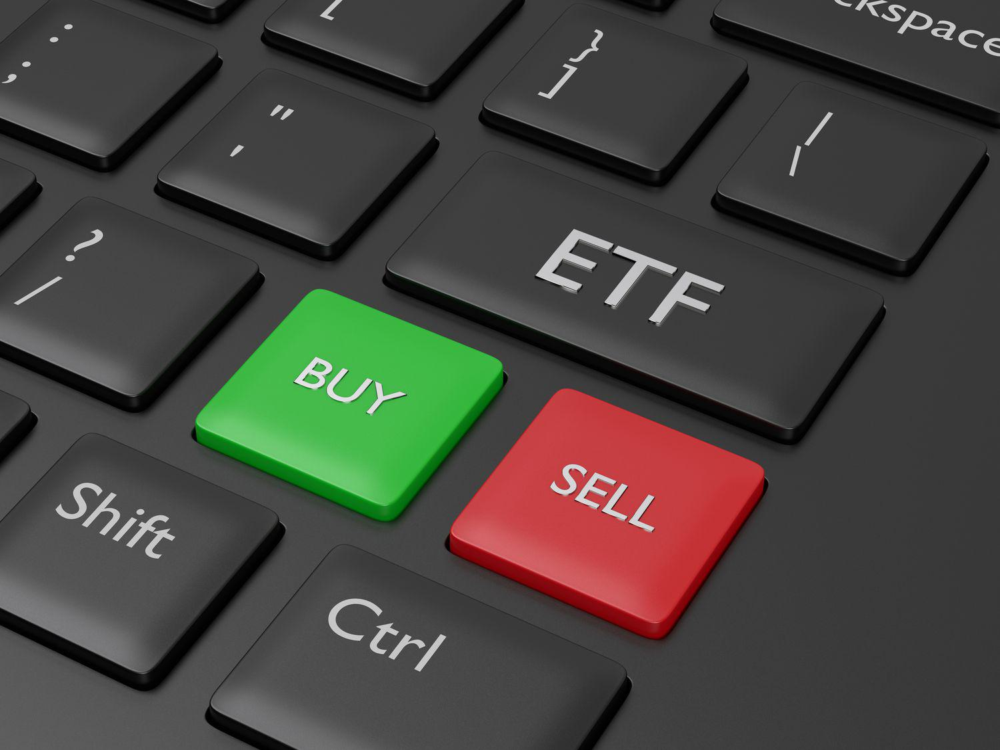

## Table of Contents

## What is an ETF and how does it differ from mutual funds?

An ETF, or Exchange-Traded Fund, is a type of investment fund that you can buy and sell on a stock exchange, just like stocks. It holds a collection of assets, like stocks, bonds, or commodities, and aims to track the performance of a specific index, such as the S&P 500. ETFs are popular because they offer diversification, which means they spread out the risk by holding many different investments, and they often have lower fees than other types of funds.

ETFs differ from mutual funds in a few key ways. One main difference is how they are traded. ETFs can be bought and sold throughout the trading day at market prices, while mutual funds are only traded once a day after the market closes, at a price calculated from the net asset value of the fund's holdings. Another difference is the cost. ETFs usually have lower expense ratios than mutual funds, which means they can be cheaper to own over time. Lastly, ETFs often have more tax efficiency because of how they are structured, which can be beneficial for investors looking to minimize their tax bills.

## What is arbitrage and why is it important in the context of ETFs?

Arbitrage is when someone buys something in one place and sells it in another place for a higher price. It's like buying a toy at a store where it's on sale and then selling it online where people are willing to pay more. In the world of ETFs, arbitrage helps keep the price of the ETF close to the value of the assets it holds. If the ETF's price gets too high or too low compared to its assets, people can make money by buying or selling the ETF and its assets to bring the prices back in line.

This is important for ETFs because it helps them work smoothly. When the price of an ETF stays close to the value of its assets, investors can trust that they are getting a fair deal. If arbitrage didn't exist, the price of an ETF could swing wildly, making it risky and less attractive to investors. So, arbitrage is like a safety net that keeps the ETF market stable and reliable.

## What are the basic principles of ETF arbitrage?

ETF arbitrage works by taking advantage of small differences between the price of an ETF and the value of the assets it holds. Imagine an ETF that tracks a basket of stocks. If the ETF's price is lower than the total value of those stocks, someone can buy the ETF and sell the stocks, making a profit from the difference. This action pushes the ETF's price up. On the other hand, if the ETF's price is higher than the stocks' value, someone can buy the stocks and sell the ETF, again making a profit and pushing the ETF's price down.

This process keeps the ETF's price in line with its underlying assets. It's like a self-correcting mechanism. When many people are doing this arbitrage, it helps make sure the ETF's price stays close to what it should be, based on the value of the stocks or other assets it holds. This is important because it makes ETFs a reliable investment tool for people who want to invest in a way that's easy to understand and trust.

## How does the creation and redemption process work in ETF arbitrage?

The creation and redemption process is key to how ETF arbitrage works. When an ETF's price is higher than the value of its assets, big investors called authorized participants (APs) can create new shares of the ETF. They do this by giving the ETF provider a basket of the assets the ETF tracks. In return, they get new ETF shares that they can sell at the higher price. This action increases the number of ETF shares in the market, which helps bring the ETF's price back down to match the value of its assets.

On the other hand, when the ETF's price is lower than the value of its assets, APs can redeem ETF shares. They give the ETF provider a bunch of ETF shares and get back the underlying assets. They can then sell these assets at a higher price than the ETF shares they gave up. This action decreases the number of ETF shares in the market, which helps push the ETF's price back up to match the value of its assets. This back-and-forth process keeps the ETF's price in line with its underlying assets, making ETFs a stable and reliable investment.

## What are authorized participants and what role do they play in ETF arbitrage?

Authorized participants, or APs, are big investors or financial institutions that have a special role in the world of ETFs. They are the only ones who can create new ETF shares or get rid of existing ones. This is important because it helps keep the ETF's price in line with the value of the assets it holds. When the ETF's price is too high, APs can create new shares by giving the ETF provider a basket of the assets the ETF tracks. They then sell these new shares at the higher price, which helps bring the ETF's price back down.

On the other hand, when the ETF's price is too low, APs can redeem ETF shares. They give the ETF provider a bunch of ETF shares and get back the underlying assets. They can then sell these assets at a higher price than the ETF shares they gave up. This action decreases the number of ETF shares in the market, which helps push the ETF's price back up to match the value of its assets. By doing this, APs play a crucial role in keeping the ETF market stable and making sure that the price of an ETF stays close to what it should be.

## What are the different types of ETF arbitrage strategies?

ETF arbitrage strategies come in different forms, but they all aim to make money from small differences between an ETF's price and the value of its assets. One common strategy is called "creation-redemption arbitrage." When an ETF's price is higher than the value of its assets, big investors called authorized participants can create new ETF shares by giving the ETF provider a basket of the assets the ETF tracks. They then sell these new shares at the higher price, making a profit and helping to bring the ETF's price back down. On the other hand, when the ETF's price is lower than the value of its assets, these investors can redeem ETF shares. They give the ETF provider a bunch of ETF shares and get back the underlying assets, which they can sell at a higher price than the ETF shares they gave up, again making a profit and helping to push the ETF's price back up.

Another type of ETF arbitrage strategy is "nav arbitrage." NAV stands for Net Asset Value, which is the total value of all the assets in the ETF. If the ETF's market price is different from its NAV, traders can buy the ETF and sell the assets, or buy the assets and sell the ETF, to make money from the difference. This helps keep the ETF's price in line with its NAV. There's also "pairs trading," where traders look for two ETFs that usually move together but have temporarily drifted apart. They might buy the cheaper ETF and sell the more expensive one, betting that the prices will come back together, allowing them to make a profit.

These strategies show how ETF arbitrage can work in different ways, but they all rely on the same basic idea: finding and taking advantage of small price differences to make money and help keep the ETF market stable.

## How do market makers use ETF arbitrage to manage liquidity?

Market makers help keep the ETF market running smoothly by making sure there are always buyers and sellers. They use ETF arbitrage to manage liquidity, which means making sure there are enough shares available for people to trade. When an ETF's price gets too high compared to the value of its assets, market makers can create new shares. They do this by giving the ETF provider the assets the ETF tracks, and then they sell these new shares. This brings more shares into the market, which helps lower the ETF's price and makes it easier for people to buy and sell.

On the other hand, when the ETF's price is too low, market makers can buy up the ETF shares and give them back to the ETF provider in exchange for the underlying assets. They can then sell these assets at a higher price. This action takes some ETF shares out of the market, which helps raise the ETF's price. By doing this, market makers make sure there's always a good balance of buying and selling, which keeps the market liquid and helps investors trade without big price swings.

## What are the risks associated with ETF arbitrage?

ETF arbitrage can be risky because it's not always easy to make money from the small price differences. Sometimes, the costs of buying and selling the ETF and its assets can be high, like trading fees and taxes. If these costs are too high, the arbitrage might not be worth it. Also, there's a risk that the price difference might not last long enough for the arbitrage to work. If the ETF's price and the value of its assets change quickly, the arbitrage opportunity could disappear before someone can make a profit.

Another risk is that the market can be unpredictable. Sometimes, big events like economic news or unexpected changes in the market can cause the ETF's price to move in ways that are hard to predict. This can make it tricky to know when to buy or sell for arbitrage. If the market moves against the arbitrage strategy, someone could end up losing money instead of making it. So, while ETF arbitrage can be a way to make money, it's important to understand these risks and be ready for them.

## How does ETF arbitrage impact the pricing and tracking error of ETFs?

ETF arbitrage helps keep the price of an ETF close to the value of the assets it holds. When the ETF's price gets too high or too low compared to its assets, people can make money by buying or selling the ETF and its assets. This action pushes the ETF's price back in line with its assets. It's like a self-correcting system that makes sure the ETF's price stays fair and close to what it should be. This is important because it makes ETFs a reliable investment for people who want to invest in a way that's easy to understand and trust.

Arbitrage also affects the tracking error of ETFs, which is how much the ETF's performance differs from the index it's trying to copy. When arbitrage works well, it keeps the ETF's price close to its assets, which helps the ETF track its index more accurately. If the ETF's price gets too far away from its assets, the tracking error can get bigger. But because arbitrage helps keep the price in line, it usually helps keep the tracking error small. This makes ETFs a good choice for investors who want to follow the performance of a specific index as closely as possible.

## What tools and data are necessary for effective ETF arbitrage?

To do ETF arbitrage well, you need some important tools and data. First, you need real-time market data that shows the current prices of the ETF and the assets it holds. This helps you spot the small price differences that you can use to make money. You also need a trading platform that lets you buy and sell quickly and easily. This is important because arbitrage opportunities can disappear fast, so you need to act quickly. Having access to a good analytics tool can also help. It can show you trends and patterns in the market, which can help you decide when to make your moves.

Another thing you need is data about the ETF's net asset value (NAV), which is the total value of all the assets in the ETF. You can compare this with the ETF's market price to see if there's an arbitrage opportunity. It's also helpful to have information about the trading [volume](/wiki/volume-trading-strategy) and liquidity of the ETF and its assets. This tells you how easy it will be to buy and sell without affecting the price too much. Finally, keeping up with market news and economic events can help you understand what might cause the ETF's price to change, so you can be ready to take advantage of arbitrage opportunities when they come up.

## How do regulatory environments affect ETF arbitrage practices?

The rules and laws set by governments and financial watchdogs can change how ETF arbitrage works. These rules can make it easier or harder to do arbitrage. For example, some countries have strict rules about how much you can trade or what kind of information you need to share. If the rules are too tight, it might be harder to find and use arbitrage opportunities because you might not be able to buy and sell as quickly or as much as you want. Also, different countries might have different tax laws, which can affect how much money you make from arbitrage. If the taxes are high, it might not be worth doing arbitrage because the costs could be too high.

On the other hand, if the rules are clear and easy to follow, it can help arbitrage work better. When everyone knows the rules and can trust that they are fair, more people might want to do arbitrage. This can make the ETF market more stable and liquid, which means it's easier for people to buy and sell. Regulators might also keep an eye on arbitrage to make sure it's not causing problems in the market. They might step in if they see that arbitrage is making prices move too much or if people are trying to use it to cheat. So, the rules can shape how arbitrage is done and how well it works.

## What advanced techniques can be used to optimize ETF arbitrage profits?

To make more money from ETF arbitrage, you can use some smart tricks. One trick is to use computer programs that can spot arbitrage chances really fast. These programs can look at lots of data and find small price differences that people might miss. They can also buy and sell very quickly, which is important because arbitrage opportunities can disappear in a flash. Another trick is to use a special kind of trading called "[algorithmic trading](/wiki/algorithmic-trading)." This means using math formulas to decide when to buy and sell. It can help you make better choices and make more money.

Another way to make more money is to pay attention to how different ETFs are connected. Sometimes, two ETFs that follow the same thing can have different prices. If you can spot this, you can buy the cheaper one and sell the more expensive one, betting that their prices will come back together. This is called "pairs trading." Also, keeping an eye on big news and events can help. If you know what might make ETF prices change, you can be ready to take advantage of arbitrage chances when they pop up. By using these smart tricks, you can make your ETF arbitrage work better and make more money.

## What are ETFs and how does arbitrage work with them?

Exchange-Traded Funds (ETFs) have grown in popularity among investors, primarily due to their liquidity and diversification benefits. ETFs trade on major exchanges similar to stocks, enabling investors to buy and sell throughout the trading day. This provides a level of flexibility and market access that enhances an investor's ability to respond to market movements swiftly. In addition, ETFs typically contain a diversified portfolio of assets, which reduces risk compared to investing in individual securities.

Arbitrage in ETFs leverages price discrepancies between an ETF's market price and its Net Asset Value (NAV). This divergence often occurs due to investor demand and supply dynamics. The NAV is a measure of an ETF's value based on the market value of its underlying assets, calculated daily. However, an ETF's market price can fluctuate throughout the trading day, sometimes deviating from the NAV due to market pressures.

Traders exploit these discrepancies through [arbitrage](/wiki/arbitrage). When an [ETF](/wiki/etf-trading-strategies) trades lower than its NAV, traders can buy the underpriced ETF and sell the corresponding basket of underlying securities at their collective market value, procuring a profit from the differential. Conversely, if the ETF trades at a premium, traders might sell the ETF while purchasing the underlying securities, again profiting from the price variance.

The arbitrage process involves complex mechanisms driven by authorized participants (APs) who possess the ability to create or redeem ETF shares. When an ETF is undervalued, APs buy shares, redeem them for the underlying assets, and sell those assets at market value, thereby reducing supply and correcting the price disparity. Conversely, when an ETF is overvalued, APs buy the underlying assets, create more ETF shares, and sell them to the market, increasing supply and realigning the market price with the NAV.

$$
\text{Arbitrage Profit} = (\text{Market Price} - \text{NAV}) \times \text{Number of Shares}
$$

In practice, this process is facilitated by the [liquidity](/wiki/liquidity-risk-premium) and diversity of the ETF market, which provides ample opportunities for traders to execute such strategies efficiently. While minor discrepancies can persist due to transaction costs and other market frictions, the arbitrage mechanism ensures that these inefficiencies are typically corrected quickly, reinforcing market equilibrium over time. Through these actions, arbitrageurs play an essential role in maintaining the pricing accuracy of ETFs, contributing to the overall stability and efficiency of financial markets.

## References & Further Reading

[1]: Madhavan, A. (2012). ["Exchange-Traded Funds, Market Structure, and the Flash Crash"](https://rpc.cfainstitute.org/en/research/financial-analysts-journal/2012/exchange-traded-funds-market-structure-and-the-flash-crash). Financial Analysts Journal.

[2]: Hasbrouck, J. (2003). ["Intraday Price Formation in U.S. Equity Markets"](https://onlinelibrary.wiley.com/doi/10.1046/j.1540-6261.2003.00609.x). The Journal of Finance.

[3]: Pennacchi, G. (2008). ["Theory of Asset Pricing"](https://gpennacc.web.illinois.edu/TAP_Aug2020_FrontMatter.pdf). Pearson.

[4]: Chan, E. (2009). ["Quantitative Trading: How to Build Your Own Algorithmic Trading Business"](https://github.com/ftvision/quant_trading_echan_book) by Ernest P. Chan.

[5]: Lopez de Prado, M. (2018). ["Advances in Financial Machine Learning"](https://www.amazon.com/Advances-Financial-Machine-Learning-Marcos/dp/1119482089) by Marcos Lopez de Prado.