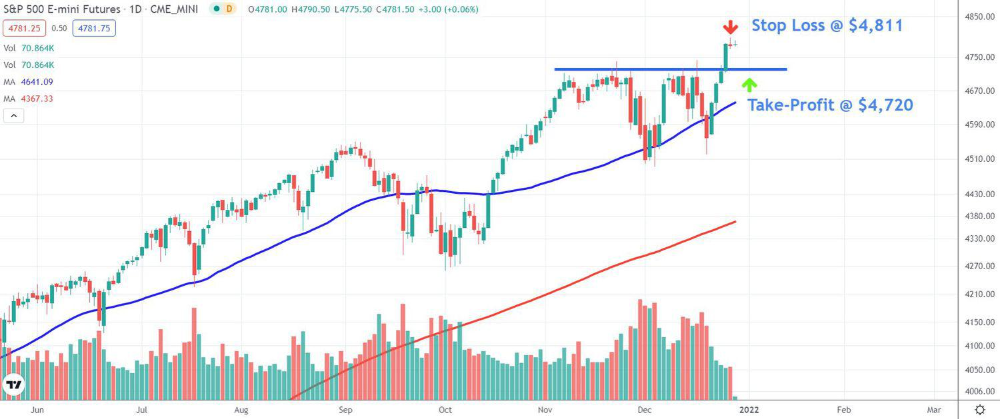

Futures trading is a vital component of modern financial markets, allowing participants to hedge risks or speculate on the future prices of assets. It involves the buying and selling of futures contracts, which are standardized agreements to buy or sell a particular asset at a predetermined price on a specified future date. This form of trading is significant because it provides liquidity, price discovery, and risk management tools, making it indispensable for various market participants.

The S&P 500, a key stock market index, is composed of 500 large-cap U.S. companies and serves as a benchmark for the U.S. equity market. Created by Standard & Poor's, this index is widely used in futures trading to gauge the market's performance and investor sentiment. S&P 500 futures offer substantial benefits, including high liquidity and significant volatility, which are attractive features for traders and investors looking to manage risk or capitalize on market movements.



Algorithmic trading, commonly known as algo trading, has seen rapid growth and transformation within the financial sector. Utilizing complex algorithms and computer systems, traders can execute orders at speeds and frequencies that surpass human capabilities. This approach has revolutionized trading by increasing efficiency, accuracy, and the potential for profit. Algorithms analyze massive datasets to identify opportunities and execute trades, often in a fraction of a second.

This article aims to explore the intersection of futures trading and algorithmic trading, specifically focusing on S&P 500 futures. By examining how these two dynamic fields interact, we aim to highlight the transformative impact of technology on trading strategies and market dynamics. Algorithmic trading in futures markets presents numerous advantages, such as enhanced speed and precision, which can lead to improved returns and reduced human error.

The article will encompass several key areas. Initially, we will define futures trading and its role in financial markets, followed by an exploration of the S&P 500 index. We will then trace the evolution of algorithmic trading, investigating various strategies such as trend following and market-making specifically for S&P 500 futures. Additionally, we will outline the benefits and risks associated with algo trading and provide a guide for beginners interested in venturing into this domain. We will conclude with reflections on the future of futures trading and algorithmic strategies, encouraging readers to remain informed about ongoing market and technological advancements.

## Table of Contents

## Understanding Futures Trading

Futures trading is a financial transaction involving agreements to buy or sell assets at a predetermined future date and price. These agreements, known as futures contracts, function as standardized legal agreements on an exchange. The buyer of a futures contract is obligated to purchase the underlying asset, while the seller is obligated to sell it at the contract's expiration date, regardless of current market conditions.

Futures contracts play a critical role in hedging and speculation. Hedging involves reducing risk exposure to unfavorable price movements, allowing companies to stabilize revenues and costs by locking in prices. For example, a farmer might use futures contracts to lock in a sale price for their crop months before harvest. Conversely, speculators utilize futures contracts to profit from anticipated price movements, providing [liquidity](/wiki/liquidity-risk-premium) and [volatility](/wiki/volatility-trading-strategies) to the markets. These speculators often do not intend to take delivery of the underlying asset but are instead driven by short-term financial gain.

The key participants in the futures market include hedgers, speculators, and arbitrageurs. Hedgers, such as corporations and producers, aim to protect themselves from adverse price shifts. Speculators, often individual traders and financial institutions, seek profits by predicting future price changes. Arbitrageurs, on the other hand, exploit price discrepancies across markets or related securities to achieve risk-free profits. They ensure market efficiency by narrowing price differences through simultaneous buying and selling.

Futures trading boasts a rich history, with origins tracing back centuries. Early forms of futures contracts can be found as far back as Mesopotamia and the Japanese rice markets in the 17th century. However, the modern iteration of futures trading began with the Chicago Board of Trade (CBOT) in the mid-19th century, created to address agricultural market uncertainties. This evolved into more diversified financial instruments, extending beyond agricultural commodities to include various assets like currencies, interest rates, and stock indices.

In the context of stock indices, such as the S&P 500, futures trading involves agreements based on the index's expected future value. The S&P 500, comprising 500 of the largest U.S. companies, serves as a benchmark for the U.S. stock market's performance. Trading futures on such an index allows investors to speculate or hedge against the overall market's movement, rather than individual stocks. This approach provides unique strategic opportunities due to the S&P 500's inherent liquidity and volatility, offering the potential for significant gains or effective risk management.

## What is the S&P 500?

The S&P 500, officially known as the Standard & Poor's 500, stands as one of the most significant stock market indices globally. It comprises 500 of the largest publicly traded companies in the United States, across various industries, selected based on market capitalization, liquidity, and sector representation. These components represent nearly 80% of the total value of the U.S. stock market, offering a broad and diverse gauge of the overall market's health and performance.

The significance of the S&P 500 lies not only in its comprehensive coverage of major U.S. industries but also in its role as a benchmark for investors. It serves as a bellwether for economic conditions, guiding investment strategies and portfolio management worldwide. Investors use the S&P 500 to measure the performance of mutual funds, ETFs, and portfolios, given its status as a proxy for the broader market.

In futures trading, the S&P 500 is leveraged through S&P 500 futures contracts, which are standardized agreements that allow traders to buy or sell the index at a predetermined price at a future date. These contracts play a crucial role in facilitating hedging and speculation. For instance, an investor anticipating a market decline might sell S&P 500 futures to hedge against potential losses in their portfolio. Conversely, a speculator betting on a market rise might purchase futures to gain from price increases.

Trading S&P 500 futures offers several benefits. One of the foremost advantages is liquidity. As one of the most heavily traded index futures markets, the S&P 500 futures ensure that traders can enter and [exit](/wiki/exit-strategy) positions easily without significantly affecting prices. This liquidity translates into tighter bid-ask spreads, reducing trading costs for participants.

Volatility is another advantage associated with S&P 500 futures trading. Given the index's composition and market influence, it responds swiftly to economic indicators, company earnings, and geopolitical events, presenting numerous opportunities for traders to capitalize on price movements. Moreover, trading can occur almost 24 hours a day, thanks to electronic trading systems, allowing for global participation and responsiveness to developments outside normal U.S. market hours.

In sum, the S&P 500 stands as a pivotal component of the global financial ecosystem. Its use in futures trading underscores its value as a tool for risk management and strategic investment, benefiting from substantial liquidity and inherent market volatility.

## The Evolution of Algorithmic Trading

Algorithmic trading, often referred to as algo trading, marks a significant evolution in modern financial markets. It started gaining prominence in the 1970s when the New York Stock Exchange introduced the Designated Order Turnaround system (DOT) to route orders electronically. However, the true revolution began with the advent of the 1980s and 1990s as computing technology advanced rapidly. This period saw the development of Electronic Communication Networks (ECNs) which facilitated more efficient electronic trading and allowed institutional traders to bypass traditional exchanges.

Several key technological developments have notably propelled algo trading. The increase in computational power enabled complex data analysis and faster trade execution. Additionally, the interconnectivity brought by the internet facilitated real-time data feeds and communication between markets globally. The implementation of sophisticated algorithms became more feasible, handling massive volumes of trading data and executing trades at unprecedentedly high speeds.

Today's algo trading strategies are diverse and cater to various trading goals. Common strategies include:

1. **Trend Following**: This strategy involves algorithms that identify and capitalize on trends in stock prices, commodities, or currencies.

2. **Arbitrage**: Here, algorithms exploit price differentials across different markets or securities to generate profit.

3. **Market Making**: This strategy involves providing liquidity to the market by placing both buy and sell orders in securities.

4. **Mean Reversion**: Based on the notion that prices and returns eventually move back to the mean, algorithms identify securities that are expected to revert to their historical averages.

5. **Execution-Based Strategies**: These are designed to fulfill large orders with minimal market impact by slicing the order into smaller parts, such as VWAP (Volume Weighted Average Price).

Algorithmic trading offers compelling advantages, primarily speed and efficiency. Algorithms can execute trades in fractions of a second, significantly faster than human traders. This speed allows traders to capitalize on price inefficiencies and market fluctuations instantaneously. Moreover, algorithms enhance precision by removing human emotions from trading decisions, leading to more consistent performance.

Currently, a growing trend is the integration of [machine learning](/wiki/machine-learning) and [artificial intelligence](/wiki/ai-artificial-intelligence) into algorithmic strategies. Machine learning models can process and analyze massive datasets to identify patterns and predict market movements with greater accuracy. This is coupled with the rise of data analytics tools, which enable traders to refine their strategies continually.

The future of [algorithmic trading](/wiki/algorithmic-trading) appears promising, with continuous advancements in AI, machine learning, and computational technology. These developments are likely to enhance the capability of algorithms, leading to even more sophisticated strategies that adapt effectively to fluctuating market conditions. As markets continue to evolve with technology, algorithmic trading is expected to play a dominant role in shaping the landscape of future financial markets.

## Algorithmic Strategies for S&P 500 Futures

Algorithmic trading strategies are pivotal in trading S&P 500 futures. These strategies leverage computational power and data analysis to inform trading decisions, maximize returns, and manage risks in a fast-paced financial environment.

### Overview of Popular Algorithmic Strategies

1. **Trend Following Strategies**: 
   These strategies are based on the principle that prices continue in a given direction for an extended period. By identifying and aligning with these trends, traders can capitalize on [momentum](/wiki/momentum). Trend following often uses indicators such as moving averages, momentum indicators, and Relative Strength Index (RSI) to signal when to enter or exit a trade. A simple Python code snippet for a moving average crossover strategy might be:

   ```python
   import pandas as pd

   def moving_average_strategy(data, short_window=40, long_window=100):
       signals = pd.DataFrame(index=data.index)
       signals['price'] = data['Close']
       signals['short_mavg'] = data['Close'].rolling(window=short_window, min_periods=1).mean()
       signals['long_mavg'] = data['Close'].rolling(window=long_window, min_periods=1).mean()
       signals['signal'] = 0.0
       signals['signal'][short_window:] = np.where(signals['short_mavg'][short_window:] 
                                                   > signals['long_mavg'][short_window:], 1.0, 0.0)   
       signals['positions'] = signals['signal'].diff()
       return signals
   ```

2. **Market Making and Arbitrage Strategies**:
   Market making involves providing liquidity to the market by simultaneously quoting buy and sell prices and profiting from the bid-ask spread. Arbitrage strategies exploit price inefficiencies between related markets or instruments. For instance, if S&P 500 futures prices deviate from their theoretical value, arbitrageurs may execute trades to capture price discrepancies.

3. **Machine Learning and AI**:
   The adoption of machine learning and AI in algorithmic trading has transformed strategy development. These technologies can analyze vast datasets to uncover patterns that are not immediately apparent, offering a competitive edge. Machine learning models, such as neural networks or random forests, are trained on historical data to predict price movements or optimize portfolio allocations.

   A basic example of using machine learning in trading might involve using a classification model to predict the direction of future price movements:

   ```python
   from sklearn.ensemble import RandomForestClassifier

   def train_ml_model(features, target):
       model = RandomForestClassifier(n_estimators=100)
       model.fit(features, target)
       return model

   def predict_movement(model, new_data):
       return model.predict(new_data)
   ```

### Case Studies and Examples 
Several firms have successfully harnessed these strategies. Renowned [quantitative trading](/wiki/quantitative-trading) firms like Renaissance Technologies have achieved remarkable success using proprietary algorithms. The firm employs advanced quantitative models and a team of scientists and mathematicians to trade a wide array of financial instruments, including S&P 500 futures.

Another example is Two Sigma, which uses AI and machine learning extensively to develop trading strategies. The firm's data-driven approach, employing sophisticated predictive models and vast computing resources, exemplifies the potential of algorithms in futures trading.

These examples demonstrate not only the practicality of algorithmic strategies but also their potential to revolutionize traditional trading paradigms. As technology continues to evolve, the integration of AI and machine learning into trading strategies is expected to become even more pronounced, offering new opportunities and challenges in the S&P 500 futures market.

## The Benefits and Risks of Algo Trading in Futures Markets

Algorithmic trading, particularly in futures markets, presents a range of benefits and risks that traders need to consider carefully. 

**Benefits of Algorithmic Trading in Futures Markets**

One of the primary benefits of algorithmic trading is the significant enhancement in trading speed. Algorithms can process vast amounts of market data and execute orders within milliseconds, something that human traders cannot match. According to a report from the European Central Bank, the automation speed allows traders to capitalize on fleeting market opportunities, thus potentially increasing profitability [1].

Another benefit is the precision and consistency that algorithms bring to trading. Human traders are susceptible to emotions and fatigue, which can lead to inconsistent decisions. Algorithms, however, operate based on pre-set rules and parameters, thus ensuring a consistent execution of the trading strategy. This consistency can enhance profitability by minimizing errors due to emotional or psychological biases.

Algorithmic trading also introduces efficiencies in terms of cost. As operations are automated, costs arising from manual errors are reduced. Furthermore, algorithms can execute complex strategies involving multiple orders across various markets, which would be infeasible manually and costlier in terms of manpower.

**Risks and Challenges of Algorithmic Trading**

Despite its advantages, algorithmic trading comes with significant risks. One of the primary concerns is the risk of technical failures. Since algorithmic trading relies heavily on technology, any malfunction in software, hardware, or network infrastructure can lead to significant financial losses. For example, the infamous 'Flash Crash' of May 6, 2010, is a stark reminder of the potential drawbacks associated with technical failures in algorithmic trading systems [2].

Another challenge is the risk of over-optimization, commonly referred to as "curve-fitting." This occurs when an algorithm is fine-tuned to perform exceptionally well on historical data but fails to adapt to new market conditions. This overfitting can misleadingly suggest a strategy's robustness, only for it to underperform in live markets.

Moreover, the competitive nature of algorithmic trading means that successful strategies can quickly become obsolete as other traders adapt and compete for the same opportunities. The constant need for innovation and adaptation adds a layer of complexity and risk management that traders must navigate.

**Management of Risk in Algo Trading: Tools and Best Practices**

To mitigate these risks, traders employ various tools and best practices. Robust risk management protocols, such as stop-loss orders and real-time monitoring systems, are critical. Continuous [backtesting](/wiki/backtesting) and optimization, using simulation environments for testing strategies under various market scenarios, is essential in minimizing the risk of overfitting.

Algorithmic traders also often use statistical measures like the Sharpe Ratio to evaluate the risk-adjusted return of their strategies. By employing a ratio that considers both risks (volatility) and returns, traders can better assess the potential success of their algorithms in real-world conditions.

```python
def sharpe_ratio(returns, risk_free_rate=0.02):
    excess_returns = returns - risk_free_rate
    return excess_returns.mean() / excess_returns.std()
```

**Regulatory Considerations and Market Impacts**

The regulatory environment significantly influences algorithmic trading. Regulators worldwide, including the U.S. Securities and Exchange Commission (SEC), impose stringent requirements on algorithmic trading systems. These include ensuring fair practices, minimizing risks of market manipulation, and establishing stringent controls over algorithms' lifecycle, from development to deployment.

Widespread algorithm use also impacts market dynamics. It can lead to increased volatility, as the speed and [volume](/wiki/volume-trading-strategy) at which algorithms trade can amplify price swings, particularly during periods of market stress. Regulatory bodies continually adapt to these changes to ensure the stability and integrity of financial markets.

References:
- [1] European Central Bank. "Algorithmic Trading in the Global Financial Markets." 
- [2] U.S. Securities and Exchange Commission and the Commodity Futures Trading Commission. "Findings Regarding the Market Events of May 6, 2010."

## Getting Started with Algo Trading in S&P 500 Futures

Embarking on algorithmic trading for S&P 500 futures can be an exciting and potentially profitable venture. For beginners, understanding the essential components and developing a structured approach is crucial. This section provides a step-by-step guide to get started with algo trading for S&P 500 futures, covering necessary software, algorithm development and backtesting, learning resources, and broker selection.

### Step-by-Step Guide to Algo Trading for Beginners

1. **Understand the Basics**: Gain an understanding of futures trading and the S&P 500 index. It's essential to comprehend how futures contracts work, the role of the S&P 500 in the market, and the principles of algorithmic trading.

2. **Acquire Essential Software and Tools**: 
   - **Trading Platforms**: Platforms like MetaTrader, ThinkorSwim, or NinjaTrader provide a comprehensive environment for executing and managing trades.
   - **Programming Environments**: Python is widely preferred for its simplicity and extensive libraries. Tools like Jupyter Notebook or IDLE can be used for coding.
   - **Data Feeds**: Access to real-time and historical data is crucial. Bloomberg, Reuters, or Quandl provide such services.

3. **Developing Trading Algorithms**: 
   - Start by defining a trading strategy. For instance, a basic moving average crossover strategy can be a good starting point.
   - Write the code to implement the logic. Here is a simple example in Python using pandas:

   ```python
   import pandas as pd

   # Load historical data
   data = pd.read_csv('sp500_futures.csv')

   # Compute moving averages
   data['SMA_50'] = data['Close'].rolling(window=50).mean()
   data['SMA_200'] = data['Close'].rolling(window=200).mean()

   # Generate signals
   data['Signal'] = 0
   data.loc[data['SMA_50'] > data['SMA_200'], 'Signal'] = 1
   data.loc[data['SMA_50'] < data['SMA_200'], 'Signal'] = -1
   ```

4. **Backtesting Algorithms**: 
   - Test your strategy using historical data to evaluate how it would have performed.
   - Libraries such as Backtrader in Python can be helpful. Ensure to simulate transaction costs and slippage to get realistic results.

5. **Resources for Learning and Development**: 
   - **Courses**: Online platforms like Coursera, Udacity, or Udemy offer courses on algorithmic trading and financial analysis.
   - **Books**: Consider reading "Algorithmic Trading" by Ernie Chan or "Trading and Exchanges" by Larry Harris for deeper insights.
   - **Online Communities**: Engage with forums such as QuantConnect, QuantInsti's community, or Stack Exchange's quantitative finance section for peer support and idea exchange.

6. **Choosing a Broker and Platform**:
   - Look for brokers who offer APIs for automation, low latency execution, and competitive commission structures. Examples include Interactive Brokers and TD Ameritrade.
   - Ensure they provide comprehensive support for futures trading and integration with your chosen trading platform.

By following these steps, beginners can systematically begin their journey into algorithmic trading of S&P 500 futures. It's vital to approach this endeavor with continuous learning and adaptation to changes in technology and market dynamics.

## Conclusion

In this article, we explored the intricate landscape of algo trading within the S&P 500 futures market, highlighting its significant potential to revolutionize trading strategies. Algorithmic trading has emerged as a pivotal force, providing traders with unparalleled speed, accuracy, and the ability to manage large volumes of data efficiently. The fusion of futures trading with sophisticated algorithmic strategies offers traders a competitive edge, though it necessitates a vivid understanding of both opportunities and inherent challenges.

Algorithmic strategies present various opportunities to capitalize on market movements, offering a structured approach to trading that can enhance profitability. However, traders must remain cautious of potential pitfalls such as algorithmic errors, market volatility, and the repercussions of high-frequency trading. Proper risk management and a thorough understanding of regulatory requirements are essential to navigate these challenges successfully.

Looking forward, the symbiosis between technology and futures trading indicates a transformative future for the financial markets, with algorithmic strategies playing a crucial role. Machine learning and artificial intelligence advancements continually refine these strategies, promising even greater efficiency and adaptability. 

As this technological evolution continues, it is crucial for traders and market participants to stay informed and educated about the latest developments, tools, and methods. Continuous learning and adaptation are imperative to harness the full potential of algorithmic trading and to maintain a competitive edge in the ever-evolving landscape of the financial markets.

Traders are encouraged to engage with online communities, partake in specialized courses, and leverage available resources to build a robust knowledge base. By embracing this dynamic trading arena with an informed and strategic approach, traders can effectively capitalize on future opportunities while mitigating risks.

## References & Further Reading

[1]: Bergstra, J., Bardenet, R., Bengio, Y., & Kégl, B. (2011). ["Algorithms for Hyper-Parameter Optimization."](https://papers.nips.cc/paper/4443-algorithms-for-hyper-parameter-optimization) Advances in Neural Information Processing Systems 24.

[2]: ["Advances in Financial Machine Learning"](https://www.amazon.com/Advances-Financial-Machine-Learning-Marcos/dp/1119482089) by Marcos Lopez de Prado

[3]: ["Evidence-Based Technical Analysis: Applying the Scientific Method and Statistical Inference to Trading Signals"](https://www.amazon.com/Evidence-Based-Technical-Analysis-Scientific-Statistical/dp/0470008741) by David Aronson

[4]: ["Machine Learning for Algorithmic Trading"](https://github.com/PacktPublishing/Machine-Learning-for-Algorithmic-Trading-Second-Edition) by Stefan Jansen

[5]: ["Quantitative Trading: How to Build Your Own Algorithmic Trading Business"](https://www.amazon.com/Quantitative-Trading-Build-Algorithmic-Business/dp/0470284889) by Ernest P. Chan