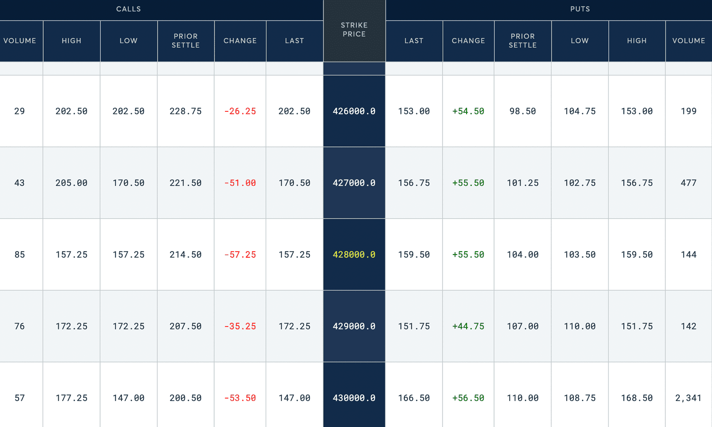

## Table of Contents

## What are S&P 500 Futures?

S&P 500 Futures are contracts that let people bet on where they think the S&P 500 index will go in the future. The S&P 500 is a big list of 500 important companies in the U.S., and it's used to see how well the stock market is doing. When you buy or sell an S&P 500 Futures contract, you're not buying the actual stocks in the index. Instead, you're making a deal that says you'll buy or sell the value of the index at a certain price on a certain date in the future.

These futures are used by investors and traders for different reasons. Some use them to try to make money by guessing if the market will go up or down. Others use them to protect their investments. For example, if someone owns a lot of stocks and is worried the market might go down, they can use S&P 500 Futures to help reduce their risk. Futures are traded on special markets, and their prices can change a lot, so they can be risky but also offer big rewards.

## How do S&P 500 Futures work?

S&P 500 Futures are like bets on what the S&P 500 index will do in the future. The S&P 500 is a list of 500 big companies in the U.S., and it shows how well the stock market is doing. When you buy a futures contract, you're agreeing to buy or sell the value of the S&P 500 at a set price on a specific date later on. You're not actually buying the stocks in the index, but you're betting on whether the index will go up or down.

These futures are traded on special markets where people can buy and sell them all the time. The price of the futures can change a lot, depending on what people think will happen to the S&P 500. Some people use futures to try to make money by guessing if the market will go up or down. Others use them to protect their investments. For example, if someone thinks the market might drop, they can use futures to help reduce their risk. But futures can be risky because their prices can move a lot, so they can offer big rewards but also big losses.

## What is the purpose of trading S&P 500 Futures?

The main purpose of trading S&P 500 Futures is to bet on where the S&P 500 index, which represents 500 big U.S. companies, will go in the future. When someone trades these futures, they are making a deal to buy or sell the value of the S&P 500 at a certain price on a specific date later on. This allows traders to make money if they guess correctly whether the market will go up or down.

Another important reason for trading S&P 500 Futures is to manage risk. Investors who own a lot of stocks might use futures to protect their investments. For example, if they think the market might drop, they can use futures to help reduce their losses. This is like buying insurance for their stock portfolio. By using futures, they can balance out potential losses in their stocks if the market goes down.

Overall, S&P 500 Futures serve as tools for both speculation and risk management. They are traded on special markets where prices can change quickly, making them a way for people to either make big profits or face big losses, depending on how well they predict the market's movements.

## Who are the main participants in the S&P 500 Futures market?

The main participants in the S&P 500 Futures market are traders and investors. Traders are people who buy and sell futures contracts to make money from short-term changes in the S&P 500 index. They might trade many times a day, trying to guess if the market will go up or down. Investors, on the other hand, are people who use futures to protect their money. They might own a lot of stocks and use futures to reduce their risk if the market goes down.

Another group of participants is institutional investors, like big banks, pension funds, and hedge funds. These organizations often use S&P 500 Futures to manage large amounts of money. They might use futures to balance their investments or to make big bets on where they think the market is going. Institutional investors can have a big impact on the market because they trade in large volumes.

Lastly, there are also market makers and speculators. Market makers help keep the market running smoothly by always being ready to buy or sell futures. They make money from the difference between buying and selling prices. Speculators are people who take big risks, hoping to make big profits from guessing the market's movements. All these groups together make the S&P 500 Futures market active and important for the overall financial system.

## What are the contract specifications for S&P 500 Futures?

S&P 500 Futures contracts are agreements to buy or sell the value of the S&P 500 index at a set price on a certain date in the future. Each contract represents $250 times the value of the S&P 500 index. For example, if the S&P 500 is at 4,000 points, one contract would be worth $1 million (4,000 times $250). The contracts are traded on the Chicago Mercantile Exchange (CME), and they have specific expiration dates, usually on the third Friday of March, June, September, and December.

Trading S&P 500 Futures happens during specific hours, typically from 9:30 AM to 4:15 PM Eastern Time, with an extended session from 5:00 PM to 8:30 AM the next day. The minimum price change, or tick size, for these futures is 0.25 index points, which equals $12.50 per contract (0.25 times $50). The contracts are settled in cash, meaning at expiration, the buyer and seller exchange the difference between the contract price and the actual value of the S&P 500, rather than trading the actual stocks in the index.

These contracts also have a margin requirement, which is the amount of money traders need to deposit to open and maintain a position. Initial margin is the money needed to start trading, and maintenance margin is the minimum amount needed to keep the position open. If the account balance falls below the maintenance margin, traders must add more money to meet the initial margin requirement again. This helps manage the risk of trading futures.

## How is the price of S&P 500 Futures determined?

The price of S&P 500 Futures is decided by what people think the S&P 500 index will be worth in the future. When lots of people want to buy these futures because they think the market will go up, the price goes up. If lots of people want to sell because they think the market will go down, the price goes down. This is like a big guessing game where everyone's guesses together decide the price.

The price also changes based on things happening in the world, like news about the economy, big events, or changes in what people think will happen. These things can make people feel more or less confident about the market, which affects what they are willing to pay for futures. The price keeps moving all the time as people buy and sell, trying to guess where the S&P 500 will be when the futures contract ends.

## What are the risks associated with trading S&P 500 Futures?

Trading S&P 500 Futures can be risky because the prices can change a lot in a short time. This is called market [volatility](/wiki/volatility-trading-strategies). When you trade futures, you're betting on where the S&P 500 index will go in the future. If the market moves against your guess, you could lose a lot of money quickly. This is especially risky if you use something called leverage, which means you're borrowing money to trade. Leverage can make your wins bigger, but it also makes your losses bigger if things go wrong.

Another risk is that futures contracts have a set end date, and you need to close your position before that date or you'll have to settle the contract. If the market has moved against you by then, you might lose money. Also, you need to keep enough money in your account to meet the margin requirements. If the market goes against you and your account balance drops too low, you'll get a margin call, which means you have to add more money right away or your position will be closed, possibly at a loss.

## How can S&P 500 Futures be used for hedging?

S&P 500 Futures can be used for hedging to protect investments from going down in value. If someone owns a lot of stocks and is worried that the stock market might drop, they can use futures to help reduce their risk. They do this by selling S&P 500 Futures contracts. If the market does go down, the loss in their stocks will be balanced out by a gain in the futures they sold. It's like buying insurance for their stock portfolio, where the futures act as a safety net.

Hedging with S&P 500 Futures is not just for people who own stocks. Companies and big investors also use futures to manage their risks. For example, a company that depends on the economy doing well might buy futures to protect against a market downturn. By using futures, they can make sure that even if the market goes down, they won't lose as much money. This way, they can keep their business or investments stable no matter what happens in the market.

## What are the key differences between S&P 500 Futures and other index futures?

S&P 500 Futures are contracts that let you bet on where the S&P 500 index, which represents 500 big U.S. companies, will go in the future. They are different from other index futures because they track the S&P 500, which is one of the most important and widely watched indexes in the world. The S&P 500 is seen as a good way to see how the whole U.S. economy is doing. Other index futures, like those based on the Dow Jones or Nasdaq, focus on different sets of companies and might not give you the same broad view of the economy. Also, S&P 500 Futures have a contract size of $250 times the index value, which is different from the contract sizes of other futures.

Another key difference is how S&P 500 Futures are used. They are very popular for both betting on the market and for protecting investments. Many big investors and companies use S&P 500 Futures to manage their risks because the S&P 500 is so important. Other index futures might be used more for specific reasons, like betting on tech stocks with Nasdaq futures or on big, established companies with Dow Jones futures. The trading hours, margin requirements, and how the contracts are settled can also be different for other index futures, which can affect how they are used and who trades them.

## How do macroeconomic factors influence S&P 500 Futures prices?

Macroeconomic factors are big things that affect the whole economy, like interest rates, inflation, and how the economy is growing. These things can make people feel more or less confident about the future, which changes how much they are willing to pay for S&P 500 Futures. For example, if the economy is growing fast, people might think companies will do well and the S&P 500 will go up, so they might buy more futures, which makes the price go up. On the other hand, if there's a lot of inflation and interest rates are going up, people might worry that companies will have a hard time making money, so they might sell futures, which makes the price go down.

News about the economy can also move the price of S&P 500 Futures quickly. For example, if the government releases a report showing that more people are getting jobs, it might make people think the economy is getting better, so they buy more futures, pushing the price up. But if there's bad news, like a big company going bankrupt or a country having a financial crisis, people might sell futures because they're worried about the market, which makes the price go down. So, macroeconomic factors are important because they change what people think will happen to the S&P 500, which directly affects the price of futures.

## What are some advanced trading strategies involving S&P 500 Futures?

One advanced trading strategy involving S&P 500 Futures is called spread trading. This is when you buy one futures contract and sell another at the same time. The idea is to make money from the difference in price between the two contracts, not from the overall direction of the market. For example, you might buy a futures contract that expires in March and sell one that expires in June. If the difference in price between these two contracts changes in your favor, you can make money even if the S&P 500 itself doesn't go up or down much. This can be a way to reduce risk because you're not betting on the whole market moving in one direction.

Another strategy is called delta hedging. This is a bit more complicated, but it's about balancing the risk in your stock portfolio with S&P 500 Futures. If you own a lot of stocks and you're worried they might go down, you can sell S&P 500 Futures to protect your investments. The tricky part is figuring out how many futures to sell so that any loss in your stocks is balanced out by a gain in the futures. This is called "delta," and it changes as the market moves. By keeping an eye on delta and adjusting your futures positions, you can keep your portfolio safe from big swings in the market.

## How have regulatory changes impacted the trading of S&P 500 Futures?

Regulatory changes have had a big impact on how S&P 500 Futures are traded. One big change was the Dodd-Frank Act, which was passed after the 2008 financial crisis. This law made new rules for trading futures to make the market safer. For example, it required more transparency and better risk management. This meant that traders had to report more about their trades and keep more money in their accounts to cover potential losses. These rules were meant to stop big problems in the market, but they also made trading more complicated and sometimes more expensive.

Another important change was the introduction of position limits by the Commodity Futures Trading Commission (CFTC). Position limits are rules about how many futures contracts one person or group can hold at one time. The idea is to stop any one trader from having too much control over the market. These limits can affect how big investors trade S&P 500 Futures because they have to be careful not to go over the limits. This can change how they make their trading plans and might make them trade less or in different ways. Overall, these regulatory changes have made the market safer but also changed how people trade futures.

## References & Further Reading

[1]: Bergstra, J., Bardenet, R., Bengio, Y., & Kégl, B. (2011). ["Algorithms for Hyper-Parameter Optimization."](https://papers.nips.cc/paper/4443-algorithms-for-hyper-parameter-optimization) Advances in Neural Information Processing Systems 24.

[2]: ["Advances in Financial Machine Learning"](https://www.amazon.com/Advances-Financial-Machine-Learning-Marcos/dp/1119482089) by Marcos Lopez de Prado

[3]: ["Evidence-Based Technical Analysis: Applying the Scientific Method and Statistical Inference to Trading Signals"](https://www.amazon.com/Evidence-Based-Technical-Analysis-Scientific-Statistical/dp/0470008741) by David Aronson

[4]: ["Machine Learning for Algorithmic Trading"](https://github.com/PacktPublishing/Machine-Learning-for-Algorithmic-Trading-Second-Edition) by Stefan Jansen

[5]: ["Quantitative Trading: How to Build Your Own Algorithmic Trading Business"](https://www.amazon.com/Quantitative-Trading-Build-Algorithmic-Business/dp/0470284889) by Ernest P. Chan