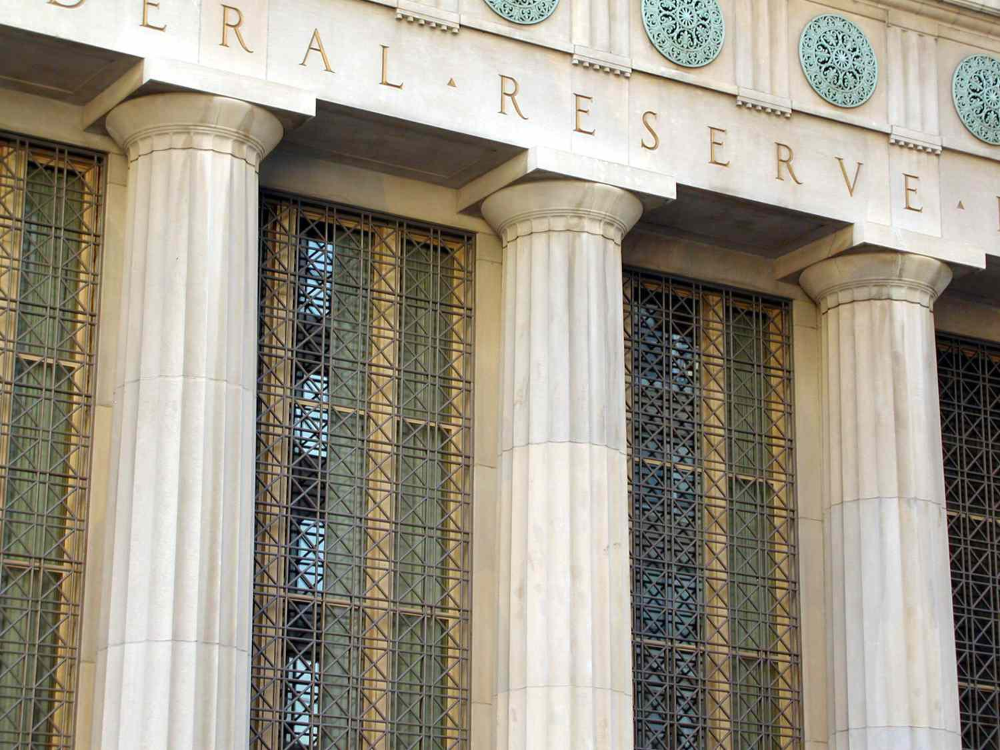

Economic policy is a fundamental driver that shapes national economies by deploying a combination of fiscal and monetary strategies to achieve specific economic objectives. Fiscal policy involves the manipulation of government spending and taxation to influence economic activity, thereby promoting economic growth and stability. On the other hand, monetary policy pertains to the regulation of the money supply and interest rates, primarily overseen by central banks, which aim to control inflation and stabilize the currency.

Central banks are pivotal in executing monetary policy. They employ a variety of tools, including interest rate adjustments, open market operations, and altering reserve requirements for financial institutions. This strategic management of monetary conditions is essential for fostering an environment conducive to steady economic growth while maintaining low inflation rates.

In the contemporary financial landscape, algorithmic trading stands out as a significant component that intersects with central banking and monetary policy. Algorithmic trading utilizes complex computer algorithms to execute trades at high speeds, often in response to real-time market data. This modern trading method aids in enhancing market liquidity and efficiency, but it also introduces challenges, such as increased market volatility and ethical concerns related to market fairness.

This article aims to explore the interconnected roles of economic policy, central banking, and algorithmic trading. By examining how these elements interact, the discussion seeks to offer valuable insights into their collective influence on financial markets and economic stability. Understanding these interactions is critical for stakeholders, including policymakers and financial institutions, as they navigate the complexities of the current and future economic environments.

## Table of Contents

## Understanding Economic Policy

Economic policy is a term that encompasses the various strategies and actions taken by governments to influence a country's economic performance. It primarily consists of fiscal and monetary policies, which work together to guide economic growth and stability.

Fiscal policy is centered on government expenditure and taxation. By adjusting these elements, governments can influence economic activity. For instance, in times of economic recession, a government might increase spending or reduce taxes to stimulate demand and boost growth. Conversely, in periods of strong economic growth, it might decrease spending or raise taxes to prevent the economy from overheating. The core idea is to manage the aggregate demand, thus smoothing the economic cycle and reducing the amplitude of economic fluctuations. Fiscal policies are therefore crucial in addressing issues like unemployment and inflation, ensuring that economic growth is sustainable.

Monetary policy, on the other hand, involves the regulation of the money supply and interest rates and is typically under the purview of central banks. By controlling the amount of money circulating in the economy and setting the cost of borrowing, central banks can influence inflation and economic activity. For example, to combat high inflation, a central bank might raise interest rates, making borrowing more expensive and thus slowing down economic growth. Alternatively, to counteract recessionary pressures, it might lower interest rates, encouraging borrowing and investment.

The interplay between fiscal and monetary policies is vital for maintaining economic stability. A well-balanced economic policy ensures that inflation is kept in check, employment levels are maximized, and the economy grows at a healthy rate. This balance is essential because the two types of policies can sometimes work at cross-purposes. For instance, expansive fiscal policy (increased spending or tax cuts) might clash with contractionary monetary policy (higher interest rates) if not well-coordinated, potentially leading to inefficiencies and suboptimal economic outcomes.

Both policies must be sensitive to the unique economic conditions of each country, taking into account factors such as the level of public debt, the state of the global economy, and socio-political considerations. By effectively combining fiscal and monetary policies, governments can foster an environment conducive to sustainable growth and economic stability.

## Monetary Policy and Central Banking

Central banks play a crucial role in implementing monetary policy to regulate economic activity, aiming to maintain price stability and foster economic growth. Major central banks, like the Federal Reserve (Fed) in the United States, the European Central Bank (ECB), and the Bank of Japan (BoJ), employ various tools to achieve these goals.

### Tools of Monetary Policy

1. **Interest Rate Manipulation**: Central banks adjust the policy interest rates to influence economic activity. Lowering interest rates tends to stimulate borrowing and spending, which can boost economic growth but may also lead to higher inflation. Conversely, raising rates generally aims to temper inflation by discouraging borrowing and reducing spending.

2. **Open Market Operations (OMOs)**: Central banks buy or sell government securities in the open market to influence the level of reserves in the banking system, thereby affecting short-term interest rates and the overall money supply. Purchasing securities injects liquidity into the economy, fostering growth, whereas selling removes liquidity, potentially curbing inflation.

3. **Reserve Requirement Adjustments**: By altering the reserves banks must hold, central banks can control the amount of funds available for lending. Lower reserve requirements increase the money available for banks to loan, stimulating economic activity, whereas higher reserves restrict this capacity, aiming to prevent overheating and inflation.

### Expansionary vs. Contractionary Policy

Depending on economic conditions, monetary policy can take on an expansionary or contractionary stance. Expansionary policy, characterized by lowered interest rates and increased [liquidity](/wiki/liquidity-risk-premium), is generally adopted during economic slowdowns to encourage growth. In contrast, contractionary policy, involving higher interest rates and reduced liquidity, is used during periods of rapid growth to control inflation.

### Goals of Central Banks

The primary objectives of central banks are to stabilize the national currency, control inflation, and supervise the banking sector. By maintaining a balance between inflation and employment, central banks work towards sustainable economic growth.

### Case Studies

- **United States Federal Reserve (Fed)**: Through its dual mandate of maximizing employment and stabilizing prices, the Fed utilizes a flexible approach, adjusting its tools dynamically in response to economic data. For instance, during the economic downturn triggered by COVID-19, the Fed lowered interest rates to near zero and engaged in large-scale asset purchases to provide economic support.

- **European Central Bank (ECB)**: The ECB focuses on price stability within the Eurozone. In response to the 2010 European sovereign debt crisis, the ECB implemented measures such as long-term refinancing operations (LTROs) and the purchase of government bonds, aiming to increase liquidity and stabilize the financial system.

- **Bank of Japan (BoJ)**: Known for its aggressive monetary easing policies, the BoJ has employed unconventional strategies like negative interest rates and yield curve control to combat decades-long deflation and sluggish growth. This involves targeting the yield on 10-year Japanese government bonds to maintain a favorable environment for investment and consumption.

The strategies and actions of these central banks reflect differing economic environments and challenges, demonstrating the central role that monetary policy plays in shaping national and global economic landscapes.

## Algorithmic Trading in Financial Markets

Algorithmic trading is a systematic method of executing market orders using pre-determined instructions based on variables such as price, timing, and [volume](/wiki/volume-trading-strategy). This approach has gained prominence due to its ability to process massive volumes of data and execute trades at speeds unmatched by human traders. 

One of the key advantages of [algorithmic trading](/wiki/algorithmic-trading) is its support for high-frequency trading ([HFT](/wiki/high-frequency-trading-strategies)), which entails making a large number of trades within fractions of a second. HFT contributes to increased market liquidity by enabling rapid buying and selling, which in turn facilitates tighter bid-ask spreads and reduces transaction costs for all market participants. Furthermore, algorithmic trading employs sophisticated techniques to analyze both historical and real-time data to craft optimized trading strategies. These strategies enhance market efficiency by swiftly incorporating new information into asset prices and allowing traders to make informed decisions.

Challenges inherent in algorithmic trading include managing potential market [volatility](/wiki/volatility-trading-strategies) and addressing ethical concerns regarding fairness and market manipulation. Flash crashes, for instance, are precipitous drops in security prices within a very short time, often exacerbated by high-frequency trades. Such events highlight the volatility risks associated with algorithmic trading systems. Moreover, there are ethical considerations regarding the fairness of allowing machines with superior speed and information processing capabilities to dominate trading, potentially disadvantaging human traders.

The integration of macroeconomic indicators into algorithmic trading strategies allows traders to adapt rapidly to changes in economic data. Algorithms designed to interpret signals from indicators such as GDP growth rates, inflation data, or central bank announcements can adjust trading strategies almost instantaneously. This integration means that algorithmic trading systems are not only responsive to market data but also to broader economic conditions, making them highly adaptable instruments within the financial markets. 

Overall, while algorithmic trading offers numerous advantages such as enhanced market liquidity and efficiency, it also poses challenges that need careful management to ensure market stability and fairness.

## Interactions Between Central Banking and Algo Trading

Central bank policy changes, such as [interest rate](/wiki/interest-rate-trading-strategies) adjustments, have a significant impact on algorithmic trading strategies. Algorithmic trading systems are designed to process vast amounts of data, including economic indicators and monetary policy signals, in real-time. Through sophisticated algorithms, these systems can almost instantaneously adjust trading strategies in response to shifts in economic policy. For example, a reduction in interest rates by a central bank may be interpreted by algorithms as a favorable condition for stocks and other risk assets, prompting a buy signal that results in increased trading volume and market liquidity.

The rapid response capability of algorithmic trading to monetary policy changes underscores the close linkages between central banking decisions and financial markets. When central banks, like the Federal Reserve, the European Central Bank (ECB), or the Bank of Japan (BoJ), implement policy changes, the effects are swiftly reflected in market prices. This immediate reaction can contribute to market volatility. For instance, unexpected policy announcements can lead to sudden shifts in asset prices as algorithms execute trades based on their programmed criteria.

Algorithmic trading's interaction with central banking actions also influences market liquidity. High-frequency trading, a subset of algorithmic trading, bolsters liquidity by facilitating a large number of small transactions, reducing spreads, and increasing the efficiency of price discovery. However, this can also lead to heightened volatility under certain conditions, such as during significant policy shifts or in less liquid markets.

Historical case studies provide valuable insights into the interplay between central banking and algorithmic trading. For example, during the ECB's quantitative easing announcements, algorithms typically adjusted their trading strategies to account for the anticipated impact on bond yields and currency values. Analyzing these past interactions helps understand potential impacts on market stability and the effectiveness of monetary policy.

The dynamics between central banking policies and algorithmic trading necessitate a careful balance. While algorithmic systems enhance market efficiency and depth, they also pose risks, such as flash crashes, which can challenge regulators and policymakers. Thus, understanding these interactions is crucial for designing monetary policies that consider the complexities of modern algorithmic trading environments and their implications for financial market stability.

## Challenges and Opportunities

Balancing rapid technological advancements with traditional economic policies presents both challenges and opportunities in the context of algorithmic trading and central banking. Algorithmic trading, characterized by its use of sophisticated algorithms to execute trades at high speeds, brings significant risks alongside potential benefits. One notable risk is the occurrence of flash crashes, which are sudden, severely sharp drops in security prices, often exacerbated by high-frequency trading algorithms reacting in milliseconds. These events underline the need for robust regulatory frameworks to safeguard market stability.

Conversely, algorithmic trading offers opportunities for enhancing market efficiency. By leveraging vast amounts of historical and real-time data, algorithms can optimize trading strategies, thereby improving liquidity and reducing transaction costs. As high-frequency traders provide liquidity by quickly buying and selling securities, they can smooth price fluctuations, contributing to more stable and efficient markets.

Central banks face the complex task of deciphering market signals that are increasingly influenced by algorithmic trading. Traditional economic indicators may be perturbed by the instantaneous nature of algorithmic trades, complicating monetary policy decision-making. This situation demands innovative tools and methodologies from central banks to accurately interpret volatile market data and adjust policies accordingly.

The integration of [artificial intelligence](/wiki/ai-artificial-intelligence) (AI) and [machine learning](/wiki/machine-learning) within trading platforms presents further opportunities for market prediction and efficiency. Algorithms enhanced by AI can adapt and learn from new data, leading to more accurate predictions and strategic decision-making in financial markets. For example, machine learning models can identify complex patterns in financial data that are not apparent through traditional analysis, offering traders a competitive edge.

Understanding these dynamics invites strategic investment opportunities and the enhancement of economic policy. As financial markets become increasingly driven by technology, investors can capitalize on advanced algorithms to maximize returns while mitigating risks. Central banks and policymakers, on the other hand, can harness technological advancements to refine monetary policies and maintain economic stability.

In summary, navigating the intersection of technology and economic policy requires a concerted effort from both market participants and regulators. The ability to balance the risks and rewards of algorithmic trading is crucial for fostering financial markets that are both innovative and resilient.

## Conclusion

The intersection of economic policy, central banking, and algorithmic trading is pivotal to modern financial systems. This dynamic triad influences how markets behave and requires constant adaptation from both policymakers and financial institutions. As technologies evolve and new financial models emerge, strategic approaches become essential to manage economic stability and foster growth effectively.

Within this framework, policymakers and financial institutions must collaborate to harness the opportunities and mitigate the risks associated with these interactions. Ensuring economic stability involves not only shaping policies responsive to technological advancements but also safeguarding against potential pitfalls such as market volatility and systemic risks introduced by algorithmic trading.

Future research into integrating advanced technologies, like artificial intelligence and machine learning, with macroeconomic strategies is not just beneficial but necessary. These technologies promise improved accuracy in market predictions, which could lead to more robust economic frameworks. Successfully merging these elements requires careful analysis and innovative policy crafting to sustain growth and stability.

By examining these interrelations, stakeholders can better anticipate and respond to shifts in economic and financial landscapes. Understanding the fluid dynamics at play enables more informed decision-making, fostering resilience in an ever-changing global economy. This capability is crucial for anticipating market trends, adjusting to monetary policy changes, and maintaining the delicate balance required for enduring economic growth.

## References & Further Reading

[1]: Bernanke, B. S., Reinhart, V. R., & Sack, B. P. (2004). [“Monetary Policy Alternatives at the Zero Bound: An Empirical Assessment.”](https://www.federalreserve.gov/pubs/feds/2004/200448/200448pap.pdf) Brookings Papers on Economic Activity 

[2]: ["Algorithmic Trading: Winning Strategies and Their Rationale"](https://www.amazon.com/Algorithmic-Trading-Winning-Strategies-Rationale-ebook/dp/B00CY5HC0U) by Ernie Chan

[3]: Haldane, A. G. (2015). ["Managing global finance as a system."](https://www.bis.org/review/r141030f.pdf) Bank of England.

[4]: ["The Alchemists: Three Central Bankers and a World on Fire"](https://www.amazon.com/Alchemists-Three-Central-Bankers-World/dp/0143124994) by Neil Irwin

[5]: Carney, M. (2019). ["The Growing Challenges for Monetary Policy in the current International Monetary and Financial System."](https://www.bankofengland.co.uk/-/media/boe/files/speech/2019/the-growing-challenges-for-monetary-policy-speech-by-mark-carney.pdf) Bank of England.

[6]: ["High-Frequency Trading: A Practical Guide to Algorithmic Strategies and Trading Systems"](https://www.amazon.com/High-Frequency-Trading-Practical-Algorithmic-Strategies/dp/0470563761) by Irene Aldridge

[7]: Vayanos, D., & Woolley, P. (2013). [“An Institutional Theory of Momentum and Reversal.”](https://personal.lse.ac.uk/vayanos/Papers/ITMR_RFS13.pdf) The Review of Financial Studies 

[8]: ["Foolproof: Why Safety Can Be Dangerous and How Danger Makes Us Safe"](https://archive.org/details/foolproofwhysafe0000ipgr) by Greg Ip