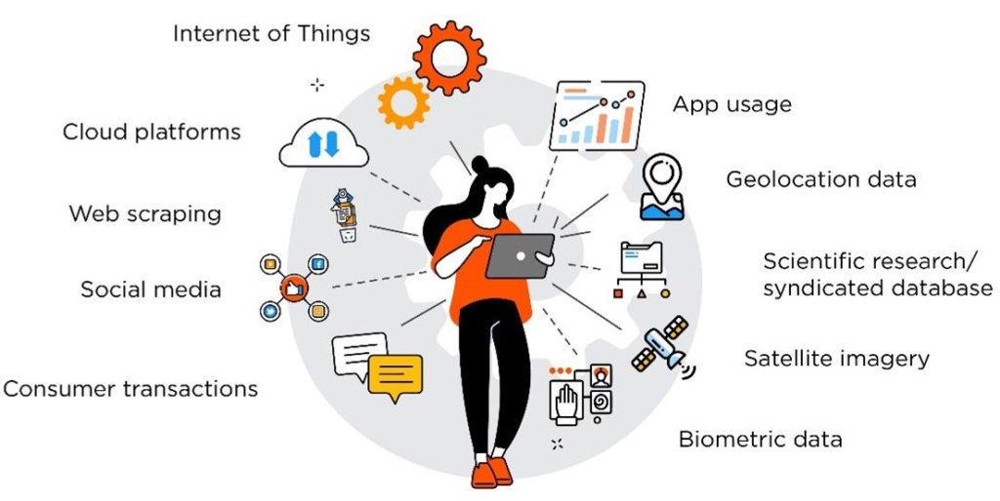

In the rapidly evolving world of finance, maintaining a competitive edge is crucial for success. Algorithmic trading has become a transformative force in the trading landscape, utilizing sophisticated computer algorithms to execute trades at speeds and efficiencies far beyond human capability. This technological advancement allows for the rapid analysis of vast quantities of data, leading to more informed and timely trading decisions.

One of the most significant developments within this sphere is the increasing use of media alternative data. Unlike traditional financial data sources such as corporate earnings reports or economic indicators, media alternative data encompasses a range of unconventional sources. These include news articles, social media posts, blogs, and other forms of digital media. By capturing the diverse sentiments and real-time narratives circulating in these channels, traders can gain novel insights into market dynamics.



This article seeks to explore the burgeoning role of media alternative data within algorithmic trading. We will examine what constitutes media alternative data, why it holds such significance, and the ways in which traders are leveraging it to secure a strategic advantage in competitive markets. Unconventional data sources are increasingly significant in shaping modern financial market strategies. By harnessing insights from these diverse data streams, traders can potentially enhance decision-making processes and improve performance outcomes. Join us as we explore this new frontier in trading, where data-driven strategies redefine the landscape of modern finance.

## Table of Contents

## Understanding Alternative Data

Alternative data refers to information derived from non-traditional sources that are not typically covered in standard financial reports or accounting forms. Unlike conventional data such as balance sheets or income statements, which provide historical snapshots of a company's performance, [alternative data](/wiki/best-alternative-data) offers real-time, nuanced perspectives that can enhance market analysis and forecasting.

There are various types of alternative datasets that investors and traders find valuable. Social media sentiment analysis, for instance, extracts public mood and opinions from platforms like Twitter or Facebook. By parsing this data through natural language processing tools, traders can identify trends and shifts in public sentiment that might impact stock prices. Another example includes satellite images, which can be used to gauge the activity levels of retail business operations by analyzing the number of cars in parking lots or to assess crop yields and their potential market impact.

Consumer sentiment data, often gathered through online reviews or purchasing behavior, also falls under this category. This data provides insights into customer satisfaction and brand perception, which are critical for forecasting a company's performance.

The primary advantage of alternative data is its capacity to uncover behavioral patterns and market sentiments not immediately evident through traditional financial analysis. In effect, it enables a more comprehensive understanding of market dynamics. For instance, by examining GPS location data, traders can assess foot traffic in shopping areas, offering early signs of sales performance for retail businesses.

Given these insights, an increasing number of traders and financial analysts are turning to alternative data to optimize their investment strategies. The agility and the immediate nature of the insights gained empower financial professionals to react more quickly to market changes and potentially obtain a competitive advantage.

The growing importance of alternative data has also prompted advancements in data processing technologies, such as [machine learning](/wiki/machine-learning) algorithms, which can effectively handle large volumes of data and extract actionable insights. This evolution continues to transform how financial markets are understood and engaged, pushing boundaries beyond traditional analysis methods.

## The Role of Media Alternative Data in Algo Trading

Media alternative data, which encompasses news articles, social media posts, blogs, and other digital media content, has become a critical asset in the [algorithmic trading](/wiki/algorithmic-trading) landscape. This type of data is invaluable in capturing and analyzing market sentiment, which is essential for predicting stock price movements and formulating effective trading strategies.

In the context of algorithmic trading, media alternative data is employed to develop sophisticated predictive models that enhance decision-making processes. By analyzing the sentiment expressed in these diverse media sources, traders can gain insights into prevailing market attitudes and potential shifts in trends. Sentiment analysis tools are particularly valuable in this regard, as they can efficiently interpret vast amounts of unstructured data to forecast market trends.

The integration of media alternative data into trading algorithms allows for the creation of more adaptive and timely trading strategies. This integration is crucial because market sentiment can significantly influence asset prices and [volatility](/wiki/volatility-trading-strategies). For instance, a positive news article about a company can lead to a surge in its stock price, while a negative social media post might cause a downturn. By staying attuned to these sentiment-driven changes, traders can make more informed decisions, better align their strategies with market movements, and potentially achieve higher returns.

The process typically involves the use of technology-driven sentiment analysis to parse language from media sources. Techniques such as Natural Language Processing (NLP) and machine learning algorithms are employed to quantify sentiment and assess its potential impact on financial markets. For example, a simple sentiment analysis task might involve classifying words from a news headline as positive, negative, or neutral, and using the overall score to predict the likely effect on stock prices.

In addition, programming languages such as Python are often utilized to automate and streamline this analysis. By employing libraries like `TextBlob` or `NLTK`, traders can build scripts that process and analyze large datasets efficiently, enabling real-time responses to market developments. Here is a basic example of how Python might be used to perform sentiment analysis:

```python
from textblob import TextBlob

def analyze_sentiment(text):
    analysis = TextBlob(text)
    sentiment_score = analysis.sentiment.polarity
    return sentiment_score

# Example usage
news_headline = "Company X announces breakthrough innovation in technology."
score = analyze_sentiment(news_headline)
print(f"Sentiment Score: {score}")
```

In this example, `TextBlob` processes the text of a news headline to provide a sentiment score, which can then be utilized in algorithmic models to predict its impact on related stock prices.

Overall, by harnessing media alternative data through advanced analytical tools and techniques, traders can anticipate market sentiment shifts more accurately and refine their algorithmic trading strategies to enhance performance and responsiveness in dynamic financial markets.

## Case Studies in the Use of Media Alternative Data

Numerous hedge funds and financial institutions have increasingly adopted alternative data strategies to gain a competitive advantage in financial markets. Case studies highlight the notable successes achieved by leveraging news sentiment and social media analytics in trading decisions.

One significant illustration of this trend is the use of Twitter data to anticipate stock movements following major corporate news. By monitoring tweets and extracting sentiment data, traders can assess public reactions and predict potential impacts on stock prices. The effectiveness of this method was demonstrated when a [hedge fund](/wiki/hedge-fund-trading-strategies) successfully utilized Twitter sentiment analysis to make buy and sell decisions, resulting in substantial portfolio gains. This example underscores the utility of media alternative data to capture the collective mood of the market in real-time.

Financial firms are also investing in sophisticated algorithms capable of parsing vast amounts of media content in real-time. These algorithms are designed to detect market-moving news and turn data into actionable insights with minimal delay. For instance, a financial institution developed a proprietary system that scans news headlines and posts from financial blogs to gauge sentiment changes. By employing natural language processing (NLP) techniques, the system identifies positive or negative tones, helping traders make informed decisions with greater speed and accuracy.

These case studies illustrate the potential for media alternative data to enhance predictive accuracy in trading. By integrating this non-traditional data into trading models, firms can potentially increase their returns compared to relying solely on traditional data sources. The integration of media alternative data into algorithmic trading strategies presents an improved approach to capturing market opportunities, thereby illustrating its value as part of a comprehensive market strategy.

## Challenges and Limitations

The incorporation of media alternative data into algorithmic trading, while innovative, presents several challenges that traders and analysts are working to address. Among the most pressing issues is data veracity and noise. Media data, especially from social networks, can often include misinformation or unverified content. This potentially leads to the distortion of trading models, as algorithms may react to false signals. For instance, a misleading tweet or a sensationalized news headline could cause a significant but unwarranted market movement, thereby skewing results.

In addition, significant computational and analytical challenges arise due to the sheer [volume](/wiki/volume-trading-strategy) and diversity of media content. Processing this vast dataset requires advanced computing resources and sophisticated algorithms capable of efficiently filtering and analyzing relevant information. This often involves extensive natural language processing (NLP) and machine learning techniques to parse the data effectively. Traders must therefore deploy high-performance computing solutions to manage the data in real-time, ensuring their models remain timely and accurate.

Privacy concerns and regulatory challenges are also becoming more prominent as data sources expand. The use of personal data from social media and other platforms raises questions about privacy rights and the ethical use of such information. Moreover, financial markets are subject to strict regulations, and the use of new data types in trading requires careful compliance with evolving legal frameworks. Traders need to navigate these regulatory landscapes prudently to avoid legal pitfalls.

Lastly, balancing the benefits of real-time data insights with the associated risks and ethical considerations is crucial. While media alternative data provides the advantage of immediate market sentiment analysis, there's a need for vigilance in avoiding over-dependence on potentially volatile data sources. Ensuring that trading strategies are both profitable and ethically sound will remain a defining challenge as the industry continues to embrace these innovative data streams.

## Future Trends

The landscape of algorithmic trading is expected to evolve significantly with advancements in [artificial intelligence](/wiki/ai-artificial-intelligence) (AI) and machine learning (ML). As computational algorithms become more sophisticated, sentiment analysis will likely see remarkable enhancements. Traditionally, sentiment analysis has been employed to gauge market emotions, but future iterations are anticipated to integrate seamlessly with a broader variety of alternative data sources, including geo-location and transaction data. These integrations will allow traders to harness a richer context of market dynamics, leading to more accurate predictive models.

The growing demand for personalized and agile trading strategies is driving innovation in how data is incorporated into trading systems. As traders seek to optimize their strategies, the customization of data inputs and trading models becomes paramount. AI and ML technologies enable the creation of bespoke algorithms that cater to specific market conditions and investor preferences. For instance, algorithms can be programmed to adjust trading strategies in real-time, based on fluctuations in media sentiment or geopolitical developments identified through geo-location data. 

Collaboration between fintech firms and traditional financial institutions is likely to foster the development of hybrid trading models. These partnerships can leverage the strengths of both sectors: the innovative prowess and technological agility of fintech companies and the deep market knowledge and extensive resources of established financial entities. This synergy can lead to the creation of trading systems that are not only innovative but also robust, offering improved resilience against market volatility.

As technology advances, the use of media alternative data is expected to become more prevalent and refined across the trading industry. Continuous improvements in data processing capabilities and analysis techniques will facilitate the extraction of actionable insights from vast amounts of unstructured data. Enhanced algorithms will offer greater precision and speed, critical factors for maintaining competitive advantage in high-frequency trading environments. 

In conclusion, the future of algorithmic trading is poised for a transformative phase where data-driven strategies increasingly rely on sophisticated analysis and integration methodologies. Traders and institutions that effectively embrace these advancements will be well-positioned to capitalize on market opportunities, setting new standards for performance and innovation in the trading sector.

## Conclusion

Media alternative data represents a paradigm shift in how traders interact with financial markets by offering fresh perspectives beyond traditional financial metrics. Its capacity to provide real-time insights has transformed it into an invaluable tool for algorithmic trading strategies. By synthesizing data from varied media sources, traders gain a richer, more immediate understanding of market sentiment, enabling timely and informed trading decisions. 

Despite the inherent challenges such as data veracity, noise, and computational demands, strategic integration of media alternative data offers a promising path to smarter decision-making and enhanced market performance. The ability to anticipate market movements based on media sentiment analysis equips traders with a competitive edge, allowing them to optimize their strategies in response to dynamic market conditions.

As the financial landscape continues to integrate technology, those traders who can effectively harness alternative media data will likely lead the next generation of market strategies. They will set new benchmarks for adaptability and precision in trading by leveraging innovative data analytics to capture subtle market shifts. The future of algorithmic trading will likely be defined by further advancements in artificial intelligence and machine learning, which will refine the use of media alternative data. 

Future developments are expected to continuously enhance the capacity of media data as a vital component in the algorithmic trading ecosystem. These advancements will likely foster more sophisticated, agile trading models that are attuned to the nuanced and fast-paced nature of modern financial markets. As technology progresses, media alternative data's role within algo trading will only expand, making it an indispensable asset for informed decision-making in the evolving financial sector.

## References & Further Reading

[1]: Bergstra, J., Bardenet, R., Bengio, Y., & Kégl, B. (2011). ["Algorithms for Hyper-Parameter Optimization."](https://proceedings.neurips.cc/paper/2011/file/86e8f7ab32cfd12577bc2619bc635690-Paper.pdf) Advances in Neural Information Processing Systems 24.

[2]: ["Advances in Financial Machine Learning"](https://www.amazon.com/Advances-Financial-Machine-Learning-Marcos/dp/1119482089) by Marcos Lopez de Prado

[3]: ["Evidence-Based Technical Analysis: Applying the Scientific Method and Statistical Inference to Trading Signals"](https://www.amazon.com/Evidence-Based-Technical-Analysis-Scientific-Statistical/dp/0470008741) by David Aronson

[4]: ["Machine Learning for Algorithmic Trading"](https://github.com/stefan-jansen/machine-learning-for-trading) by Stefan Jansen

[5]: ["Quantitative Trading: How to Build Your Own Algorithmic Trading Business"](https://books.google.com/books/about/Quantitative_Trading.html?id=j70yEAAAQBAJ) by Ernest P. Chan

[6]: Tetlock, P. C. (2007). ["Giving content to investor sentiment: The role of media in the stock market."](https://onlinelibrary.wiley.com/doi/abs/10.1111/j.1540-6261.2007.01232.x) The Journal of Finance, 62(3), 1139-1168.

[7]: Fama, E. F., & French, K. R. (1996). ["Multifactor explanations of asset pricing anomalies."](https://onlinelibrary.wiley.com/doi/10.1111/j.1540-6261.1996.tb05202.x) The Journal of Finance, 51(1), 55-84.

[8]: ["The Manual of Ideas: The Proven Framework for Finding the Best Value Investments"](https://www.amazon.com/Manual-Ideas-Framework-Finding-Investments/dp/1118083652) by John Mihaljevic

[9]: Bollen, J., Mao, H., & Zeng, X. (2011). ["Twitter mood predicts the stock market."](https://www.sciencedirect.com/science/article/pii/S187775031100007X) PLOS ONE, 6(12), e26752.

[10]: Shleifer, A. (2000). ["Inefficient Markets: An Introduction to Behavioral Finance"](https://academic.oup.com/book/27761) by Andrei Shleifer