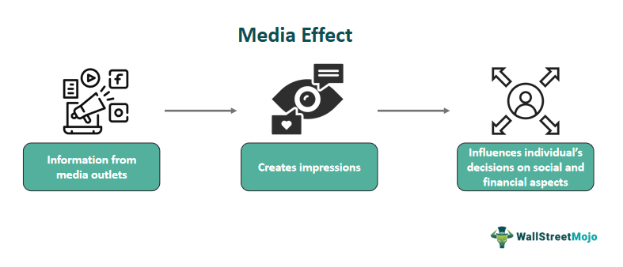

In an era characterized by the ubiquitous presence and rapid exchange of information, the influence of media on financial markets, including algorithmic trading, commands significant attention. Media influence today transcends traditional news outlets, extending to social media and digital platforms, all of which play pivotal roles in shaping public perception and investor sentiment. These various media channels collectively contribute to a dynamic landscape where the dissemination of information can dramatically sway market behaviors and outcomes.

The relationship between media strategies and their impact on trading activities is a crucial element in modern finance. Traders are now equipped with sophisticated tools that allow them to analyze and harness media data to inform their strategies. The interplay of strategic media use and its subsequent effects on trading offers valuable insights into the mechanisms by which information affects financial decisions.



In this article, we explore the significant concepts surrounding media influence, media strategies, and their consequent effects on algorithmic trading. By examining these areas, we highlight how traders incorporate media data within their strategies, seeking to secure and maintain competitive advantages in increasingly volatile and information-rich markets. Through these explorations, we aim to shed light on the transformative potential media holds within the context of financial markets and the strategic possibilities that arise from its influence.

References:
1. Tetlock, P. C. (2007). Giving Content to Investor Sentiment: The Role of Media in the Stock Market. The Journal of Finance, 62(3), 1139-1168.
2. Fama, E.F. (1970). Efficient Capital Markets: A Review of Theory and Empirical Work. The Journal of Finance, 25(2), 383-417.
3. Bollen, J., Mao, H., & Zeng, X. (2011). Twitter mood predicts the stock market. Journal of Computer Science, 2(1), 1-8.

## Table of Contents

## Understanding Media Influence

Media influence is a pivotal [factor](/wiki/factor-investing) in shaping public opinion and investor behavior, particularly within financial markets. This influence extends across various forms of media, including news articles, social media posts, and digital platforms. The media's impact on financial markets is profound, as headlines and narratives can lead to rapid and significant fluctuations in asset prices. 

One of the notable characteristics of media influence is its ability to rapidly propagate information that affects market sentiment and investor decisions. Traditional news outlets, such as newspapers and television, have historically played a role in outlining financial developments. However, the advent of digital media has transformed the manner and speed at which information is disseminated. Real-time information channels, including social media platforms like Twitter, have become crucial components in this media ecosystem.

Social media buzz can act as a catalyst for market trends. When a company announcement or economic event gains traction on platforms like Twitter, it can lead to a flurry of trading activity. For instance, a tweet from a prominent financial figure or a viral post about a company's product can cause an immediate spike or drop in stock prices. The instantaneous nature of information exchange on these platforms means that traders must be agile, responding to shifts in sentiment within minutes, if not seconds.

Political events and economic news are also significant external factors that can sway market trends. Election results, policy announcements, and macroeconomic reports are closely watched by investors and often preempt fluctuations in the markets. Headlines that reflect political instability or economic downturns can lead to negative sentiment, prompting sell-offs and market [volatility](/wiki/volatility-trading-strategies).

The implications of media influence on traders and investment strategies are considerable. With the proliferation of information, traders must navigate a complex landscape where the accuracy and timeliness of data can make or break investment decisions. Media monitoring tools and sentiment analysis software have become essential for those in the financial sector, enabling investors to gauge public sentiment and potential market movements quickly.

As the reach of media continues to expand, its influence on trading activities becomes more pronounced. Understanding how media shapes market perceptions and investor behavior is crucial for developing responsive and informed investment strategies. This expanding influence signifies the need for a strategic approach to media consumption, allowing traders to decode the signals embedded within the media's narrative and adjust their actions accordingly. The capacity to anticipate market sentiment based on media trends provides a competitive edge, highlighting the importance of integrating media insights into financial analysis and decision-making processes.

## Media Strategies and Their Impact on Trading

Media strategies play a critical role in trading by influencing public perception and market dynamics. Traders actively deploy these strategies to monitor and analyze media coverage, allowing them to anticipate market movements. The utilization of media monitoring tools and sentiment analysis technologies enables traders to extract actionable insights from various media sources, such as news articles and social media platforms.

The strategic use of media data can unveil market trends and indicate potential price shifts. For instance, a sudden surge in positive sentiment around a particular stock or commodity might signal an upward price movement. Conversely, negative sentiment detected in media channels may forecast a downturn. Traders analyze this data to make informed decisions, often executing orders through [algorithmic trading](/wiki/algorithmic-trading) systems that rapidly respond to media signals.

Reacting swiftly to breaking news is one media strategy utilized by traders, providing them with the agility required to capitalize on market-moving events. Algorithms can be programmed to scan real-time news feeds, extracting relevant keywords and assessing the sentiment associated with emerging information. Such systems enable traders to either enter or [exit](/wiki/exit-strategy) positions based on the media-triggered market changes long before manual trading decisions could be executed.

Leveraging influencer insights is another effective strategy where traders track social media influencers and industry experts whose opinions may affect public perception and, by extension, trading activities. A notable influencer's positive remark on a specific sector can boost investor confidence and drive stock prices. Sentiment analysis tools are employed to quantify these insights, feeding data into trading algorithms.

Media strategies in algorithmic trading often integrate [machine learning](/wiki/machine-learning) models to enhance their predictive power. By training algorithms on historical media data and corresponding market reactions, traders can develop robust models capable of forecasting future price movements with greater accuracy. Python libraries, such as scikit-learn, provide the necessary tools for building and refining these machine learning models.

```python
from sklearn.feature_extraction.text import CountVectorizer
from sklearn.ensemble import RandomForestRegressor
import numpy as np

# Example code for sentiment analysis feature extraction
news_data = [...]  # List of news articles
vectorizer = CountVectorizer(max_features=1000)
X = vectorizer.fit_transform(news_data).toarray()

# Stock price movements as target variable
y = np.array([...])  # Corresponding price shifts

# Train a Random Forest model
model = RandomForestRegressor(n_estimators=100)
model.fit(X, y)

# Predictive analysis
predicted_price_movement = model.predict(X_new)  # New news articles
```

This strategic use of algorithms and media-derived data has the potential to drive profitability in trading. By continuously refining their strategies and leveraging advanced technologies, traders can maintain a competitive edge in the fast-paced financial markets. Media strategies thus form an integral component of modern algorithmic trading practices, influencing market outcomes and contributing to traders' success.

## Algorithmic Trading and Media Data

Algorithmic trading, also known as algo-trading, uses computer algorithms to automate the process of trading securities based on pre-established criteria. A critical component of these algorithms today is the integration of media-derived data, which includes sentiment analysis from a variety of social platforms. By incorporating data from social media, news articles, and other forms of media, traders can enhance the capabilities of their algorithms, making them more sophisticated and responsive to shifts in market sentiment.

Media [alternative data](/wiki/best-alternative-data) provides valuable insights into public perception and market dynamics that traditional financial metrics might not capture. Sentiment analysis, for example, involves processing text data from media sources to gauge the public’s mood towards particular assets or the market at large. This analysis often uses natural language processing (NLP) techniques to transform qualitative textual data into quantifiable indicators. These indicators can then be fed into trading algorithms to predict potential market movements and to adjust trading strategies accordingly. 

For instance, a positive shift in sentiment detected on social media about a tech company might lead an algorithm to increase its holdings of that company’s stock, anticipating a price rise. Conversely, negative news coverage could trigger the selling of certain assets. This integration of media data allows trading models to be more adaptive, dynamically responding to real-time information and optimizing trade decisions to capitalize on emerging trends.

An example Python snippet for processing sentiment data might look like this:

```python
import nltk
from textblob import TextBlob

# Example media text
media_text = "The tech industry is seeing an unprecedented boom."

# Analyze sentiment
analysis = TextBlob(media_text)
sentiment_score = analysis.sentiment.polarity  # Returns a value between -1 and 1

# Decision rule
if sentiment_score > 0.1:
    print("Increase tech stock holdings.")
elif sentiment_score < -0.1:
    print("Consider selling tech stocks.")
else:
    print("Hold current position.")
```

In this context, media data enhances the decision-making capabilities of trading systems, providing a competitive advantage through the early detection of sentiment changes and market reactions. By continuously integrating real-time media input, algo-traders can not only improve their performance but also refine their risk management by anticipating potential volatility that accompanies shifting market sentiments.

Media data incorporation also facilitates more responsive trading practices, allowing algorithms to quickly adapt to a changing financial landscape. The ability to seamlessly integrate diverse streams of information into the trading process underscores the evolving complexity of algorithmic trading strategies and the increasing reliance on non-traditional data sources for gaining competitive insights. 

Thus, the role of media data in algorithmic trading bridges the gap between traditional financial metrics and the nuanced, often rapidly changing market environment influenced by public perception and sentiment. This integration is becoming a vital tool for traders aiming to enhance their decision-making processes and optimize trading performance.

## Case Studies: Media Influence in Trading

The integration of media influence into trading strategies has been successfully demonstrated in numerous case studies, providing valuable insights into market dynamics and enhancing trading performance. A prominent example involves hedge funds employing sentiment analysis of Twitter data to predict stock market shifts. This approach leverages the immediacy and breadth of information available on social media platforms, allowing traders to respond swiftly to changes in public sentiment and market conditions.

A study by Bollen et al. (2011) illustrated how Twitter mood states could predict stock market movements. By analyzing daily Twitter feeds, the researchers found a correlation between the collective mood and the Dow Jones Industrial Average (DJIA) movements. This groundbreaking study demonstrated that simple sentiment analysis could serve as a powerful tool in forecasting financial markets, particularly when it comes to short-term trading strategies.

Another example involves traders responding to viral news trends, where media coverage can significantly influence asset prices. The infamous "Flash Crash" of 2010 serves as an illustrative case of how algorithmic trading systems respond to news events. During this event, traders' reliance on media data and automated systems ostensibly contributed to a rapid and significant market downturn, highlighting the profound impact media can have on trading activities (Kirilenko et al., 2014).

The integration of media-derived insights not only enhances trading performance but also informs strategic adjustments. The ability to capture and analyze large volumes of textual data from news outlets and social media allows traders to develop a more nuanced understanding of market sentiment and dynamics. This deeper comprehension can lead to better-informed decision-making and a strategic edge in the competitive trading landscape.

A practical example of media influence on trading strategy was exhibited by the [hedge fund](/wiki/hedge-fund-trading-strategies), Ravenswood Capital Management, which developed proprietary algorithms to analyze social media sentiment. Their approach involved creating a trading strategy that capitalized on sentiment shifts detected on platforms like Twitter. By adjusting their trades based on real-time analysis, the fund reported improved performance outcomes, showcasing the strategic value of media data.

Overall, these case studies highlight the effective use of media influence in trading strategies, demonstrating its potential to enhance understanding and profitability. As media platforms continue to evolve and expand, traders' capacity to harness these insights for strategic gain will likely grow, reinforcing the importance of media data in financial markets.

## Challenges and Limitations

Incorporating media data into trading strategies presents several challenges and limitations that traders and financial institutions must navigate. One of the primary concerns is data reliability and noise. Media platforms, both traditional and social, can be sources of misinformation or speculation, which may lead to false market signals and subsequently distorted trading outcomes. For instance, rumors or unverified reports circulating on platforms such as Twitter or Reddit can trigger volatile market reactions, often referred to as "herd behavior," without any substantial basis in the underlying asset's performance or fundamentals.

The vast amounts of media data available also pose significant computational challenges. Processing and analyzing this large [volume](/wiki/volume-trading-strategy) of structured and unstructured data require advanced technologies and computing resources. Algorithms must be designed to handle real-time data analysis, which involves sophisticated natural language processing (NLP) and sentiment analysis techniques to filter out noise and extract relevant insights. This necessitates the development of robust and efficient algorithms capable of sifting through millions of data points each day.

Moreover, the use of media data in trading is subject to privacy and regulatory concerns. The handling of social media data, in particular, is often governed by strict privacy laws and regulations, such as the General Data Protection Regulation (GDPR) in the European Union. These regulations impose limitations on how data can be collected, stored, and utilized, requiring firms to ensure compliance with legal standards or risk significant penalties.

In conclusion, while the use of media data in algorithmic trading can enhance trading strategies and provide competitive advantages, it also comes with inherent challenges. Properly addressing data reliability, computational demands, and regulatory compliance is crucial to leveraging media data effectively and minimizing risks associated with its integration into trading systems.

## Future Trends in Media-Inspired Trading

Technological advancements are set to further enhance the integration of media data within algorithmic trading systems, offering novel avenues for precision and innovation. One of the key drivers is the refinement of sentiment analysis tools through [artificial intelligence](/wiki/ai-artificial-intelligence) (AI) and machine learning (ML). These technologies enable the processing of vast amounts of unstructured media data, such as news articles and social media posts, in a more sophisticated manner. Advanced sentiment analysis can dissect these texts to assess market sentiment with greater accuracy, thus allowing traders to develop more precise trading models.

AI algorithms, particularly those based on natural language processing (NLP), are becoming adept at understanding context, nuances, and sentiment in textual data. For example, sentiment scores can be generated to evaluate the positivity or negativity of news regarding a particular stock. This information can then be quantitatively assimilated into trading strategies. Consider the Python library "VADER" (Valence Aware Dictionary and sEntiment Reasoner), specifically designed for sentiment analysis of social media texts. The increased use of such tools highlights the growing significance of AI and ML in media-inspired trading.

Furthermore, collaboration between fintech firms and financial institutions is likely to lead to innovative hybrid trading approaches. Fintech companies, with their agile frameworks and technological prowess, can partner with established financial institutions to create adaptable trading platforms. These platforms can offer real-time analytics, integrating various data forms, including traditional market data and real-time media inputs.

The continuous evolution of data processing techniques promises to amplify the effectiveness of media-driven trading strategies. The use of cloud computing enables the rapid processing and storage of large datasets, which is vital for analyzing the fast-moving media landscape. As technology advances, distributed ledger technologies like blockchain may also play a role in ensuring data integrity and transparency, addressing concerns about misinformation or data malfeasance.

Finally, forecasting future trends indicates that media influence will increasingly shape trading practices. Tools leveraging advancements in AI, NLP, and big data analytics will provide traders with granular insights and predictive capabilities previously unattainable. Traders will likely benefit from frameworks that combine both qualitative media analysis with quantitative market data, fostering an integrative approach to decision-making.

These advancements underscore a future where algorithmic trading strategies are enriched by media data, promising greater adaptability and insight-driven decisions. As the landscape of data analytics continues to expand, leveraging media insights will become a critical element of competitive trading strategies.

## Conclusion

Media influence plays a significant role in shaping the financial markets and trading strategies. Traders harnessing media data can obtain actionable insights into market sentiment, which can enhance their decision-making processes. Media data, encompassing both traditional news and social media, enables traders to anticipate and react to market fluctuations more efficiently. By monitoring sentiment trends and associating them with asset price movements, traders can develop strategies that align more closely with ongoing market dynamics.

However, integrating media-derived information into trading strategies is not without its challenges. Data reliability, the propagation of misinformation, and the noise inherent in media platforms pose potential risks that traders need to navigate carefully. Despite these challenges, the strategic use of media data offers substantial opportunities for refining trading outcomes. The ability to quickly process and analyze vast amounts of sentiment data can lead to the identification of trading opportunities that might otherwise remain unnoticed.

Looking forward, the future of trading is expected to become increasingly dependent on advanced data analysis techniques. Incorporating artificial intelligence and machine learning into the analysis of media data allows for more refined trading models capable of making real-time decisions based on nuanced sentiment shifts. Consequently, media data is poised to become an indispensable asset in trading, where sophisticated algorithms can leverage this information for greater trading accuracy and effectiveness.

In conclusion, this article underscores the essential role that media influence plays in trading strategies and highlights the potential for ongoing innovation in this field. As traders continue to integrate media data into their practices, the opportunities for enhanced trading performance and better market understanding will only expand, underscoring the dynamic evolution of modern financial markets.

## References & Further Reading

[1]: Tetlock, P. C. (2007). ["Giving Content to Investor Sentiment: The Role of Media in the Stock Market."](https://onlinelibrary.wiley.com/doi/abs/10.1111/j.1540-6261.2007.01232.x) The Journal of Finance, 62(3), 1139-1168.

[2]: Fama, E.F. (1970). ["Efficient Capital Markets: A Review of Theory and Empirical Work."](https://www.jstor.org/stable/2325486) The Journal of Finance, 25(2), 383-417.

[3]: Bollen, J., Mao, H., & Zeng, X. (2011). ["Twitter mood predicts the stock market."](https://www.sciencedirect.com/science/article/pii/S187775031100007X) Journal of Computer Science, 2(1), 1-8.

[4]: ["Advances in Financial Machine Learning"](https://www.amazon.com/Advances-Financial-Machine-Learning-Marcos/dp/1119482089) by Marcos Lopez de Prado

[5]: ["Machine Learning for Algorithmic Trading"](https://github.com/stefan-jansen/machine-learning-for-trading) by Stefan Jansen

[6]: ["Quantitative Trading: How to Build Your Own Algorithmic Trading Business"](https://www.amazon.com/Quantitative-Trading-Build-Algorithmic-Business/dp/1119800064) by Ernest P. Chan