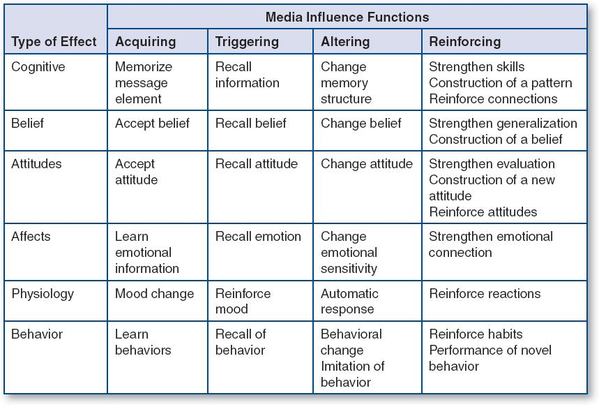

## Table of Contents

## What is the basic definition of media effect?

Media effect refers to the impact that different forms of media, like television, movies, and social media, have on people's thoughts, feelings, and behaviors. When people watch TV shows, read news articles, or scroll through social media, the content they see can influence how they think about the world and how they act in it. For example, seeing a lot of violence on TV might make someone more likely to act aggressively, or seeing positive stories might make someone feel happier and more hopeful.

Researchers study media effects to understand how media can shape public opinion, change behaviors, and even affect mental health. They look at both short-term and long-term impacts. For instance, a scary movie might cause temporary fear, but constant exposure to idealized body images in media can lead to long-term issues like low self-esteem or eating disorders. Understanding media effects helps us use media more wisely and create content that can have positive impacts on society.

## How does media influence individual behavior and societal norms?

Media influences individual behavior by showing people different ways to act and think. When people see characters on TV or in movies doing things, they might start to copy those actions. For example, if a popular show has characters who are always kind and helpful, viewers might try to be kinder too. On the other hand, if they see a lot of violence or bad behavior, they might think it's okay to act that way. Social media also plays a big role because people often want to be like the influencers they follow, so they might change their behavior to match what they see online.

Media also shapes societal norms by showing what is considered normal or acceptable in society. If TV shows and movies often show certain behaviors or lifestyles, people might start to think those are the norms. For example, if many shows portray families in a certain way, people might believe that's how all families should be. Social media can spread ideas quickly, making new norms popular fast. Over time, what people see in the media can change what society thinks is right or wrong, influencing everything from fashion to how people treat each other.

Understanding how media influences behavior and norms is important. It helps us see why people act the way they do and how society's views can change. By being aware of media's power, we can use it to promote positive behaviors and norms, like kindness and equality, instead of negative ones.

## What are the different theories explaining media effects?

There are several theories that help explain how media affects people. One of these is the Cultivation Theory, which says that the more time people spend watching TV, the more they start to believe that the world is like what they see on TV. For example, if TV shows a lot of crime, people might think crime is more common than it really is. Another theory is the Social Learning Theory, which suggests that people learn behaviors by watching others, including characters in media. If someone sees a character being rewarded for bad behavior, they might think it's okay to do the same thing.

Another important theory is the Agenda-Setting Theory, which says that media doesn't tell people what to think, but it does tell them what to think about. For example, if the news keeps talking about a certain issue, people will think that issue is more important. The Uses and Gratifications Theory focuses on why people use media. It says that people choose media to meet their needs, like entertainment or information, and this choice can affect how media influences them. Lastly, the Spiral of Silence Theory explains how media can make people feel like their views are not popular, so they might stay quiet about their opinions, which can change how society talks about certain topics.

These theories show that media can affect people in many ways, from changing what they think is normal to influencing their behavior and even making them feel like they need to stay silent about their beliefs. Understanding these theories helps us see how powerful media can be and how it shapes our world.

## Can you explain the concept of agenda-setting in media?

Agenda-setting in media is about how news and other media tell people what to think about. It's not about telling people what to think, but making certain topics seem more important. For example, if the news keeps talking about a new law, people will start to think that law is a big deal. The media decides what stories to cover a lot, and those stories end up being what people talk about and worry about.

This happens because the media has limited time and space, so they choose what to focus on. When they focus on something a lot, it makes people think that issue is really important. Over time, this can change what people see as the main problems in society. For instance, if the news always talks about crime, people might think crime is the biggest problem, even if it's not. This way, the media shapes what people see as important without telling them what to believe about it.

## How do media effects vary across different demographics?

Media effects can be different for people of different ages, genders, and backgrounds. Kids and teenagers might be more influenced by what they see on TV or social media because their brains are still growing and they are learning about the world. For example, seeing a lot of violence in video games might make them more aggressive. Older people might not be as affected by these things, but they might be more influenced by the news. They might worry more about the world based on what they see on TV.

Men and women can also be affected differently by media. Women might feel more pressure from media to look a certain way because of all the ads and shows that focus on beauty. This can make them feel bad about themselves if they don't match those ideals. Men might be more influenced by media that shows what it means to be "manly," like action movies or sports. People from different cultures might also see media differently. What is normal or funny in one culture might not be the same in another, so media can affect them in unique ways based on their background.

## What role does media play in shaping public opinion and political views?

Media plays a big role in shaping what people think about the world and their political views. When news channels, newspapers, and social media talk a lot about certain topics, people start to think those topics are really important. This is called agenda-setting. For example, if the news keeps talking about a new law, people might start to believe that law is a big deal. Also, the way media talks about things can change how people feel about them. If a news show always talks about a political party in a bad way, people might start to dislike that party, even if they didn't before.

Different types of media can also affect people's political views in different ways. Social media, for example, lets people share their own views and see what their friends think. This can make people feel like their views are popular or not. If a lot of people they know support a certain politician, they might start to support that politician too. TV shows and movies can also show political ideas in a good or bad light, which can change how people see those ideas. Overall, media can make people think about certain issues more and can influence what they believe about politics, but it's up to each person to decide what they really think.

## What are the psychological mechanisms behind media effects?

The psychological mechanisms behind media effects involve how our brains process and react to what we see and hear in the media. One key mechanism is called social learning. This is when people watch characters on TV or in movies and start to copy what they do. If they see someone being rewarded for a behavior, they might think it's okay to do the same thing. For example, if a character is always kind and gets praised for it, viewers might try to be kinder too. Another mechanism is called priming. This means that after seeing something in the media, people might think or act in ways related to what they saw. Like, if someone watches a scary movie, they might feel scared even after the movie is over.

Another important mechanism is called cultivation. This is when people start to believe that the world is like what they see on TV or in other media. If TV shows a lot of crime, people might think crime is more common than it really is. This can change how they see the world and act in it. Emotions also play a big role. Media can make people feel happy, sad, angry, or scared, and these feelings can change how they behave. For example, seeing a lot of sad news might make someone feel down and less likely to do things. Understanding these mechanisms helps us see why media can have such a big impact on people's thoughts and actions.

## How can media effects be measured and analyzed?

Media effects can be measured and analyzed by looking at how people change after they see or hear something in the media. Researchers might do surveys or interviews to ask people about their thoughts and feelings before and after they watch a TV show or read a news article. They can also watch how people act in real life to see if what they saw in the media changed their behavior. For example, they might see if people are more aggressive after watching a violent movie. By comparing what people were like before and after, researchers can figure out if the media had an effect.

Another way to measure media effects is by using experiments. In these experiments, researchers might show one group of people a certain type of media and show another group something different or nothing at all. Then, they compare how the two groups think or act afterwards. This helps them see if the specific media caused any changes. Researchers also use tools like brain scans to see how media affects people's brains. By looking at all this information, they can understand how media influences people's thoughts, feelings, and actions.

## What are some common strategies used by media to influence audiences?

Media often uses repetition to make people remember certain ideas or products. When they show the same thing over and over, like an ad for a new phone, people start to think it's important or cool. Another strategy is emotional appeal. Media might show sad stories to make people feel sorry or happy stories to make them feel good. This can change how people feel about a topic or a brand. They also use framing, which means they show things in a certain way to make people think about them differently. For example, if they talk about a new law as good or bad, people might start to see it that way too.

Another common strategy is using celebrities or influencers. When someone famous talks about a product or an idea, people might want to believe it or buy it because they like the celebrity. Media also uses storytelling to make people care about issues. By telling a story about a person or a family, they can make people feel connected and more likely to support a cause. Lastly, media can use social proof, which means showing that a lot of people like something. If a TV show or a social media post shows that many people support an idea, others might start to support it too because they want to fit in.

## How do new media technologies impact traditional media effects?

New media technologies like social media and streaming services have changed how traditional media affects people. Before, people mostly watched TV shows and read newspapers, which set the agenda for what was important. Now, with social media, people can share their own views and see what their friends think. This means that what people see on social media can be just as important as what they see on TV or in the news. Social media can spread ideas quickly, making new topics popular fast. This can change what people think about and how they feel about certain issues.

Streaming services also change things. People can watch whatever they want whenever they want, which means they might not see the same ads or news stories as everyone else. This can make media effects more personal because what one person watches might be different from what their neighbor watches. Also, new media technologies let people interact with media in new ways, like commenting on posts or sharing videos. This interaction can make people feel more connected to what they see and can change how media affects them. Overall, new media technologies make media effects more complex and personalized.

## What ethical considerations should be taken into account when studying media effects?

When studying media effects, it's important to think about ethics. Researchers need to make sure they don't hurt the people they study. This means they should ask people if they want to be part of the study and tell them what the study is about. They should also keep people's information private and not share it with others. It's wrong to trick people or make them do things they don't want to do just to see how media affects them. Researchers should always be honest and fair.

Another big thing to think about is how the results of the study might be used. If a study shows that a certain type of media makes people act a certain way, that information could be used to control what people see or hear. This could limit people's freedom to choose what they want to watch or read. Researchers need to think about how their work might be used by others and make sure it doesn't harm people or take away their rights. Studying media effects can help us understand the world better, but it has to be done in a way that is good for everyone.

## What are the future trends and potential developments in the field of media effects research?

In the future, media effects research will likely focus more on new technologies like virtual reality and [artificial intelligence](/wiki/ai-artificial-intelligence). These technologies can change how people interact with media in big ways. For example, virtual reality can make people feel like they are really in a different world, which might affect them more strongly than watching a movie. Researchers will want to know how these new forms of media change people's thoughts, feelings, and actions. They will also look at how artificial intelligence, which can make personalized content for each person, might affect people differently than traditional media.

Another trend in media effects research will be looking at how media affects different groups of people in different ways. Researchers know that age, gender, and culture can change how media affects someone, but they want to learn more. They will study how media influences people from different backgrounds and how it can be used to help or hurt certain groups. As media keeps changing and growing, researchers will need to keep up and find new ways to study its effects. This will help us understand how to use media in ways that are good for everyone.

## References & Further Reading

[1]: Tetlock, P. C. (2007). ["Giving Content to Investor Sentiment: The Role of Media in the Stock Market."](https://onlinelibrary.wiley.com/doi/abs/10.1111/j.1540-6261.2007.01232.x) The Journal of Finance, 62(3), 1139-1168.

[2]: Fama, E.F. (1970). ["Efficient Capital Markets: A Review of Theory and Empirical Work."](https://www.jstor.org/stable/2325486) The Journal of Finance, 25(2), 383-417.

[3]: Bollen, J., Mao, H., & Zeng, X. (2011). ["Twitter mood predicts the stock market."](https://www.sciencedirect.com/science/article/pii/S187775031100007X) Journal of Computer Science, 2(1), 1-8.

[4]: ["Advances in Financial Machine Learning"](https://www.amazon.com/Advances-Financial-Machine-Learning-Marcos/dp/1119482089) by Marcos Lopez de Prado

[5]: ["Machine Learning for Algorithmic Trading"](https://github.com/stefan-jansen/machine-learning-for-trading) by Stefan Jansen

[6]: ["Quantitative Trading: How to Build Your Own Algorithmic Trading Business"](https://www.amazon.com/Quantitative-Trading-Build-Algorithmic-Business/dp/1119800064) by Ernest P. Chan