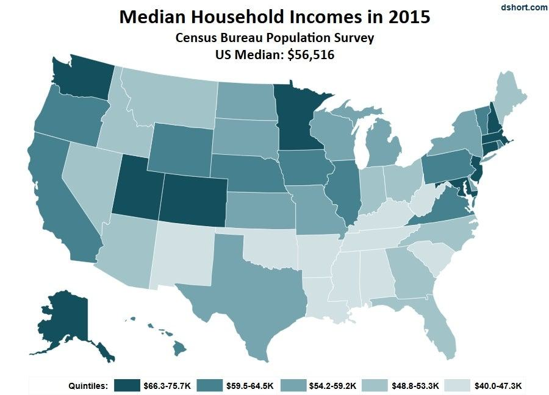

Understanding the dynamics of income distribution across different states in the U.S. is essential for stakeholders such as policymakers, economists, and investors. The variation in income distribution provides insights into the economic health and living standards of diverse regions, highlighting disparities that may necessitate tailored socio-economic policies.

This article investigates the concept of median household income, a statistical measure representing the income level at the midpoint of a population, where half of the households earn more, and half earn less. This measure is preferred over average income due to its resilience against outliers and skewed data, which can distort the average. By focusing on median household income, this article aims to capture a more accurate reflection of typical economic conditions experienced by households in different states.



The significance of median household income extends to various fields, influencing policy-making, economic analysis, and investment strategies. Its variations from state to state highlight regional economic strengths and weaknesses, shaped by factors such as education levels, local industries, and economic policies. These factors contribute to a comprehensive understanding of why some states boast higher median incomes while others lag behind.

Furthermore, these income differences can impact investment strategies, especially in the growing field of algorithmic trading. Algorithmic trading relies on pre-programmed rules and data analysis to execute trades, and economic indicators such as median household income may serve as valuable inputs for these models. Understanding income distribution can thus influence predictions and strategies, potentially leading to more informed investment decisions that align with regional economic patterns.

By exploring these interconnections, readers can gain insights into broader economic trends and make informed financial choices. This introductory section serves as a foundation for the comprehensive analysis that follows, connecting income distribution with financial markets and highlighting the importance of data-driven decision-making in today’s economy.

## Table of Contents

## The Concept of Median Household Income

Median household income is a statistical measure that represents the income level at which half of the households earn more and half earn less. In contrast, the average income is calculated by summing all household incomes and dividing by the number of households. The median is often considered a more accurate indicator of typical household earnings, especially in economic studies, because it is less affected by extreme values or outliers that can skew the average.

Using the median as a measure of central tendency is particularly important in economic analyses because it provides a clearer picture of income distribution. This helps policymakers and economists understand the economic well-being of a typical household more accurately. For instance, a small number of households with extremely high incomes can significantly increase the average income, potentially misleading stakeholders about the general population's financial situation. Therefore, relying on the median ensures that analyses and policy decisions reflect a more accurate and equitable distribution of income across households.

Several factors contribute to variations in median household income across different regions in the United States. Economic policies at the federal, state, and local levels can significantly impact household income. For example, tax policies, minimum wage laws, and public spending on welfare and social services can all influence income levels. Additionally, education levels are a critical [factor](/wiki/factor-investing); regions with higher educational attainment typically exhibit higher median incomes, as education often correlates with access to higher-paying jobs.

Local industries also play a crucial role in shaping household income. Areas with booming industries such as technology, finance, or energy may have higher median incomes compared to regions reliant on lower-paying industries. The availability and growth of lucrative job opportunities in specific sectors can elevate overall income levels for residents within those regions.

To provide a recent perspective, according to the U.S. Census Bureau's 2022 report, the median household income in the United States was approximately $70,784. However, this figure varies considerably among states. For instance, Maryland reported a median income of around $94,384, significantly higher than Mississippi's median income of approximately $45,792. Such disparities highlight the impact of regional economic conditions, local job markets, education levels, and state-specific policies on household income.

In summary, understanding median household income and its influencing factors can offer valuable insights into regional economic conditions and inform policymaking and investment strategies. This statistical measure serves as a more reliable indicator of typical household earnings, aiding in the evaluation and comparison of economic well-being across different areas.

## U.S. State Income Variations

Median household income is a critical indicator of economic well-being and varies significantly across the United States. These variations can be attributed to several factors, including geographic location, cost of living, state-specific policies, and broader economic conditions.

### Comparative Analysis of Median Household Income Across States

A comparative analysis reveals stark differences in median household incomes across U.S. states. States like Maryland, Massachusetts, and New Jersey consistently report among the highest median incomes, often exceeding $85,000 annually. These states benefit from advanced industries such as technology, finance, and healthcare, contributing to higher income levels. Conversely, states like Mississippi and West Virginia usually report median incomes significantly lower, often below $50,000, primarily due to limited industrial diversification and lower educational attainment rates.

For instance, the 2022 U.S. Census Bureau data indicate Maryland's median household income is approximately $90,000, reflecting its affluent suburbs of Washington D.C. and a highly educated workforce. On the other hand, Mississippi's median income stands at around $46,000, highlighting disparities linked to economic structure and education levels. 

### Geographic Factors and Cost of Living Adjustments

Geographic location significantly influences median household income. States located on the coasts, such as California and New York, generally have higher income levels due to concentrated economic activity in metropolitan areas. However, these states also have higher costs of living, which can offset the higher incomes. The relationship between income and cost of living can be represented by the real income formula:

$$
\text{Real Income} = \frac{\text{Nominal Income}}{\text{Cost of Living Index}}
$$

Using this formula helps to understand the true purchasing power of households. A state with a nominal income of $100,000 and a cost of living index of 120 may have similar real income to a state with a $75,000 nominal income but a 90 index.

### State-Specific Policies and Economic Conditions

State-specific policies, such as tax regulations, minimum wage laws, and investment in infrastructure, play a considerable role in shaping household income. States with favorable tax policies, such as Texas and Florida, which have no state income tax, may attract higher income residents and businesses. Additionally, investments in education and infrastructure can enhance workforce skills and connectivity, fostering economic growth and pushing median incomes upward.

Furthermore, states rich in natural resources, such as North Dakota during the oil boom, can experience temporary spikes in median incomes due to economic booms. Conversely, states reliant on declining industries may struggle to maintain or grow household incomes.

### Visual Representation

In analyzing these variations, visual aids can effectively capture the disparities across states. The following Python code snippet demonstrates how to create a bar chart visualizing median household incomes using a hypothetical dataset:

```python
import matplotlib.pyplot as plt
import pandas as pd

# Sample data
data = {'State': ['Maryland', 'Mississippi', 'California', 'New York', 'West Virginia'],
        'Median Income': [90000, 46000, 78000, 84000, 43000]}

df = pd.DataFrame(data)

plt.figure(figsize=(10,6))
plt.bar(df['State'], df['Median Income'], color='skyblue')
plt.title('Median Household Income by State')
plt.xlabel('State')
plt.ylabel('Median Income (USD)')
plt.xticks(rotation=45)
plt.show()
```

This code produces a bar chart that can help visualize differences in median household incomes across selected states, thereby providing a clear and immediate understanding of the income landscape.

These variations in median household income across states are integral to understanding the broader economic patterns in the U.S. For investors, economists, and policymakers, recognizing these differences is crucial for crafting informed strategies and policies that account for regional economic conditions.

## Algorithmic Trading: An Overview

Algorithmic trading, a method of executing orders using automated pre-programmed trading instructions, has gained immense significance in financial markets over the past decades. This approach leverages mathematics, data analysis, and computing power to trade securities at speeds and frequencies that are impossible for human traders. 

At its core, [algorithmic trading](/wiki/algorithmic-trading) involves the use of algorithms, or sets of rules, to determine the optimal timing, price, and quantity of trades. Unlike traditional trading, which relies on human intuition and decision-making, algorithmic trading eliminates emotional biases by strictly adhering to the algorithm's logic. This method also facilitates high-frequency trading ([HFT](/wiki/high-frequency-trading-strategies)), where trades are executed in fractions of a second.

Key technologies in algorithmic trading include statistical analysis, [machine learning](/wiki/machine-learning), and [artificial intelligence](/wiki/ai-artificial-intelligence). These technologies allow traders to create and refine algorithms that can identify market inefficiencies, predict price movements, and execute trades accordingly. Strategies such as [arbitrage](/wiki/arbitrage), [market making](/wiki/market-making), and [trend following](/wiki/trend-following) are commonly employed. For instance, arbitrage strategies take advantage of price differences between markets, while trend-following strategies execute trades based on [momentum](/wiki/momentum) indicators.

The benefits of algorithmic trading are numerous. Efficiency is enhanced as algorithms can analyze multiple market conditions simultaneously and execute trades without manual intervention. Speed is another advantage; algorithms can respond to market movements much faster than human traders, which is crucial in volatile markets. Additionally, because algorithms can be backtested using historical data, traders can refine their strategies before deploying them in real markets.

However, algorithmic trading also presents certain challenges. Market [liquidity](/wiki/liquidity-risk-premium) can be impacted by the high [volume](/wiki/volume-trading-strategy) of trades executed by algorithms, potentially leading to market disruptions. Additionally, the complexity of these algorithms can introduce unforeseen risks, such as algorithmic errors or "flash crashes" that can result in significant financial losses. Moreover, as algorithms become more sophisticated, they require constant maintenance and updates to remain effective in changing market conditions.

Examples of popular algorithms in various market conditions include pairs trading and [statistical arbitrage](/wiki/statistical-arbitrage), which exploit the relative price movements between correlated instruments. Mean reversion strategies, which are based on the assumption that prices will revert to their historical mean, are also widely utilized. Each of these algorithms is designed to capitalize on specific market behaviors, providing traders with tailored solutions to maximize returns.

In summary, algorithmic trading represents a paradigm shift in how market transactions are conducted. It offers efficient, high-speed trading solutions while introducing new complexities and risks that market participants must navigate. As financial markets increasingly integrate technology, the role of algorithmic trading will continue to expand, demanding ongoing advancements in technology and strategic development.

## Linking Household Income and Algorithmic Trading

Variations in median household income across different regions can significantly impact investment patterns and market behavior, primarily by influencing consumer spending, savings behavior, and overall economic health. Higher median household income often correlates with increased consumer spending, which can stimulate local economies and potentially lead to more robust economic indicators such as a higher GDP growth rate. Conversely, regions with lower median household incomes may experience diminished economic activity, affecting market performance within those areas.

Algorithmic trading can harness these income variations by incorporating regional economic health into trading strategies. For instance, algorithms can use indicators such as consumer confidence indexes, local employment rates, and income levels to predict market trends. The integration of median household income data into trading models can enhance the precision of predictions concerning market movements. 

Here is a basic Python example of how income data can be integrated into an algorithmic trading strategy:

```python
import pandas as pd
import numpy as np

# Sample data representing regional income statistics and market performance indicators
data = {
    'region': ['Region A', 'Region B', 'Region C'],
    'median_income': [75000, 50000, 60000],
    'market_index': [11500, 11200, 11300],
}

# Create a DataFrame
df = pd.DataFrame(data)

# An example function to adjust trading strategy based on income data
def adjust_strategy(income, market_index):
    # Example logic: higher income increases market confidence
    if income > 70000:
        return market_index * (1 + 0.02)  # Increase market index by 2%
    elif income < 55000:
        return market_index * (1 - 0.02)  # Decrease market index by 2%
    else:
        return market_index

# Apply the function to the DataFrame
df['adjusted_market_index'] = df.apply(lambda row: adjust_strategy(row['median_income'], row['market_index']), axis=1)

print(df)
```

In this example, regions with a higher median household income see an increase in the market index adjustments, reflecting a potentially stronger market performance. This simplistic approach serves as an example of how income data might be factored into trading strategies.

Case studies and hypothetical scenarios further illustrate the impact of household income data on algorithmic trading decisions. For instance, a case where a trading firm leverages local income data into its trading algorithms may result in a strategy that disproportionately weights investments in regions exhibiting income growth. In turn, this leads to a diversified and regionally tailored investment portfolio capable of withstanding economic fluctuations.

Tailored and region-specific trading strategies can be particularly beneficial in fine-tuning investment approaches to align with local economic conditions. For example, an algorithm might prioritize equities in states showing positive income trends while shorting those indicating income stagnation or decline. By doing so, the algorithm accounts for economic health disparities, potentially increasing returns and reducing risks associated with broader market [volatility](/wiki/volatility-trading-strategies).

Overall, incorporating median household income data into algorithmic trading provides an opportunity to refine investment strategies, adapting them to the specific economic landscapes of different regions. This approach not only enhances predictive accuracy but also encourages more nuanced and informed financial decision-making.

## Conclusion

The exploration of median household income variations across U.S. states and their influence on algorithmic trading underscores several key insights. Understanding median household income is crucial, as it provides a more accurate representation of income distribution than the average, particularly in regions with significant income disparities. This measure serves as a foundational element for analyzing economic conditions and potential investment strategies.

By integrating economic data, such as median household incomes, with the technological advancements in algorithmic trading, investors can create more nuanced strategies tailored to specific regional economic climates. This approach highlights the necessity of combining economic data insights with trading technologies to capture potential market opportunities and mitigate risks effectively.

Broader economic indicators, including household income, education levels, and employment rates, should factor into the development of trading algorithms. Incorporating these indicators allows for a more holistic view of market dynamics and facilitates the design of robust trading strategies that can adapt to diverse economic environments.

Future trends in income distribution, driven by factors such as technological advancements, globalization, and policy changes, hold significant implications for investors. A potential shift towards more equitable income distribution or increased economic disparities could alter market behaviors, influencing trading models and investment decisions.

Investors and policymakers are encouraged to leverage these data-driven insights by integrating comprehensive economic analyses with innovative trading technologies. Such an approach can drive economic growth and contribute to more stable and efficient financial markets, serving the wider economy effectively. Engaging with these insights not only enhances individual investment strategies but also supports broader economic development objectives.

## References & Further Reading

[1]: U.S. Census Bureau. (2022). ["Income and Poverty in the United States: 2022."](https://www.census.gov/library/publications/2023/demo/p60-280.html)

[2]: Lopez de Prado, M. (2018). ["Advances in Financial Machine Learning."](https://www.amazon.com/Advances-Financial-Machine-Learning-Marcos/dp/1119482089) Wiley.

[3]: Aronson, D. R. (2011). ["Evidence-Based Technical Analysis: Applying the Scientific Method and Statistical Inference to Trading Signals."](https://www.amazon.com/Evidence-Based-Technical-Analysis-Scientific-Statistical/dp/0470008741) Wiley.

[4]: Jansen, S. (2020). ["Machine Learning for Algorithmic Trading: Predictive Models to Extract Signals from Market and Alternative Data for Systematic Trading Strategies with Python."](https://github.com/stefan-jansen/machine-learning-for-trading) Packt Publishing.

[5]: Chan, E. P. (2009). ["Quantitative Trading: How to Build Your Own Algorithmic Trading Business."](https://github.com/ftvision/quant_trading_echan_book) Wiley.