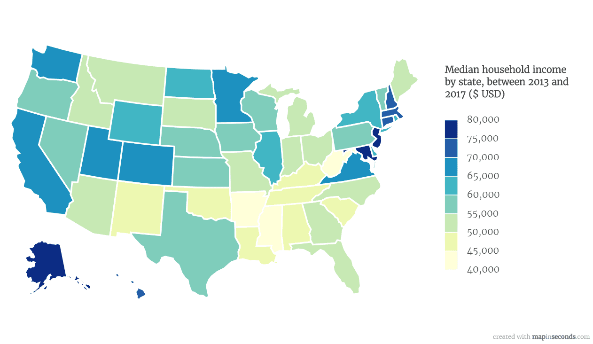

## Table of Contents

## What is median household income?

Median household income is the amount of money that is earned by the middle household when all households in a specific area are lined up from the lowest to the highest income. It's a way to understand how much money typical families make, and it's often used to compare the economic well-being of different places or groups of people.

This number is important because it gives a clearer picture of what most people earn, rather than using an average which can be skewed by very high or very low incomes. For example, if a few people earn a lot of money, the average might be high, but the median would show that most people earn less than that average. It helps policymakers and researchers see where people might need more support or where the economy is doing well.

## Why is median household income important to understand?

Understanding median household income is important because it shows us what the middle family earns in a certain place. It's like looking at the middle of a line of people where one side has less money and the other side has more. This helps us know if most families have enough money for things like food, a home, and school.

This number is also useful for comparing different areas or groups of people. If one city has a higher median income than another, it might mean people there are doing better financially. Governments and businesses use this information to make decisions, like where to build new schools or stores, or where people might need help with money.

Knowing the median income can also tell us about changes over time. If the median income goes up, it might mean that families are [earning](/wiki/earning-announcement) more and the economy is doing well. If it goes down, it could be a sign that people are struggling more. This helps everyone understand the health of the economy and plan for the future.

## How is median household income calculated?

To find the median household income, you start by collecting the income of all the households in the area you're looking at. This could be a city, a state, or even the whole country. Once you have all the incomes, you line them up from the lowest to the highest. Imagine all the households standing in a line, with the one earning the least at the front and the one earning the most at the back.

Next, you find the middle household in this line. If there's an odd number of households, the median is the income of the one right in the middle. If there's an even number, you take the two middle households and find the average of their incomes. That's the median household income. It's a way to see what the typical family earns, without being thrown off by very high or very low incomes.

## What are the sources of data for median household income by state?

The main source of data for median household income by state comes from the U.S. Census Bureau. They collect information from surveys like the American Community Survey (ACS), which asks people about their income and other details. This survey goes out to a big sample of households all over the country every year, so it gives a good picture of what's happening in each state.

Another source is the Current Population Survey (CPS), which is also run by the U.S. Census Bureau but in partnership with the Bureau of Labor Statistics. This survey asks about income too, but it focuses on a smaller group of households. It's useful for understanding trends over time and can be broken down by state. Both of these sources help us see how much money families in different states are making.

## What was the median household income for each U.S. state in the most recent year available?

The median household income for each U.S. state varies a lot. In the most recent year available, which is 2022, the state with the highest median household income was Maryland, where the middle family earned about $108,200. Washington D.C., which is not a state but often included in these lists, had an even higher median income at around $101,722. Other states with high median incomes included New Jersey at $96,346, Massachusetts at $94,488, and California at $91,905. These numbers show that families in these places tend to earn more money than in other parts of the country.

On the other end, the state with the lowest median household income in 2022 was Mississippi, where the middle family earned about $52,985. Other states with lower median incomes included West Virginia at $53,564, Arkansas at $55,432, and New Mexico at $58,722. These numbers help us see that families in these states might have less money to spend on things like food, housing, and education compared to families in states with higher median incomes.

## How has median household income changed over the last decade in the U.S. states?

Over the last decade, from 2012 to 2022, median household income in the United States has generally gone up. In 2012, the national median household income was about $51,017. By 2022, it had increased to around $74,580. This shows that, on average, families across the country are earning more money now than they did ten years ago. However, the increase has not been the same in every state. Some states saw bigger jumps in median income, while others had smaller increases or even stayed about the same.

Looking at specific states, we can see some interesting trends. For example, in Washington D.C., the median household income went from about $66,583 in 2012 to $101,722 in 2022, showing a big increase. In contrast, Mississippi's median income only grew from around $37,963 to $52,985 over the same period, which is still an increase but much smaller compared to Washington D.C. States like California and Massachusetts also saw significant growth, with California's median income rising from $61,400 to $91,905 and Massachusetts from $66,768 to $94,488. These differences show how economic growth can vary a lot from one place to another.

## Which states have the highest and lowest median household incomes?

The state with the highest median household income in 2022 was Maryland, where the middle family earned about $108,200. Washington D.C., which is not a state but often included in these lists, had an even higher median income at around $101,722. Other states with high median incomes included New Jersey at $96,346, Massachusetts at $94,488, and California at $91,905. These numbers show that families in these places tend to earn more money than in other parts of the country.

On the other end, the state with the lowest median household income in 2022 was Mississippi, where the middle family earned about $52,985. Other states with lower median incomes included West Virginia at $53,564, Arkansas at $55,432, and New Mexico at $58,722. These numbers help us see that families in these states might have less money to spend on things like food, housing, and education compared to families in states with higher median incomes.

## What factors influence differences in median household income across states?

Many things can affect why some states have higher median household incomes than others. One big reason is the kinds of jobs people have. In places like California and New York, there are a lot of high-paying jobs in tech, finance, and other industries. These jobs make the median income higher because more people earn a lot of money. Also, big cities in these states attract a lot of businesses and educated workers, which can push up incomes. On the other hand, states like Mississippi and West Virginia might have more jobs in farming or mining, which often don't pay as much. The cost of living can also play a part. In states where it's more expensive to live, people might need to earn more to keep up.

Another [factor](/wiki/factor-investing) is education. States with more people who have gone to college usually have higher median incomes because college graduates often earn more. For example, Massachusetts and Maryland have a lot of universities and a high number of college graduates, which helps boost their median incomes. Also, government policies can make a difference. Some states might offer tax breaks or other incentives that help businesses grow and create good jobs. Lastly, things like the history of the area, how easy it is to get around, and even the weather can affect where businesses choose to set up and where people decide to live, which in turn impacts median household income.

## How does median household income correlate with other economic indicators like unemployment rate and cost of living?

Median household income often goes hand-in-hand with other economic indicators like unemployment rate and cost of living. When the unemployment rate is low, more people have jobs, and this usually means the median household income goes up because more families are earning money. On the other hand, if a lot of people are out of work, the median income might go down because fewer families are bringing in money. For example, states with lower unemployment rates like Massachusetts and New Jersey tend to have higher median incomes because more people are working and earning.

The cost of living also plays a big role in median household income. In places where it costs a lot to live, like California and New York, families need to earn more money just to get by. This can make the median income look high, but it doesn't always mean people are better off because their money doesn't go as far. On the flip side, in states with a lower cost of living like Mississippi or West Virginia, families might not need to earn as much to cover their expenses, so the median income might be lower, but their money can still buy more. Understanding how these factors work together helps us see the bigger picture of how well families are doing in different parts of the country.

## What are the limitations and potential biases in the data on median household income by state?

When looking at median household income data by state, it's important to know that there can be some problems with the numbers. One big issue is that the data might not include everyone. For example, people who live in places like nursing homes or college dorms might not be counted. This can make the numbers less accurate because it leaves out some groups of people. Also, the data is based on surveys, and sometimes people might not answer honestly or they might not answer at all. This can make the numbers off because the information is not complete.

Another problem is that the data can be biased. This means it might not show a fair picture of what's really happening. For example, if richer people are more likely to answer the survey, the median income might look higher than it really is. Or if the survey doesn't ask about all types of income, like money from investments or side jobs, the numbers might be too low. Also, the way the data is collected can change over time, which makes it hard to compare numbers from different years. Knowing these limitations helps us understand that while the data is useful, it's not perfect and we need to be careful when using it to make decisions.

## How do state policies and economic conditions affect median household income?

State policies and economic conditions play a big role in shaping median household income. When a state has policies that help businesses grow, like tax breaks or good infrastructure, it can attract more companies and create more jobs. This means more people can work, and if the jobs pay well, the median income goes up. Also, if a state spends money on education and training, more people can get better jobs, which can also raise the median income. On the other hand, if a state has high taxes or strict rules that make it hard for businesses to operate, fewer jobs might be available, and the median income could stay low or even go down.

Economic conditions are another big factor. When the economy is doing well, businesses make more money and can pay their workers more. This can lead to a higher median income because more families are earning more. But if the economy is struggling, businesses might cut jobs or wages, which can lower the median income. Things like the cost of living also matter. If prices for things like housing and food go up a lot, families need more money just to get by, which can affect the median income. So, both state policies and the overall economic situation work together to influence how much the middle family earns in a state.

## What predictive models can be used to forecast future trends in median household income by state?

To forecast future trends in median household income by state, experts can use different kinds of predictive models. One common model is called regression analysis. This model looks at past data on things like employment rates, education levels, and cost of living to guess what might happen to median income in the future. Another model is time series analysis, which looks at how median income has changed over time and uses that pattern to predict future changes. Both of these models help us see what might happen to median income in different states by using numbers and patterns from the past.

Another way to predict median household income is by using [machine learning](/wiki/machine-learning) models. These models can look at a lot of different data at the same time, like state policies, economic conditions, and even things like population growth or migration patterns. By finding patterns in all this data, machine learning can make very detailed predictions about how median income might change in each state. These models are good at handling a lot of information and can be updated with new data to make their predictions even better over time.

## What are the variations in income across U.S. states?

Median household income is a critical indicator of economic well-being and varies significantly across the United States. These variations can be attributed to several factors, including geographic location, cost of living, state-specific policies, and broader economic conditions.

### Comparative Analysis of Median Household Income Across States

A comparative analysis reveals stark differences in median household incomes across U.S. states. States like Maryland, Massachusetts, and New Jersey consistently report among the highest median incomes, often exceeding $85,000 annually. These states benefit from advanced industries such as technology, finance, and healthcare, contributing to higher income levels. Conversely, states like Mississippi and West Virginia usually report median incomes significantly lower, often below $50,000, primarily due to limited industrial diversification and lower educational attainment rates.

For instance, the 2022 U.S. Census Bureau data indicate Maryland's median household income is approximately $90,000, reflecting its affluent suburbs of Washington D.C. and a highly educated workforce. On the other hand, Mississippi's median income stands at around $46,000, highlighting disparities linked to economic structure and education levels. 

### Geographic Factors and Cost of Living Adjustments

Geographic location significantly influences median household income. States located on the coasts, such as California and New York, generally have higher income levels due to concentrated economic activity in metropolitan areas. However, these states also have higher costs of living, which can offset the higher incomes. The relationship between income and cost of living can be represented by the real income formula:

$$
\text{Real Income} = \frac{\text{Nominal Income}}{\text{Cost of Living Index}}
$$

Using this formula helps to understand the true purchasing power of households. A state with a nominal income of $100,000 and a cost of living index of 120 may have similar real income to a state with a $75,000 nominal income but a 90 index.

### State-Specific Policies and Economic Conditions

State-specific policies, such as tax regulations, minimum wage laws, and investment in infrastructure, play a considerable role in shaping household income. States with favorable tax policies, such as Texas and Florida, which have no state income tax, may attract higher income residents and businesses. Additionally, investments in education and infrastructure can enhance workforce skills and connectivity, fostering economic growth and pushing median incomes upward.

Furthermore, states rich in natural resources, such as North Dakota during the oil boom, can experience temporary spikes in median incomes due to economic booms. Conversely, states reliant on declining industries may struggle to maintain or grow household incomes.

### Visual Representation

In analyzing these variations, visual aids can effectively capture the disparities across states. The following Python code snippet demonstrates how to create a bar chart visualizing median household incomes using a hypothetical dataset:

```python
import matplotlib.pyplot as plt
import pandas as pd

# Sample data
data = {'State': ['Maryland', 'Mississippi', 'California', 'New York', 'West Virginia'],
        'Median Income': [90000, 46000, 78000, 84000, 43000]}

df = pd.DataFrame(data)

plt.figure(figsize=(10,6))
plt.bar(df['State'], df['Median Income'], color='skyblue')
plt.title('Median Household Income by State')
plt.xlabel('State')
plt.ylabel('Median Income (USD)')
plt.xticks(rotation=45)
plt.show()
```

This code produces a bar chart that can help visualize differences in median household incomes across selected states, thereby providing a clear and immediate understanding of the income landscape.

These variations in median household income across states are integral to understanding the broader economic patterns in the U.S. For investors, economists, and policymakers, recognizing these differences is crucial for crafting informed strategies and policies that account for regional economic conditions.

## References & Further Reading

[1]: U.S. Census Bureau. (2022). ["Income and Poverty in the United States: 2022."](https://www.census.gov/library/publications/2023/demo/p60-280.html)

[2]: Lopez de Prado, M. (2018). ["Advances in Financial Machine Learning."](https://www.amazon.com/Advances-Financial-Machine-Learning-Marcos/dp/1119482089) Wiley.

[3]: Aronson, D. R. (2011). ["Evidence-Based Technical Analysis: Applying the Scientific Method and Statistical Inference to Trading Signals."](https://www.amazon.com/Evidence-Based-Technical-Analysis-Scientific-Statistical/dp/0470008741) Wiley.

[4]: Jansen, S. (2020). ["Machine Learning for Algorithmic Trading: Predictive Models to Extract Signals from Market and Alternative Data for Systematic Trading Strategies with Python."](https://github.com/stefan-jansen/machine-learning-for-trading) Packt Publishing.

[5]: Chan, E. P. (2009). ["Quantitative Trading: How to Build Your Own Algorithmic Trading Business."](https://github.com/ftvision/quant_trading_echan_book) Wiley.