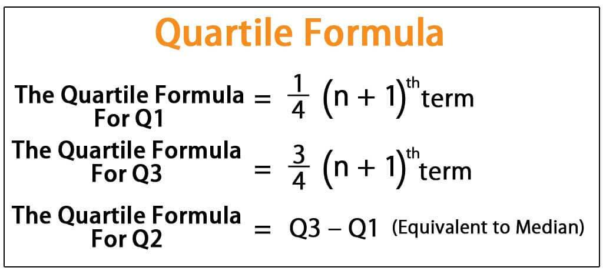

In the world of trading, making data-driven decisions is essential for success. Traders rely heavily on statistical tools to analyze market trends and develop robust trading strategies. Among these tools, the median emerges as a key statistical measure. The median, unlike the average, offers better resilience to data anomalies such as outliers and extreme market movements. This makes it particularly valuable in financial analysis, where data sets often contain skewed distributions.

This article focuses on methods to calculate the median in algorithmic trading, highlighting its advantages over other statistical measures like mean or mode, especially in scenarios involving high volatility. The median helps traders maintain a clear focus on market trends by mitigating the impact of erratic price swings. Understanding how to accurately calculate and apply the median is paramount in formulating strategies that minimize risk and maximize potential returns. Statistics not only enhance the accuracy of market predictions but also play a fundamental role in developing trading algorithms capable of adaptive decision-making in fast-paced trading environments. This section sets the foundation for exploring these concepts further, emphasizing the importance of the median in crafting effective and resilient trading strategies.



## Table of Contents

## Understanding the Median

The median is a fundamental statistical measure used to summarize a dataset. It represents the middle value in a sorted list, providing a central point that divides the data into two equal halves. Unlike the average, or mean, which can be skewed by extreme values known as outliers, the median remains unaffected by such anomalies. This characteristic makes it particularly useful in datasets with significant variability, where outliers might distort the overall picture.

To calculate the median, first arrange the data in ascending numerical order. For datasets with an odd number of observations, the median is the value located at the exact midpoint. Mathematically, if a dataset contains $n$ number of observations, where $n$ is odd, the median $M$ can be found using the formula:

$$
M = x_{\left(\frac{n+1}{2}\right)}
$$

Here, $x_{\left(\frac{n+1}{2}\right)}$ denotes the value of the data point at position $\frac{n+1}{2}$.

For datasets with an even number of observations, the median is the average of the two middle numbers. In such cases, if the dataset contains $n$ observations, the positions of these two values are $\frac{n}{2}$ and $\frac{n}{2} + 1$. Thus, the median $M$ is calculated as:

$$
M = \frac{x_{\left(\frac{n}{2}\right)} + x_{\left(\frac{n}{2} + 1\right)}}{2}
$$

Consider a simple example to illustrate these calculations:

1. For an odd-numbered dataset: $[3, 5, 7, 9, 11]$, the median is the third element, which is 7.
2. For an even-numbered dataset: $[3, 5, 7, 9]$, the median is computed as:

$$
M = \frac{5 + 7}{2} = 6
$$

The robustness of the median in the presence of outliers is one of its primary strengths, offering a reliable measure of central tendency for various applications, including [algorithmic trading](/wiki/algorithmic-trading). By using the median, traders can obtain a clearer picture of typical price movements, mitigating the impact of sudden, extreme price changes.

## Importance of Median in Algorithmic Trading

The median price is a pivotal tool for algorithmic traders aiming to filter out the noise inherent in market price fluctuations. Unlike the arithmetic average, the median provides a robust measure that is less sensitive to extreme values, such as sudden spikes or dips. This characteristic is valuable in reducing the effect of [volatility](/wiki/volatility-trading-strategies) on trading models, allowing for more stable and reliable decision-making processes.

In the trading environment, price noise can obscure true market trends, leading to erroneous interpretations and potential losses. By focusing on the median price, traders can achieve a cleaner signal that highlights the central tendency of market prices. This improves the visualization of overall market trends, distinguishing essential information from the erratic behaviors often observed in closing or average prices. For instance, during periods of high volatility, the average price may be skewed by outliers, whereas the median remains centered on the majority of price movements, thereby offering a more accurate representation.

In the practice of [backtesting](/wiki/backtesting) — the process of testing a trading strategy using historical data — the use of the median can be instrumental in assessing performance metrics realistically. Outliers in historical data can distort backtesting results, leading to over-optimized strategies that may underperform in live markets. By incorporating the median, traders can smooth out these extreme variations, resulting in a more realistic evaluation of how a strategy would perform under typical market conditions. This approach helps traders refine strategies before real capital is at risk.

The application of the median extends beyond reducing volatility. It serves as a foundational component in numerous algorithmic trading strategies, contributing to the development of indicators that prioritize precision and stability. As algorithmic trading methods continue to evolve, the reliance on robust statistical measures like the median is expected to grow, underscoring its importance in navigating modern financial markets.

## Methods for Calculating Median

Different algorithmic methods are used to calculate the median in trading, each offering unique advantages depending on the complexity and speed required for processing financial data. Python and R are among the most popular programming languages employed for calculating the median due to their robust statistical libraries and ease of use.

### Python for Median Calculation

In Python, packages such as `numpy` and `pandas` provide built-in functions to efficiently compute the median. For instance, using `numpy`, the median of a data array can be calculated using the `numpy.median()` function:

```python
import numpy as np

data = [10, 20, 35, 24, 50, 45, 30]
median_value = np.median(data)
print("Median:", median_value)
```

This function sorts the data and finds the middle value, making it particularly useful in contexts where dealing with large datasets is necessary.

### R for Median Calculation

In R, computing the median is straightforward with the built-in `median()` function. This function returns the median of the input numeric vector or data set, similar to Python’s `numpy.median()`:

```R
data <- c(10, 20, 35, 24, 50, 45, 30)
median_value <- median(data)
print(median_value)
```

This simple application of statistical functions allows traders to quickly implement median calculations without extensive coding.

### Median Price Calculations in Trading

Median price calculations often involve examining high and low asset prices within given periods. Median prices are typically calculated using the following formula:

$$
\text{Median Price} = \frac{(\text{High} + \text{Low})}{2}
$$

This calculation helps traders filter out extreme price fluctuations by averaging the high and low prices over a specific period, providing a clearer picture of an asset’s central tendency.

In algorithmic trading, these calculations can be automated to assist in real-time decision making. By leveraging the median prices, traders can better assess trends and reduce the impact of volatile market conditions, thus enhancing the robustness of trading strategies.

In summary, employing Python and R for median calculations provides algorithmic traders with powerful tools to evaluate and interpret market data effectively. This capability is crucial for developing strategies that are less susceptible to false signals caused by market noise.

## Examples of Median Calculation in Trading Algorithms

Median prices are a fundamental component in developing robust trading algorithms, often integrated into strategies such as moving averages and oscillators. By leveraging the median, traders can filter out irregularities caused by sharp price movements, thus obtaining a more stable representation of market behavior.

One common application is using the median in conjunction with Bollinger Bands. Bollinger Bands are a volatility indicator formed using a moving average and standard deviations. By incorporating the median price instead of the typical price (which is an average of high, low, and close prices), traders can better account for outlier events that might skew the average and thus affect the interpretability of market volatility. The median helps center the bands more accurately when price distributions are skewed, providing a clearer indication of potential market breakouts or reversals.

Furthermore, integrating median prices with the Relative Strength Index (RSI) can produce more stable trading indicators. The RSI is a [momentum](/wiki/momentum) oscillator measuring the speed and change of price movements, traditionally based on average price gains and losses over a set period. By substituting the median for the average in the RSI calculation, traders can diminish the impact of price spikes, leading to a smoother RSI curve that may offer more reliable buy or sell signals.

Here's a basic example of how you might calculate a moving median with Bollinger Bands using Python:

```python
import pandas as pd
import numpy as np

def calculate_median_price(high, low, close):
    return np.median([high, low, close])

# Example pandas DataFrame
data = pd.DataFrame({
    'High': [50, 51, 52, 53, 54],
    'Low': [45, 46, 47, 48, 49],
    'Close': [48, 49, 50, 51, 52]
})

data['Median_Price'] = data.apply(lambda row: calculate_median_price(row['High'], row['Low'], row['Close']), axis=1)

# Compute the Rolling Median and Bollinger Bands
rolling_median = data['Median_Price'].rolling(window=20).median()
rolling_std = data['Median_Price'].rolling(window=20).std()
bollinger_up = rolling_median + (rolling_std * 2)
bollinger_down = rolling_median - (rolling_std * 2)

data['Rolling_Median'] = rolling_median
data['Bollinger_Up'] = bollinger_up
data['Bollinger_Down'] = bollinger_down

print(data)
```

This code illustrates how to compute a rolling median and apply it within the framework of Bollinger Bands. Using this approach allows traders to refine their algorithms for better profitability by minimizing the impact of outliers and maintaining a focus on long-term price trends.

The combination of median prices with these technical indicators exemplifies how traders can improve their market analysis and decision-making capabilities. By relying on median calculations, they gain tools for creating more resilient trading strategies that adapt to market volatility while providing a clearer signal from a noisy environment.

## Real-World Applications and Challenges

Hedge funds and high-frequency trading firms utilize median price analysis as a strategic tool for refining trading decisions. The median presents a robust measure for handling skewed data, which is particularly advantageous in fast-paced trading environments where outliers can distort decision-making processes. By relying on the median, traders can mitigate the influence of sudden price spikes or drops, ensuring that their strategies are more reflective of overall market sentiment rather than transient anomalies.

One significant application is in predictive analytics, where median prices are employed to develop models that anticipate future market movements. By capturing the central tendency of price data, these models offer more reliable predictions, aiding traders in making informed buy or sell decisions. Furthermore, the median is instrumental in risk management strategies, as it allows firms to assess potential risks based on a stable measure of central tendency, helping to safeguard investments against volatility.

However, the effective use of median price analysis is not without its challenges. Data quality is a critical concern; inaccurate or incomplete data can lead to faulty median calculations, ultimately skewing model outputs. Ensuring high-quality, clean data is fundamental for the median to accurately represent market conditions. Additionally, varying market conditions, such as sudden economic events or shifts in investor sentiment, can pose another layer of complexity, necessitating continuous recalibration of strategies that rely on median calculations.

The computational demands of calculating the median in high-frequency trading are also notable. As these trading strategies involve analyzing vast volumes of data in real-time, the computational resources required to determine the median efficiently become a substantial consideration. Implementing optimized algorithms or leveraging advanced computing infrastructures can alleviate some of these challenges, ensuring that the median remains a viable component of sophisticated trading strategies.

In summary, while median price analysis offers substantial benefits in trading by enhancing predictive accuracy and risk mitigation, addressing the accompanying challenges related to data quality, market dynamics, and computational efficiency is crucial for realizing its full potential.

## Conclusion

Median calculation is fundamental to algorithmic trading, offering critical insights into market behavior. Unlike the mean, which can be distorted by extreme values or outliers, the median provides a more balanced representation of the central tendency of price movements. This inherent robustness makes it invaluable in crafting trading strategies that are less susceptible to erroneous signals driven by market noise.

In algorithmic strategies, utilizing the median reduces risks by filtering out volatile market spikes that may lead to suboptimal trading decisions. For instance, in quantitative models, the incorporation of medians in calculating key indicators such as moving averages or oscillators can mitigate the disruptions caused by short-term anomalies. This emphasis on smoothing out data inevitably leads to more reliable strategy performance, thereby enhancing the potential for superior returns.

As algorithmic trading methodologies continue to evolve, the reliance on medians is anticipated to grow. The increasing complexity of financial markets and the vast amounts of data processed necessitate statistical measures that offer stability and reliability. The median's ability to provide consistent insights makes it an indispensable tool in the arsenal of traders and trading systems. Consequently, the role of the median in algorithmic trading is expected to expand, driven by advances in technology and the ongoing quest for optimal trading precision.

## References & Further Reading

[1]: ["Quantitative Trading: How to Build Your Own Algorithmic Trading Business"](https://www.amazon.com/Quantitative-Trading-Build-Algorithmic-Business/dp/0470284889) by Ernest P. Chan

[2]: ["Machine Learning for Algorithmic Trading"](https://www.amazon.com/Machine-Learning-Algorithmic-Trading-alternative/dp/1839217715) by Stefan Jansen

[3]: ["Advances in Financial Machine Learning"](https://www.amazon.com/Advances-Financial-Machine-Learning-Marcos/dp/1119482089) by Marcos Lopez de Prado

[4]: ["Evidence-Based Technical Analysis: Applying the Scientific Method and Statistical Inference to Trading Signals"](https://www.amazon.com/Evidence-Based-Technical-Analysis-Scientific-Statistical/dp/0470008741) by David Aronson

[5]: Bergstra, J., Bardenet, R., Bengio, Y., & Kégl, B. (2011). ["Algorithms for Hyper-Parameter Optimization."](https://proceedings.neurips.cc/paper/2011/file/86e8f7ab32cfd12577bc2619bc635690-Paper.pdf) Advances in Neural Information Processing Systems 24.