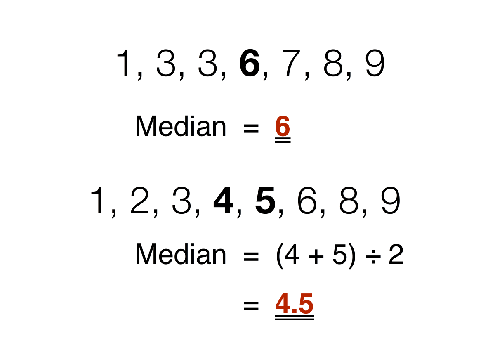

## Table of Contents

## What is the median in statistics?

The median is a number that shows the middle of a set of data. To find the median, you first need to put all the numbers in order from smallest to largest. If there is an odd number of values, the median is the number right in the middle. If there is an even number of values, the median is the average of the two middle numbers.

The median is useful because it gives you an idea of the center of the data without being affected too much by very high or very low numbers. For example, if you have the numbers 2, 3, 5, 7, and 100, the median is 5, not 100. This makes the median a good choice when you want to understand the typical value in a set of data that might have some extreme values.

## How is the median different from the mean and mode?

The median, mean, and mode are all ways to describe a set of numbers, but they do it differently. The median is the middle number when you line up all the numbers from smallest to largest. If there's an even number of values, you take the average of the two middle numbers. The median is good for understanding the center of the data without being thrown off by very high or very low numbers. For example, in the set 2, 3, 5, 7, and 100, the median is 5, which shows the middle value without being affected by the high number 100.

The mean, or average, is found by adding up all the numbers and then dividing by how many numbers there are. The mean can be influenced a lot by very high or very low numbers. Using the same set of numbers, 2, 3, 5, 7, and 100, the mean would be (2+3+5+7+100)/5 = 23.4. This number is much higher than most of the numbers in the set because of the 100. The mean gives you a sense of the overall average but can be misleading if there are extreme values.

The mode is the number that appears most often in a set of data. If no number repeats, there is no mode. The mode can be useful to see which value is most common, but it doesn't tell you anything about the other numbers in the set. For example, in the set 2, 3, 5, 7, and 100, there is no mode because all numbers appear only once. If you had the set 2, 3, 3, 5, 7, the mode would be 3 because it appears more often than the other numbers. Each of these measures—median, mean, and mode—gives you a different way to look at and understand your data.

## Why is the median important in data analysis?

The median is important in data analysis because it gives a good idea of the middle value in a set of numbers. It is not affected by extreme values, like very high or very low numbers. This makes the median a useful measure when you want to understand what is typical in your data without those extreme values messing things up. For example, if you are looking at the salaries of a group of people and one person earns a lot more than everyone else, the median salary will still show you what most people earn, not the high salary of that one person.

In some situations, the median can be more helpful than the mean or average. The mean can be pulled up or down by extreme values, which might not give a true picture of what is normal. The median avoids this problem by focusing on the middle value. This is why the median is often used in fields like real estate to report the median home price, or in income studies to show the median income of a population. It helps to give a clearer picture of what is happening in the middle of the data, which can be more meaningful for understanding the typical case.

## How do you find the median of an odd number of observations?

To find the median of an odd number of observations, you first need to put all the numbers in order from the smallest to the largest. Once the numbers are lined up, you look for the middle number. This middle number is the median.

For example, if you have the numbers 3, 7, 1, 9, and 5, you would first arrange them in order: 1, 3, 5, 7, 9. Since there are five numbers, the middle number is the third one in the list. So, the median of these numbers is 5.

## How do you find the median of an even number of observations?

To find the median of an even number of observations, you first need to put all the numbers in order from the smallest to the largest. Once they are lined up, you find the two middle numbers. Since there is an even number of observations, there won't be just one middle number, but two.

To get the median, you add these two middle numbers together and then divide by two. This gives you the average of the two middle numbers, which is the median. For example, if you have the numbers 2, 4, 6, and 8, you would arrange them as 2, 4, 6, 8. The two middle numbers are 4 and 6. Adding them together gives you 10, and dividing by 2 gives you 5, so the median is 5.

## Can the median be used for all types of data?

The median can be used for most types of data, but it works best with numbers that can be ordered from smallest to largest. This includes things like ages, test scores, or temperatures. When you have a set of numbers, you can find the median by putting them in order and [picking](/wiki/asset-class-picking) the middle one or averaging the two middle ones if there's an even number of observations. The median is useful because it gives you a good idea of the middle value without being affected by very high or very low numbers.

However, the median is not as useful for data that can't be ordered in a meaningful way, like categories or types of things. For example, if you have data about different colors of cars, you can't put 'red', 'blue', and 'green' in order to find a middle value. In these cases, other measures like the mode, which tells you the most common category, might be more helpful. So, while the median is a great tool for numerical data, it's not the best choice for all types of data.

## What are the advantages of using the median over other measures of central tendency?

The median is a good measure to use because it's not affected by very high or very low numbers. If you have a set of numbers where some are much bigger or smaller than the rest, the median will still show you the middle value. This makes it really useful when you want to see what's typical without those extreme numbers messing things up. For example, if you're looking at house prices in a neighborhood and there's one mansion that's way more expensive than the others, the median price will still tell you what most houses cost, not the price of the mansion.

Another advantage of the median is that it's easy to understand and calculate. You just need to put all your numbers in order and find the middle one. If you have an even number of numbers, you just take the average of the two middle ones. This simplicity makes the median a practical choice for quick analysis. It's also good for showing the middle value in a clear way, which can be helpful when you're trying to explain data to others or when you need a quick snapshot of what's typical in your data set.

## How does the median handle outliers in a dataset?

The median is really good at dealing with outliers in a dataset. Outliers are numbers that are a lot bigger or smaller than most of the other numbers. When you have outliers, they can make the average, or mean, look very different from what most of the numbers are like. But the median doesn't let those outliers mess things up. It just looks for the middle number after you put all the numbers in order, so a few extreme numbers won't change where the middle is.

This makes the median a useful tool when you want to see what's typical in your data without the outliers throwing everything off. For example, if you're looking at the ages of people at a party and there's one person who's much older than everyone else, the median age will still show you what most people's ages are like, not the age of the oldest person. This helps you get a clearer picture of what's normal in your data, even when there are some unusual numbers in there.

## What is the weighted median and how is it calculated?

The weighted median is a special way to find the middle value in a set of numbers when some numbers are more important than others. Imagine you have a list of numbers, but each number has a weight that says how important it is. To find the weighted median, you first add up all the weights to get the total weight. Then, you go through the list in order, adding up the weights until you get to half of the total weight. The number you land on at that point is the weighted median.

For example, if you have the numbers 1, 2, and 3 with weights of 1, 2, and 3 respectively, the total weight is 1 + 2 + 3 = 6. To find the weighted median, you need to get to half of 6, which is 3. Starting from the smallest number, you add the weight of 1 (which is 1), then the weight of 2 (which is 2), and you reach a total of 3. So, the weighted median is 2 because that's the number you land on when you reach a total weight of 3. The weighted median helps when you want to find the middle value but some numbers count more than others.

## How can the median be used in time series data?

The median can be used in time series data to help you understand what's typical over time. Time series data is information collected over different times, like daily temperatures or monthly sales. When you use the median with this kind of data, you can see the middle value of each time period. For example, if you're looking at the median temperature every day for a month, you can see what the typical temperature was without being affected by any really hot or cold days.

Using the median in time series data is useful because it gives you a clear picture of the middle value over time, even if there are some unusual numbers in your data. Let's say you're tracking the number of visitors to a website each day. Some days might have a lot more visitors because of a special event, but the median number of visitors will show you what's normal without those big spikes messing things up. This can help you make better decisions, like planning for typical traffic or understanding trends without the influence of outliers.

## What are some common misconceptions about the median?

One common misconception about the median is that it's the same as the average, or mean. People sometimes think that if you have a set of numbers, the median is just what you get when you add them all up and divide by how many there are. But that's not right. The median is the middle number when you line up all the numbers from smallest to largest. If there's an even number of numbers, it's the average of the two middle ones. The mean can be pulled up or down by really big or small numbers, but the median stays in the middle no matter what.

Another misconception is that the median is always a number in the dataset. While it's true that the median is often one of the numbers you have, it doesn't have to be. If you have an even number of numbers, the median is the average of the two middle numbers, which might not be a number that's actually in your list. For example, if you have the numbers 2, 4, 6, and 8, the median is 5, which isn't one of the numbers you started with. So, the median can be a number that's not in your original set of data.

## How does the concept of the median extend to multivariate data?

The median can be tricky to use with multivariate data, which means data with more than one number for each thing you're looking at. When you have just one number for each thing, finding the median is easy. You put all the numbers in order and pick the middle one. But with multivariate data, like when you have someone's height and weight, you can't just line up all the pairs of numbers and find a middle pair. Instead, you have to look at each variable by itself to find the median height and the median weight.

Even though you can find the median for each variable on its own, it doesn't give you a single median for the whole set of data. For example, if you're looking at people's heights and weights, the median height and the median weight won't necessarily come from the same person. This makes it hard to use the median to describe the whole set of data at once. So, when working with multivariate data, the median is useful for understanding each variable separately, but it doesn't give you a complete picture of the data together.

## What is the Median and How Do We Understand It?

The median is a fundamental statistical measure used to summarize a dataset. It represents the middle value in a sorted list, providing a central point that divides the data into two equal halves. Unlike the average, or mean, which can be skewed by extreme values known as outliers, the median remains unaffected by such anomalies. This characteristic makes it particularly useful in datasets with significant variability, where outliers might distort the overall picture.

To calculate the median, first arrange the data in ascending numerical order. For datasets with an odd number of observations, the median is the value located at the exact midpoint. Mathematically, if a dataset contains $n$ number of observations, where $n$ is odd, the median $M$ can be found using the formula:

$$
M = x_{\left(\frac{n+1}{2}\right)}
$$

Here, $x_{\left(\frac{n+1}{2}\right)}$ denotes the value of the data point at position $\frac{n+1}{2}$.

For datasets with an even number of observations, the median is the average of the two middle numbers. In such cases, if the dataset contains $n$ observations, the positions of these two values are $\frac{n}{2}$ and $\frac{n}{2} + 1$. Thus, the median $M$ is calculated as:

$$
M = \frac{x_{\left(\frac{n}{2}\right)} + x_{\left(\frac{n}{2} + 1\right)}}{2}
$$

Consider a simple example to illustrate these calculations:

1. For an odd-numbered dataset: $[3, 5, 7, 9, 11]$, the median is the third element, which is 7.
2. For an even-numbered dataset: $[3, 5, 7, 9]$, the median is computed as:

$$
M = \frac{5 + 7}{2} = 6
$$

The robustness of the median in the presence of outliers is one of its primary strengths, offering a reliable measure of central tendency for various applications, including [algorithmic trading](/wiki/algorithmic-trading). By using the median, traders can obtain a clearer picture of typical price movements, mitigating the impact of sudden, extreme price changes.

## What are the methods for calculating the median?

Different algorithmic methods are used to calculate the median in trading, each offering unique advantages depending on the complexity and speed required for processing financial data. Python and R are among the most popular programming languages employed for calculating the median due to their robust statistical libraries and ease of use.

### Python for Median Calculation

In Python, packages such as `numpy` and `pandas` provide built-in functions to efficiently compute the median. For instance, using `numpy`, the median of a data array can be calculated using the `numpy.median()` function:

```python
import numpy as np

data = [10, 20, 35, 24, 50, 45, 30]
median_value = np.median(data)
print("Median:", median_value)
```

This function sorts the data and finds the middle value, making it particularly useful in contexts where dealing with large datasets is necessary.

### R for Median Calculation

In R, computing the median is straightforward with the built-in `median()` function. This function returns the median of the input numeric vector or data set, similar to Python’s `numpy.median()`:

```R
data <- c(10, 20, 35, 24, 50, 45, 30)
median_value <- median(data)
print(median_value)
```

This simple application of statistical functions allows traders to quickly implement median calculations without extensive coding.

### Median Price Calculations in Trading

Median price calculations often involve examining high and low asset prices within given periods. Median prices are typically calculated using the following formula:

$$
\text{Median Price} = \frac{(\text{High} + \text{Low})}{2}
$$

This calculation helps traders filter out extreme price fluctuations by averaging the high and low prices over a specific period, providing a clearer picture of an asset’s central tendency.

In algorithmic trading, these calculations can be automated to assist in real-time decision making. By leveraging the median prices, traders can better assess trends and reduce the impact of volatile market conditions, thus enhancing the robustness of trading strategies.

In summary, employing Python and R for median calculations provides algorithmic traders with powerful tools to evaluate and interpret market data effectively. This capability is crucial for developing strategies that are less susceptible to false signals caused by market noise.

## References & Further Reading

[1]: ["Quantitative Trading: How to Build Your Own Algorithmic Trading Business"](https://www.amazon.com/Quantitative-Trading-Build-Algorithmic-Business/dp/0470284889) by Ernest P. Chan

[2]: ["Machine Learning for Algorithmic Trading"](https://www.amazon.com/Machine-Learning-Algorithmic-Trading-alternative/dp/1839217715) by Stefan Jansen

[3]: ["Advances in Financial Machine Learning"](https://www.amazon.com/Advances-Financial-Machine-Learning-Marcos/dp/1119482089) by Marcos Lopez de Prado

[4]: ["Evidence-Based Technical Analysis: Applying the Scientific Method and Statistical Inference to Trading Signals"](https://www.amazon.com/Evidence-Based-Technical-Analysis-Scientific-Statistical/dp/0470008741) by David Aronson

[5]: Bergstra, J., Bardenet, R., Bengio, Y., & Kégl, B. (2011). ["Algorithms for Hyper-Parameter Optimization."](https://proceedings.neurips.cc/paper/2011/file/86e8f7ab32cfd12577bc2619bc635690-Paper.pdf) Advances in Neural Information Processing Systems 24.