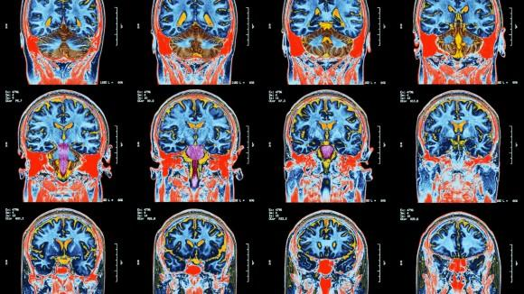

## Table of Contents

## What are medical image models and why are they important in healthcare?

Medical image models are special computer programs that help doctors understand pictures from inside the body, like X-rays or MRIs. These models use something called artificial intelligence, or AI, to look at these pictures and find things that might be hard for a human to see, like tiny tumors or signs of disease. By using these models, doctors can make better decisions about what is wrong with a patient and how to treat them.

These models are very important in healthcare because they can help doctors be more accurate and faster in diagnosing diseases. For example, if a doctor is looking at a brain scan, the model can point out areas that might be a problem, saving the doctor time and helping them not miss important details. This can lead to patients getting the right treatment sooner, which can make a big difference in their health and recovery.

## How do medical image models differ from traditional image processing techniques?

Medical image models use artificial intelligence (AI) to learn from lots of images and get better at finding things in new images. They are different from traditional image processing techniques because traditional methods use set rules to look at images. For example, a traditional method might use a specific math formula to make an image clearer or to find edges in the image. But medical image models can learn from examples and improve over time, which means they can find things that traditional methods might miss.

Traditional image processing techniques are good at doing specific tasks, like making an image brighter or removing noise from it. These techniques follow a step-by-step process that doesn't change. On the other hand, medical image models can adapt and learn from new data. This makes them very useful for looking at medical images where the signs of disease can be subtle and different from one patient to another. By learning from many examples, these models can spot patterns and details that might be hard for traditional methods to see.

In summary, while traditional image processing techniques rely on fixed rules and formulas to analyze images, medical image models use AI to learn and adapt. This ability to learn makes medical image models more flexible and powerful, especially in the complex world of healthcare where every patient's image can be unique.

## What is UNETR and how does it contribute to medical image analysis?

UNETR is a special kind of computer model used to look at medical images. It's based on something called a transformer, which is a type of AI that's really good at understanding patterns in data. UNETR combines this with another model called U-Net, which is great at figuring out the shape and details in images. By mixing these two, UNETR can look at medical images and find important things like tumors or other signs of disease more accurately and quickly than other methods.

In medical image analysis, UNETR helps doctors by making it easier to see what's going on inside the body. For example, when a doctor looks at an MRI scan, UNETR can highlight areas that might be a problem. This helps the doctor make a diagnosis faster and with more confidence. Because UNETR can learn from lots of different images, it gets better over time and can handle all sorts of medical images, making it a powerful tool in healthcare.

## Can you explain the basic architecture of UNETR?

UNETR is a special kind of computer model that helps doctors look at medical images. It's made up of two main parts: a transformer and a U-Net. The transformer part is really good at understanding the big picture and finding patterns in the data. It takes the whole image and breaks it down into smaller pieces, then looks at how these pieces relate to each other. This helps UNETR understand the overall structure of the image. On the other hand, the U-Net part is great at zooming in on details and figuring out the shapes and edges in the image. It helps UNETR pinpoint exactly where things like tumors or other problems might be.

When you put these two parts together, UNETR can do a really good job at looking at medical images. First, the transformer part looks at the entire image and learns about the overall patterns. Then, it sends this information to the U-Net part, which uses it to focus on the details and find the exact locations of any issues. This combination makes UNETR very powerful because it can understand both the big picture and the small details at the same time. This helps doctors see things in medical images that might be hard to spot otherwise, making it easier to diagnose and treat patients.

## What are the key advantages of using UNETR for medical imaging tasks?

UNETR has several key advantages when it comes to medical imaging tasks. One big advantage is that it combines the strengths of both transformers and U-Net models. Transformers are really good at understanding the overall patterns in an image, while U-Nets are great at focusing on the small details. By using both, UNETR can look at the big picture and the tiny details at the same time. This makes it better at finding things like tumors or other signs of disease that might be hard to see.

Another advantage of UNETR is that it can learn from lots of different medical images. This means it gets better over time and can handle all sorts of images, from X-rays to MRIs. Because it can adapt and learn, UNETR can help doctors make more accurate diagnoses faster. This can lead to patients getting the right treatment sooner, which can make a big difference in their health and recovery.

## What is Co-Correcting and how does it improve the accuracy of medical image models?

Co-Correcting is a special method that helps make medical image models even better at finding things in pictures like X-rays or MRIs. Imagine you have two friends working together on a puzzle. One friend is good at seeing the big picture, while the other is great at finding small details. They help each other out, so they can put the puzzle together faster and with fewer mistakes. Co-Correcting works the same way. It uses two different parts of the model to check each other's work. If one part finds something that might be a tumor, the other part double-checks it to make sure it's right. This teamwork helps the model be more accurate and catch things it might have missed before.

By using Co-Correcting, medical image models can improve their accuracy because they get to learn from their mistakes. When the two parts of the model work together, they can correct each other and learn from any errors they make. This means that over time, the model gets better at spotting signs of disease or other problems in medical images. For doctors, this means they can trust the model more to help them make the right diagnosis, which can lead to better treatment for patients.

## How does the Co-Correcting method work in conjunction with other models like UNETR?

Co-Correcting is a smart way to make medical image models like UNETR even better. It works by having two parts of the model work together to check each other's work. One part might be good at seeing the big picture, like the transformer part of UNETR, while the other part is great at finding small details, like the U-Net part. When they work together, if one part thinks it sees something important, like a tumor, the other part double-checks it. This teamwork helps the model be more accurate because it can catch mistakes and learn from them.

When Co-Correcting is used with UNETR, it makes UNETR even more powerful. UNETR already does a great job of looking at the whole image and the tiny details, but Co-Correcting adds an extra layer of checking. This means that UNETR can be even more sure about what it finds in medical images. For doctors, this means they can trust UNETR more to help them find problems in patients' images, leading to faster and more accurate diagnoses. This can make a big difference in how quickly patients get the right treatment and get better.

## What challenges does Co-Correcting aim to address in medical imaging?

Co-Correcting aims to tackle the challenge of making medical image models more accurate and reliable. One big problem in medical imaging is that models can sometimes miss small details or make mistakes. This is really important because even a tiny error can lead to a wrong diagnosis, which can affect a patient's treatment and health. Co-Correcting helps by having two parts of the model check each other's work. This teamwork means the model can catch mistakes and learn from them, making it better at spotting signs of disease or other problems in medical images.

Another challenge Co-Correcting addresses is the need for models to keep improving over time. Medical images can be very different from one patient to another, so models need to be able to adapt and learn from new data. Co-Correcting helps the model do this by constantly checking and correcting itself. This makes the model more flexible and able to handle all sorts of medical images, from X-rays to MRIs. As a result, doctors can trust the model more to help them make the right diagnosis, which can lead to better treatment for patients.

## What is BS-Net and what makes it unique among other medical image models?

BS-Net is a special kind of computer model used to look at medical images. It stands for "Boundary-aware Segmentation Network." What makes BS-Net unique is that it focuses on finding the edges or boundaries of things in the images, like tumors or organs. By paying close attention to these boundaries, BS-Net can help doctors see exactly where a problem starts and ends, which is really important for figuring out the best treatment.

BS-Net is different from other medical image models because it uses a special way of looking at images. It combines two main parts: one part that looks at the overall shape and another part that focuses on the fine details around the edges. This helps BS-Net be very accurate in finding and outlining things in medical images. Because of this, doctors can trust BS-Net to give them clear and precise information, which can make a big difference in how they treat their patients.

## How does BS-Net enhance the segmentation of medical images?

BS-Net helps doctors see the edges of things in medical images more clearly. It's like drawing a line around a tumor or an organ so doctors know exactly where it starts and ends. BS-Net does this by using two special parts: one part looks at the big picture and the other part focuses on the tiny details around the edges. By combining these two parts, BS-Net can find the exact boundaries of things in the image, which is really important for planning the right treatment.

This focus on edges makes BS-Net different from other medical image models. While other models might look at the whole image and guess where things are, BS-Net pays close attention to the borders. This means it can be more accurate and help doctors make better decisions. When doctors can see the exact shape and size of a problem, they can plan surgery or other treatments more carefully, which can lead to better results for patients.

## What are some real-world applications of BS-Net in clinical settings?

In hospitals, doctors use BS-Net to help them see exactly where a tumor is in a patient's body. When looking at MRI or CT scans, BS-Net can draw a clear line around the tumor, showing doctors its exact shape and size. This helps doctors plan surgery better because they know exactly where to cut and how much of the tumor to remove. It's like having a map that shows the tumor's boundaries, making it easier for doctors to treat the patient without harming healthy tissue.

BS-Net is also used to look at organs like the liver or the heart. By outlining these organs clearly, doctors can see if there are any problems or diseases. For example, if a patient has liver disease, BS-Net can show the doctors the exact part of the liver that is affected. This helps doctors decide the best way to treat the disease, whether it's with medicine, surgery, or other treatments. By giving doctors a clear picture of what's going on inside the body, BS-Net helps them make better decisions and improve patient care.

## How do experts evaluate and compare the performance of models like UNETR, Co-Correcting, and BS-Net?

Experts evaluate and compare the performance of medical image models like UNETR, Co-Correcting, and BS-Net by looking at how well they can find and outline things in medical images. They use special measures like accuracy, which tells them how often the model gets things right, and the Dice coefficient, which shows how well the model's outline matches the real shape of things like tumors or organs. The Dice coefficient is calculated using the formula $$ \text{Dice} = \frac{2 \times |A \cap B|}{|A| + |B|} $$, where A is the model's prediction and B is the true shape. By comparing these numbers, experts can see which model does a better job at finding and outlining things in medical images.

In addition to these measures, experts also look at how fast the models can work and how well they can handle different types of images. They might test the models on a variety of medical images, like X-rays, MRIs, and CT scans, to see if they work well in different situations. They also check if the models can learn and get better over time. By looking at all these things together, experts can decide which model is best for helping doctors in real hospitals and clinics.

## References & Further Reading

[1]: Ronneberger, O., Fischer, P., & Brox, T. (2015). ["U-Net: Convolutional Networks for Biomedical Image Segmentation."](https://link.springer.com/chapter/10.1007/978-3-319-24574-4_28) arXiv:1505.04597.

[2]: Dosovitskiy, A., Beyer, L., Kolesnikov, A., Weissenborn, D., Zhai, X., Unterthiner, T., ... & Houlsby, N. (2020). ["An Image is Worth 16x16 Words: Transformers for Image Recognition at Scale."](https://arxiv.org/abs/2010.11929) arXiv:2010.11929.

[3]: Zhou, T., Ruan, S., & Canu, S. (2021). ["Review: Deep Learning for Medical Image Segmentation Using Multi-Modality Fusion."](https://arxiv.org/abs/2004.10664) Frontiers in Neuroscience.

[4]: Tang, Y., Niu, Z., Liu, F., & Liu, J. (2022). ["BS-Net: Boundary-Aware Segmentation Network for Multi-Organ Segmentation in CT Images."](https://onlinelibrary.wiley.com/doi/10.1002/ange.202420413) Medical Image Analysis.

[5]: Wang, G., et al. (2019). ["A Review on Deep Learning in Medical Image Reconstruction and Analysis."](https://www.sciencedirect.com/science/article/pii/S2667102621000061) IEEE Transactions on Medical Imaging.