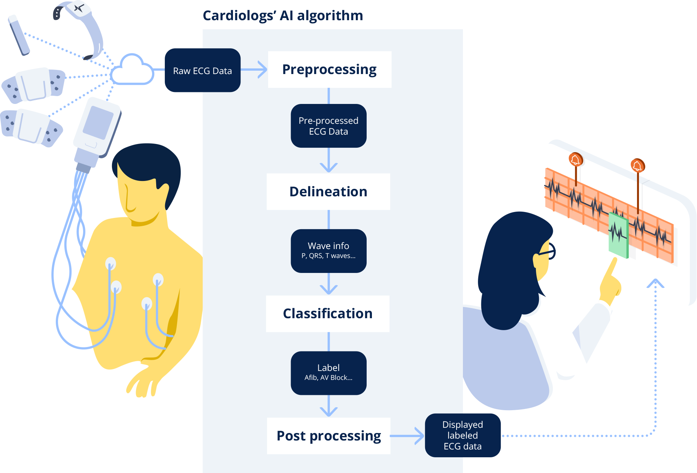

## Table of Contents

## What is medical waveform analysis and why is it important in healthcare?

Medical waveform analysis is the process of looking at and understanding the patterns and shapes in medical signals, like those from heart monitors or brain activity. These signals, or waveforms, can tell doctors a lot about what's happening inside a person's body. For example, an electrocardiogram (ECG) shows the electrical activity of the heart, and by analyzing its waveform, doctors can spot signs of heart problems like arrhythmias or heart attacks.

This kind of analysis is really important in healthcare because it helps doctors make better decisions about a patient's care. By carefully studying these waveforms, doctors can find problems early, keep track of how a patient is doing, and choose the best treatments. For instance, if a waveform from a brain monitor shows unusual patterns, it might mean the patient has a seizure disorder, and the doctor can start treatment right away. So, waveform analysis is a key tool that helps improve patient outcomes and save lives.

## How does machine learning contribute to medical waveform analysis?

Machine learning helps doctors understand medical waveforms better by using computers to learn from lots of data. Imagine you have a huge pile of ECG readings. A machine learning model can look at all these readings and learn what normal heartbeats look like and what abnormal ones look like. Then, when it sees a new ECG, it can quickly tell if there's something wrong. This makes it easier and faster for doctors to spot problems like heart disease or seizures, because the computer does a lot of the hard work.

These models can also find patterns that humans might miss. For example, a [machine learning](/wiki/machine-learning) algorithm might notice tiny changes in a brain wave that could mean a person is at risk for epilepsy. By finding these small details, doctors can start treatment earlier, which can make a big difference in how well a patient does. So, machine learning not only speeds up the process of looking at medical waveforms but also makes the analysis more accurate and helpful for patient care.

## What are the common types of medical waveforms analyzed using machine learning?

Medical waveforms that are commonly analyzed using machine learning include electrocardiograms (ECGs), electroencephalograms (EEGs), and pulse oximetry signals. An ECG measures the electrical activity of the heart and is used to detect heart conditions like arrhythmias or heart attacks. Machine learning can help analyze the ECG waveform to identify patterns that might be hard for a human to see, making it easier to diagnose heart problems quickly and accurately. An EEG measures the electrical activity of the brain and is used to diagnose conditions like epilepsy or sleep disorders. By using machine learning, doctors can spot unusual patterns in the EEG that could mean a patient needs treatment.

Pulse oximetry signals measure the oxygen levels in the blood and are important for monitoring patients with respiratory issues. Machine learning can analyze these signals to predict if a patient's oxygen levels might drop, helping doctors take action before the situation gets worse. These types of waveforms are just a few examples of how machine learning can improve the analysis of medical data, leading to better patient care and outcomes.

## What are the basic steps involved in processing medical waveforms for machine learning?

Processing medical waveforms for machine learning starts with collecting the data. Doctors use special machines to record signals like ECGs or EEGs, and these signals are saved as digital files. Once the data is collected, it needs to be cleaned up. This means removing any noise or errors that might have gotten into the signal. For example, if someone moved during an ECG, it could make the signal look weird. Cleaning the data helps make sure the machine learning model gets good, clear information to learn from.

After cleaning the data, the next step is to turn the waveforms into a format that a computer can understand. This often means breaking the waveform into smaller parts, like looking at the shape of each heartbeat in an ECG. These parts are then turned into numbers that the machine learning model can use. This process is called feature extraction. Once the data is in the right format, it's split into two groups: one group is used to train the model, and the other group is used to test how well the model works. The model learns from the training data to find patterns, and then it's checked with the test data to see if it can spot those patterns in new waveforms. This whole process helps doctors use machine learning to understand medical waveforms better and make better decisions about patient care.

## How can machine learning algorithms be used to detect anomalies in medical waveforms?

Machine learning algorithms can detect anomalies in medical waveforms by learning what normal patterns look like and then spotting when something is different. Imagine a machine learning model as a student that studies a lot of normal heartbeats from ECGs. The model learns the shape and timing of these heartbeats. When it sees a new ECG, it compares it to what it has learned. If the new ECG has a heartbeat that looks very different, the model can say, "Hey, this is not normal!" This helps doctors find problems like heart attacks or irregular heartbeats much faster than if they had to look at each ECG by themselves.

These algorithms are really good at finding tiny changes that might be hard for people to see. For example, in an EEG, a machine learning model can look at the brain waves and notice if there are small differences that could mean a person is having a seizure. By training on lots of EEGs from people with and without seizures, the model learns to tell the difference. When it sees a new EEG, it can quickly say if there's an anomaly, helping doctors start treatment right away. This way, machine learning helps doctors catch health problems early and take care of patients better.

## What role does feature extraction play in medical waveform analysis?

Feature extraction is a very important step in medical waveform analysis. It's like breaking down a big puzzle into smaller pieces that are easier to understand. When you have a medical waveform, like an ECG or EEG, it's a long, continuous signal. Feature extraction means taking this long signal and turning it into numbers or smaller parts that a computer can work with. For example, in an ECG, you might look at the time between heartbeats or the shape of each heartbeat. These smaller pieces, or features, help the computer understand what the waveform means.

Once you have these features, you can use them to train machine learning models. The model learns from these features to tell the difference between normal and abnormal waveforms. For example, if the time between heartbeats is too short or too long, the model can learn that this might mean a heart problem. By using feature extraction, doctors and computers can work together to find health problems faster and more accurately. This helps make sure patients get the right treatment at the right time.

## How do supervised and unsupervised learning approaches differ in analyzing medical waveforms?

Supervised learning is like having a teacher who shows you examples and tells you what they mean. In medical waveform analysis, you use supervised learning by giving the computer lots of waveforms that are already labeled as normal or abnormal. For example, you might show the computer many ECGs and tell it which ones show a heart attack and which ones don't. The computer learns from these examples and then can look at new ECGs and say if they are normal or not. This way, supervised learning helps doctors find problems in patients by using what it learned from the labeled data.

Unsupervised learning is different because it's like learning without a teacher. You give the computer a bunch of waveforms, but you don't tell it what they mean. The computer has to figure out the patterns by itself. For example, with unsupervised learning, the computer might look at a lot of EEGs and find groups of brain waves that look similar. It can then say, "These brain waves are different from those ones," even if it doesn't know what the difference means. This can help doctors see new patterns or unusual things in the data that they might not have noticed before.

## What are some challenges faced when applying machine learning to medical waveform data?

One big challenge when using machine learning on medical waveform data is getting good, clean data. Medical waveforms can be messy because they come from real patients who move around or have other things going on that can mess up the signal. Cleaning up this data takes a lot of work, and if it's not done right, the machine learning model might learn the wrong things. Also, there's not always enough data to train the models well, especially for rare health problems. Without enough examples, the model might not be able to tell the difference between normal and abnormal waveforms.

Another challenge is making sure the machine learning model works well for everyone. People's bodies are different, so what looks normal for one person might not be normal for another. This can make it hard for the model to spot problems in everyone. Plus, medical data can be private, so there are rules about how it can be used. This means it can be tough to share data between hospitals or use it to train models. All these challenges make it harder to use machine learning to help doctors understand medical waveforms and take care of patients.

## How can deep learning enhance the accuracy of medical waveform analysis?

Deep learning can make medical waveform analysis more accurate by using special kinds of machine learning models called neural networks. These models are really good at finding patterns in data, even when the patterns are hard to see. For example, a [deep learning](/wiki/deep-learning) model can look at an ECG and learn to tell the difference between a normal heartbeat and one that shows a heart problem. It does this by breaking down the waveform into many small parts and figuring out which parts are important. This helps doctors spot health issues faster and more accurately because the model can find tiny changes that might be missed by other methods.

Another way deep learning helps is by learning from lots of different kinds of data. For example, it can use both ECG and EEG data to understand how the heart and brain work together. By looking at all this information at once, the model can find connections that might not be obvious. This can lead to better predictions about a patient's health and help doctors choose the best treatments. So, deep learning not only makes waveform analysis more accurate but also helps doctors see the bigger picture of a patient's health.

## What are the ethical considerations when using machine learning for medical waveform analysis?

One big ethical concern when using machine learning for medical waveform analysis is keeping patient data private. Medical data is very personal, and there are rules about how it can be used and shared. If machine learning models are trained on this data, it's really important to make sure no one can figure out who the data belongs to. This means using special ways to hide personal information and being careful about how the data is stored and used. If these rules are not followed, patients might not trust doctors and hospitals to keep their information safe, which can make it harder to use machine learning to help people.

Another ethical issue is making sure the machine learning models are fair and work well for everyone. People's bodies are different, so what looks normal for one person might not be normal for someone else. If a model is only trained on data from a certain group of people, it might not work as well for others. This can lead to unfair treatment and bad health outcomes for some patients. It's important to use data from lots of different people to train the models, so they can help everyone equally. By thinking about these ethical issues, we can use machine learning to improve medical waveform analysis in a way that is safe and fair for all patients.

## How can the performance of machine learning models on medical waveforms be evaluated?

To check how well a machine learning model works on medical waveforms, doctors and scientists use different ways to see if the model can tell the difference between normal and abnormal signals. One common way is to use something called a confusion matrix. This is like a table that shows how many times the model got it right and how many times it got it wrong. For example, if the model says a waveform is normal when it really is normal, that's a true positive. If it says a waveform is abnormal when it's really normal, that's a false positive. By looking at these numbers, doctors can see how accurate the model is and if it's good enough to use in real life.

Another way to evaluate the model is by using numbers like accuracy, sensitivity, and specificity. Accuracy tells you how often the model gets it right overall. Sensitivity, or the true positive rate, shows how good the model is at finding abnormal waveforms when they are there. Specificity, or the true negative rate, shows how good the model is at saying a waveform is normal when it really is normal. These numbers help doctors understand if the model is reliable and if it can help them make better decisions about patient care. By using these evaluation methods, doctors can make sure the machine learning model is helping them in the best way possible.

## What are the latest advancements in machine learning techniques for medical waveform analysis?

Recent advancements in machine learning for medical waveform analysis include the use of more advanced neural networks, like convolutional neural networks (CNNs) and recurrent neural networks (RNNs). These models are really good at understanding patterns in data, even when the patterns are hard to see. For example, CNNs can look at an ECG and learn to tell the difference between a normal heartbeat and one that shows a heart problem. They do this by breaking down the waveform into many small parts and figuring out which parts are important. RNNs are great for looking at signals that change over time, like EEGs, because they can remember what they saw before and use that to understand what's happening now.

Another big advancement is the use of transfer learning. This means taking a model that was trained on one kind of data and using it to help understand a different kind of data. For example, a model that learned to find patterns in ECGs can be tweaked to find patterns in EEGs. This saves time and helps the new model work better, even if there's not a lot of data to train it on. Also, researchers are working on making machine learning models explainable, so doctors can understand why the model says a waveform is normal or abnormal. This helps build trust in the models and makes sure they are used in a safe and fair way.