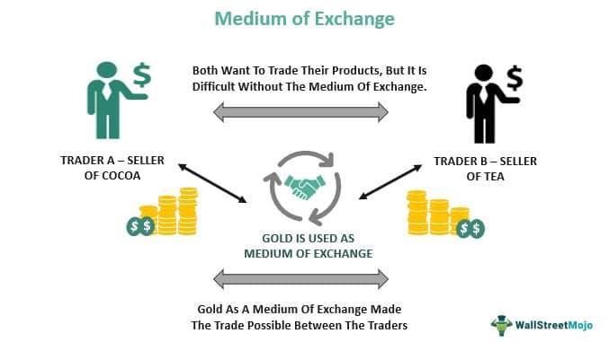

This article explores the intersection of economic concepts such as the medium of exchange and modern trading practices, including currency use and algorithmic trading. The aim is to shed light on how these elements interact to facilitate global commerce and foster economic growth. Understanding the intricate relationship between traditional and innovative financial instruments is essential for navigating the complexities of contemporary financial markets.

The medium of exchange stands as a fundamental economic concept that underpins global trade. Originally represented by physical commodities like gold, it has since evolved into national fiat currencies and innovative digital assets. These mediums enable the efficient buying and selling of goods and services by providing a standard of value that is widely accepted.

In parallel, trading practices have undergone significant evolution, particularly with the advent of algorithmic trading. By utilizing automated systems to execute trades based on predefined criteria, algorithmic trading has revolutionized market dynamics. It has enhanced efficiency and liquidity, offering new opportunities and presenting unique challenges in managing financial risk.

The convergence of these economic concepts with advanced technologies such as artificial intelligence and blockchain has set the stage for a transformative future in financial markets. This article seeks to provide a comprehensive understanding of how these concepts work together and influence the economic landscape, preparing stakeholders to adapt to ongoing innovations in trade and currency.

## Table of Contents

## The Economic Concept of Medium of Exchange

A medium of exchange is an essential component of economic activities, serving as a universally accepted intermediary instrument to facilitate transactions. It enables the buying and selling of goods and services, simplifying the exchange process by providing a common ground for valuation that both parties understand and agree upon. Historically, societies have utilized diverse items as mediums of exchange, ranging from tangible commodities to precious metals.

Gold is a notable example of a historical medium of exchange. Valued for its scarcity and inherent properties, gold was widely accepted and trusted as a store of value, thus facilitating trade. Other commodities, such as silver and cattle, were also used as mediums of exchange before the advent of modern fiat currencies. These items carried intrinsic value, making them effective for trade across different cultures and regions.

The effectiveness of a medium of exchange is assessed through several key characteristics:

1. **Acceptability**: For a medium of exchange to function efficiently, it must be widely accepted within an economy or across economies. Acceptability ensures that the medium is recognized and trusted by all parties involved in a transaction.

2. **Stability in Value**: A medium of exchange must maintain a stable value over time to facilitate reliable trade. Fluctuations in value can deter its use as a medium, as parties may lose confidence in its purchasing power. Stability in value provides predictability, crucial for future planning and transactions.

3. **Divisibility**: To accommodate transactions of varying sizes, a medium of exchange must be divisible into smaller units without losing value. This divisibility allows for precision in trade, enabling the exchange of goods and services of different values.

4. **Portability**: The ease with which a medium of exchange can be transported significantly determines its practicality. Portability ensures that the medium can be conveniently carried by individuals, facilitating transactions in different locations.

5. **Durability**: A medium of exchange must withstand physical wear and tear over time. Durable mediums retain their form and value, making them reliable for consistent use in transactions.

6. **Recognizability**: The ability to easily recognize and verify a medium of exchange is essential. This characteristic helps prevent counterfeiting and assures parties of the authenticity and value of the medium being transacted.

As economies evolved, these characteristics guided the transition from commodity-based systems to the use of fiat currencies, which are government-issued and not backed by a physical commodity. Fiat currencies are predominantly used today due to their convenience and alignment with the stipulated characteristics, despite being dependent on government regulation and economic policies for their value and stability.

## Currency: The Modern Medium of Exchange

Currency, typically issued by national governments, is the primary medium of exchange in contemporary economies. It simplifies trade by delivering a standardized measure of value accepted largely across various markets, thereby reducing transaction costs and enhancing economic efficiency. National currencies such as the U.S. dollar, Euro, and Japanese yen serve as critical tools in facilitating both domestic and international trade, providing a uniform basis for pricing goods and services.

The concept of currency as a medium of exchange is rooted in its ability to perform as a tool for transferring value and as a unit of account. This uniformity allows for the comparison of the value of diverse goods and services, a function that was historically more cumbersome when bartering prevailed. Moreover, currency's predictability and acceptability are fundamental attributes that have helped stabilize global trade. The stability of a currency is often underpinned by a country's economic strength and monetary policy, enabling market participants to rely on it with confidence.

In recent years, the rise of alternative currencies, most notably cryptocurrencies, has started to challenge traditional perceptions of currency. Cryptocurrencies like Bitcoin and Ethereum present new mediums of exchange that operate independently of national governments. These digital currencies utilize blockchain technology, offering features like decentralization, enhanced security, and lower transaction costs, along with the potential for reduced dependency on centralized banking systems.

Cryptocurrencies introduce a certain level of [volatility](/wiki/volatility-trading-strategies) due to their fluctuating exchange rates and speculative nature, posing both challenges and opportunities. While their volatility can hinder their effectiveness as a stable medium of exchange, they also offer significant appeal due to potential gains and the innovation of peer-to-peer financial transactions without intermediaries. Furthermore, the underlying technology, blockchain, has prompted interest among central banks worldwide, sparking discussions around the development of central bank digital currencies (CBDCs) aimed at modernizing monetary systems and addressing the demands of digital economies.

Overall, while traditional currencies continue to play a dominant role in the global economic landscape, the emergence of alternative currencies reflects an ongoing evolution that may shape the future of monetary exchange, presenting both adaptability challenges and potential breakthroughs in financial inclusivity and efficiency.

## Algorithmic Trading: Evolution of Trading Practices

Algorithmic trading represents a significant advancement in trading practices, leveraging automated systems to execute trades at high speed and [volume](/wiki/volume-trading-strategy) based on predetermined criteria. This approach has revolutionized how transactions are conducted in financial markets, building upon and transforming traditional trading methods.

Historically, trading practices have evolved substantially. The earliest form of trade, barter, involved the direct exchange of goods and services. Its limitation—requiring a mutual coincidence of wants—prompted the development of monetary systems that supported manual trading. In manual trading, individuals relied on physical and electronic exchanges to conduct transactions. The advent of electronic trading further streamlined these processes, allowing for the integration of computer systems to facilitate faster and more efficient trade execution.

The development of [algorithmic trading](/wiki/algorithmic-trading) marked a turning point in this evolution. By employing complex algorithms, traders can analyze vast datasets and execute orders based on market conditions, trends, and even historical patterns. The use of algorithms allows for trades to be executed within fractions of a second, reducing human intervention and errors while enabling rapid response to market changes.

Algorithmic trading enhances market efficiency by narrowing bid-ask spreads and facilitating price discovery. The mechanism of high-frequency trading ([HFT](/wiki/high-frequency-trading-strategies)), a subset of algorithmic trading, exemplifies this, executing thousands of orders per second and contributing to market [liquidity](/wiki/liquidity-risk-premium). These systems are designed to identify [arbitrage](/wiki/arbitrage) opportunities, optimize order execution, and manage risk through diversification and hedging strategies.

The impact of algorithmic trading on global financial markets is profound. It has improved market depth and liquidity, promoting a more stable trading environment. However, the reliance on computer-driven trades introduces new dynamics, such as the potential for flash crashes—sudden, severe market declines caused by automated programs. These incidents underscore the importance of robust regulatory frameworks and risk management systems to mitigate the impact of excessive volatility.

Overall, the evolution of trading practices from barter to algorithmic processes underscores technological progress's role in shaping financial markets. As algorithmic trading becomes increasingly sophisticated, it continues to redefine how global commerce is conducted, offering both challenges and opportunities for market participants.

## The Role of Technology in the Future of Trade and Currency

Technological advancements have significantly reshaped the landscape of trade and currency, primarily through developments in [artificial intelligence](/wiki/ai-artificial-intelligence) (AI) and blockchain technology. These innovations redefine the concept of mediums of exchange and introduce new paradigms in trading practices. 

AI, with its capacity to process vast volumes of data and generate insights in real-time, is transforming trading practices. It enables more sophisticated algorithmic trading systems that can analyze market conditions and execute trades with precision and speed previously unattainable. Machine learning models, a subset of AI, can identify patterns in historical trading data to predict future market movements, allowing traders to optimize their strategies. This leads to increased market efficiency and more dynamic pricing mechanisms.

Blockchain technology introduces a decentralized and secure way of recording transactions, which is particularly relevant for the development of cryptocurrencies. Blockchain's transparency, security, and ability to function without a central authority offer an alternative to traditional monetary systems. Cryptocurrencies such as Bitcoin and Ethereum demonstrate how blockchain can function as a medium of exchange, challenging traditional fiat currencies by offering faster, cheaper, and more private transactions.

Moreover, central banks worldwide are exploring Central Bank Digital Currencies (CBDCs) as a potential new form of digital currency. CBDCs aim to combine the benefits of a traditional fiat currency with the technological advantages of digital money. They promise enhanced security, reduced costs for cash printing and handling, and improved efficiency in payment systems. The implementation of CBDCs could significantly alter global monetary systems, reduce reliance on cash, and provide governments with more tools for implementing monetary policy.

Understanding these technologies is crucial for adapting to the changing economic landscape. As AI and blockchain continue to evolve, they will create both challenges and opportunities for businesses, governments, and individuals. Stakeholders must stay informed about these developments to leverage their full potential and mitigate risks associated with their adoption.

Continued exploration and innovation in AI and blockchain are expected to drive further progress in trade and currency, fostering more inclusive and resilient financial markets. Efforts in research and development will likely lead to enhanced security measures, more efficient trading algorithms, and broader acceptance of digital currencies as legitimate mediums of exchange. These advancements mark a transformative era in global commerce and economic growth.

## Challenges and Opportunities in Currency and Algo Trading

Cryptocurrencies, emerging as innovative alternatives to traditional fiat currencies, present both significant challenges and opportunities in their function as mediums of exchange. One of the foremost challenges is their inherent price volatility. This characteristic can undermine a [cryptocurrency](/wiki/cryptocurrency)'s ability to serve as a stable store of value, which is a crucial criterion for any effective medium of exchange. Price fluctuations can lead to uncertainty in transactions, causing both consumers and businesses to hesitate in adopting cryptocurrencies for everyday use. The volatility can be attributed to various factors, including speculative trading, regulatory news, and market sentiment. 

On the other hand, algorithmic trading, a technology-driven trading strategy that uses automated systems to execute trades at high speed, introduces a different set of challenges and opportunities. The complexity of algorithmic trading systems can increase exponentially with the incorporation of sophisticated algorithms and models, which necessitates advanced data analysis and risk management systems. The requirement for such robust infrastructures can pose significant hurdles, especially for small and medium-sized enterprises that may lack the necessary technological and financial resources.

However, the opportunities presented by algorithmic trading are substantial. These systems have the potential to increase market efficiency and liquidity by executing trades more quickly and accurately than human traders. They enable the rapid analysis of large data sets to identify trading signals and trends, which can lead to more informed and strategic decision-making. The automation of trades reduces human error and allows market participants to capitalize on short-term opportunities that may be missed by manual trading processes.

Additionally, both cryptocurrencies and algorithmic trading offer access to new markets and investment opportunities. Cryptocurrencies can facilitate cross-border transactions without the need for traditional banking intermediaries, potentially reducing transaction costs and time. Algorithmic trading can tap into various asset classes and markets globally, providing traders and investors with expansive opportunities for portfolio diversification.

To navigate the challenges and harness the opportunities posed by cryptocurrencies and algorithmic trading, stakeholders need to invest in comprehensive education and technological upgrades. Building resilient systems that can effectively manage risk and volatility while leveraging the benefits of automation and efficiency is key to thriving in the rapidly evolving financial landscape.

## Conclusion

The integration of economic concepts, such as mediums of exchange, with modern trading practices, including algorithmic trading, plays a significant role in global commerce. As the financial landscape evolves, these elements facilitate more efficient and dynamic markets, driving economic growth and development. Algorithmic trading, with its capacity for executing trades at high speed, has transformed how transactions are conducted, optimizing market liquidity and pricing.

The evolution of currency, from traditional fiat systems to the emergence of cryptocurrencies and potential central bank digital currencies (CBDCs), exemplifies how technological advancements are reshaping the finance industry. These digital currencies offer new possibilities for secure, efficient transactions but also introduce volatility and regulatory challenges.

Staying informed about these technological and economic changes is crucial for stakeholders in the financial sector. Understanding the implications of evolving trading practices and monetary systems enables investors, policymakers, and businesses to adapt strategies, mitigate risks, and capitalize on new opportunities presented by these advancements. The continued evolution of these dynamics will unavoidably shape the future of financial markets, making vigilance and adaptability key components for success in the ever-changing economic landscape.

## References & Further Reading

[1]: Bergstra, J., Bardenet, R., Bengio, Y., & Kégl, B. (2011). ["Algorithms for Hyper-Parameter Optimization."](https://papers.nips.cc/paper/4443-algorithms-for-hyper-parameter-optimization) Advances in Neural Information Processing Systems 24.

[2]: ["Advances in Financial Machine Learning"](https://www.amazon.com/Advances-Financial-Machine-Learning-Marcos/dp/1119482089) by Marcos Lopez de Prado

[3]: ["Evidence-Based Technical Analysis: Applying the Scientific Method and Statistical Inference to Trading Signals"](https://www.amazon.com/Evidence-Based-Technical-Analysis-Scientific-Statistical/dp/0470008741) by David Aronson

[4]: ["Machine Learning for Algorithmic Trading"](https://github.com/stefan-jansen/machine-learning-for-trading) by Stefan Jansen

[5]: ["Quantitative Trading: How to Build Your Own Algorithmic Trading Business"](https://www.amazon.com/Quantitative-Trading-Build-Algorithmic-Business/dp/1119800064) by Ernest P. Chan