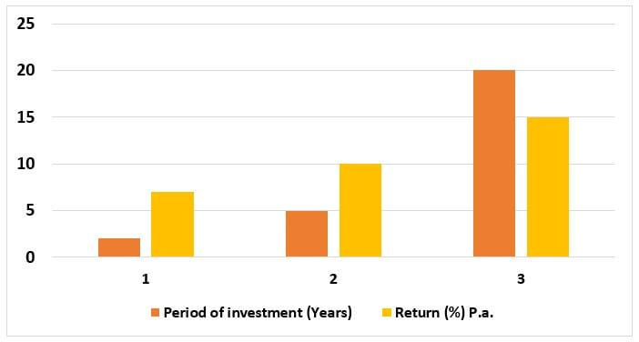

In the world of investing, understanding various time periods and how they can be leveraged through different strategies is crucial. Investment horizons, or the length of time an investor plans to hold an investment, play a significant role in determining the risk and potential returns associated with different assets. The focus of this article is on medium-term investment periods, a strategic timeframe that typically spans from two to ten years. Medium-term investments provide a balance between the relative safety of short-term investments and the higher risk and return potential of long-term holdings.

Medium-term investment strategies differ notably from those designed for short- or long-term horizons. For example, short-term investments, generally considered as those held for less than two years, often prioritize liquidity and capital preservation. In contrast, long-term investments, held beyond ten years, typically focus on substantial growth and are willing to absorb higher volatility. Medium-term strategies, therefore, require a unique approach to balance the inherent risk with potential returns, capitalizing on market dynamics in a way that neither short-term nor long-term strategies can.



The article further explores the role of algorithmic trading within medium-term investment horizons. Algorithmic trading has transformed the financial market, enabling precise and efficient execution of investment strategies by leveraging computational algorithms to analyze large volumes of data. Medium-term algorithmic strategies, like mean reversion and trend-following, are crafted to identify and exploit market trends lasting several months to years.

Understanding the distinction between various investment horizons and adopting the right strategy is fundamental for achieving financial goals. By focusing on medium-term investments in this article, we aim to offer insights into the advantages and challenges specific to this timeframe, as well as the innovative use of algorithmic trading to enhance investment outcomes. The practical implications of these strategies are profound, potentially improving decision-making and optimizing profitability in a rapidly evolving financial landscape.

## Table of Contents

## Understanding Investment Horizons

Investment horizons refer to the expected duration an investor plans to maintain an investment before liquidating it. These horizons are categorized into three main types based on their duration: short-term, medium-term, and long-term. Each category aligns with different investment goals, risk tolerances, and asset compositions.

Short-term investment horizons typically extend from a few months to up to two years. During this time frame, investors often prioritize capital preservation and liquidity. The focus is on minimizing risk while potentially seeking modest returns. Consequently, short-term investments generally involve low-risk assets such as treasury bills, money market funds, and short-duration bonds.

Medium-term investment horizons span approximately two to ten years. This period allows for a balance between risk and return, accommodating a more diverse range of asset classes. Investors in this category aim for moderate growth while managing risks associated with economic fluctuations. Medium-term horizons can include a mix of bonds, equities, and other investment vehicles that offer potential for appreciation without overexposing the investor to high [volatility](/wiki/volatility-trading-strategies).

Long-term investment horizons are characterized by holding periods exceeding ten years. Investors with long-term goals are primarily focused on maximizing returns and are more willing to tolerate volatility. These investments often include equities, real estate, and other high-growth assets. Over extended periods, the impact of short-term market volatility diminishes, and the compounding of returns becomes a significant [factor](/wiki/factor-investing) in wealth accumulation.

Understanding one's investment horizon is crucial for aligning risk with financial objectives and selecting an appropriate asset allocation. An investor must consider their financial goals, risk tolerance, and time frame to determine the optimal mix of assets. By aligning their investment strategy with a well-defined horizon, investors can better navigate market conditions and achieve their desired outcomes.

## What Defines Medium-Term Investments?

Medium-term investments typically have a duration ranging from two to ten years, a span that offers a strategic midpoint between short-term and long-term investment horizons. This timeframe is often influenced by the investor's preferences and the specific asset classes being considered. In practice, medium-term investments serve as a flexible strategy, moderating risk and return more effectively than shorter or longer-term approaches.

In the context of fixed-income securities, medium-term investments are commonly associated with bonds that mature within two to ten years. This classification is essential for investors looking to balance [interest rate](/wiki/interest-rate-trading-strategies) risk and return potential. Medium-term bonds generally offer higher yields than short-term bonds, as they encompass a greater duration, yet typically involve less risk than their long-term counterparts due to a shorter exposure to interest rate fluctuations.

The defining characteristic of medium-term investments is their balanced approach toward risk and return. While short-term investments prioritize [liquidity](/wiki/liquidity-risk-premium) and minimal risk, they often yield lower returns. Conversely, long-term investments can offer potentially higher returns but come with increased volatility and market risk. Medium-term investments strive to achieve a harmonious balance, appealing to investors seeking moderate growth without committing to the uncertainties of a long horizon.

This balanced approach is particularly advantageous during periods of economic uncertainty. Medium-term investments allow investors to maintain greater flexibility in response to market changes, while still capturing opportunities for growth. This flexibility means investors can reassess and adjust their portfolios more frequently than with typical long-term strategies, aligning with evolving market conditions and investment goals.

By adopting medium-term investment strategies, investors position themselves to benefit from a dynamic market landscape, maximizing potential returns while effectively managing associated risks.

## Advantages and Challenges of Medium-Term Investments

Medium-term investments are characterized by their ability to achieve growth potential while maintaining a controlled risk profile. These investments typically span a timeframe ranging from two to ten years and can encompass various asset classes, including equities, bonds, and real estate. The following sections explore the advantages and challenges associated with medium-term investments.

One of the key advantages of medium-term investments is their potential for capital appreciation. This time horizon allows investors to benefit from market upswings, as companies and economies generally exhibit growth over several years. Unlike short-term investments, which can be significantly influenced by daily market fluctuations, medium-term investments tend to smooth out these volatilities. Consequently, investors are better able to realize gains from trends that appear more clearly over an intermediate period.

Moreover, medium-term investments offer flexibility that can be strategically aligned with changing market conditions. This adaptability is a significant advantage over long-term investments, which often necessitate a commitment to a particular strategy regardless of market dynamics. By periodically reviewing and adjusting their portfolios, investors can capitalize on emerging opportunities and mitigate potential risks related to macroeconomic changes, industry shifts, or new technological advancements.

Despite these advantages, medium-term investments do entail inherent challenges. One major challenge is the need for a careful balance of strategies to manage risks associated with market volatility. This requires regular re-evaluation of the investment portfolio to ensure alignment with the investor’s financial goals and risk tolerance. Investors must be vigilant in monitoring economic indicators, interest rate fluctuations, and other market signals that could exert pressure on asset valuations.

Furthermore, periodic assessment demands a certain level of expertise and involvement, which could be resource-intensive in terms of both time and effort. This necessity can prove daunting for individual investors without the support of financial advisors or [algorithmic trading](/wiki/algorithmic-trading) programs to systematically evaluate and react to market data.

In summary, medium-term investments strike a balance between the growth potential of longer investment horizons and the reduced volatility of shorter ones. They provide opportunities for strategic adjustments according to market conditions, but also require ongoing management and strategic oversight to effectively navigate the complexities of market environments.

## Algorithmic Trading in Medium-Term Investment

Algorithmic trading has transformed the management of medium-term investments by providing enhanced precision and efficiency in executing trades. Within this framework, strategies such as mean reversion, [momentum](/wiki/momentum), and trend-following are specifically tailored to optimize medium-term horizons, typically ranging from several months to a few years. These strategies employ complex algorithms designed to analyze and respond to market data at a scale and speed beyond human capability.

Mean reversion strategies operate under the assumption that asset prices will revert to their historical mean over time. For medium-term investments, these strategies leverage statistical and mathematical models to identify deviations from average prices and predict potential corrections. The algorithm might use historical data and standard deviation measures to determine the entry and [exit](/wiki/exit-strategy) points for trades.

Momentum strategies, on the other hand, capitalize on the continuation of existing market trends. In a medium-term context, these strategies identify assets that exhibit a significant upward or downward movement over several months. The algorithm uses indicators such as moving averages, Relative Strength Index (RSI), or MACD (Moving Average Convergence Divergence) to detect and follow these trends. A typical Python implementation might involve libraries such as Pandas and NumPy to perform calculations and Matplotlib for visualizing trends.

```python
import pandas as pd
import numpy as np
import matplotlib.pyplot as plt

# Example of calculating a simple moving average and plotting it
data = pd.Series(np.random.randn(100), name='Price')
window_size = 20
moving_average = data.rolling(window=window_size).mean()

plt.figure(figsize=(10,5))
plt.plot(data, label='Price')
plt.plot(moving_average, label=f'{window_size}-Day Moving Average', linestyle='--')
plt.legend()
plt.show()
```

Trend-following strategies, which are similar to momentum strategies, involve taking positions based on the direction of prevailing trends. However, they are more broadly applied and may incorporate additional factors such as market sentiment or macroeconomic indicators. The algorithms for trend-following might use a more comprehensive data set, integrating both technical indicators and [fundamental analysis](/wiki/fundamental-analysis).

These algorithmic strategies necessitate high computational power and robust data processing capabilities to effectively parse large datasets and make real-time decisions. They are implemented using advanced software and hardware infrastructures capable of executing complex calculations rapidly and without error.

Algorithmic trading in medium-term investments is inherently complex, requiring continuous optimization and monitoring to respond adequately to dynamic market conditions. By strategically employing mean reversion, momentum, and trend-following strategies, investors can harness the capabilities of algorithms to enhance their medium-term investment outcomes, aligning them with broader financial goals and market opportunities.

## Factors Influencing Medium-Term Horizons in Algo Trading

In algorithmic trading, several critical factors influence medium-term investment horizons, shaping both strategy and execution. Market volatility, a measure of how much the price of an asset fluctuates over time, is a primary consideration. High volatility can present opportunities for profit but also increases risk. Traders must design algorithms that can adapt to changing volatility conditions, ensuring strategies remain profitable under various market scenarios.

Liquidity is another fundamental factor, referring to the ease with which assets can be bought or sold in the market without affecting their price. High liquidity is favorable for medium-term strategies as it allows for smoother entry and exit from positions. Illiquid markets can lead to wider bid-ask spreads, increasing transaction costs and potentially eroding profits.

Transaction costs, including commissions, fees, and the aforementioned bid-ask spreads, can significantly impact the profitability of medium-term strategies. Algorithms must be optimized to minimize these costs while maximizing returns. This might involve selecting optimal entry and exit points or adjusting position sizes based on market conditions.

Technological infrastructure plays a supportive role in executing medium-term algorithmic strategies efficiently. Sophisticated algorithms rely on robust data processing capabilities and low-latency connections to market data feeds. Ensuring high-quality infrastructure can enhance the speed and accuracy of order execution, which is crucial for taking advantage of market opportunities.

Regulatory environments also pose challenges and considerations for traders. Different regions have varying rules and compliance requirements that can affect strategy development and execution. Traders must stay informed about these regulations to ensure strategies are both compliant and optimized for the market conditions they operate in.

Risk management is a critical aspect linked closely to the choice of investment horizon. Medium-term strategies must balance systematic risks, which affect the entire market, and specific risks, linked to individual assets or sectors. Effective risk management involves using tools such as stop-loss orders, diversification, and hedging to mitigate potential downsides.

By understanding and integrating these factors, traders can refine their medium-term algorithmic strategies to optimize performance. Each factor interplays uniquely depending on market conditions, and the strategic approach can be adjusted to accommodate shifts in any of these elements.

## Real-World Applications and Case Studies

Companies like QuantConnect and AlgoTrader have been instrumental in facilitating the exploration and execution of medium-term algorithmic trading strategies. These platforms provide a comprehensive suite of tools necessary for developing, [backtesting](/wiki/backtesting), and executing trading strategies that span various investment horizons.

QuantConnect, for instance, offers a cloud-based algorithmic trading platform that supports multiple programming languages, including Python. The platform allows traders to simulate and backtest their strategies using historical market data, providing insights into potential performance across different medium-term horizons. By capitalizing on features like cloud computing resources and a collaborative community, traders can experiment with and refine their strategies to maximize returns while managing risks.

AlgoTrader, another prominent platform, equips traders with advanced capabilities for strategy development and deployment. It supports the automation of trading strategies and integrates with various market data providers and trading systems. AlgoTrader's backtesting features enable traders to evaluate their strategies against historical data, helping them fine-tune their approaches for better alignment with market patterns and risk tolerance over medium-term durations.

Successful case studies in medium-term algorithmic trading illustrate the potential for substantial returns while mitigating risks. For instance, a strategy emphasizing mean reversion may capitalize on the tendency of asset prices to revert to their historical averages. By analyzing datasets to identify entry and exit points, traders can execute trades that optimize profitability in the medium-term. Alternatively, momentum-based strategies leverage the continuation of existing market trends. By identifying assets exhibiting strong price movements, traders aim to benefit from sustained trends over several months or years.

These platforms and strategies underscore the potential of leveraging algorithmic tools to navigate medium-term investment horizons. Through rigorous backtesting and real-time deployment, traders gain a competitive edge in an ever-evolving market landscape, aligning their strategies with personal financial goals and prevailing market conditions to enhance profitability and minimize risks.

## Conclusion

Investment horizon analysis is crucial in algorithmic trading as it shapes decision-making and strategy development. By accurately assessing and optimizing medium-term horizons, investors can effectively balance risk and return, leveraging algorithmic tools to enhance profitability. Medium-term horizons, typically spanning from two to ten years, provide a unique balance between the high-risk, speculative nature of short-term investments and the stability-oriented, long-term commitments. 

Algorithmic trading strategies, such as momentum or trend-following, are well-suited to medium-term investments. These strategies use complex algorithms to parse vast amounts of market data, seeking to identify and exploit patterns that generate returns over several months or years. The precision and efficiency of algorithmic trading lie in its ability to process and react to market signals faster than human counterparts, offering a quantifiable edge in discerning viable opportunities within the medium-term timeframe.

Aligning investment strategies with personal financial goals and market conditions allows traders to maximize their potential returns within their chosen investment horizons. Risk management becomes a pivotal concern, where strategies are crafted to balance systematic risks, which affect the entire market, and specific risks unique to individual investments. By incorporating techniques such as diversification within the medium-term horizon, traders can mitigate potential losses and enhance overall portfolio resilience.

Investors using platforms like QuantConnect and AlgoTrader can develop and backtest medium-term strategies to refine their approaches. These tools provide a testing ground for algorithmic strategies, allowing investors to assess their performance across historical data before deploying them in real-time markets. Successful case studies in medium-term algorithmic trading demonstrate the potential for achieving substantial returns while maintaining an acceptable risk profile.

In conclusion, the strategic analysis of investment horizons remains a crucial element for algorithmic traders aiming to strike a balance between risk and return. By leveraging algorithmic tools and aligning strategies with individual goals and market conditions, traders can capitalize on medium-term trends and maximize potential returns. The continuous refinement of these strategies, informed by market dynamics and technological advancements, ensures competitive performance in the ever-evolving landscape of investment.

## References & Further Reading

[1]: Bergstra, J., Bardenet, R., Bengio, Y., & Kégl, B. (2011). ["Algorithms for Hyper-Parameter Optimization."](https://dl.acm.org/doi/10.5555/2986459.2986743) Advances in Neural Information Processing Systems 24.

[2]: ["Advances in Financial Machine Learning"](https://www.amazon.com/Advances-Financial-Machine-Learning-Marcos/dp/1119482089) by Marcos Lopez de Prado

[3]: ["Evidence-Based Technical Analysis: Applying the Scientific Method and Statistical Inference to Trading Signals"](https://www.amazon.com/Evidence-Based-Technical-Analysis-Scientific-Statistical/dp/0470008741) by David Aronson

[4]: ["Machine Learning for Algorithmic Trading"](https://github.com/stefan-jansen/machine-learning-for-trading) by Stefan Jansen

[5]: ["Quantitative Trading: How to Build Your Own Algorithmic Trading Business"](https://github.com/LucindaYa/quant-resources/blob/master/Quantitative%20Trading%20How%20to%20Build%20Your%20Own%20Algorithmic%20Trading%20Business.pdf) by Ernest P. Chan