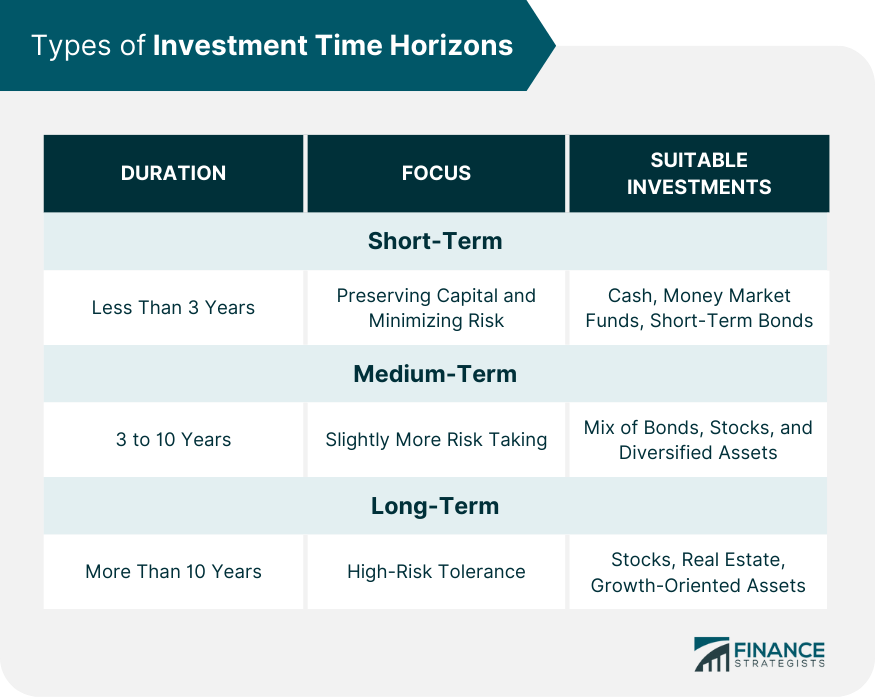

## Table of Contents

## What is considered a medium-term investment period?

A medium-term investment period usually lasts from one to five years. This time frame is longer than short-term investments, which might only last a few months, but shorter than long-term investments, which can go on for more than five years. People often choose medium-term investments when they have specific goals in mind, like saving for a down payment on a house or funding a child's education.

During a medium-term investment period, investors might choose a mix of assets like bonds, stocks, and mutual funds. This mix helps balance the risk and potential returns. Since the investment period is not too long, it's important to pick investments that are likely to grow steadily without too much risk. This way, the money can be available when needed, without losing too much value.

## Why might someone choose a medium-term investment strategy?

Someone might choose a medium-term investment strategy because they have a specific goal in mind that they want to reach in a few years. For example, they might be saving up to buy a house or pay for a wedding. Medium-term investments, which last from one to five years, give them enough time to grow their money but not so long that they lose sight of their goal. This time frame is perfect for people who need their money back at a certain time and want to make sure it grows a bit.

Another reason is that medium-term investments can be less risky than long-term ones but still offer better returns than short-term investments. If someone puts their money into a mix of stocks, bonds, and mutual funds, they can balance the risk and reward. This mix helps them feel safer about their money because it's not all in one place. Plus, they can still see their money grow over the years, which is great for their future plans.

## What are common types of investments suitable for medium-term periods?

For medium-term investments, people often choose bonds. Bonds are like loans you give to a company or government. They pay you back with interest over time. Because bonds are usually less risky than stocks, they're good for medium-term goals. You can get your money back after a few years, and you'll have earned some interest too.

Another common choice is mutual funds. Mutual funds are a mix of different investments, like stocks and bonds, managed by a professional. This mix helps spread out the risk. If one investment does badly, the others might do well, so your money is safer. Mutual funds can grow over a few years, which is great for medium-term goals.

Some people also pick stocks for medium-term investments. Stocks can go up and down a lot, but they can also grow faster than bonds. If you pick the right stocks, you might see good returns in a few years. But remember, stocks are riskier, so you need to be okay with the chance that you might lose some money.

## How does risk tolerance affect medium-term investment choices?

Risk tolerance is how much risk someone is okay with when they invest their money. It really matters when choosing medium-term investments. If someone has a high risk tolerance, they might pick more stocks. Stocks can go up and down a lot, but they can also grow faster. This means they might get more money back in a few years, but they also might lose some. So, if they're okay with that, stocks could be a good choice for them.

On the other hand, if someone has a low risk tolerance, they'll want to keep their money safer. They might choose more bonds instead of stocks. Bonds are usually less risky and give steady returns. This means they won't lose as much money, but they also won't see it grow as fast. For medium-term goals, like saving for a down payment on a house, bonds can be a good fit because they offer a safer way to grow money over a few years.

In the end, understanding your own risk tolerance helps you pick the right mix of investments. If you're somewhere in the middle, you might choose a mix of stocks, bonds, and mutual funds. This way, you can balance the risk and reward to match what you're comfortable with. It's all about finding the right balance for your medium-term goals.

## What are the potential returns one might expect from medium-term investments?

The returns from medium-term investments can vary a lot depending on what you choose to invest in. If you put your money into bonds, you might expect to earn around 2% to 5% per year. Bonds are usually safer, so they don't grow as fast, but they're good if you want to keep your money safe while still [earning](/wiki/earning-announcement) a bit more than you would in a regular savings account. 

If you go for stocks or stock-based mutual funds, the returns can be higher, but so can the risk. You might see returns of 5% to 10% per year, or even more if you're lucky. But remember, stocks can go down as well as up, so you might lose some money too. A mix of stocks and bonds in a mutual fund can give you a balance, with returns somewhere in the middle, maybe around 4% to 7% per year. This mix can help you grow your money over a few years while keeping some of the risk under control.

## How do economic cycles impact medium-term investment strategies?

Economic cycles, like times when the economy grows or shrinks, can really change how well your medium-term investments do. When the economy is doing well, and people are buying more stuff, companies make more money. This usually means their stocks go up, and if you have stocks or stock-based mutual funds, your investments can grow faster. But if the economy is not doing so well, and people are buying less, companies might not make as much money. This can make their stock prices go down, and your investments might not grow as much or even lose value.

Because of this, you need to think about where the economy is in its cycle when you pick your medium-term investments. If you think the economy is going to grow, you might want to put more money into stocks to get higher returns. But if you think the economy might slow down, you might want to choose safer investments like bonds. They won't grow as fast, but they're less likely to lose a lot of value if the economy gets worse. Keeping an eye on economic cycles can help you make smarter choices for your medium-term goals.

## What are the key differences between short-term, medium-term, and long-term investments?

Short-term, medium-term, and long-term investments are different because of how long you keep your money in them and how much risk you take. Short-term investments last less than a year. They're good if you need your money back soon, like for an emergency. But they usually don't grow much. Things like savings accounts or short-term bonds are common short-term investments. They're safe but won't make you rich.

Medium-term investments last from one to five years. People use them for goals like buying a house or paying for school. They can be a mix of stocks, bonds, and mutual funds. This mix helps balance risk and reward. You might see your money grow more than with short-term investments, but it's still not as risky as long-term ones. Medium-term investments are good if you want to grow your money a bit but still get it back in a few years.

Long-term investments last more than five years, sometimes even decades. They're for big goals like retirement. You can put your money into stocks, real estate, or retirement accounts. Long-term investments can grow a lot because you have more time. But they're also riskier because a lot can change over many years. If you're okay with waiting and taking more risk, long-term investments can help your money grow the most.

## How can one assess the performance of a medium-term investment?

To assess the performance of a medium-term investment, you need to look at how much your money has grown over time. Check the total return, which is how much you've made from the investment, including any interest or dividends. For example, if you invested $1,000 and it's now worth $1,100 after two years, your total return is 10%. You can also compare this to what you expected to earn. If you thought you'd get 5% a year, and you got 10% over two years, that's good. But if you were hoping for more, you might need to think about changing your investments.

Another way to assess performance is by looking at the risk you took. Did your investment go up and down a lot, or was it pretty steady? If it was too risky and made you nervous, it might not be the right fit for your medium-term goals, even if it made money. Also, think about how your investment did compared to the market or other similar investments. If the market went up 8% and your investment only went up 2%, it might not be doing as well as you hoped. By looking at these things, you can decide if your medium-term investment is working out or if you need to make some changes.

## What are some strategies to mitigate risks in medium-term investments?

One way to lower the risks in medium-term investments is by spreading your money around. This means not putting all your money into one thing. Instead, you can put some in stocks, some in bonds, and maybe some in mutual funds. This way, if one investment does badly, the others might do well and balance it out. It's like not putting all your eggs in one basket. Another good strategy is to keep an eye on the economy. If you think the economy might slow down, you can move some of your money into safer investments like bonds. This can help protect your money if things get tough.

Another strategy is to set clear goals and check on your investments regularly. Know how much risk you're okay with and pick investments that match that. If you're not sure about something, it's okay to ask for help from a financial advisor. They can give you good advice on what to do. Also, don't forget to look at how your investments are doing every now and then. If they're not growing as much as you hoped, or if they're too risky, you can make changes before it's too late. By keeping an eye on things and making smart choices, you can keep your medium-term investments safer.

## How does diversification play a role in medium-term investment portfolios?

Diversification is really important for medium-term investment portfolios because it helps spread out the risk. Imagine you have a bunch of different investments, like stocks, bonds, and mutual funds. If one of them doesn't do well, the others might still be okay, so your whole portfolio doesn't lose as much value. It's like not putting all your eggs in one basket. By having a mix of different investments, you can balance things out and make your medium-term goals safer.

When you're [picking](/wiki/asset-class-picking) your medium-term investments, think about putting your money into different types of assets. For example, you might have some money in stocks from different companies and industries, some in government or corporate bonds, and maybe some in a mutual fund that has a mix of stocks and bonds. This way, if something bad happens to one type of investment, like stocks going down because of a bad economy, your bonds might still be doing okay. Diversification can help you get a good return without taking too much risk, which is perfect for medium-term goals like saving for a house or a wedding.

## What are advanced techniques for optimizing medium-term investment returns?

One advanced technique for optimizing medium-term investment returns is called asset allocation. This means deciding how much of your money to put into different types of investments, like stocks, bonds, and mutual funds. You can adjust this mix based on what's happening in the economy and how much risk you're okay with. For example, if you think the economy will grow, you might put more money into stocks to get higher returns. But if you think things might get tough, you could move some money into safer bonds. By changing your asset allocation over time, you can try to get the best returns while keeping your risks under control.

Another technique is called rebalancing. This means checking your investments every so often and making sure they still match your goals and risk level. If one type of investment has grown a lot and now makes up a bigger part of your portfolio than you wanted, you can sell some of it and buy more of the other investments to get back to your original plan. Rebalancing helps keep your portfolio balanced and can help you buy low and sell high. It's a way to make sure your medium-term investments are always working hard for you, even as things change.

## How do tax implications affect medium-term investment decisions?

Tax implications can really change how you decide to invest your money for medium-term goals. Different investments are taxed in different ways. For example, if you make money from stocks, you might have to pay capital gains tax when you sell them. But if you hold onto them for more than a year, you might pay a lower tax rate. On the other hand, interest from bonds is usually taxed as regular income, which can be higher. Knowing these tax rules can help you pick investments that will leave you with more money after taxes.

Another thing to think about is tax-advantaged accounts, like IRAs or 401(k)s. These accounts can help you save on taxes, but they usually have rules about when you can take your money out. If your medium-term goal is something like buying a house, these accounts might not be the best choice because you might have to pay a penalty if you take your money out too soon. But if you can wait a bit longer, using these accounts can help your money grow faster because you're not losing as much to taxes. By understanding how taxes work, you can make smarter choices and keep more of your investment returns.

## References & Further Reading

[1]: Bergstra, J., Bardenet, R., Bengio, Y., & Kégl, B. (2011). ["Algorithms for Hyper-Parameter Optimization."](https://dl.acm.org/doi/10.5555/2986459.2986743) Advances in Neural Information Processing Systems 24.

[2]: ["Advances in Financial Machine Learning"](https://www.amazon.com/Advances-Financial-Machine-Learning-Marcos/dp/1119482089) by Marcos Lopez de Prado

[3]: ["Evidence-Based Technical Analysis: Applying the Scientific Method and Statistical Inference to Trading Signals"](https://www.amazon.com/Evidence-Based-Technical-Analysis-Scientific-Statistical/dp/0470008741) by David Aronson

[4]: ["Machine Learning for Algorithmic Trading"](https://github.com/stefan-jansen/machine-learning-for-trading) by Stefan Jansen

[5]: ["Quantitative Trading: How to Build Your Own Algorithmic Trading Business"](https://github.com/LucindaYa/quant-resources/blob/master/Quantitative%20Trading%20How%20to%20Build%20Your%20Own%20Algorithmic%20Trading%20Business.pdf) by Ernest P. Chan