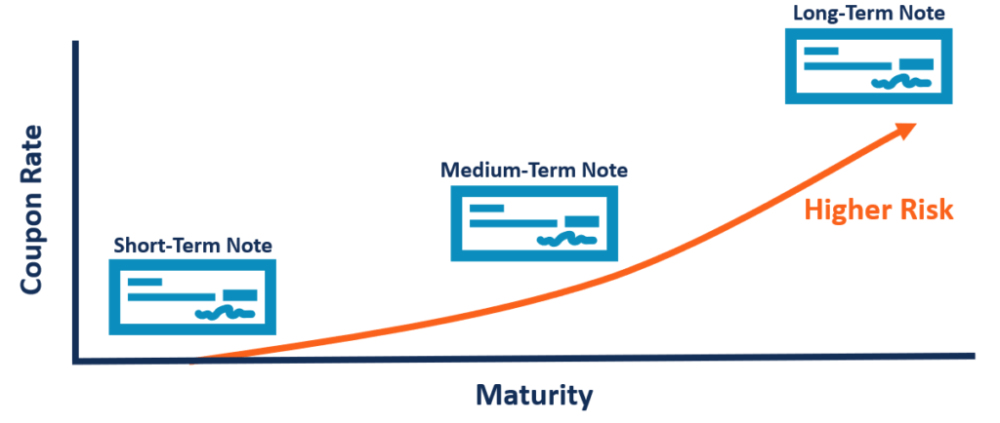

## Table of Contents

## What is a Medium Term Note (MTN)?

A Medium Term Note (MTN) is a type of debt security that companies issue to raise money. It's called "medium term" because it usually lasts from one to ten years. Companies use MTNs to borrow money from investors, who buy these notes and get paid back with interest over time.

MTNs are flexible because they can be issued in different amounts and at different times. This means a company can choose when and how much money to borrow. Investors like MTNs because they can pick the ones that fit their needs, like how long they want to invest or what interest rate they want.

## How does the maturity range of MTNs differ from other financial instruments?

Medium Term Notes (MTNs) have a maturity range that usually goes from one to ten years. This is different from other financial instruments like short-term securities, which mature in less than a year, and long-term bonds, which can last for more than ten years, sometimes up to 30 years or even longer. The medium-term range of MTNs gives them a special place between short and long-term investments.

Because of their medium-term nature, MTNs can be a good choice for investors who want something that lasts longer than a short-term investment but not as long as a long-term bond. For companies, MTNs offer a way to borrow money for a period that matches their medium-term financial plans. This flexibility in maturity can make MTNs attractive to both issuers and investors who are looking for options that fit their specific needs.

## What are the typical maturity ranges for MTNs?

Medium Term Notes, or MTNs, usually have a maturity range that goes from one to ten years. This means that when someone buys an MTN, they can expect to get their money back, plus interest, within this time frame. 

This medium-term range makes MTNs different from other types of investments. For example, short-term securities last less than a year, while long-term bonds can go on for more than ten years, sometimes up to 30 years or even longer. Because of their medium-term nature, MTNs are a good fit for people who want an investment that lasts longer than a short-term one but not as long as a long-term bond.

## What are the benefits of investing in MTNs for individual investors?

Investing in Medium Term Notes, or MTNs, can be a good choice for individual investors because they offer a nice middle ground. MTNs usually last between one and ten years, which means you get to keep your money invested for a while but not too long. This can be great if you want to earn more interest than you would from short-term investments but don't want to lock your money away for as long as a long-term bond.

Another benefit is that MTNs come in different sizes and with different interest rates. This means you can pick an MTN that fits what you're looking for. If you want a certain amount of interest or need your money back at a specific time, you can find an MTN that matches your needs. This flexibility makes MTNs a handy tool for planning your finances.

## How do MTNs fit into a diversified investment portfolio?

Medium Term Notes, or MTNs, can be a good addition to a diversified investment portfolio because they offer a balance between risk and reward. MTNs usually last from one to ten years, which is longer than short-term investments but shorter than long-term bonds. This means they can provide a steady income over a medium period, which can help balance out the ups and downs of other investments like stocks or short-term securities.

Because MTNs come in different sizes and interest rates, they can fit well with other investments in your portfolio. You can choose MTNs that match your investment goals, whether you want a certain amount of interest or need your money back at a specific time. Adding MTNs to your mix of investments can help spread out your risk, so you're not relying too much on just one type of investment. This can make your overall portfolio more stable and better able to handle changes in the market.

## What are the risks associated with MTNs?

Investing in Medium Term Notes, or MTNs, comes with some risks that you should know about. One big risk is the chance that the company that issued the MTN might not be able to pay you back. This is called credit risk. If the company has financial problems, you might not get your money back, or you might get it back late. Another risk is [interest rate](/wiki/interest-rate-trading-strategies) risk. If interest rates go up after you buy an MTN, the value of your MTN might go down. This happens because new MTNs with higher interest rates become more attractive to investors.

Another risk to consider is [liquidity](/wiki/liquidity-risk-premium) risk. MTNs might not be as easy to sell as other investments like stocks. If you need your money back before the MTN matures, you might have a hard time finding someone to buy it from you, or you might have to sell it for less than you paid. Also, inflation risk is something to think about. If inflation goes up a lot, the money you get back from your MTN might not be worth as much as when you invested it. Keeping these risks in mind can help you decide if MTNs are right for your investment plan.

## How do issuers benefit from using MTNs to raise capital?

Issuers benefit from using Medium Term Notes, or MTNs, because they offer a lot of flexibility. Companies can decide when and how much money they want to borrow. This means they can issue MTNs in different amounts and at different times, depending on their needs. This flexibility helps them match their borrowing to their financial plans, making it easier to manage their money over the medium term.

Another benefit for issuers is that MTNs can attract a wide range of investors. Because MTNs come with different maturity dates and interest rates, different investors can find ones that fit their needs. This makes it easier for companies to find people willing to buy their MTNs, which helps them raise the money they need. Plus, since MTNs are usually less risky than short-term borrowing, companies can often get better terms and lower interest rates, saving them money in the long run.

## What role do credit ratings play in the pricing and attractiveness of MTNs?

Credit ratings are really important when it comes to the pricing and attractiveness of Medium Term Notes (MTNs). A credit rating is like a report card that shows how likely a company is to pay back its debts. If a company has a high credit rating, it means they are seen as less risky. This makes their MTNs more attractive to investors because there's a lower chance the company won't pay back the money. When something is less risky, investors are usually okay with a lower interest rate, so the company can offer MTNs with lower interest rates and still get people to buy them.

On the other hand, if a company has a low credit rating, it means they are seen as more risky. Investors might worry that the company won't be able to pay back the money, so they will want a higher interest rate to make up for that risk. This means the company has to offer higher interest rates on their MTNs to attract investors. So, credit ratings can really affect how much a company has to pay to borrow money through MTNs and how attractive those MTNs are to investors.

## How does the liquidity of MTNs compare to other debt securities?

Medium Term Notes, or MTNs, are not as easy to buy and sell as some other debt securities, like government bonds or corporate bonds that trade on big markets. This means MTNs might have less liquidity. Liquidity is how quickly and easily you can turn your investment into cash without losing much money. Because MTNs are often sold directly by the company that issues them and not on a big public market, finding someone to buy your MTN if you want to sell it early can be harder.

Compared to short-term securities like Treasury bills, which are very liquid because they are backed by the government and trade in large volumes, MTNs can be less attractive if you need your money back quickly. If you try to sell an MTN before it matures, you might have to sell it for less than what you paid for it, especially if not many people want to buy it at that time. This lower liquidity can make MTNs a bit riskier for investors who might need their money back sooner than the MTN's maturity date.

## What are the tax implications of investing in MTNs?

When you invest in Medium Term Notes, or MTNs, you need to think about taxes. The interest you earn from MTNs is usually taxed as regular income. This means you'll pay taxes on that interest at the same rate as your other income, like what you earn from your job. Depending on where you live, you might also have to pay state or local taxes on that interest.

There can be other tax things to consider too. If you buy an MTN for less than its face value and then it matures at that face value, the difference could be taxed as a capital gain. But if you sell your MTN before it matures, any profit you make could also be taxed as a capital gain. The tax rules can be different depending on your situation and where you live, so it's a good idea to talk to a tax professional to understand exactly how MTNs will affect your taxes.

## How can investors assess the yield curve impact on MTNs?

The yield curve shows how interest rates change over different times. For Medium Term Notes, or MTNs, which last from one to ten years, the yield curve can tell investors a lot. If the yield curve is going up, it means longer-term MTNs will have higher interest rates than shorter-term ones. This can be good for investors because they can earn more interest by choosing longer-term MTNs. But if the yield curve is flat or going down, it might be better to pick shorter-term MTNs because they might give you a better return compared to the risk.

Investors can also look at how the yield curve changes over time to decide when to buy or sell MTNs. If the yield curve is expected to go up, it might be a good time to buy MTNs because their value could go up. But if the yield curve is expected to go down, it might be better to wait or sell the MTNs you have because their value could go down. Understanding the yield curve helps investors make smarter choices about which MTNs to pick and when to buy or sell them.

## What advanced strategies can be used to optimize returns from MTNs?

One way to get more out of your Medium Term Notes, or MTNs, is to use a laddering strategy. This means you buy MTNs that mature at different times, like one year, three years, and five years. When each MTN matures, you can take the money and buy a new MTN with a longer term. This way, you always have some MTNs that are about to pay you back, and some that are [earning](/wiki/earning-announcement) interest for a longer time. Laddering helps you spread out your risk and can give you a steady stream of income, while also letting you take advantage of changing interest rates.

Another strategy is to look at the yield curve and try to guess where interest rates are going. If you think rates are going to go up, you might want to buy shorter-term MTNs so you can reinvest the money at higher rates when they mature. But if you think rates are going to go down, longer-term MTNs might be a better choice because they lock in a higher rate for a longer time. Watching the yield curve and making smart guesses about where it's headed can help you pick the right MTNs to maximize your returns.

You can also think about diversifying your MTNs by investing in notes from different companies and industries. This way, if one company runs into trouble, it won't hurt your whole investment. By spreading your money across different issuers, you can lower your risk and possibly get better overall returns. Plus, if you keep an eye on credit ratings and choose MTNs from companies with strong ratings, you can feel more confident that you'll get your money back with interest.

## References & Further Reading

[1]: ["Medium Term Note - MTN"](https://www.investopedia.com/terms/m/mtn.asp) by James Chen, Investopedia

[2]: ["Advances in Financial Machine Learning"](https://www.amazon.com/Advances-Financial-Machine-Learning-Marcos/dp/1119482089) by Marcos Lopez de Prado

[3]: ["Algorithmic Trading: Winning Strategies and Their Rationale"](https://www.amazon.com/Algorithmic-Trading-Winning-Strategies-Rationale-ebook/dp/B00CY5HC0U) by Ernest P. Chan

[4]: ["Financial Markets and Trading: An Introduction to Market Microstructure and Trading Strategies"](https://archive.org/details/financialmarkets0000schm) by Anatoly B. Schmidt

[5]: ["Quantitative Trading: How to Build Your Own Algorithmic Trading Business"](https://www.amazon.com/Quantitative-Trading-Build-Algorithmic-Business/dp/1119800064) by Ernest P. Chan