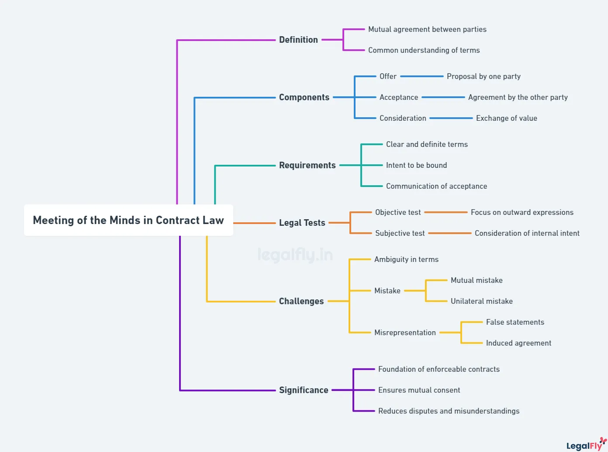

## Table of Contents

## What is the concept of 'meeting of the minds' in contract law?

The concept of 'meeting of the minds' in contract law means that all parties involved in a contract fully understand and agree to the terms of the deal. It's a basic idea that says a contract is only valid if everyone agrees on what they are promising to do. This concept is important because it makes sure that contracts are fair and that everyone knows what they are getting into.

Sometimes, if there's a misunderstanding or if someone was tricked, a court might say there was no real 'meeting of the minds.' This can happen if one person thought they were agreeing to something different than what was written in the contract. If a court finds that there was no meeting of the minds, they might decide the contract isn't valid, which means it can't be enforced. This helps protect people from being stuck in unfair deals.

## Why is the 'meeting of the minds' important in forming a contract?

The 'meeting of the minds' is important in forming a contract because it makes sure that everyone involved really understands and agrees to what the contract says. If everyone knows what they are agreeing to, then the contract is fair and everyone can trust it. This is a basic idea that helps keep business deals honest and clear.

Without a 'meeting of the minds,' there could be big problems. If someone thinks they are agreeing to one thing but the contract says something else, it can lead to fights and confusion. Courts look at this idea to decide if a contract should be followed or not. If there was no real agreement, the contract might not be valid, which protects people from being tricked or stuck in bad deals.

## How can a 'meeting of the minds' be established between parties?

A 'meeting of the minds' can be established when both parties clearly talk about and agree on what they want from the contract. This means they need to discuss all the important parts of the deal, like what each person will do, how much it will cost, and when things need to be done. It's important that both sides understand each other and that there are no big misunderstandings. They can do this by talking face-to-face, over the phone, or through emails and letters, as long as they make sure everyone is on the same page.

To make sure there's a 'meeting of the minds,' it's also helpful to write down the agreement in a contract. The contract should clearly say what was agreed upon, using simple words that everyone can understand. Both parties should read the contract carefully and ask questions if anything is confusing. Once they are happy with everything, they can sign the contract to show they agree. This written agreement helps prove that there was a real 'meeting of the minds' if there's ever a problem later on.

## What are the common elements that indicate a 'meeting of the minds'?

Common elements that indicate a 'meeting of the minds' include clear communication and mutual agreement on the terms of the contract. This means that both parties have talked about what they want and have come to an understanding. They should discuss important details like what each person will do, how much it will cost, and when things need to be done. If both sides understand and agree on these points, it shows they have reached a 'meeting of the minds.'

Another element is the absence of big misunderstandings or mistakes. If one person thought they were agreeing to something different than what was written in the contract, it could mean there was no real 'meeting of the minds.' Both parties need to make sure they are clear about everything and that there are no surprises. This can be helped by having a written contract that everyone reads and agrees to, which shows that they all understand and accept the terms.

Finally, both parties should feel good about the deal and be willing to sign the contract. If someone signs without understanding or agreeing to the terms, it might not be a true 'meeting of the minds.' So, it's important for everyone to take their time, ask questions, and make sure they are happy with the agreement before signing.

## Can a contract be enforced without a 'meeting of the minds'?

A contract usually can't be enforced if there's no 'meeting of the minds.' This means that if the people involved in the contract didn't really agree on what they were promising to do, a court might say the contract isn't valid. This is important because it stops people from being tricked or stuck in unfair deals. If one person thought they were agreeing to something different than what was written in the contract, it shows there was no real agreement.

However, sometimes a court might still enforce a contract even if there seems to be no 'meeting of the minds,' but this is rare. It could happen if the misunderstanding was small and didn't change the main point of the deal. For example, if both sides agreed on the big things like what to do and how much to pay, but had a small mistake about a less important detail, the court might decide the contract can still be enforced. But usually, a clear 'meeting of the minds' is needed for a contract to be valid and enforceable.

## What happens if there is a misunderstanding between the parties?

If there is a misunderstanding between the parties, it can cause big problems with the contract. A misunderstanding means that one person thought they were agreeing to something different than what the other person thought. This can lead to fights and confusion because both sides might not be happy with what they think they agreed to. If the misunderstanding is about something important, it might mean there was no real 'meeting of the minds.' This is a key idea in contract law that says everyone needs to agree on what they are promising to do.

When there's a misunderstanding, a court might decide the contract isn't valid. This happens if the court thinks the misunderstanding was so big that it changed what the contract was supposed to do. If the contract isn't valid, it can't be enforced, which means one person can't make the other person follow it. But if the misunderstanding is about something small and doesn't change the main point of the deal, the court might still say the contract is okay. It all depends on how big the misunderstanding is and if it stops there from being a true agreement between the parties.

## How does the court determine if there was a 'meeting of the minds'?

When a court needs to figure out if there was a 'meeting of the minds,' they look at how the people involved talked and acted before they signed the contract. They check if both sides really understood and agreed on what they were promising to do. This includes looking at any emails, letters, or conversations they had. The court wants to see if everyone was on the same page and if there were any big misunderstandings that could mess up the agreement.

If the court finds that both parties clearly talked about the important parts of the deal and agreed on them, they might say there was a 'meeting of the minds.' But if one person thought they were agreeing to something different than what the other person thought, the court might decide there was no real agreement. They look at how important the misunderstanding was. If it was about something small that didn't change the main point of the deal, the contract might still be valid. But if it was about something big, the court might say the contract isn't valid and can't be enforced.

## What role does communication play in achieving a 'meeting of the minds'?

Communication is really important for making sure there's a 'meeting of the minds' when people are making a contract. It means that everyone needs to talk clearly about what they want and what they are agreeing to do. They should discuss all the important parts of the deal, like what each person will do, how much it will cost, and when things need to be done. If both sides talk openly and make sure they understand each other, it helps them reach a real agreement. Without good communication, there could be big misunderstandings that mess up the whole deal.

If people don't communicate well, it can lead to problems. For example, if one person thinks they are agreeing to something different than what the other person thinks, it can cause fights and confusion. Courts look at how people communicated to decide if there was a 'meeting of the minds.' They check emails, letters, and conversations to see if everyone was on the same page. Good communication helps make sure everyone knows what they are agreeing to, which makes the contract fair and clear for everyone involved.

## How do different jurisdictions interpret the 'meeting of the minds'?

Different places around the world might look at the 'meeting of the minds' a bit differently, but the main idea stays the same. In the United States, courts want to make sure that everyone involved in a contract really understands and agrees to what they are promising to do. They look at how people talked and what they wrote down to see if there was a real agreement. If there's a big misunderstanding, the court might say the contract isn't valid. But if the misunderstanding is small and doesn't change the main point of the deal, the court might still say the contract is okay.

In other countries, like in the United Kingdom, the idea is similar. They also want to see if everyone understood and agreed to the contract's terms. But sometimes, they might put more focus on what the contract actually says in writing, even if someone didn't understand it fully. This can be different from how it's done in the U.S., where what people said and thought before signing can be just as important as the written contract. So, while the basic idea of needing a 'meeting of the minds' is the same everywhere, the way courts decide if it happened can vary a bit from one place to another.

## What are the historical origins of the 'meeting of the minds' doctrine?

The idea of a 'meeting of the minds' comes from old Roman law, where it was called 'consensus ad idem.' This means that for a contract to be valid, both people need to agree on what they are promising to do. Roman lawyers thought it was really important for everyone to understand and agree to the deal, so they made sure to check if there was a true agreement before saying a contract was okay.

This idea traveled through history and became a big part of contract law in many places around the world. In the 1800s, the idea was used a lot in the United States and Europe. Lawyers and courts started using the term 'meeting of the minds' to talk about how important it is for everyone to agree on the contract's terms. They wanted to make sure contracts were fair and that no one was tricked into agreeing to something they didn't understand.

## How has the concept of 'meeting of the minds' evolved with digital contracts?

The concept of 'meeting of the minds' has had to adapt to the way we make contracts online. With digital contracts, people often agree to deals through emails, websites, or apps. This means that instead of talking face-to-face, they communicate through screens. Courts still want to make sure everyone understands and agrees to what they're promising to do, but now they have to look at digital messages and clicks to see if there was a real agreement. They check if people read and understood the terms before clicking 'I agree' or signing digitally.

Even though the way we communicate has changed, the main idea of needing a 'meeting of the minds' stays the same. Courts still need to see that both sides were clear about what they were agreeing to, even if it's done through a computer or phone. If there's a big misunderstanding because someone didn't read the terms or didn't understand them, the court might say the digital contract isn't valid. So, it's important for people to take their time and make sure they understand everything before agreeing to a digital contract.

## What are some landmark cases that have influenced the interpretation of 'meeting of the minds' in contract law?

One important case that helped shape the idea of 'meeting of the minds' is Raffles v. Wichelhaus from 1864 in England. In this case, two people made a deal to buy cotton, but they were talking about different ships called 'Peerless.' One thought the cotton was coming on the ship that left in October, and the other thought it was the one that left in December. The court said there was no real agreement because they were thinking about different things, so there was no 'meeting of the minds.' This case showed how important it is for both sides to be clear about what they are agreeing to.

Another key case is Lucy v. Zehmer from 1954 in the United States. In this case, one person thought they were just joking around when they agreed to sell their farm, but the other person thought it was a real deal. The court looked at what they said and did, and decided that even though one person was joking, their actions made it seem like they were serious. So, the court said there was a 'meeting of the minds' and the contract was valid. This case showed that courts will look at what people do and say to see if there was a real agreement, even if someone says they were just kidding.

## References & Further Reading

[1]: Anabtawi, I., & Schwarcz, S. L. (2011). ["Regulating Systemic Risk: Towards an Analytical Framework"](https://scholarship.law.nd.edu/ndlr/vol86/iss4/1/). Notre Dame Law Review, 86(4), 1349-1407.

[2]: Goldstein, M. A., Kumar, P., & Graves, F. C. (2014). ["Computerized and High-Frequency Trading."](https://papers.ssrn.com/sol3/papers.cfm?abstract_id=2379842) Journal of Economic Perspectives, 28(2), 129-150.

[3]: MacKenzie, D. (2015). ["Mechanizing the Merc: The History and Effects of the Chicago Mercantile Exchange's Automated Trading System"](https://www.castanet.net/news/Hockey/524741/Avalanche-reward-newly-acquired-goalie-Blackwood-with-5-year-26-25-million-contract-extension). Social Studies of Science, 36(6), 931-972.

[4]: Yadav, Y., & Tiwari, A. (2020). ["The Need for a New Regulatory Framework for Algorithmic Trading"](https://scholar.google.com/citations?user=Dn5cmSQAAAAJ&hl=en). Journal of Financial Markets, Institutions and Money, 64, 101185.

[5]: Scopino, G. (2015). ["The Secondary Market for Algorithmic Trading Programs: Licensing and Market Structure"](https://link.springer.com/chapter/10.1007/978-1-4842-5629-9_6). Fordham Law Review, 85(2), 1011-1060. 

[6]: van Loo, R. (2021). ["Digital Market Perfection"](https://repository.law.umich.edu/mlr/vol117/iss5/2/). Georgetown Law Journal, 109(3), 759-823.